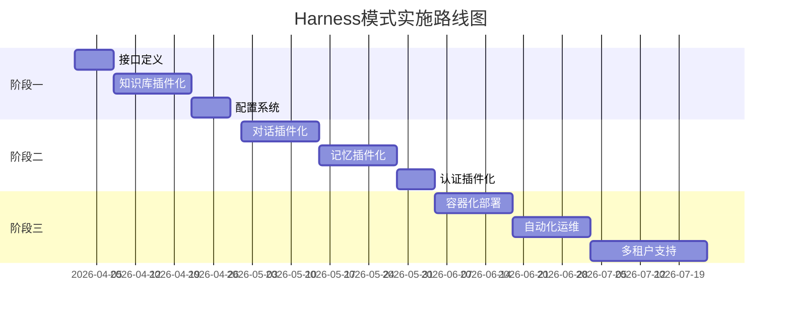

# 系统架构设计

## 1. 总体架构

### 1.1 架构风格
- 分层架构 + 微服务架构
- 前后端分离设计
- 模块化组件设计

### 1.2 技术选型

| 层级 | 技术栈 | 说明 |
|------|--------|------|
| 前端 | Taro + Vant Weapp | 跨端小程序框架 |
| 后端 | Go + Gin | 高性能API服务 |
| 数据库 | SQLite + Chroma DB | 关系型 + 向量数据库 |
| AI集成 | 大模型API + 本地模型 | 多模型支持 |
| 存储 | 本地文件系统 | 支持云存储扩展 |

## 2. 系统组件

### 2.1 前端架构
```
前端小程序
├── 应用层 (App)
├── 页面层 (Pages)
├── 组件层 (Components) 
├── 状态层 (Store)
└── 服务层 (API)
```

### 2.2 后端架构
```
后端服务
├── API网关层 (Gin Router)
├── 业务逻辑层 (Services)
├── 数据访问层 (Models)
├── 工具层 (Utils)
└── 中间件层 (Middleware)
```

## 3. 核心模块设计

### 3.1 认证模块
```go
type AuthService struct {
    // JWT令牌管理
    // 用户会话管理
    // 权限验证
}
```

### 3.2 知识库模块
```go
type KnowledgeService struct {
    // 文档解析
    // 向量化处理
    // 语义检索
    // 标签管理
}
```

### 3.3 对话模块  
```go
type DialogueService struct {
    // Context构建
    // 大模型调用
    // 回复生成
    // 记忆提取
}
```

### 3.4 记忆模块
```go
type MemoryService struct {
    // 记忆存储
    // 记忆检索
    // 强度管理
    // 上下文关联
}
```

## 4. 数据架构

### 4.1 数据库设计
```sql
-- 核心表关系
teachers (老师) → knowledge_documents (知识文档)
students (学生) → conversation_history (对话历史)
students (学生) → student_memories (学生记忆)
```

### 4.2 数据流设计
```
1. 文档上传 → 解析 → 向量化 → 存储
2. 用户提问 → 检索 → 构建context → 生成回复
3. 对话发生 → 记忆提取 → 记忆存储 → 记忆更新
```

## 5. 接口设计

### 5.1 RESTful API
```
GET    /api/teachers/{id}/documents    # 获取老师文档
POST   /api/teachers/{id}/documents    # 上传文档
GET    /api/students/{id}/conversation # 获取对话历史
POST   /api/students/{id}/conversation # 发送消息
```

### 5.2 大模型接口
```go
interface LLMProvider {
    GenerateResponse(ctx Context) (string, error)
    EmbedText(text string) ([]float32, error)
}
```

## 6. 部署架构

### 6.1 V1.0 单机部署
```
单机部署图:
[小程序] ←→ [Go API Server] ←→ [SQLite]
                          ←→ [Chroma DB]  
                          ←→ [文件存储]
                          ←→ [大模型API]
```

### 6.2 V3.0 云原生部署
```
云原生部署:
[CDN] ←→ [API Gateway] ←→ [微服务集群]
                               ←→ [Redis缓存]
                               ←→ [MySQL集群] 
                               ←→ [对象存储]
                               ←→ [向量数据库]
```

## 7. 安全架构

### 7.1 认证授权
- JWT令牌认证
- RBAC权限控制
- API访问限流

### 7.2 数据安全
- HTTPS传输加密
- 数据存储加密
- 敏感信息脱敏

### 7.3 审计日志
- 操作日志记录
- 访问日志分析
- 异常行为检测

## 8. 性能优化

### 8.1 缓存策略
- Redis缓存热点数据
- CDN缓存静态资源
- 浏览器缓存优化

### 8.2 数据库优化
- 索引优化
- 查询优化
- 分库分表准备

### 8.3 并发处理
- 连接池管理
- 异步处理
- 负载均衡

## 9. Harness模式架构改造

### 9.1 Harness核心设计
```go
// Harness核心接口
type Plugin interface {
    Name() string
    Version() string
    Init(config map[string]interface{}) error
    Execute(ctx Context) (interface{}, error)
    Destroy() error
}

// Harness管理器
type HarnessManager struct {
    plugins map[string]Plugin
    config  *Config
}
```

### 9.2 插件化模块设计

#### 知识库插件
```go
type KnowledgePlugin struct {
    basePlugin
    vectorDB VectorDB
    parser   DocumentParser
}

func (p *KnowledgePlugin) Execute(ctx Context) (interface{}, error) {
    // 实现知识检索逻辑
    return p.vectorDB.Search(ctx.Query, ctx.Limit)
}
```

#### 对话插件
```go
type DialoguePlugin struct {
    basePlugin
    llmProvider LLMProvider
    memory      MemoryService
}

func (p *DialoguePlugin) Execute(ctx Context) (interface{}, error) {
    // 构建对话上下文
    context := p.buildContext(ctx)
    // 调用大模型
    return p.llmProvider.GenerateResponse(context)
}
```

### 9.3 配置驱动架构
```yaml
# harness-config.yaml
plugins:
  - name: "knowledge-retrieval"
    type: "knowledge"
    enabled: true
    config:
      vector_db: "chroma"
      max_results: 5
  
  - name: "socratic-dialogue"
    type: "dialogue"  
    enabled: true
    config:
      model: "gpt-4"
      temperature: 0.7
      max_tokens: 1000

  - name: "memory-management"
    type: "memory"
    enabled: true
    config:
      storage: "sqlite"
      ttl: "24h"
```

### 9.4 目录结构调整（Harness模式）
```
digital-twin/
├── src/
│   ├── harness/           # Harness核心
│   │   ├── core/         # 核心接口
│   │   ├── manager/      # 插件管理器
│   │   └── config/       # 配置管理
│   ├── plugins/          # 插件目录
│   │   ├── knowledge/    # 知识库插件
│   │   ├── dialogue/     # 对话插件
│   │   ├── memory/       # 记忆插件
│   │   └── auth/         # 认证插件
│   ├── backend/          # 传统后端（逐步迁移）
│   └── frontend/         # 前端
├── configs/              # 配置文件
│   ├── harness.yaml      # Harness主配置
│   ├── plugins/          # 插件配置
│   └── environments/     # 环境配置
└── deployments/          # 部署配置
    ├── docker-compose.yml
    └── kubernetes/
```

### 9.5 迁移策略

#### 阶段一：插件化改造（V2.0）
1. 定义Harness核心接口
2. 将知识库模块改造为插件
3. 实现配置驱动
4. 保持向后兼容

#### 阶段二：全面插件化（V3.0）
1. 所有模块插件化
2. 动态加载机制
3. 热插拔支持
4. 插件市场准备

#### 阶段三：云原生部署（V4.0）
1. 容器化部署
2. 自动扩缩容
3. 插件远程加载
4. 多租户支持

### 9.6 收益分析

#### 技术收益
- ✅ 组件解耦，易于维护
- ✅ 动态功能更新，无需重启
- ✅ 配置驱动，灵活定制
- ✅ 易于扩展新功能

#### 业务收益  
- 🚀 快速响应业务变化
- 💰 降低开发成本
- 🔧 简化运维复杂度
- 📈 支持多租户SaaS

### 9.7 实施路线图



## 🔄 迭代计划

### V2.1 (2026-07-01)
- 插件市场功能
- 多租户支持
- 数据分析插件

### V2.2 (2026-08-01)  
- 移动端优化
- 离线模式支持
- 语音交互插件

### V3.0 (2026-09-01)
- 云原生部署
- 自动扩缩容
- AI模型训练平台

## 10. 风险评估与应对

### 技术风险
- **插件接口稳定性**: 定义稳定的API版本
- **性能开销**: 优化插件通信机制
- **安全性**: 严格的插件沙箱机制

### 迁移风险  
- **兼容性问题**: 保持双模式运行
- **学习曲线**: 提供详细文档和培训
- **测试覆盖**: 加强插件测试

### 应对策略
- 渐进式迁移，降低风险
- 充分的测试验证
- 完善的监控告警
- 详细的回滚方案