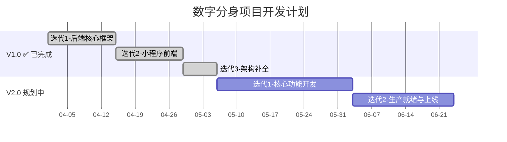

# 数字分身项目开发计划

## 📅 项目概述

**项目名称**: 数字分身系统 (Digital Twin System)
**技术栈**: Go + Gin + Taro + Chroma DB + 大模型API
**部署模式**: 单机部署（Docker Compose）

## 🎯 项目目标

### 业务目标
- 实现多老师多知识库支持
- 支持学生个性化记忆管理
- 建立师生授权体系，支持个性化教学管理
- 提供作业提交与AI/教师点评能力
- 单机部署，生产可用

### 技术目标
- Harness 插件化架构，配置驱动
- 管道编排驱动业务流程
- Docker 容器化部署
- HTTPS + 安全加固

---

## 📊 版本规划

### V1.0 - MVP 核心功能（✅ 已完成）

**周期**: 2026-04-01 至 2026-05-05（约 5 周）
**迭代数**: 3 个迭代

| 迭代 | 周期 | 内容 | 状态 |
|------|------|------|------|
| 迭代1 | 04-01 ~ 04-14 | 后端核心框架 & 全链路验证 | ✅ |
| 迭代2 | 04-15 ~ 04-28 | 小程序前端开发 & 后端适配改造 | ✅ |
| 迭代3 | 04-29 ~ 05-05 | 架构补全 & 质量加固 | ✅ |

**V1.0 交付成果**：
- ✅ Harness 核心框架 + 4 个插件（认证/知识库/记忆/对话）
- ✅ Taro 小程序前端 10 个页面
- ✅ 微信登录 + 角色选择 + JWT 认证
- ✅ 管道编排落地（student_chat 管道 4 插件按序执行）
- ✅ 对话后自动提取记忆（异步 LLM 提取）
- ✅ 令牌刷新（7 天宽限期）
- ✅ 配置校验增强 + 管道超时控制 + 健康检查格式对齐
- ✅ 39 个集成测试 + 80+ 单元测试全部通过
- ✅ 17 个 API 接口

---

### V2.0 - 单机生产可用版（📋 规划中）

**预计周期**: ~7 周
**迭代数**: 2 个迭代

| 迭代 | 预计周期 | 内容 |
|------|----------|------|
| 迭代1 | ~4 周 | 核心功能开发（用户需求优先） |
| 迭代2 | ~3 周 | 生产就绪与上线 |

#### 迭代1：核心功能开发

| 模块 | 内容 | 优先级 |
|------|------|--------|
| 师生授权机制 | 教师邀请/学生申请/审批/对话鉴权 | P0 |
| 教师注册增强 | 必填学校+描述，名称+学校唯一 | P0 |
| 教师评语系统 | 教师对学生写评语 | P1 |
| 个性化问答风格 | 教师针对每个学生设置对话风格 | P1 |
| 作业系统 | 学生提交作业，AI+教师点评 | P1 |
| 文件上传 | PDF/DOCX/TXT/MD 解析入库 | P1 |
| URL 导入 | 网页抓取内容入库 | P1 |
| SSE 流式输出 | 大模型流式推送，前端逐字渲染 | P1 |
| 前端新增 8 页面 | 师生管理/评语/作业/学生详情等 | P0-P1 |

#### 迭代2：生产就绪与上线

| 模块 | 内容 | 优先级 |
|------|------|--------|
| Docker 容器化 | Dockerfile + docker-compose（后端+Chroma+Nginx） | P0 |
| HTTPS + Nginx | Let's Encrypt 证书 + 反向代理 | P0 |
| 安全加固 | JWT Secret 强制校验 + API 限流 + CORS 收紧 | P0 |
| 数据持久化 | SQLite WAL + Chroma 数据挂载 | P0 |
| 记忆衰减 | 遗忘曲线 + 定时清理 | P1 |
| 数据看板 | 教师端学生统计 + 知识库热度 | P1 |
| 对话导出 | 导出为 TXT | P2 |
| 小程序发布 | 域名备案 + 微信提审 | P0 |
| 备份 + 监控 | 定时备份 + 健康告警 | P0 |

---

## 📐 技术架构（单机部署）

```
┌──────────────────────────────────────────────────┐
│                   服务器（单机）                    │
│                                                  │
│  ┌──────────┐  ┌───────────┐  ┌──────────────┐  │
│  │  Nginx    │  │  Go 后端   │  │  Chroma DB   │  │
│  │ (HTTPS)   │→ │  (:8080)  │→ │  (:8000)     │  │
│  │ (:443)    │  │           │  │              │  │
│  └──────────┘  └───────────┘  └──────────────┘  │
│       ↑             ↑               ↑            │
│  静态文件       SQLite.db       向量数据          │
│  (前端dist)    (挂载到宿主机)   (挂载到宿主机)     │
│                     ↑                            │
│              uploads/ (文件存储)                   │
│                                                  │
│  docker-compose 统一编排                          │
└──────────────────────────────────────────────────┘
         ↑
    微信小程序 ←→ 微信服务器
```

---

## 📈 时间线



---

## 🛠️ 技术风险与应对

| 风险 | 应对方案 |
|------|----------|
| PDF/DOCX 解析库兼容性 | 优先支持 TXT/MD，PDF/DOCX 使用成熟 Go 库 |
| 网页抓取被反爬 | 合理 User-Agent + 超时 + 错误提示 |
| SSE 小程序兼容性 | wx.request + 轮询降级方案 |
| 微信小程序审核不通过 | 提前了解审核规则，准备备案材料 |
| SQLite 并发写入瓶颈 | WAL 模式 + 写入队列 + 连接池优化 |
| 师生授权改造影响现有对话 | 数据迁移脚本：为已有关系自动创建 approved 记录 |

---

## 📋 质量保证

### 代码质量
- Go vet / Go lint 代码规范检查
- 单元测试覆盖率 > 80%
- 集成测试覆盖所有核心场景
- 每个迭代结束前全链路回归

### 测试统计（V1.0 已完成）
- 集成测试：39 个（IT-01 ~ IT-39），全部通过
- 后端单元测试：80+，全部通过
- 前端 E2E 测试：3 个，全部通过

### 性能指标
- API 响应时间 < 200ms（不含大模型调用）
- 对话响应时间 < 2s（含大模型调用）

---

**最后更新**: 2026-03-28
**版本**: v2.0.0
