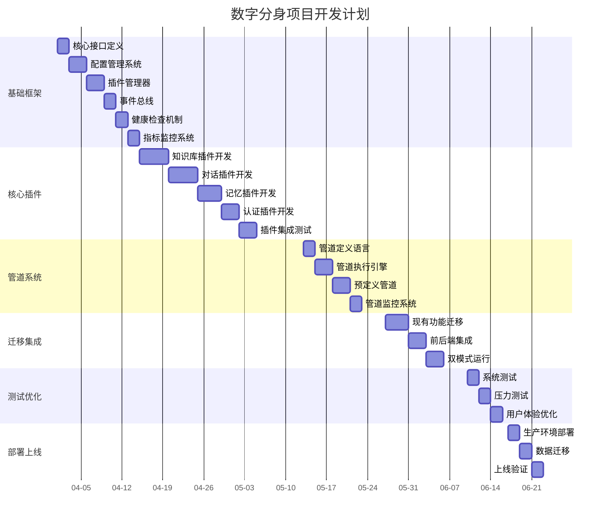

# 数字分身项目开发计划

## 📅 项目概述

**项目名称**: 数字分身系统 (Digital Twin System)  
**项目版本**: V2.0 (Harness模式改造)  
**项目周期**: 12周 (2026年4月1日 - 2026年6月30日)  
**技术栈**: Go + Gin + Taro + Chroma DB + 大模型API

## 🎯 项目目标

### 业务目标
- 实现多老师多知识库支持
- 支持学生个性化记忆管理
- 提供可插拔的AI能力扩展
- 降低运维复杂度

### 技术目标  
- 完成Harness模式架构改造
- 实现插件化系统
- 支持配置驱动开发
- 建立完善的监控体系

## 📊 项目阶段划分

### 阶段一：基础框架搭建 (2周)
**时间**: 2026-04-01 至 2026-04-14

#### 任务清单
```
[✓] 1.1 Harness核心接口定义 (2天)
[✓] 1.2 配置管理系统实现 (3天)  
[ ] 1.3 插件管理器开发 (3天)
[ ] 1.4 事件总线实现 (2天)
[ ] 1.5 健康检查机制 (2天)
[ ] 1.6 指标监控系统 (2天)
```

#### 交付物
- Harness核心接口代码
- 配置管理模块
- 基础插件管理器
- 开发环境配置

### 阶段二：核心插件开发 (4周)
**时间**: 2026-04-15 至 2026-05-12

#### 任务清单
```
[ ] 2.1 知识库插件开发 (5天)
    - 文档解析功能
    - 向量化处理
    - 语义检索接口
    - 标签管理系统

[ ] 2.2 对话插件开发 (5天)
    - Context构建器
    - 大模型调用适配
    - 回复生成策略
    - 对话状态管理

[ ] 2.3 记忆插件开发 (4天)
    - 记忆存储引擎
    - 记忆检索算法
    - 记忆强度管理
    - 上下文关联

[ ] 2.4 认证插件开发 (3天)
    - JWT认证
    - 角色权限管理
    - 会话管理
    - 安全审计

[ ] 2.5 插件集成测试 (3天)
    - 单元测试覆盖
    - 集成测试场景
    - 性能压力测试
    - 安全漏洞扫描
```

#### 交付物
- 4个核心插件实现
- 完整的测试用例
- 性能测试报告
- 安全审计报告

### 阶段三：管道系统实现 (2周)
**时间**: 2026-05-13 至 2026-05-26

#### 任务清单
```
[ ] 3.1 管道定义语言 (2天)
    - YAML配置解析
    - 管道DSL设计
    - 验证规则定义

[ ] 3.2 管道执行引擎 (3天)
    - 插件执行顺序
    - 错误处理机制
    - 超时控制
    - 结果聚合

[ ] 3.3 预定义管道 (3天)
    - 学生对话管道
    - 老师管理管道
    - 系统维护管道
    - 数据分析管道

[ ] 3.4 管道监控 (2天)
    - 执行轨迹记录
    - 性能指标收集
    - 错误日志分析
    - 可视化看板
```

#### 交付物
- 管道执行引擎
- 4个预定义管道
- 监控看板
- 执行日志系统

### 阶段四：迁移与集成 (2周)
**时间**: 2026-05-27 至 2026-06-09

#### 任务清单
```
[ ] 4.1 现有功能迁移 (4天)
    - 知识库模块迁移
    - 对话模块迁移  
    - 记忆模块迁移
    - 认证模块迁移

[ ] 4.2 前后端集成 (3天)
    - API网关适配
    - 身份验证集成
    - 数据格式转换
    - 错误处理统一

[ ] 4.3 双模式运行 (3天)
    - 传统模式兼容
    - 平滑迁移策略
    - 配置切换机制
    - 回滚方案准备
```

#### 交付物
- 迁移完成的核心功能
- 集成测试报告
- 双模式运行环境
- 回滚应急预案

### 阶段五：测试与优化 (1周)
**时间**: 2026-06-10 至 2026-06-16

#### 任务清单
```
[ ] 5.1 系统测试 (2天)
    - 功能完整性测试
    - 性能基准测试
    - 安全渗透测试
    - 兼容性测试

[ ] 5.2 压力测试 (2天)
    - 高并发场景测试
    - 内存泄漏检测
    - 数据库性能优化
    - 缓存策略优化

[ ] 5.3 用户体验优化 (1天)
    - 响应时间优化
    - 错误提示改进
    - 界面交互优化
    - 文档完善
```

#### 交付物
- 测试报告
- 性能优化方案
- 用户体验改进
- 最终文档

### 阶段六：部署上线 (1周)
**时间**: 2026-06-17 至 2026-06-23

#### 任务清单
```
[ ] 6.1 生产环境部署 (2天)
    - 容器化部署
    - 环境配置管理
    - 监控系统部署
    - 日志收集设置

[ ] 6.2 数据迁移 (2天)
    - 用户数据迁移
    - 知识库数据迁移
    - 对话历史迁移
    - 配置数据迁移

[ ] 6.3 上线验证 (1天)
    - 功能验证
    - 性能验证
    - 安全验证
    - 用户验收测试
```

#### 交付物
- 生产环境部署完成
- 数据迁移完成
- 上线验证报告
- 运维手册

## 👥 团队分工

### 开发团队 (4人)
- **架构师 (1人)**: 负责技术架构设计和核心代码开发
- **后端开发 (2人)**: 负责插件开发和系统集成
- **前端开发 (1人)**: 负责界面适配和用户体验优化

### 测试团队 (2人)  
- **测试工程师 (2人)**: 负责功能测试、性能测试、安全测试

### 运维团队 (1人)
- **运维工程师 (1人)**: 负责部署环境和监控系统

## 📈 时间计划甘特图



## 🛠️ 技术风险与应对

### 技术风险
1. **插件接口稳定性风险**
   - 应对: 定义版本化API，提供向后兼容
   - 应对: 完善的接口测试和文档

2. **性能开销风险**
   - 应对: 优化插件通信机制，使用连接池
   - 应对: 性能监控和预警机制

3. **安全性风险**
   - 应对: 插件沙箱机制，权限控制
   - 应对: 安全审计和漏洞扫描

### 迁移风险
1. **兼容性问题**
   - 应对: 双模式运行，逐步迁移
   - 应对: 详细的迁移测试用例

2. **数据一致性风险**
   - 应对: 数据迁移验证工具
   - 应对: 回滚方案和备份机制

## 📋 质量保证

### 代码质量
- 代码规范检查 (ESLint, Go vet)
- 单元测试覆盖率 >80%
- 集成测试覆盖率 >70%
- 代码审查流程

### 文档质量  
- 技术文档完整
- API文档自动生成
- 用户手册详细
- 运维手册实用

### 性能指标
- API响应时间 <200ms
- 系统可用性 >99.9%
- 错误率 <0.1%
- 并发支持 >1000用户

## 🔄 迭代计划

### V2.1 (2026-07-01)
- 插件市场功能
- 多租户支持
- 数据分析插件

### V2.2 (2026-08-01)  
- 移动端优化
- 离线模式支持
- 语音交互插件

### V3.0 (2026-09-01)
- 云原生部署
- 自动扩缩容
- AI模型训练平台

## 📞 沟通计划

### 日常沟通
- **每日站会**: 9:00-9:15 (工作日)
- **周例会**: 周一 14:00-15:00
- **月评审**: 每月最后一周周五

### 报告机制
- **日报**: 每日下班前提交
- **周报**: 每周五提交
- **月报**: 每月最后一天提交

### 紧急沟通
- 紧急问题: 企业微信群立即通知
- 生产事故: 电话紧急联系

## ✅ 验收标准

### 功能验收
- [ ] 所有插件功能正常
- [ ] 管道执行正确
- [ ] 性能指标达标
- [ ] 安全要求满足

### 技术验收  
- [ ] 代码质量通过
- [ ] 测试覆盖达标
- [ ] 文档完整准确
- [ ] 部署流程顺畅

### 业务验收
- [ ] 用户体验良好
- [ ] 业务流程顺畅
- [ ] 价值指标达成
- [ ] 用户反馈积极

---

**最后更新**: 2026-03-28  
**版本**: v1.1.0  
**负责人**: 项目总监