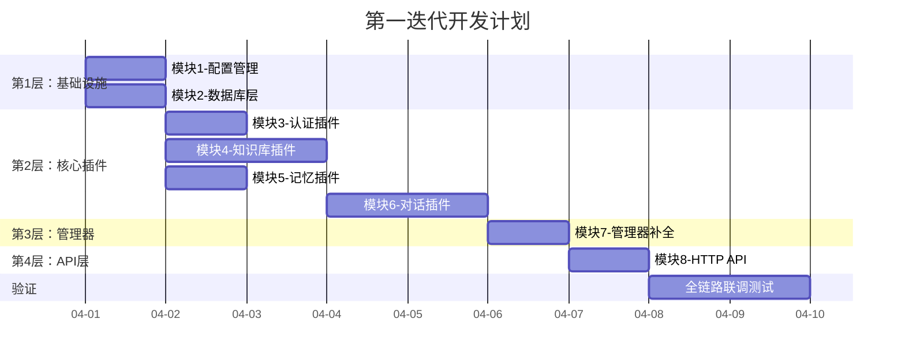

# 第一迭代需求规格说明书

## 1. 迭代概述

| 项目 | 说明 |
|------|------|
| **迭代名称** | Sprint 1 - 后端核心框架 & 全链路验证 |
| **迭代目标** | 跑通 Harness 模式全链路：HTTP请求 → 管道编排 → 插件执行 → 返回结果 |
| **迭代周期** | 2周（2026-04-01 至 2026-04-14） |
| **交付标准** | 后端可独立运行，通过 curl/Postman 验证所有 API 接口 |
| **前端依赖** | 无，本迭代纯后端，前端下一迭代接入 |

## 2. 迭代目标

### 2.1 核心目标
> **验证 Harness 插件化架构模式的正确性和可行性**

具体来说：
1. ✅ 配置驱动：从 `harness.yaml` 加载配置，驱动插件和管道的初始化
2. ✅ 插件生命周期：插件能正确注册、初始化、执行、销毁
3. ✅ 管道编排：`student_chat` 管道能按顺序执行 4 个插件
4. ✅ 数据流转：插件间通过 `PluginInput/PluginOutput` 正确传递数据
5. ✅ HTTP 接入：Gin 路由能正确将请求转发到管道执行

### 2.2 不在本迭代范围
- ❌ 前端界面开发
- ❌ 文件上传/文档解析（知识库插件仅实现检索，文档通过 API 手动录入）
- ❌ 记忆衰减机制（仅实现基础存取）
- ❌ 流式输出（SSE/WebSocket）
- ❌ 多租户支持
- ❌ Docker 部署
- ❌ Prometheus 指标暴露

## 3. 模块需求

### 3.1 模块1：配置管理 (`src/harness/config/`)

**目标**：解析 `configs/harness.yaml`，为所有模块提供类型安全的配置访问。

#### 功能需求
| ID | 需求 | 优先级 |
|----|------|--------|
| CFG-01 | 解析 YAML 配置文件，映射到 Go 结构体 | P0 |
| CFG-02 | 支持环境变量替换（`${VAR_NAME}` 语法） | P0 |
| CFG-03 | 提供获取系统配置、插件配置、管道配置的方法 | P0 |
| CFG-04 | 配置校验：必填字段缺失时返回明确错误 | P1 |

#### 配置结构体定义
```go
// SystemConfig 系统配置
type SystemConfig struct {
    Name        string          `yaml:"name"`
    Version     string          `yaml:"version"`
    Environment string          `yaml:"environment"`
    Debug       bool            `yaml:"debug"`
    Logging     LoggingConfig   `yaml:"logging"`
    Monitoring  MonitoringConfig `yaml:"monitoring"`
}

// PluginConfig 插件配置
type PluginConfig struct {
    Enabled  bool                   `yaml:"enabled"`
    Type     string                 `yaml:"type"`
    Priority int                    `yaml:"priority"`
    Config   map[string]interface{} `yaml:"config"`
}

// PipelineConfig 管道配置
type PipelineConfig struct {
    Description string   `yaml:"description"`
    Plugins     []string `yaml:"plugins"`
    Timeout     string   `yaml:"timeout"`
}
```

#### 依赖
- 外部依赖：`gopkg.in/yaml.v3`
- 输入：`configs/harness.yaml` 文件路径
- 输出：`ConfigManager` 实例

---

### 3.2 模块2：数据库层 (`src/backend/database/`)

**目标**：提供 SQLite 数据库连接和基础数据模型，支撑所有插件的数据存储需求。

#### 功能需求
| ID | 需求 | 优先级 |
|----|------|--------|
| DB-01 | SQLite 数据库连接管理（连接池、自动重连） | P0 |
| DB-02 | 自动建表（程序启动时自动创建/迁移表结构） | P0 |
| DB-03 | 用户表 CRUD | P0 |
| DB-04 | 文档表 CRUD | P0 |
| DB-05 | 对话历史表 CRUD | P0 |
| DB-06 | 记忆表 CRUD | P0 |

#### 数据模型
```sql
-- 用户表
CREATE TABLE IF NOT EXISTS users (
    id          INTEGER PRIMARY KEY AUTOINCREMENT,
    username    TEXT NOT NULL UNIQUE,
    password    TEXT NOT NULL,          -- bcrypt 哈希
    role        TEXT NOT NULL DEFAULT 'student',  -- teacher/student/admin
    nickname    TEXT,
    email       TEXT,
    created_at  DATETIME DEFAULT CURRENT_TIMESTAMP,
    updated_at  DATETIME DEFAULT CURRENT_TIMESTAMP
);

-- 知识文档表
CREATE TABLE IF NOT EXISTS documents (
    id          INTEGER PRIMARY KEY AUTOINCREMENT,
    teacher_id  INTEGER NOT NULL,
    title       TEXT NOT NULL,
    content     TEXT NOT NULL,          -- 原始文本内容
    doc_type    TEXT DEFAULT 'text',    -- text/pdf/docx/md
    tags        TEXT,                   -- JSON 数组格式
    status      TEXT DEFAULT 'active',  -- active/archived
    created_at  DATETIME DEFAULT CURRENT_TIMESTAMP,
    updated_at  DATETIME DEFAULT CURRENT_TIMESTAMP,
    FOREIGN KEY (teacher_id) REFERENCES users(id)
);

-- 对话历史表
CREATE TABLE IF NOT EXISTS conversations (
    id              INTEGER PRIMARY KEY AUTOINCREMENT,
    student_id      INTEGER NOT NULL,
    teacher_id      INTEGER NOT NULL,       -- 对话的数字分身所属教师
    session_id      TEXT NOT NULL,           -- 会话ID
    role            TEXT NOT NULL,           -- user/assistant
    content         TEXT NOT NULL,
    token_count     INTEGER DEFAULT 0,
    created_at      DATETIME DEFAULT CURRENT_TIMESTAMP,
    FOREIGN KEY (student_id) REFERENCES users(id),
    FOREIGN KEY (teacher_id) REFERENCES users(id)
);

-- 学生记忆表
CREATE TABLE IF NOT EXISTS memories (
    id              INTEGER PRIMARY KEY AUTOINCREMENT,
    student_id      INTEGER NOT NULL,
    teacher_id      INTEGER NOT NULL,       -- 关联的教师
    memory_type     TEXT NOT NULL,           -- conversation/learning_progress/personality_traits
    content         TEXT NOT NULL,           -- 记忆内容
    importance      REAL DEFAULT 0.5,        -- 重要性 0.0-1.0
    last_accessed   DATETIME,
    created_at      DATETIME DEFAULT CURRENT_TIMESTAMP,
    updated_at      DATETIME DEFAULT CURRENT_TIMESTAMP,
    FOREIGN KEY (student_id) REFERENCES users(id),
    FOREIGN KEY (teacher_id) REFERENCES users(id)
);
```

#### 依赖
- 外部依赖：`github.com/mattn/go-sqlite3` 或 `modernc.org/sqlite`（纯 Go 实现，无需 CGO）
- 输入：数据库文件路径（从配置读取）
- 输出：`*sql.DB` 实例 + Repository 接口

---

### 3.3 模块3：认证插件 (`src/plugins/auth/`)

**目标**：实现 JWT 认证，提供用户登录/注册和请求鉴权能力。

#### 功能需求
| ID | 需求 | 优先级 |
|----|------|--------|
| AUTH-01 | 用户注册（用户名+密码+角色） | P0 |
| AUTH-02 | 用户登录（返回 JWT 令牌） | P0 |
| AUTH-03 | JWT 令牌验证（在管道中作为第一个插件执行） | P0 |
| AUTH-04 | 令牌刷新 | P1 |
| AUTH-05 | 密码 bcrypt 加密存储 | P0 |
| AUTH-06 | 角色权限校验（teacher/student/admin） | P1 |

#### 插件 Execute 逻辑
```
输入 Data:
  - "token": JWT令牌字符串（管道内鉴权时）
  - "action": "login" | "register" | "verify"（区分操作类型）
  - "username", "password", "role"（登录/注册时）

输出 Data:
  - "authenticated": true/false
  - "user_id": 用户ID
  - "role": 用户角色
  - "token": JWT令牌（登录/注册时返回）
  
副作用:
  - 验证通过后，自动填充 input.UserContext
```

#### 依赖
- 外部依赖：`github.com/golang-jwt/jwt/v5`、`golang.org/x/crypto/bcrypt`
- 内部依赖：模块1（配置管理）、模块2（数据库层）

---

### 3.4 模块4：知识库插件 (`src/plugins/knowledge/`)

**目标**：实现知识文档的存储和语义检索（本迭代不含文件上传解析，通过 API 直接录入文本）。

#### 功能需求
| ID | 需求 | 优先级 |
|----|------|--------|
| KNW-01 | 文档录入（标题+内容+标签，存入 SQLite + 向量化存入 Chroma） | P0 |
| KNW-02 | 文档列表查询（按教师ID筛选） | P0 |
| KNW-03 | 文档删除 | P1 |
| KNW-04 | 语义检索（输入问题，返回 Top-K 相关文档片段） | P0 |
| KNW-05 | 文本分块处理（chunk_size=1000, overlap=200） | P0 |

#### 插件 Execute 逻辑
```
输入 Data:
  - "action": "search" | "add" | "list" | "delete"
  - "query": 检索问题（search 时）
  - "teacher_id": 教师ID（限定检索范围）
  - "title", "content", "tags": 文档信息（add 时）
  - "document_id": 文档ID（delete 时）
  - "limit": 返回数量（search 时，默认5）

输出 Data:
  - "documents": 文档列表（list 时）
  - "chunks": 相关文档片段数组（search 时）
    - 每个 chunk: {"content": "...", "score": 0.85, "document_id": 1, "title": "..."}
  - "document_id": 新文档ID（add 时）
```

#### 依赖
- 外部依赖：Chroma DB HTTP Client（自行封装，调用 Chroma REST API）
- 内部依赖：模块1（配置管理）、模块2（数据库层）

---

### 3.5 模块5：记忆插件 (`src/plugins/memory/`)

**目标**：实现学生记忆的基础存取，在对话时提供历史记忆上下文。

#### 功能需求
| ID | 需求 | 优先级 |
|----|------|--------|
| MEM-01 | 记忆存储（student_id + teacher_id + type + content） | P0 |
| MEM-02 | 记忆检索（按 student_id + teacher_id 查询最近 N 条） | P0 |
| MEM-03 | 记忆列表查询 | P1 |
| MEM-04 | 记忆更新（更新 last_accessed 时间） | P1 |

#### 插件 Execute 逻辑
```
输入 Data:
  - "action": "retrieve" | "store" | "list"
  - "student_id": 学生ID
  - "teacher_id": 教师ID
  - "memory_type": 记忆类型（可选，不传则查全部）
  - "content": 记忆内容（store 时）
  - "limit": 返回数量（retrieve 时，默认10）

输出 Data:
  - "memories": 记忆数组（retrieve/list 时）
    - 每条: {"id": 1, "type": "conversation", "content": "...", "importance": 0.8}
  - "memory_id": 新记忆ID（store 时）
  
管道中的行为:
  - 在 student_chat 管道中，自动检索该学生的相关记忆
  - 将记忆注入到 Data["memories"] 中，供下游对话插件使用
```

#### 依赖
- 内部依赖：模块1（配置管理）、模块2（数据库层）

---

### 3.6 模块6：对话插件 (`src/plugins/dialogue/`)

**目标**：整合上游插件输出，构建完整 prompt，调用大模型生成苏格拉底式回复。

#### 功能需求
| ID | 需求 | 优先级 |
|----|------|--------|
| DLG-01 | 构建完整对话上下文（system prompt + 知识 + 记忆 + 历史 + 用户问题） | P0 |
| DLG-02 | 调用 OpenAI 兼容 API 生成回复 | P0 |
| DLG-03 | 苏格拉底式教学 system prompt 模板 | P0 |
| DLG-04 | 对话历史保存到数据库 | P0 |
| DLG-05 | 对话历史查询 | P0 |
| DLG-06 | 对话后自动提取记忆（调用记忆插件存储） | P1 |

#### 插件 Execute 逻辑
```
输入 Data（来自上游插件的累积数据）:
  - "message": 用户原始问题
  - "teacher_id": 目标教师ID（选择哪个数字分身）
  - "session_id": 会话ID
  - "memories": 记忆插件注入的相关记忆（数组）
  - "chunks": 知识库插件注入的相关文档片段（数组）
  - "action": "chat" | "history"

输出 Data:
  - "reply": 大模型生成的回复文本
  - "token_usage": {"prompt_tokens": N, "completion_tokens": N}
  - "conversation_id": 对话记录ID
  - "history": 对话历史数组（history 时）
```

#### System Prompt 模板
```
你是一位采用苏格拉底式教学法的AI教师助手。你的教学原则：
1. 不直接给出答案，而是通过提问引导学生思考
2. 根据学生的回答，逐步深入，层层递进
3. 当学生遇到困难时，给予适当的提示而非直接解答
4. 鼓励学生表达自己的理解，即使不完全正确
5. 在学生得出正确结论时给予肯定和总结

【相关知识】
{knowledge_chunks}

【学生记忆】
{student_memories}

【对话历史】
{conversation_history}
```

#### 依赖
- 外部依赖：OpenAI API（HTTP 调用）
- 内部依赖：模块1（配置管理）、模块2（数据库层）

---

### 3.7 模块7：Harness 管理器补全 (`src/harness/manager/`)

**目标**：补全 `loadConfig()` 和 `loadPlugins()` 的空实现，让管理器能真正驱动整个系统。

#### 功能需求
| ID | 需求 | 优先级 |
|----|------|--------|
| MGR-01 | `loadConfig()` 对接配置管理模块，加载 harness.yaml | P0 |
| MGR-02 | `loadPlugins()` 根据配置实例化并注册所有启用的插件 | P0 |
| MGR-03 | `buildPipelines()` 根据配置构建管道（替换硬编码） | P0 |
| MGR-04 | 插件工厂：根据 type 字段创建对应插件实例 | P0 |
| MGR-05 | 向插件注入数据库连接等共享资源 | P0 |

#### 插件工厂设计
```go
// PluginFactory 根据配置创建插件实例
func CreatePlugin(name string, pluginType string, db *sql.DB) (core.Plugin, error) {
    switch pluginType {
    case "auth":
        return auth.NewAuthPlugin(name, db), nil
    case "knowledge":
        return knowledge.NewKnowledgePlugin(name, db), nil
    case "memory":
        return memory.NewMemoryPlugin(name, db), nil
    case "dialogue":
        return dialogue.NewDialoguePlugin(name, db), nil
    default:
        return nil, fmt.Errorf("unknown plugin type: %s", pluginType)
    }
}
```

---

### 3.8 模块8：HTTP API 层 (`src/backend/api/` + `src/cmd/server/`)

**目标**：提供 Gin HTTP 路由，将 HTTP 请求转换为管道执行。

#### 功能需求
| ID | 需求 | 优先级 |
|----|------|--------|
| API-01 | Gin 路由注册和分组 | P0 |
| API-02 | 统一 JSON 响应格式 | P0 |
| API-03 | JWT 认证中间件（从 Header 提取 token） | P0 |
| API-04 | CORS 中间件 | P0 |
| API-05 | 请求日志中间件 | P1 |
| API-06 | 错误恢复中间件（panic recovery） | P0 |
| API-07 | 程序入口 main.go | P0 |

---

## 4. 接口清单（第一迭代）

### 4.1 认证接口

| 方法 | 路径 | 说明 | 鉴权 |
|------|------|------|------|
| POST | `/api/auth/register` | 用户注册 | 无 |
| POST | `/api/auth/login` | 用户登录 | 无 |
| POST | `/api/auth/refresh` | 刷新令牌 | 需要 |

### 4.2 对话接口

| 方法 | 路径 | 说明 | 鉴权 |
|------|------|------|------|
| POST | `/api/chat` | 发送对话消息（走 student_chat 管道） | 需要 |
| GET | `/api/conversations` | 获取对话历史 | 需要 |

### 4.3 知识库接口

| 方法 | 路径 | 说明 | 鉴权 |
|------|------|------|------|
| POST | `/api/documents` | 添加知识文档 | 需要（teacher） |
| GET | `/api/documents` | 获取文档列表 | 需要（teacher） |
| DELETE | `/api/documents/:id` | 删除文档 | 需要（teacher） |

### 4.4 记忆接口

| 方法 | 路径 | 说明 | 鉴权 |
|------|------|------|------|
| GET | `/api/memories` | 获取学生记忆列表 | 需要 |

### 4.5 系统接口

| 方法 | 路径 | 说明 | 鉴权 |
|------|------|------|------|
| GET | `/api/system/health` | 健康检查 | 无 |
| GET | `/api/system/plugins` | 插件列表 | 需要（admin） |
| GET | `/api/system/pipelines` | 管道列表 | 需要（admin） |

---

## 5. 数据流设计

### 5.1 对话全链路（student_chat 管道）

```
用户请求 POST /api/chat
  Body: {"message": "什么是牛顿第一定律?", "teacher_id": 1}
  Header: Authorization: Bearer <jwt_token>

    ↓ Gin Router

Handler 构建 PluginInput:
  {
    request_id: "uuid",
    user_context: {user_id: "3", role: "student", session_id: "uuid"},
    data: {
      "message": "什么是牛顿第一定律?",
      "teacher_id": 1,
      "action": "chat",
      "token": "<jwt_token>"
    }
  }

    ↓ ExecutePipeline("student_chat", input)

[插件1: authentication]
  → 验证 JWT token
  → 填充 UserContext（user_id, role）
  → 输出 Data: {...原始data, "authenticated": true}

    ↓ 输出作为下一个插件的输入

[插件2: memory-management]
  → 根据 student_id + teacher_id 检索相关记忆
  → 输出 Data: {...原始data, "memories": [{...}, {...}]}

    ↓

[插件3: knowledge-retrieval]
  → 根据 message + teacher_id 语义检索知识库
  → 输出 Data: {...原始data, "chunks": [{content, score}, ...]}

    ↓

[插件4: socratic-dialogue]
  → 整合 memories + chunks + message 构建 prompt
  → 调用大模型 API
  → 保存对话记录到数据库
  → 输出 Data: {"reply": "你觉得一个物体在没有外力...", "token_usage": {...}}

    ↓ 返回给 Handler

HTTP Response 200:
  {
    "code": 0,
    "message": "success",
    "data": {
      "reply": "你觉得一个物体在没有外力作用时会怎样运动呢？",
      "conversation_id": 42,
      "token_usage": {"prompt_tokens": 850, "completion_tokens": 120}
    }
  }
```

### 5.2 文档录入流程

```
POST /api/documents
  Body: {"title": "牛顿力学", "content": "牛顿第一定律...", "tags": ["物理","力学"]}
  Header: Authorization: Bearer <teacher_jwt_token>

    ↓ JWT中间件验证 → 确认是teacher角色

Handler 直接调用 knowledge 插件:
  action: "add"
  → 文本分块（chunk_size=1000, overlap=200）
  → 每个 chunk 向量化 → 存入 Chroma DB
  → 文档元数据存入 SQLite

    ↓

HTTP Response 200:
  {
    "code": 0,
    "message": "success",
    "data": {"document_id": 5, "chunks_count": 3}
  }
```

---

## 6. 统一响应格式

```json
// 成功响应
{
  "code": 0,
  "message": "success",
  "data": { ... }
}

// 错误响应
{
  "code": 40001,
  "message": "invalid token",
  "data": null
}
```

### 错误码定义

| 错误码 | 说明 | HTTP Status |
|--------|------|-------------|
| 0 | 成功 | 200 |
| 40001 | 未认证/令牌无效 | 401 |
| 40002 | 令牌过期 | 401 |
| 40003 | 权限不足 | 403 |
| 40004 | 参数校验失败 | 400 |
| 40005 | 资源不存在 | 404 |
| 40006 | 用户名已存在 | 409 |
| 50001 | 服务器内部错误 | 500 |
| 50002 | 大模型调用失败 | 502 |
| 50003 | 向量数据库错误 | 502 |
| 50004 | 管道执行超时 | 504 |

---

## 7. 外部依赖清单

| 依赖 | 版本 | 用途 |
|------|------|------|
| `github.com/gin-gonic/gin` | v1.9+ | HTTP 框架 |
| `gopkg.in/yaml.v3` | v3 | YAML 配置解析 |
| `github.com/golang-jwt/jwt/v5` | v5 | JWT 令牌 |
| `golang.org/x/crypto` | latest | bcrypt 密码加密 |
| `modernc.org/sqlite` | latest | 纯 Go SQLite 驱动（无需 CGO） |
| `github.com/google/uuid` | v1 | UUID 生成 |

### 外部服务依赖

| 服务 | 版本 | 用途 | 本迭代是否必须 |
|------|------|------|----------------|
| Chroma DB | 0.4+ | 向量数据库 | ⏸️ 延后（使用内存模式） |
| 通义千问 API | - | 大模型调用（OpenAI 兼容格式） | ✅ 是（qwen-turbo 免费） |

> **大模型配置说明**：
> - 默认使用阿里云通义千问 `qwen-turbo`，完全免费，兼容 OpenAI Chat Completions 格式
> - 支持 Mock 模式（`LLM_MODE=mock`），无需 API Key 即可跑通全链路验证
> - 可随时切换到 DeepSeek / SiliconFlow / OpenAI 等，只需修改环境变量

---

## 8. 目录结构（第一迭代产出）

```
digital-twin/
├── configs/
│   └── harness.yaml                 # 主配置文件（已有）
├── src/
│   ├── cmd/
│   │   └── server/
│   │       └── main.go              # 🆕 程序入口
│   ├── harness/
│   │   ├── core/
│   │   │   └── plugin.go            # 核心接口（已有）
│   │   ├── config/
│   │   │   ├── config.go            # 🆕 配置结构体
│   │   │   └── loader.go            # 🆕 配置加载器
│   │   └── manager/
│   │       ├── harness_manager.go   # 🔧 补全空实现
│   │       ├── pipeline.go          # 管道执行（已有）
│   │       ├── event_bus.go         # 事件总线（已有）
│   │       └── plugin_factory.go    # 🆕 插件工厂
│   ├── plugins/
│   │   ├── auth/
│   │   │   ├── auth_plugin.go       # 🆕 认证插件
│   │   │   ├── jwt.go               # 🆕 JWT 工具
│   │   │   └── middleware.go        # 🆕 Gin 中间件
│   │   ├── knowledge/
│   │   │   ├── knowledge_plugin.go  # 🆕 知识库插件
│   │   │   ├── chunker.go           # 🆕 文本分块器
│   │   │   └── chroma_client.go     # 🆕 Chroma DB 客户端
│   │   ├── memory/
│   │   │   ├── memory_plugin.go     # 🆕 记忆插件
│   │   │   └── store.go             # 🆕 记忆存储
│   │   └── dialogue/
│   │       ├── dialogue_plugin.go   # 🆕 对话插件
│   │       ├── llm_client.go        # 🆕 大模型客户端
│   │       └── prompt.go            # 🆕 提示词模板
│   └── backend/
│       ├── api/
│       │   ├── router.go            # 🆕 路由定义
│       │   ├── handlers.go          # 🆕 请求处理器
│       │   ├── middleware.go        # 🆕 通用中间件
│       │   └── response.go          # 🆕 统一响应
│       └── database/
│           ├── database.go          # 🆕 数据库连接
│           ├── models.go            # 🆕 数据模型
│           └── repository.go        # 🆕 数据访问层
├── go.mod                           # 🔧 补充依赖
└── go.sum                           # 🆕 自动生成
```

**统计**：🆕 新建 20 个文件，🔧 修改 2 个文件

---

## 9. 开发顺序



---

## 10. 验收标准

### 10.1 功能验收

| 编号 | 验收项 | 验证方式 |
|------|--------|----------|
| AC-01 | 用户注册成功，密码 bcrypt 加密存储 | curl POST /api/auth/register |
| AC-02 | 用户登录成功，返回有效 JWT | curl POST /api/auth/login |
| AC-03 | 无效 token 请求被拒绝，返回 401 | curl 带错误 token 访问 |
| AC-04 | 教师能添加知识文档，文档被分块向量化 | curl POST /api/documents |
| AC-05 | 教师能查询文档列表 | curl GET /api/documents |
| AC-06 | 学生发送对话，走完 student_chat 管道 4 个插件 | curl POST /api/chat |
| AC-07 | 对话回复采用苏格拉底式引导风格 | 人工检查回复内容 |
| AC-08 | 对话历史正确保存并可查询 | curl GET /api/conversations |
| AC-09 | 学生记忆正确存储并在对话中被检索使用 | 多轮对话后检查记忆 |
| AC-10 | 健康检查接口返回系统状态 | curl GET /api/system/health |
| AC-11 | 插件列表接口返回 4 个已注册插件 | curl GET /api/system/plugins |

### 10.2 架构验收

| 编号 | 验收项 | 验证方式 |
|------|--------|----------|
| AR-01 | 配置驱动：修改 harness.yaml 中的插件配置，重启后生效 | 修改配置 → 重启 → 验证 |
| AR-02 | 插件可插拔：禁用某个插件后系统仍能运行 | 设置 enabled: false → 重启 |
| AR-03 | 管道编排：管道中插件按配置顺序执行 | 日志观察执行顺序 |
| AR-04 | 数据流转：上游插件输出正确传递给下游 | 日志观察 Data 内容 |

### 10.3 质量验收

| 编号 | 验收项 | 标准 |
|------|--------|------|
| QA-01 | 代码编译通过 | `go build` 无错误 |
| QA-02 | 单元测试通过 | `go test ./...` 全部 PASS |
| QA-03 | API 响应时间 | < 200ms（不含大模型调用） |

---

## 11. 测试用例（curl 命令）

### 注册教师
```bash
curl -X POST http://localhost:8080/api/auth/register \
  -H "Content-Type: application/json" \
  -d '{"username": "teacher_wang", "password": "123456", "role": "teacher", "nickname": "王老师"}'
```

### 注册学生
```bash
curl -X POST http://localhost:8080/api/auth/register \
  -H "Content-Type: application/json" \
  -d '{"username": "student_li", "password": "123456", "role": "student", "nickname": "小李"}'
```

### 教师登录
```bash
curl -X POST http://localhost:8080/api/auth/login \
  -H "Content-Type: application/json" \
  -d '{"username": "teacher_wang", "password": "123456"}'
# 返回: {"code":0, "data":{"token":"eyJhbG..."}}
```

### 添加知识文档
```bash
curl -X POST http://localhost:8080/api/documents \
  -H "Content-Type: application/json" \
  -H "Authorization: Bearer <teacher_token>" \
  -d '{
    "title": "牛顿运动定律",
    "content": "牛顿第一定律（惯性定律）：一切物体在没有受到外力作用的时候，总保持静止状态或匀速直线运动状态...",
    "tags": ["物理", "力学", "牛顿定律"]
  }'
```

### 学生对话
```bash
curl -X POST http://localhost:8080/api/chat \
  -H "Content-Type: application/json" \
  -H "Authorization: Bearer <student_token>" \
  -d '{"message": "什么是牛顿第一定律?", "teacher_id": 1}'
# 期望返回苏格拉底式引导回复
```

### 查询对话历史
```bash
curl -X GET "http://localhost:8080/api/conversations?teacher_id=1&limit=20" \
  -H "Authorization: Bearer <student_token>"
```

### 健康检查
```bash
curl http://localhost:8080/api/system/health
# 返回: {"code":0, "data":{"status":"running", "plugins":4, "pipelines":2}}
```

---

**文档版本**: v1.0.0  
**创建日期**: 2026-03-28  
**最后更新**: 2026-03-28
