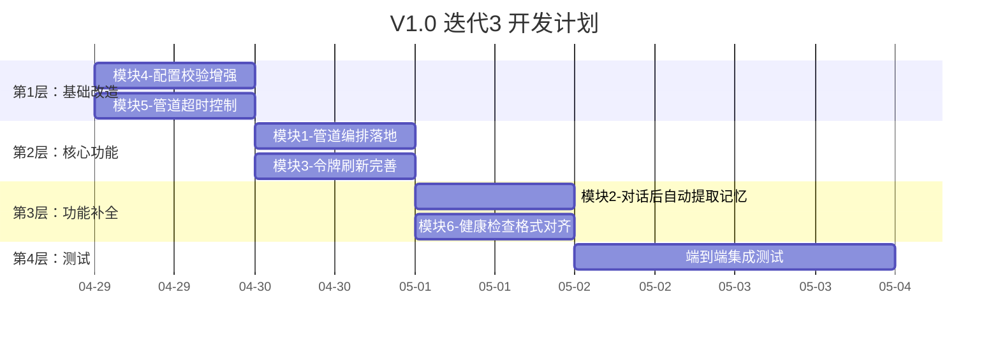

# V1.0 第三迭代需求规格说明书

## 1. 迭代概述

| 项目 | 说明 |
|------|------|
| **迭代名称** | Sprint 3 - 架构补全 & 质量加固 |
| **迭代目标** | 补全 V1.0 所有缺失功能，让 Harness 管道编排真正工作，完善端到端集成测试 |
| **迭代周期** | 1周（2026-04-29 至 2026-05-05） |
| **交付标准** | 所有 V1.0 需求项 100% 完成，架构验收项全部通过，端到端集成测试覆盖所有核心场景 |
| **前端依赖** | 无，本迭代纯后端 |

## 2. 迭代目标

### 2.1 核心目标
> **补全 V1.0 架构验收缺口，让 Harness 插件化管道编排真正驱动业务流程**

具体来说：
1. 🔴 **管道编排落地**：`HandleChat` 从手动编排改为调用 `ExecutePipeline("student_chat", input)`，让 `student_chat` 管道真正工作
2. 🔴 **对话后自动提取记忆**：对话插件完成后调用 LLM 提取关键记忆并存储到 memories 表
3. 🟡 **令牌刷新完善**：支持过期 token 在宽限期内刷新
4. 🟡 **配置校验增强**：必填字段（JWT secret、LLM 配置等）缺失时返回明确错误
5. 🟡 **管道超时控制**：Pipeline.Execute 正确使用 context deadline，超时返回 50004 错误
6. 🟡 **健康检查格式对齐**：返回格式与 V1.0 API 规范完全一致
7. 🟢 **端到端集成测试**：新增覆盖所有迭代3功能的集成测试用例

### 2.2 不在本迭代范围
- ❌ 前端改动（纯后端迭代）
- ❌ 记忆衰减机制（V2.0 范围）
- ❌ 流式输出（V2.0 范围）
- ❌ 文件上传/URL 导入（V3.0 范围）

---

## 3. 模块需求

### 3.1 模块1：管道编排落地（P0）

**需求 ID**：ITER3-01  
**对应 V1.0 需求**：MGR-03（根据配置构建管道替换硬编码）、架构验收项 AR-03/AR-04  
**当前问题**：`handlers.go` 中的 `HandleChat` 手动逐个调用 memory → knowledge → dialogue 插件，没有使用管道系统 `ExecutePipeline("student_chat", input)`。

#### 3.1.1 改造内容

**HandleChat 改造**：
- 移除手动编排的 3 步插件调用逻辑
- 改为调用 `hm.ExecutePipeline("student_chat", input)`
- 管道中的 4 个插件按 `harness.yaml` 配置顺序执行：`authentication → memory-management → knowledge-retrieval → socratic-dialogue`

**认证插件在管道中的行为**：
- 当 `student_chat` 管道执行时，第一个插件是 `authentication`
- 但 `HandleChat` 已经在 JWT 中间件中完成了认证，所以管道中的 auth 插件需要支持"透传模式"
- 方案：当 `input.Data` 中没有 `action` 且 `input.UserContext` 已填充时，auth 插件直接透传（merge Data 并返回 success）

**知识库插件在管道中的行为**：
- 当 `input.Data` 中没有 `action` 时（管道模式），自动执行 `search` 操作
- 使用 `input.Data["message"]` 作为检索 query
- 使用 `input.Data["teacher_id"]` 限定检索范围
- 将检索结果注入到 `output.Data["chunks"]`

**数据流转规范**：
```
初始 Data (Handler 构建):
{
  "message": "什么是牛顿第一定律?",
  "teacher_id": 1,
  "session_id": "uuid"
}
UserContext: {user_id: "3", role: "student"}

→ 经过 authentication 插件（透传模式）:
  Data 不变，UserContext 不变

→ 经过 memory-management 插件（管道模式，无 action）:
  Data 新增: "memories": [{...}, {...}]

→ 经过 knowledge-retrieval 插件（管道模式，无 action）:
  Data 新增: "chunks": [{content, score, document_id}, ...]

→ 经过 socratic-dialogue 插件（action=chat，由管道注入）:
  输出 Data: {"reply": "...", "session_id": "...", "conversation_id": N, "token_usage": {...}, "pipeline_duration_ms": N}
```

#### 3.1.2 涉及文件

| 文件 | 改动类型 | 说明 |
|------|----------|------|
| `src/backend/api/handlers.go` | 修改 | `HandleChat` 改为调用 `ExecutePipeline` |
| `src/plugins/auth/auth_plugin.go` | 修改 | 新增透传模式（无 action 且 UserContext 已填充时） |
| `src/plugins/knowledge/knowledge_plugin.go` | 修改 | 新增管道模式（无 action 时自动 search） |
| `src/plugins/dialogue/dialogue_plugin.go` | 修改 | 管道模式下从 Data 获取 action（由 Handler 注入） |

#### 3.1.3 验收标准

| 编号 | 验收项 | 验证方式 |
|------|--------|----------|
| ITER3-01-AC1 | `POST /api/chat` 走 `student_chat` 管道执行 | 日志观察管道执行轨迹 |
| ITER3-01-AC2 | 管道中 4 个插件按配置顺序执行 | 日志观察执行顺序 |
| ITER3-01-AC3 | 上游插件输出正确传递给下游 | 集成测试验证回复中包含知识库内容 |
| ITER3-01-AC4 | 管道执行结果与手动编排结果一致 | 对比测试 |

---

### 3.2 模块2：对话后自动提取记忆（P0）

**需求 ID**：ITER3-02  
**对应 V1.0 需求**：DLG-06（对话后自动提取记忆）  
**当前问题**：对话插件只保存了对话历史到 `conversations` 表，但没有自动提取记忆并存储到 `memories` 表。

#### 3.2.1 实现方案

在对话插件的 `handleChat` 方法中，AI 回复生成并保存后，**异步**调用 LLM 提取记忆：

1. 构建记忆提取 prompt，将用户消息和 AI 回复作为输入
2. 调用 LLM 提取关键记忆点（学习进度、个性特征、对话要点）
3. 将提取的记忆存储到 `memories` 表
4. 记忆提取失败不影响对话主流程（异步 + 容错）

#### 3.2.2 记忆提取 Prompt 模板

```
请从以下对话中提取关键学习记忆，以 JSON 数组格式返回。每条记忆包含：
- type: 记忆类型（conversation/learning_progress/personality_traits）
- content: 记忆内容（简洁描述，不超过100字）
- importance: 重要性（0.0-1.0）

对话内容：
学生: {user_message}
教师: {ai_reply}

要求：
1. 只提取有价值的信息，不要重复对话原文
2. 如果对话没有有价值的记忆点，返回空数组 []
3. 每次最多提取 3 条记忆

返回格式示例：
[{"type": "learning_progress", "content": "学生对牛顿第一定律有基本了解，但对惯性概念理解不够深入", "importance": 0.8}]
```

#### 3.2.3 Mock 模式行为

当 `LLM_MODE=mock` 时，记忆提取返回固定的 mock 记忆：
```json
[{"type": "conversation", "content": "学生进行了一次对话学习", "importance": 0.5}]
```

#### 3.2.4 涉及文件

| 文件 | 改动类型 | 说明 |
|------|----------|------|
| `src/plugins/dialogue/dialogue_plugin.go` | 修改 | `handleChat` 末尾新增异步记忆提取 |
| `src/plugins/dialogue/prompt.go` | 修改 | 新增 `BuildMemoryExtractionPrompt` 方法 |
| `src/plugins/dialogue/llm_client.go` | 修改 | 新增 `ExtractMemories` 方法（复用 Chat 接口） |

#### 3.2.5 验收标准

| 编号 | 验收项 | 验证方式 |
|------|--------|----------|
| ITER3-02-AC1 | 对话完成后 memories 表自动新增记忆记录 | 集成测试：对话后查询记忆列表 |
| ITER3-02-AC2 | 记忆提取失败不影响对话主流程 | 模拟 LLM 失败，验证对话仍正常返回 |
| ITER3-02-AC3 | Mock 模式下记忆提取返回固定内容 | 集成测试验证 |
| ITER3-02-AC4 | API 模式下记忆内容有实际意义 | 人工检查 |

---

### 3.3 模块3：令牌刷新完善（P1）

**需求 ID**：ITER3-03  
**对应 V1.0 需求**：AUTH-04（令牌刷新）  
**当前问题**：`handleRefresh` 中如果 token 已过期，`ValidateToken` 直接返回错误，无法刷新。

#### 3.3.1 改造内容

1. 在 `JWTManager` 中新增 `ParseTokenUnverifiedExpiry` 方法：即使 token 过期也能解析出 claims
2. 设置刷新宽限期：token 过期后 **7 天内**仍可刷新
3. 刷新逻辑：
   - token 未过期 → 直接刷新，生成新 token
   - token 过期但在宽限期内 → 允许刷新，生成新 token
   - token 过期超过宽限期 → 拒绝刷新，返回 40002

#### 3.3.2 涉及文件

| 文件 | 改动类型 | 说明 |
|------|----------|------|
| `src/plugins/auth/jwt.go` | 修改 | 新增 `ParseTokenIgnoreExpiry` 方法 |
| `src/plugins/auth/auth_plugin.go` | 修改 | `handleRefresh` 使用新方法支持过期 token 刷新 |

#### 3.3.3 验收标准

| 编号 | 验收项 | 验证方式 |
|------|--------|----------|
| ITER3-03-AC1 | 未过期 token 可正常刷新 | 集成测试（已有 IT-17） |
| ITER3-03-AC2 | 过期 token 在宽限期内可刷新 | 集成测试（新增用例） |
| ITER3-03-AC3 | 超过宽限期的 token 刷新返回 40002 | 集成测试（新增用例） |

---

### 3.4 模块4：配置校验增强（P1）

**需求 ID**：ITER3-04  
**对应 V1.0 需求**：CFG-04（配置校验：必填字段缺失时返回明确错误）  
**当前问题**：`loader.go` 中 `validateConfig` 只校验了 `system.name`、`system.version` 和插件 `type`，缺少关键业务配置的校验。

#### 3.4.1 新增校验规则

| 校验项 | 规则 | 错误信息 |
|--------|------|----------|
| JWT Secret | `authentication` 插件启用时，`jwt.secret` 不能为空或为默认值 | `认证插件的 jwt.secret 未配置或使用了默认值` |
| LLM API Key | `socratic-dialogue` 插件启用且 `mode=api` 时，`api_key` 不能为空 | `对话插件 API 模式下 api_key 不能为空` |
| 管道引用校验 | 管道中引用的插件必须在 plugins 中定义且 enabled | `管道 {name} 引用的插件 {plugin} 未定义或未启用` |
| 超时格式校验 | 管道 timeout 必须是合法的 Go Duration 格式 | `管道 {name} 的 timeout 格式无效: {value}` |

#### 3.4.2 涉及文件

| 文件 | 改动类型 | 说明 |
|------|----------|------|
| `src/harness/config/loader.go` | 修改 | `validateConfig` 增强校验逻辑 |

#### 3.4.3 验收标准

| 编号 | 验收项 | 验证方式 |
|------|--------|----------|
| ITER3-04-AC1 | JWT secret 为空时启动报错 | 单元测试 |
| ITER3-04-AC2 | API 模式下 api_key 为空时启动报错 | 单元测试 |
| ITER3-04-AC3 | 管道引用不存在的插件时启动报错 | 单元测试 |

---

### 3.5 模块5：管道超时控制（P1）

**需求 ID**：ITER3-05  
**对应 V1.0 需求**：管道执行控制（超时控制、错误处理）  
**当前问题**：`Pipeline.Execute` 虽然接收了 `context.Context`，但没有在每个插件执行前检查 context 是否已超时/取消。`ExecutePipeline` 设置了超时 context，但管道内部没有利用。

#### 3.5.1 改造内容

1. `Pipeline.Execute` 在每个插件执行前检查 `ctx.Err()`
2. 如果 context 已超时，立即返回 50004 错误
3. 每个插件执行时传入带超时的 context
4. 管道执行结果中记录每个插件的执行耗时（用于调试和监控）

#### 3.5.2 涉及文件

| 文件 | 改动类型 | 说明 |
|------|----------|------|
| `src/harness/manager/pipeline.go` | 修改 | Execute 方法增加超时检查和执行轨迹记录 |

#### 3.5.3 验收标准

| 编号 | 验收项 | 验证方式 |
|------|--------|----------|
| ITER3-05-AC1 | 管道超时时返回 50004 错误 | 单元测试（设置极短超时） |
| ITER3-05-AC2 | 管道执行结果包含各插件耗时 | 日志观察 |

---

### 3.6 模块6：健康检查格式对齐（P2）

**需求 ID**：ITER3-06  
**对应 V1.0 需求**：API 规范中 `/api/system/health` 的返回格式  
**当前问题**：当前 `HealthCheck()` 返回的格式与 V1.0 API 规范定义的不完全一致。

#### 3.6.1 目标格式（与 V1.0 API 规范一致）

```json
{
  "code": 0,
  "message": "success",
  "data": {
    "status": "running",
    "timestamp": "2026-04-01T10:00:00Z",
    "uptime_seconds": 3600,
    "plugins": {
      "total": 4,
      "healthy": 4,
      "details": {
        "authentication": "healthy",
        "memory-management": "healthy",
        "knowledge-retrieval": "healthy",
        "socratic-dialogue": "healthy"
      }
    },
    "pipelines": {
      "total": 2,
      "names": ["student_chat", "teacher_management"]
    },
    "database": "connected",
    "version": "1.1.0"
  }
}
```

#### 3.6.2 改造内容

1. `HarnessManager` 记录启动时间，计算 `uptime_seconds`
2. `HealthCheck()` 返回格式调整为规范定义的结构
3. 新增数据库连接状态检查（`db.Ping()`）
4. 从配置中读取 `version`

#### 3.6.3 涉及文件

| 文件 | 改动类型 | 说明 |
|------|----------|------|
| `src/harness/manager/harness_manager.go` | 修改 | `HealthCheck` 方法返回格式调整，新增 startTime 字段 |

#### 3.6.4 验收标准

| 编号 | 验收项 | 验证方式 |
|------|--------|----------|
| ITER3-06-AC1 | 健康检查返回格式与 API 规范完全一致 | 集成测试验证字段 |
| ITER3-06-AC2 | uptime_seconds 正确递增 | 集成测试 |
| ITER3-06-AC3 | database 字段反映真实连接状态 | 集成测试 |

---

## 4. 端到端集成测试

### 4.1 测试策略

本迭代的集成测试需要**端到端**进行，覆盖以下维度：
1. **管道编排验证**：验证 `student_chat` 管道真正工作
2. **记忆自动提取验证**：对话后记忆表有新增记录
3. **令牌刷新验证**：过期 token 刷新场景
4. **配置校验验证**：错误配置启动失败
5. **超时控制验证**：管道超时返回正确错误码
6. **健康检查验证**：返回格式完全符合规范
7. **全链路回归**：确保迭代3改动不破坏已有功能

### 4.2 测试用例清单

编号从 IT-28 开始，延续前两个迭代。

| 编号 | 测试名称 | 测试类型 | 优先级 | 说明 |
|------|----------|----------|--------|------|
| **IT-28** | 管道编排对话 | E2E | P0 | 通过管道执行对话，验证回复正常 |
| **IT-29** | 管道数据流转验证 | E2E | P0 | 对话后验证记忆和知识库数据被正确注入 |
| **IT-30** | 对话后自动提取记忆 | E2E | P0 | 对话后查询记忆列表，验证有新增记忆 |
| **IT-31** | 多轮对话记忆累积 | E2E | P0 | 多轮对话后验证记忆数量递增 |
| **IT-32** | 过期 token 刷新（宽限期内） | 功能 | P1 | 使用过期 token 调用 refresh，验证成功 |
| **IT-33** | 超过宽限期 token 刷新失败 | 功能 | P1 | 使用超过宽限期的 token 调用 refresh，验证返回 40002 |
| **IT-34** | 健康检查格式验证 | 功能 | P1 | 验证 /api/system/health 返回格式与规范一致 |
| **IT-35** | 健康检查字段完整性 | 功能 | P1 | 验证 uptime_seconds、database、version 等字段存在且有效 |
| **IT-36** | 全链路回归：注册→登录→添加文档→对话→记忆 | E2E | P0 | 完整业务流程回归 |
| **IT-37** | 全链路回归：微信登录→补全信息→对话→历史→记忆 | E2E | P0 | 微信登录全链路回归 |
| **IT-38** | 对话回复包含知识库内容引用 | E2E | P1 | 添加文档后对话，验证回复引用了知识库内容 |
| **IT-39** | 管道插件顺序验证 | 架构 | P1 | 验证管道中插件按配置顺序执行 |

### 4.3 测试用例详细设计

#### IT-28: 管道编排对话

```
前置条件: 教师和学生已注册
步骤:
  1. 学生调用 POST /api/chat {"message": "什么是光合作用?", "teacher_id": N}
  2. 验证 HTTP 200, code=0
  3. 验证 reply 非空
  4. 验证 session_id 非空
  5. 验证 conversation_id > 0
  6. 验证 token_usage 包含 prompt_tokens, completion_tokens, total_tokens
  7. 验证 pipeline_duration_ms > 0
预期: 管道编排的对话结果与之前手动编排一致
```

#### IT-29: 管道数据流转验证

```
前置条件: 教师已添加知识文档
步骤:
  1. 教师添加文档 {"title": "光合作用", "content": "光合作用是植物利用光能..."}
  2. 学生对话 {"message": "什么是光合作用?", "teacher_id": N}
  3. 验证回复中包含与光合作用相关的内容
预期: 知识库插件在管道中正确检索并注入了知识片段
```

#### IT-30: 对话后自动提取记忆

```
前置条件: 学生已注册
步骤:
  1. 查询学生记忆列表，记录当前记忆数量 count_before
  2. 学生发起对话 {"message": "我想学习牛顿定律", "teacher_id": N}
  3. 等待 2 秒（异步记忆提取）
  4. 再次查询学生记忆列表，记录 count_after
  5. 验证 count_after > count_before
预期: 对话后 memories 表自动新增了记忆记录
```

#### IT-31: 多轮对话记忆累积

```
前置条件: 学生已注册
步骤:
  1. 查询初始记忆数量 count_0
  2. 第1轮对话: "什么是牛顿第一定律?"
  3. 等待 2 秒
  4. 查询记忆数量 count_1, 验证 count_1 > count_0
  5. 第2轮对话: "惯性和牛顿第一定律有什么关系?"
  6. 等待 2 秒
  7. 查询记忆数量 count_2, 验证 count_2 > count_1
预期: 每轮对话后记忆数量递增
```

#### IT-32: 过期 token 刷新（宽限期内）

```
步骤:
  1. 使用特殊方法生成一个已过期但在宽限期内的 token（过期 1 小时）
  2. 调用 POST /api/auth/refresh，携带该过期 token
  3. 验证 HTTP 200, code=0
  4. 验证返回新的有效 token
  5. 使用新 token 访问受保护接口，验证成功
预期: 宽限期内的过期 token 可以成功刷新
```

#### IT-33: 超过宽限期 token 刷新失败

```
步骤:
  1. 使用特殊方法生成一个过期超过 7 天的 token
  2. 调用 POST /api/auth/refresh，携带该 token
  3. 验证返回 code=40002
预期: 超过宽限期的 token 无法刷新
```

#### IT-34: 健康检查格式验证

```
步骤:
  1. 调用 GET /api/system/health
  2. 验证 HTTP 200, code=0
  3. 验证 data.status = "running"
  4. 验证 data.timestamp 为有效的 RFC3339 时间
  5. 验证 data.uptime_seconds >= 0
  6. 验证 data.plugins.total = 4
  7. 验证 data.plugins.healthy = 4
  8. 验证 data.plugins.details 包含 4 个插件的健康状态
  9. 验证 data.pipelines.total >= 1
  10. 验证 data.pipelines.names 包含 "student_chat"
  11. 验证 data.database = "connected"
  12. 验证 data.version 非空
预期: 返回格式与 V1.0 API 规范完全一致
```

#### IT-36: 全链路回归

```
步骤:
  1. 注册教师 teacher_iter3
  2. 注册学生 student_iter3
  3. 教师登录获取 token
  4. 教师添加文档 {"title": "量子力学入门", "content": "量子力学是研究微观粒子..."}
  5. 学生登录获取 token
  6. 学生对话 {"message": "什么是量子力学?", "teacher_id": N}
  7. 验证回复非空
  8. 等待 2 秒
  9. 查询对话历史，验证有 2 条记录（user + assistant）
  10. 查询记忆列表，验证有新增记忆
  11. 刷新学生 token，验证成功
  12. 健康检查，验证格式正确
预期: 完整业务流程端到端通过
```

---

## 5. 开发顺序



**总预估**：约 5.5 天

---

## 6. 验收标准汇总

### 6.1 功能验收

| 编号 | 验收项 | 验证方式 |
|------|--------|----------|
| AC-01 | `POST /api/chat` 通过 `student_chat` 管道执行 | 集成测试 IT-28 |
| AC-02 | 管道中插件按配置顺序执行，数据正确流转 | 集成测试 IT-29 |
| AC-03 | 对话后 memories 表自动新增记忆 | 集成测试 IT-30/IT-31 |
| AC-04 | 过期 token 在宽限期内可刷新 | 集成测试 IT-32 |
| AC-05 | 超过宽限期的 token 刷新返回 40002 | 集成测试 IT-33 |
| AC-06 | 健康检查返回格式与 API 规范一致 | 集成测试 IT-34/IT-35 |
| AC-07 | 全链路回归测试通过 | 集成测试 IT-36/IT-37 |

### 6.2 架构验收

| 编号 | 验收项 | 验证方式 |
|------|--------|----------|
| AR-01 | 管道编排：管道中插件按配置顺序执行 | 集成测试 IT-39 |
| AR-02 | 数据流转：上游插件输出正确传递给下游 | 集成测试 IT-29 |
| AR-03 | 超时控制：管道超时返回 50004 | 单元测试 |
| AR-04 | 配置校验：必填字段缺失时启动报错 | 单元测试 |

### 6.3 质量验收

| 编号 | 验收项 | 标准 |
|------|--------|------|
| QA-01 | 代码编译通过 | `go build` 无错误 |
| QA-02 | 单元测试通过 | `go test ./...` 全部 PASS |
| QA-03 | 集成测试通过 | IT-01 ~ IT-39 全部 PASS |
| QA-04 | 无回归问题 | 迭代1/2 的测试用例不受影响 |

---

## 7. 风险与应对

| 风险 | 影响 | 应对方案 |
|------|------|----------|
| 管道编排改造可能影响现有对话功能 | 对话功能回归 | 全链路回归测试 IT-36/IT-37 覆盖 |
| 异步记忆提取可能导致竞态条件 | 数据一致性 | 使用 goroutine + 独立数据库连接 |
| 过期 token 刷新可能引入安全风险 | 安全性 | 严格限制宽限期为 7 天 |
| 配置校验增强可能导致现有环境启动失败 | 开发体验 | 校验规则区分 warning 和 error |

---

**文档版本**: v1.0.0  
**创建日期**: 2026-03-28  
**最后更新**: 2026-03-28
