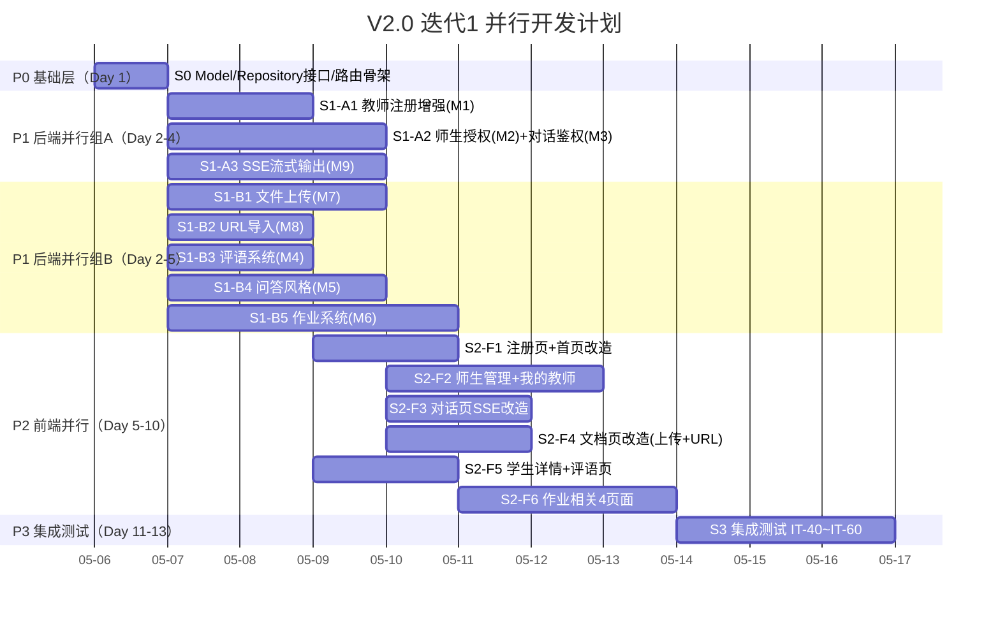
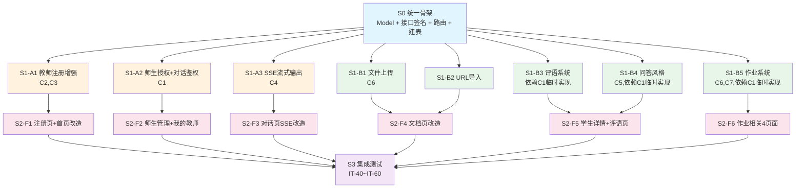

# V2.0 迭代1 需求规格说明书

## 1. 迭代概述

| 项目 | 说明 |
|------|------|
| **迭代名称** | V2.0 Sprint 1 - 核心功能开发（用户需求优先） |
| **迭代目标** | 完成所有用户可感知的新功能，让系统从 MVP 变成功能完整的产品 |
| **迭代周期** | ~4 周 |
| **交付标准** | 所有新功能通过集成测试，前端页面可交互 |
| **前置依赖** | V1.0 全部完成（3 个迭代，39 个集成测试通过） |

## 2. 迭代目标

### 2.1 核心目标
> **完成师生教学管理全链路 + 知识库增强 + 对话体验升级**

具体来说：
1. ✅ 师生授权：教师邀请/学生申请/审批/对话鉴权
2. ✅ 教师注册增强：必填学校+描述，名称+学校唯一
3. ✅ 教师评语：教师对学生写评语，含学习进度摘要
4. ✅ 个性化问答风格：教师针对每个学生设置对话风格
5. ✅ 作业系统：学生提交作业，AI+教师点评
6. ✅ 文件上传：PDF/DOCX/TXT/MD 解析入库
7. ✅ URL 导入：网页抓取内容入库
8. ✅ SSE 流式输出：大模型流式推送，前端逐字渲染

### 2.2 不在本迭代范围
- ❌ Docker 容器化部署（迭代2）
- ❌ HTTPS / Nginx 配置（迭代2）
- ❌ 安全加固 / API 限流（迭代2）
- ❌ 记忆衰减机制（迭代2）
- ❌ 数据分析看板（迭代2）
- ❌ 小程序审核发布（迭代2）

---

## 3. 模块需求

### 3.1 模块 V2-M1：教师注册增强

**目标**：教师注册时必填学校和分身描述，同名+同校不允许注册。

#### 数据库变更

**users 表新增字段**：

```sql
ALTER TABLE users ADD COLUMN school TEXT DEFAULT '';          -- 学校名称（教师必填）
ALTER TABLE users ADD COLUMN description TEXT DEFAULT '';     -- 分身简短描述（教师必填）
```

**新增唯一索引**：

```sql
-- 教师 nickname + school 联合唯一索引（仅对 teacher 角色生效）
CREATE UNIQUE INDEX IF NOT EXISTS idx_teacher_school ON users(nickname, school) WHERE role = 'teacher';
```

#### 功能需求

| ID | 需求 | 优先级 |
|----|------|--------|
| REG-01 | `POST /api/auth/complete-profile` 教师角色必填 school + description | P0 |
| REG-02 | 校验 nickname + school 在 teacher 角色中唯一 | P0 |
| REG-03 | 重复时返回 409 + 错误码 40008 | P0 |
| REG-04 | User 模型新增 School / Description 字段 | P0 |
| REG-05 | 教师列表接口返回 school + description | P1 |

#### 改造接口

**`POST /api/auth/complete-profile`** 请求体变更：

```json
// 教师角色（新增 school + description 必填）
{
  "role": "teacher",
  "nickname": "王老师",
  "school": "北京大学",
  "description": "物理学教授，专注力学和热力学教学"
}

// 学生角色（不变）
{
  "role": "student",
  "nickname": "小李"
}
```

#### 涉及文件

| 文件 | 改动 |
|------|------|
| `database/database.go` | autoMigrate 新增 ALTER TABLE + CREATE INDEX |
| `database/models.go` | User 结构体新增 School / Description 字段 |
| `database/repository.go` | UserRepository 新增 CheckTeacherExists 方法 |
| `plugins/auth/auth_plugin.go` | complete-profile action 增加校验逻辑 |
| `backend/api/handlers.go` | HandleCompleteProfile 请求体增加 school / description |

---

### 3.2 模块 V2-M2：师生授权机制

**目标**：教师可邀请学生使用分身，学生可申请使用，需教师审批。

#### 新增数据表

```sql
CREATE TABLE IF NOT EXISTS teacher_student_relations (
    id              INTEGER PRIMARY KEY AUTOINCREMENT,
    teacher_id      INTEGER NOT NULL,
    student_id      INTEGER NOT NULL,
    status          TEXT NOT NULL DEFAULT 'pending',  -- pending / approved / rejected
    initiated_by    TEXT NOT NULL,                     -- teacher（邀请）/ student（申请）
    created_at      DATETIME DEFAULT CURRENT_TIMESTAMP,
    updated_at      DATETIME DEFAULT CURRENT_TIMESTAMP,
    FOREIGN KEY (teacher_id) REFERENCES users(id),
    FOREIGN KEY (student_id) REFERENCES users(id),
    UNIQUE(teacher_id, student_id)
);
```

#### 功能需求

| ID | 需求 | 优先级 |
|----|------|--------|
| REL-01 | 教师邀请学生（邀请即同意，status=approved） | P0 |
| REL-02 | 学生申请使用分身（status=pending，需审批） | P0 |
| REL-03 | 教师审批同意（status → approved） | P0 |
| REL-04 | 教师审批拒绝（status → rejected） | P0 |
| REL-05 | 获取师生关系列表（教师看学生列表，学生看教师列表） | P0 |
| REL-06 | 关系已存在时返回 409 + 错误码 40009 | P0 |

#### 新增接口

| 方法 | 路径 | 说明 | 角色 |
|------|------|------|------|
| POST | `/api/relations/invite` | 教师邀请学生 | teacher |
| POST | `/api/relations/apply` | 学生申请使用分身 | student |
| PUT | `/api/relations/:id/approve` | 教师审批同意 | teacher |
| PUT | `/api/relations/:id/reject` | 教师审批拒绝 | teacher |
| GET | `/api/relations` | 获取师生关系列表 | 所有 |

#### 业务逻辑

```
教师邀请学生:
  POST /api/relations/invite { "student_id": 5 }
  → 检查学生是否存在 + 角色是否为 student
  → 检查关系是否已存在 → 已存在返回 40009
  → 创建关系 status=approved, initiated_by=teacher

学生申请使用分身:
  POST /api/relations/apply { "teacher_id": 1 }
  → 检查教师是否存在 + 角色是否为 teacher
  → 检查关系是否已存在 → 已存在返回 40009
  → 创建关系 status=pending, initiated_by=student

教师审批:
  PUT /api/relations/:id/approve
  → 检查关系是否存在 + 是否属于当前教师
  → status → approved, updated_at → now

  PUT /api/relations/:id/reject
  → 检查关系是否存在 + 是否属于当前教师
  → status → rejected, updated_at → now

获取列表:
  GET /api/relations?status=pending
  → 教师：返回自己的学生列表（含 status）
  → 学生：返回自己的教师列表（含 status）
  → 支持 status 筛选
```

#### 涉及文件

| 文件 | 改动 |
|------|------|
| `database/database.go` | autoMigrate 新增 teacher_student_relations 表 |
| `database/models.go` | 新增 TeacherStudentRelation 结构体 |
| `database/repository.go` | 新增 RelationRepository（CRUD + 查询） |
| `backend/api/handlers.go` | 新增 5 个 Handler |
| `backend/api/router.go` | 新增 /api/relations 路由组 |

---

### 3.3 模块 V2-M3：对话鉴权改造

**目标**：未授权学生无法与教师分身对话。

#### 功能需求

| ID | 需求 | 优先级 |
|----|------|--------|
| AUTH-01 | `POST /api/chat` 增加师生授权检查 | P0 |
| AUTH-02 | `POST /api/chat/stream` 增加师生授权检查 | P0 |
| AUTH-03 | 未授权返回 403 + 错误码 40007 | P0 |
| AUTH-04 | 数据迁移：为已有对话关系自动创建 approved 记录 | P1 |

#### 改造逻辑

```go
// HandleChat 改造（在构建管道输入之前增加）
func (h *Handler) HandleChat(c *gin.Context) {
    // ... 解析请求 ...

    // 🆕 师生授权检查
    if role == "student" {
        relationRepo := database.NewRelationRepository(db)
        approved, err := relationRepo.IsApproved(req.TeacherID, userIDInt64)
        if err != nil {
            Error(c, 500, 50001, "查询授权关系失败")
            return
        }
        if !approved {
            Error(c, 403, 40007, "未获得该教师授权，请先申请")
            return
        }
    }

    // ... 原有管道执行逻辑 ...
}
```

#### 数据迁移脚本

```sql
-- 为已有对话关系自动创建 approved 记录
INSERT OR IGNORE INTO teacher_student_relations (teacher_id, student_id, status, initiated_by)
SELECT DISTINCT teacher_id, student_id, 'approved', 'teacher'
FROM conversations
WHERE NOT EXISTS (
    SELECT 1 FROM teacher_student_relations
    WHERE teacher_student_relations.teacher_id = conversations.teacher_id
    AND teacher_student_relations.student_id = conversations.student_id
);
```

#### 涉及文件

| 文件 | 改动 |
|------|------|
| `backend/api/handlers.go` | HandleChat 增加授权检查 |
| `database/repository.go` | RelationRepository 新增 IsApproved 方法 |
| `database/database.go` | autoMigrate 增加数据迁移逻辑 |

---

### 3.4 模块 V2-M4：教师评语系统

**目标**：教师可对学生写评语，含学习进度摘要。

#### 新增数据表

```sql
CREATE TABLE IF NOT EXISTS teacher_comments (
    id              INTEGER PRIMARY KEY AUTOINCREMENT,
    teacher_id      INTEGER NOT NULL,
    student_id      INTEGER NOT NULL,
    content         TEXT NOT NULL,           -- 评语内容
    progress_summary TEXT,                   -- 学习进度摘要
    created_at      DATETIME DEFAULT CURRENT_TIMESTAMP,
    updated_at      DATETIME DEFAULT CURRENT_TIMESTAMP,
    FOREIGN KEY (teacher_id) REFERENCES users(id),
    FOREIGN KEY (student_id) REFERENCES users(id)
);
```

#### 功能需求

| ID | 需求 | 优先级 |
|----|------|--------|
| CMT-01 | 教师写评语（含学习进度摘要） | P1 |
| CMT-02 | 获取评语列表（教师看自己写的，学生看收到的） | P1 |
| CMT-03 | 写评语前校验师生关系（必须是 approved） | P1 |

#### 新增接口

| 方法 | 路径 | 说明 | 角色 |
|------|------|------|------|
| POST | `/api/comments` | 教师写评语 | teacher |
| GET | `/api/comments` | 获取评语列表 | 所有 |

#### 涉及文件

| 文件 | 改动 |
|------|------|
| `database/database.go` | autoMigrate 新增 teacher_comments 表 |
| `database/models.go` | 新增 TeacherComment 结构体 |
| `database/repository.go` | 新增 CommentRepository |
| `backend/api/handlers.go` | 新增 HandleCreateComment / HandleGetComments |
| `backend/api/router.go` | 新增 /api/comments 路由 |

---

### 3.5 模块 V2-M5：个性化问答风格

**目标**：教师可针对每个学生设置不同的对话风格，对话时自动注入。

#### 新增数据表

```sql
CREATE TABLE IF NOT EXISTS student_dialogue_styles (
    id              INTEGER PRIMARY KEY AUTOINCREMENT,
    teacher_id      INTEGER NOT NULL,
    student_id      INTEGER NOT NULL,
    style_config    TEXT NOT NULL,           -- JSON 格式配置
    created_at      DATETIME DEFAULT CURRENT_TIMESTAMP,
    updated_at      DATETIME DEFAULT CURRENT_TIMESTAMP,
    FOREIGN KEY (teacher_id) REFERENCES users(id),
    FOREIGN KEY (student_id) REFERENCES users(id),
    UNIQUE(teacher_id, student_id)
);
```

#### style_config JSON 结构

```json
{
  "temperature": 0.7,           // 回复随机性 0.1-1.0
  "guidance_level": "medium",   // 引导程度: low / medium / high
  "style_prompt": "对该学生请多用鼓励性语言，注重基础概念的巩固",
  "max_turns_per_topic": 5      // 每个话题最大追问轮次
}
```

#### 功能需求

| ID | 需求 | 优先级 |
|----|------|--------|
| STY-01 | 教师设置学生问答风格（UPSERT） | P1 |
| STY-02 | 获取学生问答风格 | P1 |
| STY-03 | 对话时自动查询并注入风格到 system prompt | P1 |
| STY-04 | 风格中的 temperature 覆盖 LLM 默认值 | P1 |
| STY-05 | guidance_level 影响 system prompt 模板 | P1 |

#### 新增接口

| 方法 | 路径 | 说明 | 角色 |
|------|------|------|------|
| PUT | `/api/students/:id/dialogue-style` | 设置学生问答风格 | teacher |
| GET | `/api/students/:id/dialogue-style` | 获取学生问答风格 | teacher/student |

#### Prompt 注入方案

改造 `prompt.go` 中的 `BuildSystemPrompt`，新增 `styleConfig` 参数：

```go
// 改造前
func (b *PromptBuilder) BuildSystemPrompt(chunks, memories []map[string]interface{}) string

// 改造后
func (b *PromptBuilder) BuildSystemPrompt(chunks, memories []map[string]interface{}, styleConfig *StyleConfig) string
```

**guidance_level 对 system prompt 的影响**：

| guidance_level | 效果 |
|----------------|------|
| `low` | 追加："请尽量少提问，多给出直接的解释和答案" |
| `medium` | 保持默认苏格拉底式教学（不追加） |
| `high` | 追加："请严格采用苏格拉底式教学，绝不直接给出答案，每次回复必须包含至少一个引导性问题" |

**style_prompt 注入位置**：

```
你是一位采用苏格拉底式教学法的AI教师助手。你的教学原则：
...（原有内容）

【个性化教学要求】
{style_prompt}                    ← 🆕 注入位置

【相关知识】
...
```

#### 对话插件改造

改造 `dialogue_plugin.go` 中的 `handleChat`：

```go
// 在构建 prompt 之前，查询个性化风格
styleRepo := database.NewStyleRepository(p.db)
styleConfig, _ := styleRepo.GetByTeacherAndStudent(teacherID, studentID)

// 传入 styleConfig
systemPrompt := p.prompt.BuildSystemPrompt(chunks, memories, styleConfig)

// 如果 styleConfig 指定了 temperature，覆盖 LLM 默认值
if styleConfig != nil && styleConfig.Temperature > 0 {
    p.llmClient.SetTemperature(styleConfig.Temperature)
    defer p.llmClient.ResetTemperature() // 恢复默认值
}
```

#### 涉及文件

| 文件 | 改动 |
|------|------|
| `database/database.go` | autoMigrate 新增 student_dialogue_styles 表 |
| `database/models.go` | 新增 StudentDialogueStyle / StyleConfig 结构体 |
| `database/repository.go` | 新增 StyleRepository |
| `plugins/dialogue/prompt.go` | BuildSystemPrompt 增加 styleConfig 参数 |
| `plugins/dialogue/dialogue_plugin.go` | handleChat 增加风格查询和注入 |
| `plugins/dialogue/llm_client.go` | 新增 SetTemperature / ResetTemperature 方法 |
| `backend/api/handlers.go` | 新增 HandleSetDialogueStyle / HandleGetDialogueStyle |
| `backend/api/router.go` | 新增 /api/students/:id/dialogue-style 路由 |

---

### 3.6 模块 V2-M6：作业系统

**目标**：学生可提交作业或成果，AI 和教师都可以进行点评。

#### 新增数据表

```sql
-- 学生作业/成果表
CREATE TABLE IF NOT EXISTS assignments (
    id              INTEGER PRIMARY KEY AUTOINCREMENT,
    student_id      INTEGER NOT NULL,
    teacher_id      INTEGER NOT NULL,
    title           TEXT NOT NULL,
    content         TEXT,                    -- 文本内容
    file_path       TEXT,                    -- 上传文件路径
    file_type       TEXT,                    -- 文件类型
    status          TEXT DEFAULT 'submitted', -- submitted / reviewed
    created_at      DATETIME DEFAULT CURRENT_TIMESTAMP,
    updated_at      DATETIME DEFAULT CURRENT_TIMESTAMP,
    FOREIGN KEY (student_id) REFERENCES users(id),
    FOREIGN KEY (teacher_id) REFERENCES users(id)
);

-- 作业点评表（AI 和教师共用）
CREATE TABLE IF NOT EXISTS assignment_reviews (
    id              INTEGER PRIMARY KEY AUTOINCREMENT,
    assignment_id   INTEGER NOT NULL,
    reviewer_type   TEXT NOT NULL,            -- ai / teacher
    reviewer_id     INTEGER,                  -- teacher 时为教师 ID，ai 时为 NULL
    content         TEXT NOT NULL,            -- 点评内容
    score           REAL,                     -- 评分（可选，0-100）
    created_at      DATETIME DEFAULT CURRENT_TIMESTAMP,
    FOREIGN KEY (assignment_id) REFERENCES assignments(id)
);
```

#### 功能需求

| ID | 需求 | 优先级 |
|----|------|--------|
| ASG-01 | 学生提交作业（文本 + 可选文件） | P1 |
| ASG-02 | 获取作业列表（教师看学生提交的，学生看自己的） | P1 |
| ASG-03 | 获取作业详情（含所有点评） | P1 |
| ASG-04 | 教师手动点评作业 | P1 |
| ASG-05 | AI 自动点评作业 | P1 |
| ASG-06 | 提交作业前校验师生关系（必须是 approved） | P1 |
| ASG-07 | 教师点评后作业状态变为 reviewed | P1 |

#### 新增接口

| 方法 | 路径 | 说明 | 角色 |
|------|------|------|------|
| POST | `/api/assignments` | 学生提交作业 | student |
| GET | `/api/assignments` | 获取作业列表 | 所有 |
| GET | `/api/assignments/:id` | 获取作业详情（含点评） | 所有 |
| POST | `/api/assignments/:id/review` | 教师点评作业 | teacher |
| POST | `/api/assignments/:id/ai-review` | AI 自动点评 | student/teacher |

#### AI 点评业务逻辑

```
POST /api/assignments/:id/ai-review
  1. 查询作业详情（content + file_path）
  2. 如果有文件，解析文件内容（复用 file_parser）
  3. 查询该教师知识库中的相关知识（复用 knowledge 插件 search）
  4. 构建 AI 点评 prompt:
     "你是{教师昵称}的数字分身，请根据以下知识库内容，对学生的作业进行点评。
      要求：
      1. 指出作业中的优点
      2. 指出需要改进的地方
      3. 给出具体的改进建议
      4. 给出评分（0-100）

      【知识库参考】
      {knowledge_chunks}

      【学生作业】
      标题: {title}
      内容: {content}"
  5. 调用大模型生成点评
  6. 解析评分（从回复中提取数字）
  7. 存入 assignment_reviews (reviewer_type='ai')
```

#### 涉及文件

| 文件 | 改动 |
|------|------|
| `database/database.go` | autoMigrate 新增 assignments + assignment_reviews 表 |
| `database/models.go` | 新增 Assignment / AssignmentReview 结构体 |
| `database/repository.go` | 新增 AssignmentRepository / ReviewRepository |
| `backend/api/handlers.go` | 新增 5 个 Handler |
| `backend/api/router.go` | 新增 /api/assignments 路由组 |
| `plugins/dialogue/prompt.go` | 新增 BuildAssignmentReviewPrompt 方法 |

---

### 3.7 模块 V2-M7：文件上传

**目标**：教师可上传 PDF/DOCX/TXT/MD 文件，自动解析内容入库。

#### 功能需求

| ID | 需求 | 优先级 |
|----|------|--------|
| FUP-01 | 接收 multipart/form-data 文件上传 | P1 |
| FUP-02 | 支持 PDF 格式解析 | P1 |
| FUP-03 | 支持 DOCX 格式解析 | P1 |
| FUP-04 | 支持 TXT / MD 格式解析 | P1 |
| FUP-05 | 文件大小限制 50MB | P1 |
| FUP-06 | 文件存储到 `uploads/documents/{teacher_id}/` | P1 |
| FUP-07 | 解析后自动分块 → 向量化存入 Chroma | P1 |
| FUP-08 | 不支持的格式返回 400 + 错误码 40010 | P1 |
| FUP-09 | 超过大小限制返回 400 + 错误码 40011 | P1 |

#### 新增接口

| 方法 | 路径 | 说明 | 角色 |
|------|------|------|------|
| POST | `/api/documents/upload` | 文件上传（multipart/form-data） | teacher |

#### 文件解析方案

| 格式 | Go 库 | 说明 |
|------|-------|------|
| PDF | `github.com/ledongthuc/pdf` 或 `github.com/pdfcpu/pdfcpu` | 提取文本内容 |
| DOCX | `github.com/nguyenthenguyen/docx` | 解析 XML 提取文本 |
| TXT | 标准库 `os.ReadFile` | 直接读取 |
| MD | 标准库 `os.ReadFile` | 直接读取（保留 Markdown 格式） |

#### 处理流程

```
POST /api/documents/upload
  Content-Type: multipart/form-data
  字段: file (文件), title (可选), tags (可选)

  1. 校验文件格式（后缀 + MIME type）
  2. 校验文件大小（≤ 50MB）
  3. 保存文件到 uploads/documents/{teacher_id}/{uuid}_{filename}
  4. 根据格式调用对应解析器提取文本
  5. 自动填充 title（如果未传，使用文件名）
  6. 调用 knowledge 插件 add action（分块 + 向量化）
  7. 返回 document_id + chunks_count
```

#### 新增文件

| 文件 | 说明 |
|------|------|
| `plugins/knowledge/file_parser.go` | 🆕 文件解析器（PDF/DOCX/TXT/MD） |

#### 涉及文件

| 文件 | 改动 |
|------|------|
| `backend/api/handlers.go` | 新增 HandleUploadDocument |
| `backend/api/router.go` | 新增 POST /api/documents/upload 路由 |
| `plugins/knowledge/knowledge_plugin.go` | add action 支持 doc_type 字段 |

#### 新增环境变量

| 变量名 | 默认值 | 说明 |
|--------|--------|------|
| `UPLOAD_DIR` | `./uploads` | 文件上传存储目录 |
| `MAX_UPLOAD_SIZE` | `52428800` | 最大上传文件大小（字节，50MB） |

---

### 3.8 模块 V2-M8：URL 导入

**目标**：教师输入 URL，后端自动抓取网页内容入库。

#### 功能需求

| ID | 需求 | 优先级 |
|----|------|--------|
| URL-01 | 后端 HTTP GET 抓取网页内容 | P1 |
| URL-02 | HTML 解析：去除标签、提取正文 | P1 |
| URL-03 | 自动提取页面标题（`<title>` 标签） | P1 |
| URL-04 | 超时控制（10 秒） | P1 |
| URL-05 | 内容过长截断（100000 字符） | P1 |
| URL-06 | URL 不可达或解析失败返回 400 + 错误码 40012 | P1 |
| URL-07 | 解析后调用 knowledge 插件入库 | P1 |

#### 新增接口

| 方法 | 路径 | 说明 | 角色 |
|------|------|------|------|
| POST | `/api/documents/import-url` | URL 导入 | teacher |

#### 处理流程

```
POST /api/documents/import-url
  Body: { "url": "https://example.com/article", "title": "可选标题", "tags": "物理,力学" }

  1. 校验 URL 格式
  2. HTTP GET 抓取（User-Agent: DigitalTwin/2.0, Timeout: 10s）
  3. 解析 HTML：
     a. 提取 <title> 作为默认标题
     b. 去除 <script>/<style>/<nav>/<footer> 等非正文标签
     c. 提取 <body> 内文本内容
     d. 处理编码（UTF-8 / GBK 自动检测）
  4. 截断超长内容（> 100000 字符）
  5. 调用 knowledge 插件 add action（分块 + 向量化）
  6. 返回 document_id + chunks_count + extracted_title
```

#### 新增文件

| 文件 | 说明 |
|------|------|
| `plugins/knowledge/url_fetcher.go` | 🆕 URL 抓取和 HTML 解析 |

#### 涉及文件

| 文件 | 改动 |
|------|------|
| `backend/api/handlers.go` | 新增 HandleImportURL |
| `backend/api/router.go` | 新增 POST /api/documents/import-url 路由 |

#### 新增依赖

| 依赖 | 用途 |
|------|------|
| `golang.org/x/net/html` | HTML 解析 |
| `golang.org/x/text/encoding` | 编码检测和转换 |

---

### 3.9 模块 V2-M9：SSE 流式输出

**目标**：大模型流式调用，通过 SSE 推送给前端，实现逐字渲染。

#### 功能需求

| ID | 需求 | 优先级 |
|----|------|--------|
| SSE-01 | 新增 `POST /api/chat/stream` SSE 接口 | P1 |
| SSE-02 | LLMClient 新增 ChatStream 方法（流式调用） | P1 |
| SSE-03 | SSE 事件格式：start / delta / done | P1 |
| SSE-04 | 与 `/api/chat` 并存，共享管道逻辑 | P1 |
| SSE-05 | Mock 模式支持流式模拟（逐字输出） | P1 |
| SSE-06 | 流式完成后保存对话记录 | P1 |
| SSE-07 | 流式完成后异步提取记忆 | P1 |
| SSE-08 | 包含师生授权鉴权 | P0 |

#### 新增接口

| 方法 | 路径 | 说明 | 角色 |
|------|------|------|------|
| POST | `/api/chat/stream` | SSE 流式对话 | student |

#### SSE 响应格式

```
Content-Type: text/event-stream
Cache-Control: no-cache
Connection: keep-alive

data: {"type":"start","session_id":"uuid-xxx"}

data: {"type":"delta","content":"这是"}

data: {"type":"delta","content":"一个"}

data: {"type":"delta","content":"很好的问题"}

data: {"type":"done","conversation_id":42,"token_usage":{"prompt_tokens":850,"completion_tokens":120,"total_tokens":970}}
```

#### LLMClient 改造

```go
// 新增流式调用方法
func (c *LLMClient) ChatStream(messages []ChatMessage, onDelta func(content string)) (*ChatResponse, error)

// API 模式：使用 stream: true 参数，逐行读取 SSE 响应
// Mock 模式：将完整回复按字符逐个输出，每 50ms 一个 delta
```

#### OpenAI 兼容流式 API 请求

```json
{
  "model": "qwen-turbo",
  "messages": [...],
  "stream": true
}
```

#### 涉及文件

| 文件 | 改动 |
|------|------|
| `plugins/dialogue/llm_client.go` | 新增 ChatStream 方法 + apiStreamRequest |
| `plugins/dialogue/dialogue_plugin.go` | 新增 handleChatStream 方法 |
| `backend/api/handlers.go` | 新增 HandleChatStream |
| `backend/api/router.go` | 新增 POST /api/chat/stream 路由 |

---

### 3.10 模块 V2-M10：集成测试

**目标**：所有新功能通过集成测试。

#### 测试用例规划

| 用例编号 | 测试场景 | 涉及模块 |
|----------|----------|----------|
| IT-40 | 教师注册必填 school + description | V2-M1 |
| IT-41 | 同名+同校教师注册返回 409 | V2-M1 |
| IT-42 | 教师邀请学生 → 关系 approved | V2-M2 |
| IT-43 | 学生申请使用分身 → 关系 pending | V2-M2 |
| IT-44 | 教师审批同意 → 关系 approved | V2-M2 |
| IT-45 | 教师审批拒绝 → 关系 rejected | V2-M2 |
| IT-46 | 重复创建关系返回 409 | V2-M2 |
| IT-47 | 未授权学生对话返回 403 | V2-M3 |
| IT-48 | 授权学生对话成功 | V2-M3 |
| IT-49 | 教师写评语 + 学生查看评语 | V2-M4 |
| IT-50 | 教师设置问答风格 + 对话时生效 | V2-M5 |
| IT-51 | 学生提交作业 + 教师点评 | V2-M6 |
| IT-52 | AI 自动点评作业 | V2-M6 |
| IT-53 | 上传 TXT 文件 → 自动解析入库 | V2-M7 |
| IT-54 | 上传 MD 文件 → 自动解析入库 | V2-M7 |
| IT-55 | 上传不支持格式返回 400 | V2-M7 |
| IT-56 | URL 导入 → 自动抓取入库 | V2-M8 |
| IT-57 | URL 不可达返回 400 | V2-M8 |
| IT-58 | SSE 流式对话 → 逐字输出 | V2-M9 |
| IT-59 | SSE 流式完成后对话记录已保存 | V2-M9 |
| IT-60 | 全链路：注册→授权→设置风格→对话→评语→作业→点评 | 全部 |

---

## 4. 前端页面需求

### 4.1 改造页面

#### 4.1.1 角色选择页（FE-P2）改造

**改造内容**：教师注册增加"学校"和"分身描述"输入框

```
┌─────────────────────────┐
│     选择你的角色          │
│                         │
│  [教师]    [学生]        │
│                         │
│  ── 教师注册信息 ──      │
│  昵称: [________]       │
│  学校: [________]  🆕   │
│  分身描述: [______] 🆕   │
│                         │
│  [确认注册]              │
└─────────────────────────┘
```

#### 4.1.2 学生首页（FE-P3）改造

**改造内容**：教师卡片增加授权状态

```
┌─────────────────────────┐
│  王老师 · 北京大学        │
│  物理学教授              │
│                         │
│  [已授权 ✅]             │  ← 已授权：可直接进入对话
│  [申请使用]              │  ← 未授权：点击申请
│  [审批中 ⏳]             │  ← 已申请待审批
└─────────────────────────┘
```

#### 4.1.3 对话页（FE-P5）改造

**改造内容**：SSE 流式输出，逐字渲染 AI 回复

- 调用 `POST /api/chat/stream` 替代 `POST /api/chat`
- 使用 `Taro.request` + `enableChunked: true` 接收流式数据
- AI 回复气泡实时追加文字 + 光标闪烁动画
- 降级方案：如果 SSE 不可用，回退到普通接口

#### 4.1.4 添加文档页（FE-P8）改造

**改造内容**：三 Tab 切换

```
┌─────────────────────────┐
│  [文本录入] [文件上传] [URL导入]  │
│  ─────────────────────  │
│                         │
│  文件上传 Tab:           │
│  ┌───────────────────┐  │
│  │  📁 点击上传文件    │  │
│  │  支持 PDF/DOCX/    │  │
│  │  TXT/MD，最大50MB  │  │
│  └───────────────────┘  │
│  标题: [________]       │
│  标签: [________]       │
│  [上传并解析]            │
│                         │
│  URL 导入 Tab:          │
│  URL: [________________]│
│  标题: [________]       │
│  标签: [________]       │
│  [导入]                 │
└─────────────────────────┘
```

### 4.2 新增页面

#### 4.2.1 师生管理页（FE-P10）— teacher

```
┌─────────────────────────┐
│  我的学生                │
│                         │
│  待审批 (2)             │
│  ┌───────────────────┐  │
│  │ 小李 · 申请使用     │  │
│  │ [同意] [拒绝]      │  │
│  └───────────────────┘  │
│                         │
│  已授权 (5)             │
│  ┌───────────────────┐  │
│  │ 小王 · 已授权 ✅    │  │
│  │ [查看详情 →]       │  │
│  └───────────────────┘  │
│                         │
│  [+ 邀请学生]           │
└─────────────────────────┘
```

#### 4.2.2 我的教师页（FE-P11）— student

```
┌─────────────────────────┐
│  我的教师                │
│                         │
│  已授权                  │
│  ┌───────────────────┐  │
│  │ 王老师 · 北京大学   │  │
│  │ 物理学教授          │  │
│  │ [进入对话]          │  │
│  └───────────────────┘  │
│                         │
│  审批中                  │
│  ┌───────────────────┐  │
│  │ 李老师 · 清华大学   │  │
│  │ 等待审批中 ⏳       │  │
│  └───────────────────┘  │
└─────────────────────────┘
```

#### 4.2.3 学生详情页（FE-P12）— teacher

```
┌─────────────────────────┐
│  ← 学生详情              │
│                         │
│  小李                    │
│  对话次数: 15 | 最近: 今天│
│                         │
│  ── 问答风格设置 ──      │
│  引导程度: [低/中/高]    │
│  风格描述: [________]    │
│  [保存设置]              │
│                         │
│  ── 我的评语 ──          │
│  [+ 写评语]              │
│  ┌───────────────────┐  │
│  │ 2026-03-28         │  │
│  │ 该生学习态度认真... │  │
│  └───────────────────┘  │
└─────────────────────────┘
```

#### 4.2.4 我的评语页（FE-P13）— student

```
┌─────────────────────────┐
│  我的评语                │
│                         │
│  王老师 · 2026-03-28    │
│  ┌───────────────────┐  │
│  │ 该生学习态度认真，  │  │
│  │ 对力学概念理解较好  │  │
│  │ 进度: 牛顿定律80%  │  │
│  └───────────────────┘  │
└─────────────────────────┘
```

#### 4.2.5 提交作业页（FE-P14）— student

```
┌─────────────────────────┐
│  提交作业                │
│                         │
│  教师: [选择教师 ▼]     │
│  标题: [________]       │
│  内容:                   │
│  ┌───────────────────┐  │
│  │                   │  │
│  │  (多行文本输入)    │  │
│  │                   │  │
│  └───────────────────┘  │
│  附件: [+ 上传文件]     │
│                         │
│  [提交作业]              │
└─────────────────────────┘
```

#### 4.2.6 作业列表页（FE-P15）— teacher

```
┌─────────────────────────┐
│  学生作业                │
│                         │
│  待点评 (3)             │
│  ┌───────────────────┐  │
│  │ 小李 · 牛顿定律作业 │  │
│  │ 2026-03-28 提交    │  │
│  │ [查看详情 →]       │  │
│  └───────────────────┘  │
│                         │
│  已点评 (8)             │
│  ┌───────────────────┐  │
│  │ 小王 · 热力学作业   │  │
│  │ 评分: 85 ✅        │  │
│  └───────────────────┘  │
└─────────────────────────┘
```

#### 4.2.7 作业详情页（FE-P16）— 所有

```
┌─────────────────────────┐
│  ← 作业详情              │
│                         │
│  牛顿定律作业            │
│  小李 · 2026-03-28      │
│                         │
│  ── 作业内容 ──          │
│  牛顿第一定律是...       │
│  📎 附件: homework.pdf  │
│                         │
│  ── AI 点评 ──           │
│  ┌───────────────────┐  │
│  │ 🤖 评分: 78        │  │
│  │ 优点: 概念理解准确  │  │
│  │ 改进: 缺少实例...   │  │
│  └───────────────────┘  │
│  [请求 AI 点评]          │
│                         │
│  ── 教师点评 ──          │
│  ┌───────────────────┐  │
│  │ 👨‍🏫 评分: 85       │  │
│  │ 整体不错，注意...   │  │
│  └───────────────────┘  │
│  [写点评]  (教师可见)    │
└─────────────────────────┘
```

#### 4.2.8 我的作业页（FE-P17）— student

```
┌─────────────────────────┐
│  我的作业                │
│                         │
│  ┌───────────────────┐  │
│  │ 牛顿定律作业        │  │
│  │ 王老师 · 已点评 ✅  │  │
│  │ AI: 78 | 教师: 85  │  │
│  │ [查看详情 →]       │  │
│  └───────────────────┘  │
│                         │
│  ┌───────────────────┐  │
│  │ 热力学作业          │  │
│  │ 王老师 · 待点评 ⏳  │  │
│  │ [查看详情 →]       │  │
│  └───────────────────┘  │
│                         │
│  [+ 提交新作业]         │
└─────────────────────────┘
```

### 4.3 前端模块划分

| 模块编号 | 模块名称 | 优先级 | 涉及页面 |
|----------|----------|--------|----------|
| V2-FE-M1 | 角色选择页改造 | P0 | FE-P2 |
| V2-FE-M2 | 学生首页改造 | P0 | FE-P3 |
| V2-FE-M3 | 师生管理页 + 我的教师页 | P0 | FE-P10 + FE-P11 |
| V2-FE-M4 | 对话页 SSE 改造 | P1 | FE-P5 |
| V2-FE-M5 | 添加文档页改造 | P1 | FE-P8 |
| V2-FE-M6 | 学生详情页 | P1 | FE-P12 |
| V2-FE-M7 | 我的评语页 | P1 | FE-P13 |
| V2-FE-M8 | 作业相关页面 | P1 | FE-P14 + FE-P15 + FE-P16 + FE-P17 |

### 4.4 前端新增 API 模块

| 文件 | 说明 |
|------|------|
| `src/api/relation.ts` | 🆕 师生关系 API（invite/apply/approve/reject/list） |
| `src/api/comment.ts` | 🆕 评语 API（create/list） |
| `src/api/style.ts` | 🆕 问答风格 API（set/get） |
| `src/api/assignment.ts` | 🆕 作业 API（submit/list/detail/review/ai-review） |
| `src/api/document.ts` | 🔧 改造：新增 upload / importUrl 方法 |
| `src/api/chat.ts` | 🔧 改造：新增 chatStream 方法 |

### 4.5 前端新增 Store

| 文件 | 说明 |
|------|------|
| `src/store/relationStore.ts` | 🆕 师生关系状态管理 |
| `src/store/assignmentStore.ts` | 🆕 作业状态管理 |

---

## 5. 并行开发计划

### 5.1 总体原则

> **核心思路**：先统一定义 Model + Repository 接口 + Handler 签名 + 路由注册，然后各子模块按接口契约并行开发，最后集成联调。



---

### 5.2 P0 基础层：统一骨架（Day 1）

> **目标**：定义所有新增 Model、Repository 接口签名、Handler 空壳、路由注册。后续各子模块只需"填充实现"，互不阻塞。

#### S0-1：数据库 Model 定义（`database/models.go`）

一次性新增所有结构体，后续子模块直接引用：

```go
// ===== V2.0 迭代1 新增 Model =====

// User 扩展字段（在现有 User 结构体中新增）
// School      string    `json:"school,omitempty"`
// Description string    `json:"description,omitempty"`

// TeacherStudentRelation 师生授权关系
type TeacherStudentRelation struct {
    ID          int64     `json:"id"`
    TeacherID   int64     `json:"teacher_id"`
    StudentID   int64     `json:"student_id"`
    Status      string    `json:"status"`       // pending / approved / rejected
    InitiatedBy string    `json:"initiated_by"`  // teacher / student
    CreatedAt   time.Time `json:"created_at"`
    UpdatedAt   time.Time `json:"updated_at"`
}

// TeacherComment 教师评语
type TeacherComment struct {
    ID              int64     `json:"id"`
    TeacherID       int64     `json:"teacher_id"`
    StudentID       int64     `json:"student_id"`
    Content         string    `json:"content"`
    ProgressSummary string    `json:"progress_summary,omitempty"`
    CreatedAt       time.Time `json:"created_at"`
    UpdatedAt       time.Time `json:"updated_at"`
}

// StudentDialogueStyle 个性化问答风格
type StudentDialogueStyle struct {
    ID          int64     `json:"id"`
    TeacherID   int64     `json:"teacher_id"`
    StudentID   int64     `json:"student_id"`
    StyleConfig string    `json:"style_config"` // JSON 字符串
    CreatedAt   time.Time `json:"created_at"`
    UpdatedAt   time.Time `json:"updated_at"`
}

// StyleConfig 风格配置（JSON 解析用）
type StyleConfig struct {
    Temperature      float64 `json:"temperature"`
    GuidanceLevel    string  `json:"guidance_level"`    // low / medium / high
    StylePrompt      string  `json:"style_prompt"`
    MaxTurnsPerTopic int     `json:"max_turns_per_topic"`
}

// Assignment 学生作业
type Assignment struct {
    ID        int64     `json:"id"`
    StudentID int64     `json:"student_id"`
    TeacherID int64     `json:"teacher_id"`
    Title     string    `json:"title"`
    Content   string    `json:"content,omitempty"`
    FilePath  string    `json:"file_path,omitempty"`
    FileType  string    `json:"file_type,omitempty"`
    Status    string    `json:"status"`  // submitted / reviewed
    CreatedAt time.Time `json:"created_at"`
    UpdatedAt time.Time `json:"updated_at"`
}

// AssignmentReview 作业点评
type AssignmentReview struct {
    ID           int64     `json:"id"`
    AssignmentID int64     `json:"assignment_id"`
    ReviewerType string    `json:"reviewer_type"` // ai / teacher
    ReviewerID   *int64    `json:"reviewer_id,omitempty"`
    Content      string    `json:"content"`
    Score        *float64  `json:"score,omitempty"`
    CreatedAt    time.Time `json:"created_at"`
}
```

#### S0-2：Repository 接口签名（`database/repository.go`）

一次性新增所有 Repository 的**接口签名**（方法体先返回 `nil` / 空值），后续各子模块填充实现：

```go
// ===== RelationRepository 接口契约 =====
// 供 M2/M3/M4/M5/M6 共同依赖

type RelationRepository struct { db *sql.DB }
func NewRelationRepository(db *sql.DB) *RelationRepository
func (r *RelationRepository) Create(rel *TeacherStudentRelation) (int64, error)
func (r *RelationRepository) GetByTeacherAndStudent(teacherID, studentID int64) (*TeacherStudentRelation, error)
func (r *RelationRepository) UpdateStatus(id int64, status string) error
func (r *RelationRepository) ListByTeacher(teacherID int64, status string, offset, limit int) ([]*TeacherStudentRelation, int, error)
func (r *RelationRepository) ListByStudent(studentID int64, status string, offset, limit int) ([]*TeacherStudentRelation, int, error)
func (r *RelationRepository) IsApproved(teacherID, studentID int64) (bool, error)  // ← M3/M4/M5/M6 共用

// ===== CommentRepository 接口契约 =====

type CommentRepository struct { db *sql.DB }
func NewCommentRepository(db *sql.DB) *CommentRepository
func (r *CommentRepository) Create(comment *TeacherComment) (int64, error)
func (r *CommentRepository) ListByTeacher(teacherID int64, studentID *int64, offset, limit int) ([]*TeacherComment, int, error)
func (r *CommentRepository) ListByStudent(studentID int64, teacherID *int64, offset, limit int) ([]*TeacherComment, int, error)

// ===== StyleRepository 接口契约 =====

type StyleRepository struct { db *sql.DB }
func NewStyleRepository(db *sql.DB) *StyleRepository
func (r *StyleRepository) Upsert(style *StudentDialogueStyle) (int64, error)
func (r *StyleRepository) GetByTeacherAndStudent(teacherID, studentID int64) (*StudentDialogueStyle, error)

// ===== AssignmentRepository 接口契约 =====

type AssignmentRepository struct { db *sql.DB }
func NewAssignmentRepository(db *sql.DB) *AssignmentRepository
func (r *AssignmentRepository) Create(asg *Assignment) (int64, error)
func (r *AssignmentRepository) GetByID(id int64) (*Assignment, error)
func (r *AssignmentRepository) ListByTeacher(teacherID int64, studentID *int64, status string, offset, limit int) ([]*Assignment, int, error)
func (r *AssignmentRepository) ListByStudent(studentID int64, teacherID *int64, status string, offset, limit int) ([]*Assignment, int, error)
func (r *AssignmentRepository) UpdateStatus(id int64, status string) error

// ===== ReviewRepository 接口契约 =====

type ReviewRepository struct { db *sql.DB }
func NewReviewRepository(db *sql.DB) *ReviewRepository
func (r *ReviewRepository) Create(review *AssignmentReview) (int64, error)
func (r *ReviewRepository) ListByAssignment(assignmentID int64) ([]*AssignmentReview, error)
```

#### S0-3：Handler 空壳 + 路由注册（`api/handlers.go` + `api/router.go`）

一次性注册所有路由 + Handler 空壳（返回 501 Not Implemented），后续各子模块填充实现：

```go
// handlers.go 新增空壳（每个返回 501）
func (h *Handler) HandleInviteStudent(c *gin.Context)      { c.JSON(501, gin.H{"message": "not implemented"}) }
func (h *Handler) HandleApplyTeacher(c *gin.Context)        { c.JSON(501, gin.H{"message": "not implemented"}) }
func (h *Handler) HandleApproveRelation(c *gin.Context)     { c.JSON(501, gin.H{"message": "not implemented"}) }
func (h *Handler) HandleRejectRelation(c *gin.Context)      { c.JSON(501, gin.H{"message": "not implemented"}) }
func (h *Handler) HandleGetRelations(c *gin.Context)        { c.JSON(501, gin.H{"message": "not implemented"}) }
func (h *Handler) HandleCreateComment(c *gin.Context)       { c.JSON(501, gin.H{"message": "not implemented"}) }
func (h *Handler) HandleGetComments(c *gin.Context)         { c.JSON(501, gin.H{"message": "not implemented"}) }
func (h *Handler) HandleSetDialogueStyle(c *gin.Context)    { c.JSON(501, gin.H{"message": "not implemented"}) }
func (h *Handler) HandleGetDialogueStyle(c *gin.Context)    { c.JSON(501, gin.H{"message": "not implemented"}) }
func (h *Handler) HandleSubmitAssignment(c *gin.Context)    { c.JSON(501, gin.H{"message": "not implemented"}) }
func (h *Handler) HandleGetAssignments(c *gin.Context)      { c.JSON(501, gin.H{"message": "not implemented"}) }
func (h *Handler) HandleGetAssignmentDetail(c *gin.Context) { c.JSON(501, gin.H{"message": "not implemented"}) }
func (h *Handler) HandleReviewAssignment(c *gin.Context)    { c.JSON(501, gin.H{"message": "not implemented"}) }
func (h *Handler) HandleAIReviewAssignment(c *gin.Context)  { c.JSON(501, gin.H{"message": "not implemented"}) }
func (h *Handler) HandleUploadDocument(c *gin.Context)      { c.JSON(501, gin.H{"message": "not implemented"}) }
func (h *Handler) HandleImportURL(c *gin.Context)           { c.JSON(501, gin.H{"message": "not implemented"}) }
func (h *Handler) HandleChatStream(c *gin.Context)          { c.JSON(501, gin.H{"message": "not implemented"}) }
```

#### S0-4：数据库建表（`database/database.go`）

一次性新增所有 ALTER TABLE + CREATE TABLE，确保后续子模块启动时表已就绪。

**S0 产出**：编译通过，所有新路由返回 501，前端可以开始对接（知道接口路径和格式）。

---

### 5.3 P1 后端并行开发（Day 2-5）

> **原则**：S0 完成后，以下 8 个子模块可以**完全并行**开发，互不阻塞。每个子模块只需"填充"自己负责的 Repository 实现 + Handler 实现。

#### 并行组 A：核心链路（3 个子模块）

| 子模块 | 负责模块 | 输入依赖 | 输出接口 | 预估工时 |
|--------|----------|----------|----------|----------|
| **S1-A1** | V2-M1 教师注册增强 | S0 的 User Model | `POST /api/auth/complete-profile` 改造完成 | 1.5d |
| **S1-A2** | V2-M2 师生授权 + V2-M3 对话鉴权 | S0 的 RelationRepository 接口 | 5 个关系接口 + `IsApproved()` 可用 | 2.5d |
| **S1-A3** | V2-M9 SSE 流式输出 | 现有 LLMClient + dialogue_plugin | `POST /api/chat/stream` 可用 | 2.5d |

**S1-A1 教师注册增强** 详细拆分：

| 子任务 | 文件 | 内容 |
|--------|------|------|
| S1-A1-a | `database/models.go` | User 结构体加 School / Description 字段 |
| S1-A1-b | `database/repository.go` | UserRepository 新增 `CheckTeacherExists(nickname, school)` + 改造 `UpdateRoleAndNickname` → `UpdateProfile` |
| S1-A1-c | `plugins/auth/auth_plugin.go` | complete-profile action 增加 school/description 校验 |
| S1-A1-d | `api/handlers.go` | HandleCompleteProfile 请求体增加字段 |
| S1-A1-e | `api/handlers.go` | HandleGetTeachers 返回 school/description（改造 TeacherWithDocCount） |

**S1-A2 师生授权 + 对话鉴权** 详细拆分：

| 子任务 | 文件 | 内容 |
|--------|------|------|
| S1-A2-a | `database/repository.go` | RelationRepository 全部方法实现 |
| S1-A2-b | `api/handlers.go` | HandleInviteStudent / HandleApplyTeacher 实现 |
| S1-A2-c | `api/handlers.go` | HandleApproveRelation / HandleRejectRelation 实现 |
| S1-A2-d | `api/handlers.go` | HandleGetRelations 实现（教师/学生双视角） |
| S1-A2-e | `api/handlers.go` | HandleChat 增加 `IsApproved()` 鉴权检查 |
| S1-A2-f | `database/database.go` | 数据迁移脚本（已有对话关系 → approved） |

**S1-A3 SSE 流式输出** 详细拆分：

| 子任务 | 文件 | 内容 |
|--------|------|------|
| S1-A3-a | `plugins/dialogue/llm_client.go` | 新增 `ChatStream(messages, onDelta)` 方法 |
| S1-A3-b | `plugins/dialogue/llm_client.go` | API 模式：`stream: true` + SSE 解析 |
| S1-A3-c | `plugins/dialogue/llm_client.go` | Mock 模式：逐字模拟输出 |
| S1-A3-d | `plugins/dialogue/dialogue_plugin.go` | 新增 `handleChatStream` action |
| S1-A3-e | `api/handlers.go` | HandleChatStream 实现（SSE 响应） |

#### 并行组 B：功能模块（5 个子模块）

| 子模块 | 负责模块 | 输入依赖 | 输出接口 | 预估工时 |
|--------|----------|----------|----------|----------|
| **S1-B1** | V2-M7 文件上传 | 现有 knowledge_plugin | `POST /api/documents/upload` 可用 | 2.5d |
| **S1-B2** | V2-M8 URL 导入 | 现有 knowledge_plugin | `POST /api/documents/import-url` 可用 | 1.5d |
| **S1-B3** | V2-M4 评语系统 | S0 的 CommentRepository 接口 + `IsApproved()` | 2 个评语接口可用 | 1.5d |
| **S1-B4** | V2-M5 问答风格 | S0 的 StyleRepository 接口 + `IsApproved()` | 2 个风格接口 + prompt 注入 | 2d |
| **S1-B5** | V2-M6 作业系统 | S0 的 AssignmentRepository 接口 + `IsApproved()` | 5 个作业接口可用 | 3d |

> **关键**：B3/B4/B5 都依赖 `RelationRepository.IsApproved()`，但 S0 已定义好接口签名并提供空实现（返回 `true, nil`），所以 B 组不需要等 A2 完成。A2 完成后替换真实实现即可。

**S1-B1 文件上传** 详细拆分：

| 子任务 | 文件 | 内容 |
|--------|------|------|
| S1-B1-a | `plugins/knowledge/file_parser.go` | 🆕 FileParser 接口 + TXT/MD 解析 |
| S1-B1-b | `plugins/knowledge/file_parser.go` | PDF 解析（`github.com/ledongthuc/pdf`） |
| S1-B1-c | `plugins/knowledge/file_parser.go` | DOCX 解析（`github.com/nguyenthenguyen/docx`） |
| S1-B1-d | `api/handlers.go` | HandleUploadDocument 实现（multipart 接收 + 校验 + 解析 + 入库） |

**S1-B2 URL 导入** 详细拆分：

| 子任务 | 文件 | 内容 |
|--------|------|------|
| S1-B2-a | `plugins/knowledge/url_fetcher.go` | 🆕 URLFetcher（HTTP GET + 超时 + 编码检测） |
| S1-B2-b | `plugins/knowledge/url_fetcher.go` | HTML 解析（去标签 + 提取正文 + 提取 title） |
| S1-B2-c | `api/handlers.go` | HandleImportURL 实现 |

**S1-B3 评语系统** 详细拆分：

| 子任务 | 文件 | 内容 |
|--------|------|------|
| S1-B3-a | `database/repository.go` | CommentRepository 全部方法实现 |
| S1-B3-b | `api/handlers.go` | HandleCreateComment 实现（含 IsApproved 校验） |
| S1-B3-c | `api/handlers.go` | HandleGetComments 实现（教师/学生双视角） |

**S1-B4 问答风格** 详细拆分：

| 子任务 | 文件 | 内容 |
|--------|------|------|
| S1-B4-a | `database/repository.go` | StyleRepository 全部方法实现 |
| S1-B4-b | `api/handlers.go` | HandleSetDialogueStyle / HandleGetDialogueStyle 实现 |
| S1-B4-c | `plugins/dialogue/prompt.go` | BuildSystemPrompt 增加 styleConfig 参数 + guidance_level 模板 |
| S1-B4-d | `plugins/dialogue/dialogue_plugin.go` | handleChat 增加风格查询和注入 |
| S1-B4-e | `plugins/dialogue/llm_client.go` | 新增 SetTemperature / ResetTemperature |

**S1-B5 作业系统** 详细拆分：

| 子任务 | 文件 | 内容 |
|--------|------|------|
| S1-B5-a | `database/repository.go` | AssignmentRepository + ReviewRepository 全部方法实现 |
| S1-B5-b | `api/handlers.go` | HandleSubmitAssignment 实现（JSON + multipart 双模式） |
| S1-B5-c | `api/handlers.go` | HandleGetAssignments / HandleGetAssignmentDetail 实现 |
| S1-B5-d | `api/handlers.go` | HandleReviewAssignment 实现（教师点评 + 状态变更） |
| S1-B5-e | `api/handlers.go` | HandleAIReviewAssignment 实现（调 LLM + 解析评分） |
| S1-B5-f | `plugins/dialogue/prompt.go` | 新增 BuildAssignmentReviewPrompt |

---

### 5.4 子模块间接口契约

> 以下是各子模块之间的**硬依赖接口**，S0 阶段统一定义，确保并行开发不阻塞。

#### 契约 C1：`RelationRepository.IsApproved(teacherID, studentID int64) (bool, error)`

**提供方**：S1-A2（师生授权）
**消费方**：S1-A2-e（对话鉴权）、S1-A3-e（SSE 鉴权）、S1-B3-b（评语校验）、S1-B4-b（风格校验）、S1-B5-b（作业校验）

```go
// S0 阶段的临时实现（允许 B 组并行开发）
func (r *RelationRepository) IsApproved(teacherID, studentID int64) (bool, error) {
    return true, nil // TODO: S1-A2 替换为真实实现
}
```

#### 契约 C2：`UserRepository.CheckTeacherExists(nickname, school string) (bool, error)`

**提供方**：S1-A1（教师注册增强）
**消费方**：S1-A1-c（auth_plugin 校验）

```go
func (r *UserRepository) CheckTeacherExists(nickname, school string) (bool, error)
```

#### 契约 C3：`UserRepository.UpdateProfile(userID int64, role, nickname, school, description string) error`

**提供方**：S1-A1（教师注册增强）
**消费方**：S1-A1-c（auth_plugin 补全信息）

```go
// 改造现有 UpdateRoleAndNickname → UpdateProfile
func (r *UserRepository) UpdateProfile(userID int64, role, nickname, school, description string) error
```

#### 契约 C4：`LLMClient.ChatStream(messages []ChatMessage, onDelta func(string)) (*ChatResponse, error)`

**提供方**：S1-A3（SSE 流式输出）
**消费方**：S1-A3-d（dialogue_plugin handleChatStream）

```go
func (c *LLMClient) ChatStream(messages []ChatMessage, onDelta func(content string)) (*ChatResponse, error)
```

#### 契约 C5：`PromptBuilder.BuildSystemPrompt(chunks, memories []map[string]interface{}, styleConfig *StyleConfig) string`

**提供方**：S1-B4（问答风格）
**消费方**：S1-B4-d（dialogue_plugin 风格注入）、S1-A3-d（SSE 流式也需要）

```go
// 改造现有签名，新增 styleConfig 参数
// styleConfig 为 nil 时行为与原来一致
func (b *PromptBuilder) BuildSystemPrompt(chunks, memories []map[string]interface{}, styleConfig *StyleConfig) string
```

#### 契约 C6：`FileParser.Parse(filePath string) (string, error)`

**提供方**：S1-B1（文件上传）
**消费方**：S1-B5-e（AI 点评作业时解析附件）

```go
// 统一文件解析接口
type FileParser interface {
    Parse(filePath string) (content string, err error)
    SupportedFormats() []string
}
```

#### 契约 C7：`PromptBuilder.BuildAssignmentReviewPrompt(teacherNickname, title, content, knowledgeChunks string) string`

**提供方**：S1-B5（作业系统）
**消费方**：S1-B5-e（HandleAIReviewAssignment）

```go
func (b *PromptBuilder) BuildAssignmentReviewPrompt(teacherNickname, title, content, knowledgeChunks string) string
```

---

### 5.5 并行依赖关系图



**颜色说明**：🔵 基础层 | 🟠 后端组A | 🟢 后端组B | 🔴 前端 | 🟣 测试

---

### 5.6 P2 前端并行开发（Day 5-10）

> 前端 6 个子模块可以在对应后端子模块完成后**立即启动**，无需等待全部后端完成。

| 子模块 | 依赖后端 | 涉及页面 | 预估工时 |
|--------|----------|----------|----------|
| **S2-F1** | S1-A1 完成 | FE-P2 角色选择页 + FE-P3 学生首页 | 1.5d |
| **S2-F2** | S1-A2 完成 | FE-P10 师生管理 + FE-P11 我的教师 | 2d |
| **S2-F3** | S1-A3 完成 | FE-P5 对话页 SSE 改造 | 1.5d |
| **S2-F4** | S1-B1 + S1-B2 完成 | FE-P8 添加文档页（三 Tab） | 1.5d |
| **S2-F5** | S1-B3 + S1-B4 完成 | FE-P12 学生详情 + FE-P13 我的评语 | 2d |
| **S2-F6** | S1-B5 完成 | FE-P14~P17 作业相关 4 页面 | 2.5d |

---

### 5.7 P3 集成测试（Day 11-13）

所有前端子模块完成后，运行 IT-40 ~ IT-60 集成测试。

---

### 5.8 共享文件冲突管理

> 多个子模块会修改同一文件（如 `handlers.go`、`repository.go`），需要约定规则避免冲突。

| 共享文件 | 冲突策略 |
|----------|----------|
| `database/models.go` | S0 一次性定义完，后续不再修改 |
| `database/database.go` | S0 一次性建表完，后续不再修改 |
| `database/repository.go` | S0 定义接口签名，各子模块只填充自己的 Repository 方法体。**按 Repository 分区**，不交叉 |
| `api/handlers.go` | S0 定义空壳，各子模块只填充自己的 Handler 方法体。**按 Handler 函数名分区**，不交叉 |
| `api/router.go` | S0 一次性注册完所有路由，后续不再修改 |
| `plugins/dialogue/prompt.go` | S1-B4 改造 BuildSystemPrompt 签名，S1-B5 新增 BuildAssignmentReviewPrompt。**按函数分区** |
| `plugins/dialogue/llm_client.go` | S1-A3 新增 ChatStream，S1-B4 新增 SetTemperature。**按函数分区** |
| `plugins/dialogue/dialogue_plugin.go` | S1-A3 新增 handleChatStream，S1-B4 改造 handleChat。**按 action 分区** |

**规则**：每个子模块只修改自己负责的函数/方法，不触碰其他子模块的代码区域。

---

## 6. 新增外部依赖

| 依赖 | 用途 | 模块 |
|------|------|------|
| `github.com/ledongthuc/pdf` | PDF 文本提取 | V2-M7 |
| `github.com/nguyenthenguyen/docx` | DOCX 文本提取 | V2-M7 |
| `golang.org/x/net/html` | HTML 解析 | V2-M8 |
| `golang.org/x/text/encoding` | 编码检测和转换 | V2-M8 |

---

## 7. 新增错误码

| 错误码 | 说明 | HTTP Status | 模块 |
|--------|------|-------------|------|
| 40007 | 未获得该教师授权 | 403 | V2-M3 |
| 40008 | 该学校已有同名教师 | 409 | V2-M1 |
| 40009 | 师生关系已存在 | 409 | V2-M2 |
| 40010 | 文件格式不支持 | 400 | V2-M7 |
| 40011 | 文件大小超限 | 400 | V2-M7 |
| 40012 | URL 不可达或解析失败 | 400 | V2-M8 |

---

## 8. 目录结构变更（迭代1 产出）

```
digital-twin/
├── uploads/                                 # 🆕 文件上传目录
│   └── documents/                           #   知识库文件
│       └── {teacher_id}/                    #   按教师隔离
├── src/
│   ├── plugins/
│   │   ├── knowledge/
│   │   │   ├── file_parser.go               # 🆕 文件解析器
│   │   │   └── url_fetcher.go               # 🆕 URL 抓取器
│   │   └── dialogue/
│   │       ├── dialogue_plugin.go           # 🔧 增加风格注入 + 流式
│   │       ├── llm_client.go                # 🔧 新增 ChatStream 方法
│   │       └── prompt.go                    # 🔧 增加 styleConfig + AI 点评 prompt
│   └── backend/
│       ├── api/
│       │   ├── router.go                    # 🔧 新增 10+ 路由
│       │   └── handlers.go                  # 🔧 新增 15+ Handler
│       └── database/
│           ├── database.go                  # 🔧 新增 5 张表 + ALTER TABLE
│           ├── models.go                    # 🔧 新增 6 个结构体
│           └── repository.go                # 🔧 新增 5 个 Repository
├── src/frontend/src/
│   ├── api/
│   │   ├── relation.ts                      # 🆕 师生关系 API
│   │   ├── comment.ts                       # 🆕 评语 API
│   │   ├── style.ts                         # 🆕 问答风格 API
│   │   ├── assignment.ts                    # 🆕 作业 API
│   │   ├── document.ts                      # 🔧 新增 upload / importUrl
│   │   └── chat.ts                          # 🔧 新增 chatStream
│   ├── store/
│   │   ├── relationStore.ts                 # 🆕 师生关系 Store
│   │   └── assignmentStore.ts               # 🆕 作业 Store
│   └── pages/
│       ├── role-select/index.tsx            # 🔧 教师增加学校+描述
│       ├── home/index.tsx                   # 🔧 教师卡片增加授权状态
│       ├── chat/index.tsx                   # 🔧 SSE 流式渲染
│       ├── add-document/index.tsx           # 🔧 三 Tab 切换
│       ├── teacher-students/index.tsx       # 🆕 师生管理页
│       ├── my-teachers/index.tsx            # 🆕 我的教师页
│       ├── student-detail/index.tsx         # 🆕 学生详情页
│       ├── my-comments/index.tsx            # 🆕 我的评语页
│       ├── submit-assignment/index.tsx      # 🆕 提交作业页
│       ├── assignment-list/index.tsx        # 🆕 作业列表页
│       ├── assignment-detail/index.tsx      # 🆕 作业详情页
│       └── my-assignments/index.tsx         # 🆕 我的作业页
└── tests/
    └── integration/
        └── v2_iteration1_test.go            # 🆕 迭代1 集成测试
```

**统计**：🆕 新建 ~18 个文件，🔧 修改 ~15 个文件

---

## 9. 验收标准

### 9.1 功能验收

| 编号 | 验收项 | 验证方式 |
|------|--------|----------|
| AC-01 | 教师注册必填学校和描述，同名+同校返回 409 | curl + 集成测试 |
| AC-02 | 教师可邀请学生（邀请即同意） | curl + 集成测试 |
| AC-03 | 学生可申请使用分身（需审批） | curl + 集成测试 |
| AC-04 | 未授权学生对话返回 403 | curl + 集成测试 |
| AC-05 | 教师可对学生写评语，学生可查看 | curl + 集成测试 |
| AC-06 | 教师可设置学生问答风格，对话时生效 | curl + 集成测试 |
| AC-07 | 学生可提交作业（文本+文件） | curl + 集成测试 |
| AC-08 | AI 自动点评作业 | curl + 集成测试 |
| AC-09 | 教师可手动点评作业 | curl + 集成测试 |
| AC-10 | 教师可上传 PDF/DOCX/TXT/MD 文件，自动解析入库 | curl + 集成测试 |
| AC-11 | 教师可输入 URL，自动抓取网页内容入库 | curl + 集成测试 |
| AC-12 | SSE 流式对话，逐字输出 | curl + 集成测试 |
| AC-13 | 全链路：注册→授权→风格→对话→评语→作业→点评 | 集成测试 |

### 9.2 质量验收

| 编号 | 验收项 | 标准 |
|------|--------|------|
| QA-01 | 代码编译通过 | `go build` 无错误 |
| QA-02 | 单元测试通过 | `go test ./...` 全部 PASS |
| QA-03 | 集成测试通过 | IT-40 ~ IT-60 全部 PASS |
| QA-04 | 前端编译通过 | `npm run build:weapp` 无错误 |

---

**文档版本**: v1.0.0
**创建日期**: 2026-03-28
**最后更新**: 2026-03-28
