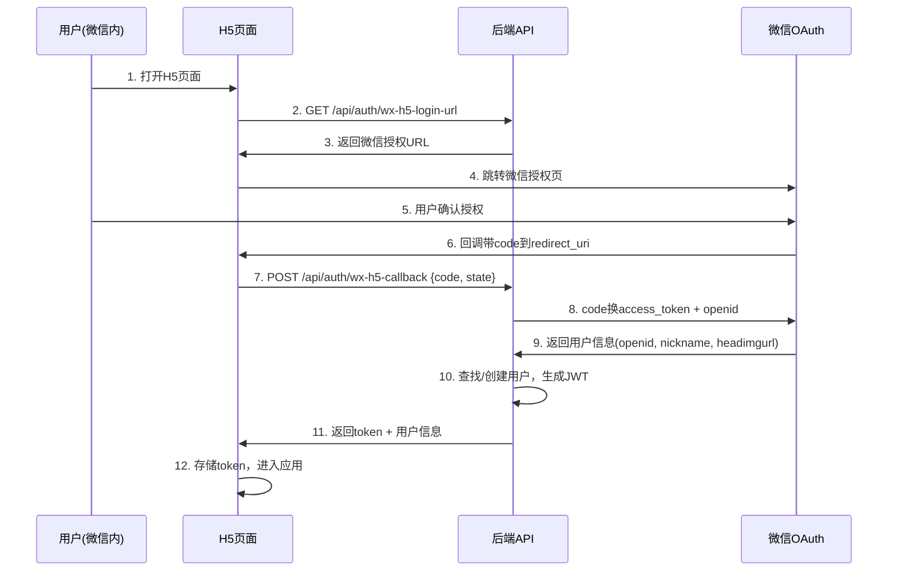

# V2.0 迭代10 需求文档

## 概述

本迭代包含三大方向：**管理员H5后台**（微信网页授权登录 + 业务监控面板 + 用户管理）、**教师/学生H5页面**（功能对齐小程序、UI独立设计）和**操作日志流水**（全量用户操作记录 + 管理员日志查询/统计/导出）。

---

## 一、全局约束

### 1.1 兼容性要求

| 项目 | 说明 |
|------|------|
| 现有小程序 | 不受影响，所有现有API保持不变 |
| 现有数据库 | 新增表和字段，不修改现有表结构的已有字段 |
| 现有认证 | H5登录走独立流程（微信网页OAuth），不影响小程序 wx-login |
| 日志中间件 | 全局中间件，对现有请求增加日志记录，不影响业务逻辑 |

### 1.2 技术栈

| 组件 | 技术选型 |
|------|---------|
| 后端 | Go + Gin（现有） |
| 管理员H5前端 | Vue 3 + Element Plus |
| 教师H5前端 | Vue 3 + Element Plus |
| 学生H5前端 | Vue 3 + Vant 4（移动端组件库） |
| 日志存储 | 独立 SQLite 数据库文件（独立数据盘） |

### 1.3 不包含的功能

- 不涉及小程序端的功能变更
- 不涉及 LLM/RAG 管道的改造
- 不涉及现有业务逻辑的修改（仅新增）
- 不需要系统级监控（CPU/内存/磁盘），只需业务层面统计

---

## R1. 微信H5网页授权登录

### 1.1 功能描述

H5端（管理员/教师/学生）统一通过微信网页授权（OAuth 2.0）登录，不需要用户名密码。用户在微信内打开H5页面时，自动跳转微信授权页面获取用户身份信息。

### 1.2 登录流程



### 1.3 微信网页授权说明

- **授权类型**：`snsapi_userinfo`（获取用户昵称、头像等信息）
- **AppID来源**：微信公众号AppID（配置在环境变量中）
- **Mock模式**：开发环境下支持 mock 模式，无需真实微信公众号
- **UnionID**：如果公众号和小程序绑定了同一个微信开放平台，可通过 UnionID 关联同一用户

### 1.4 新用户处理

- 微信授权后，如果是新用户（openid 未注册），自动创建用户账号
- 新用户需要补全角色信息（选择教师/学生），复用现有 `POST /api/auth/complete-profile` 接口
- 管理员角色通过数据库脚本直接设置，不通过前端注册

### 1.5 环境变量配置

```env
# 微信公众号配置（H5网页授权）
WX_H5_APP_ID=wx_h5_app_id_here
WX_H5_APP_SECRET=wx_h5_app_secret_here
WX_H5_REDIRECT_URI=https://your-domain.com/h5/auth/callback

# Mock模式（开发环境）
WX_H5_MOCK_ENABLED=true
```

---

## R2. 管理员H5后台

### 2.1 功能描述

提供一个管理员专属的H5后台页面，支持系统业务监控、用户管理和反馈管理。管理员通过微信授权登录后进入后台。

### 2.2 管理员角色创建

- 管理员角色通过**数据库初始化脚本**直接设置
- 提供 `scripts/set_admin.sql` 脚本，将指定用户的角色设为 admin
- 管理员角色不通过前端注册流程创建

### 2.3 管理员仪表盘

#### 2.3.1 系统总览

展示核心业务指标：

| 指标 | 说明 |
|------|------|
| 总用户数 | 系统注册用户总数 |
| 教师数 | 教师角色用户数 |
| 学生数 | 学生角色用户数 |
| 总对话数 | 系统对话总数 |
| 总消息数 | 系统消息总数 |
| 知识库条目数 | 知识库文档总数 |
| 班级数 | 班级总数 |
| 今日活跃用户 | 今日有操作的用户数 |
| 今日新增用户 | 今日注册的用户数 |
| 今日消息数 | 今日产生的消息数 |

#### 2.3.2 趋势图

- **时间范围**：支持 7天 / 30天 / 90天 切换
- **趋势数据**：新增用户趋势、活跃用户趋势、消息量趋势
- **图表类型**：折线图

#### 2.3.3 用户统计

| 维度 | 说明 |
|------|------|
| 角色分布 | 教师/学生/管理员的占比（饼图） |
| 注册趋势 | 按日统计的注册用户数（折线图） |
| 活跃度分布 | 按活跃度分层（高活跃/中活跃/低活跃/沉默） |

#### 2.3.4 对话统计

| 维度 | 说明 |
|------|------|
| 日对话量 | 按日统计的对话数（折线图） |
| 平均轮次 | 每个会话的平均消息轮次 |
| 对话时段分布 | 按小时统计的对话量（柱状图） |

#### 2.3.5 知识库统计

| 维度 | 说明 |
|------|------|
| 文档类型分布 | text/url/file/course 的占比（饼图） |
| 文档增长趋势 | 按日统计的新增文档数（折线图） |

#### 2.3.6 活跃用户排行

- 展示最近 N 天内最活跃的用户（按消息数排序）
- 分教师排行和学生排行
- 每条记录展示：昵称、角色、消息数、最后活跃时间

### 2.4 用户管理

#### 2.4.1 用户列表

- 分页展示所有用户
- 支持按昵称、角色、状态搜索
- 每条记录展示：ID、昵称、角色、状态、注册时间、最后活跃时间

#### 2.4.2 修改用户角色

- 管理员可修改用户角色（teacher / student / admin）
- 修改后立即生效

#### 2.4.3 启用/禁用用户

- 管理员可禁用用户，禁用后：
  - 该用户已登录的 token **立即失效**
  - 所有请求返回 403，提示"您的账号已被禁用，请联系管理员"
  - 新登录被拒绝
- 管理员可重新启用已禁用的用户

### 2.5 反馈管理

- 复用现有 `feedbacks` 表
- 展示所有用户反馈（分页 + 状态筛选）
- 支持更新反馈状态（pending / processing / resolved）

---

## R3. 操作日志流水

### 3.1 功能描述

记录全量的用户操作日志，包括所有API请求和关键业务操作。日志存储在**独立的SQLite数据库文件**中，放在独立的数据盘上，与业务数据库分离。

### 3.2 日志采集方式

#### 3.2.1 全局中间件自动采集

通过 Gin 中间件自动记录所有API请求的基本信息：
- 请求方法、路径、状态码、耗时
- 用户ID、角色、分身ID（从JWT中提取）
- 客户端IP、User-Agent
- 平台标识（miniapp / h5 / api）

#### 3.2.2 关键操作语义增强

在关键业务操作处，中间件或handler补充业务语义信息：
- 操作类型（action）：如 `user.login`、`chat.send_message`、`class.create`
- 资源类型（resource）：如 `user`、`conversation`、`class`
- 资源ID（resource_id）：操作的目标资源ID
- 操作详情（detail）：JSON格式的额外信息

### 3.3 操作类型枚举

| Action | Resource | 说明 |
|--------|----------|------|
| `user.login` | user | 用户登录 |
| `user.register` | user | 用户注册 |
| `user.profile_update` | user | 更新个人信息 |
| `chat.send_message` | conversation | 发送消息 |
| `chat.create_session` | session | 创建会话 |
| `chat.teacher_reply` | conversation | 教师回复 |
| `class.create` | class | 创建班级 |
| `class.update` | class | 更新班级 |
| `class.delete` | class | 删除班级 |
| `class.add_member` | class | 添加班级成员 |
| `class.remove_member` | class | 移除班级成员 |
| `knowledge.upload` | knowledge | 上传知识 |
| `knowledge.update` | knowledge | 更新知识 |
| `knowledge.delete` | knowledge | 删除知识 |
| `persona.create` | persona | 创建分身 |
| `persona.switch` | persona | 切换分身 |
| `persona.update` | persona | 更新分身 |
| `share.create` | share | 创建分享码 |
| `share.join` | share | 通过分享码加入 |
| `relation.invite` | relation | 邀请学生 |
| `relation.approve` | relation | 审批通过 |
| `relation.reject` | relation | 审批拒绝 |
| `course.create` | course | 创建课程 |
| `course.update` | course | 更新课程 |
| `course.delete` | course | 删除课程 |
| `course.push` | course | 推送课程 |
| `admin.update_role` | user | 管理员修改角色 |
| `admin.toggle_user` | user | 管理员启禁用户 |
| `document.upload` | document | 上传文档 |
| `document.delete` | document | 删除文档 |
| `memory.update` | memory | 更新记忆 |
| `memory.delete` | memory | 删除记忆 |
| `feedback.create` | feedback | 提交反馈 |

### 3.4 日志存储策略

| 配置项 | 值 | 说明 |
|--------|-----|------|
| 存储方式 | 独立 SQLite 数据库文件 | 与业务数据库分离 |
| 存储路径 | 可配置（环境变量 `LOG_DB_PATH`） | 建议放在独立数据盘 |
| 保留期限 | 90天 | 超过90天的日志自动清理 |
| 清理方式 | 每日凌晨定时任务 | 删除超过90天的记录 |
| 索引 | user_id + created_at 联合索引；action + created_at 联合索引 | 优化查询性能 |

### 3.5 环境变量配置

```env
# 日志数据库配置
LOG_DB_PATH=/data/logs/operation_logs.db
LOG_RETENTION_DAYS=90
LOG_CLEANUP_ENABLED=true
LOG_CLEANUP_HOUR=3  # 凌晨3点执行清理
```

### 3.6 管理员日志查询

#### 3.6.1 日志列表

- 分页展示操作日志
- 支持多条件筛选：用户ID、操作类型、资源类型、时间范围、平台
- 每条记录展示：时间、用户昵称、角色、操作类型、资源、详情、IP、平台、耗时

#### 3.6.2 日志统计

- **操作频次统计**：按操作类型分组统计（柱状图）
- **平台分布**：按平台分组统计（饼图）
- **时段热力图**：按小时统计操作量
- **活跃用户统计**：按用户分组统计操作数

#### 3.6.3 日志导出

- 支持导出为 CSV 格式
- 导出时应用当前的筛选条件
- 导出字段：时间、用户ID、用户昵称、角色、操作类型、资源类型、资源ID、详情、IP、平台、状态码、耗时

---

## R4. 教师H5页面

### 4.1 功能描述

提供教师端H5页面，功能对齐小程序教师端，UI独立设计。教师通过微信授权登录后进入教师端。

### 4.2 页面清单

| 页面 | 路由 | 功能 | 对应小程序页面 |
|------|------|------|---------------|
| 登录页 | /login | 微信授权登录 | pages/login |
| 角色选择 | /role-select | 新用户选择角色 | pages/role-select |
| 首页/工作台 | /home | 教师仪表盘 | pages/home |
| 聊天列表 | /chat-list | 按班级组织的学生列表 | pages/chat-list |
| 对话页 | /chat/:id | 与学生的对话 | pages/chat |
| 班级管理 | /classes | 班级列表 | pages/class-detail |
| 班级创建 | /class-create | 创建新班级 | pages/class-create |
| 班级详情 | /class/:id | 班级详情+成员管理 | pages/class-detail |
| 知识库 | /knowledge | 知识库列表 | pages/knowledge |
| 知识库添加 | /knowledge/add | 添加知识 | pages/knowledge/add |
| 知识库预览 | /knowledge/preview | 预览知识 | pages/knowledge/preview |
| 课程管理 | /courses | 课程列表 | pages/course-list |
| 课程发布 | /course/publish | 发布课程 | pages/course-publish |
| 分身管理 | /personas | 分身列表 | pages/persona-overview |
| 分享管理 | /shares | 分享码管理 | pages/share-manage |
| 记忆管理 | /memories | 记忆列表 | pages/memory-manage |
| 审批管理 | /approvals | 审批列表 | pages/approval-manage |
| 学生详情 | /student/:id | 学生信息+评语 | pages/student-detail |
| 教材配置 | /curriculum | 教材配置 | pages/curriculum-config |
| 反馈 | /feedback | 提交反馈 | pages/feedback |
| 个人中心 | /profile | 个人信息 | pages/profile |

### 4.3 功能对齐说明

- 所有功能与小程序教师端保持一致
- 复用现有后端API，无需新增业务接口
- H5端不支持的功能：语音输入（需微信SDK）、微信订阅消息推送
- H5端增强的功能：文件上传支持更多格式（不受微信临时文件限制）

### 4.4 UI设计要求

- 独立于小程序的UI设计，适配PC和移动端浏览器
- 使用 Element Plus 组件库
- 响应式布局，支持桌面端和移动端
- 左侧导航栏 + 顶部标题栏布局

---

## R5. 学生H5页面

### 5.1 功能描述

提供学生端H5页面，功能对齐小程序学生端，UI独立设计。学生通过微信授权登录后进入学生端。

### 5.2 页面清单

| 页面 | 路由 | 功能 | 对应小程序页面 |
|------|------|------|---------------|
| 登录页 | /login | 微信授权登录 | pages/login |
| 角色选择 | /role-select | 新用户选择角色 | pages/role-select |
| 首页 | /home | 教师列表+对话入口 | pages/home |
| 聊天列表 | /chat-list | 教师列表+会话列表 | pages/chat-list |
| 对话页 | /chat/:id | 与教师的对话 | pages/chat |
| 发现页 | /discover | 发现推荐 | pages/discover |
| 分享加入 | /share/:code | 扫码加入 | pages/share-join |
| 历史记录 | /history | 对话历史 | pages/history |
| 我的教师 | /my-teachers | 我的教师列表 | pages/my-teachers |
| 我的评语 | /my-comments | 我的评语 | pages/my-comments |
| 分身管理 | /personas | 分身列表 | pages/persona-overview |
| 反馈 | /feedback | 提交反馈 | pages/feedback |
| 个人中心 | /profile | 个人信息 | pages/profile |

### 5.3 功能对齐说明

- 所有功能与小程序学生端保持一致
- 复用现有后端API，无需新增业务接口
- H5端不支持的功能：语音输入、微信订阅消息、拍照
- H5端增强的功能：文件上传支持更多格式

### 5.4 UI设计要求

- 独立于小程序的UI设计，移动端优先
- 使用 Vant 4 组件库（移动端友好）
- 底部 TabBar 导航：对话 / 发现 / 我的
- 适配移动端浏览器

---

## R6. H5平台适配

### 6.1 平台配置接口

提供平台配置接口，让H5前端获取平台差异化配置：

| 配置项 | 小程序 | H5 |
|--------|--------|-----|
| 语音输入 | ✅ | ❌ |
| 微信订阅消息 | ✅ | ❌ |
| 文件上传 | 受限（微信临时文件） | 标准文件上传 |
| 分享到微信 | ✅ | ❌ |
| 拍照 | ✅ | ❌（部分浏览器支持） |

### 6.2 H5文件上传

H5端文件上传不走微信临时文件路径，使用标准的 multipart/form-data 上传：

| 配置项 | 值 |
|--------|-----|
| 最大文件大小 | 20MB |
| 允许的文件类型 | image/*, application/pdf, .doc, .docx, .txt, .md |

---

## 二、数据库变更

### 2.1 新增表

#### operation_logs（独立数据库文件）

```sql
CREATE TABLE IF NOT EXISTS operation_logs (
    id INTEGER PRIMARY KEY AUTOINCREMENT,
    user_id INTEGER NOT NULL DEFAULT 0,
    user_role TEXT NOT NULL DEFAULT '',
    persona_id INTEGER NOT NULL DEFAULT 0,
    action TEXT NOT NULL DEFAULT '',
    resource TEXT NOT NULL DEFAULT '',
    resource_id TEXT NOT NULL DEFAULT '',
    detail TEXT NOT NULL DEFAULT '',
    ip TEXT NOT NULL DEFAULT '',
    user_agent TEXT NOT NULL DEFAULT '',
    platform TEXT NOT NULL DEFAULT '',
    status_code INTEGER NOT NULL DEFAULT 0,
    duration_ms INTEGER NOT NULL DEFAULT 0,
    created_at DATETIME DEFAULT CURRENT_TIMESTAMP
);

CREATE INDEX idx_operation_logs_user_created ON operation_logs(user_id, created_at);
CREATE INDEX idx_operation_logs_action_created ON operation_logs(action, created_at);
CREATE INDEX idx_operation_logs_created ON operation_logs(created_at);
```

### 2.2 修改表

#### users 表新增字段

```sql
-- 用户状态（active/disabled），默认 active
ALTER TABLE users ADD COLUMN status TEXT NOT NULL DEFAULT 'active';

-- 微信 UnionID（H5和小程序统一身份）
ALTER TABLE users ADD COLUMN wx_unionid TEXT DEFAULT '';
```

### 2.3 管理员初始化脚本

提供 `scripts/set_admin.sql`：

```sql
-- 将指定用户设为管理员
-- 用法：替换 <USER_ID> 为目标用户的ID
UPDATE users SET role = 'admin' WHERE id = <USER_ID>;

-- 或者通过用户名设置
-- UPDATE users SET role = 'admin' WHERE username = '<USERNAME>';

-- 或者通过微信openid设置
-- UPDATE users SET role = 'admin' WHERE openid = '<OPENID>';
```

---

## 三、优先级划分

| 优先级 | 功能 | 说明 |
|--------|------|------|
| **P0** | R3: 操作日志中间件 + 日志表 | 基础设施，所有后续功能依赖 |
| **P0** | R1: H5微信登录 | H5端入口，所有H5页面依赖 |
| **P0** | R2: 管理员监控面板API | 核心需求 |
| **P0** | R2: 用户管理API | 管理员核心功能 |
| **P0** | R3: 日志查询/统计/导出API | 核心需求 |
| **P0** | R6: H5平台适配API | H5端基础 |
| **P1** | R2: 管理员H5前端 | 前端页面开发 |
| **P1** | R4: 教师H5前端 | 前端页面开发 |
| **P1** | R5: 学生H5前端 | 前端页面开发 |

---

## 四、验收标准

### 4.1 微信H5登录
- [ ] H5页面可通过微信网页授权登录
- [ ] 新用户自动创建账号
- [ ] 新用户需补全角色信息
- [ ] Mock模式下可正常登录（开发环境）
- [ ] 登录后获取JWT token，可访问受保护API

### 4.2 管理员H5后台
- [ ] 管理员可通过微信授权登录后台
- [ ] 仪表盘展示系统总览数据
- [ ] 仪表盘展示趋势图（7天/30天/90天）
- [ ] 用户管理列表支持分页和搜索
- [ ] 可修改用户角色
- [ ] 可禁用/启用用户，禁用后立即生效
- [ ] 被禁用用户收到"账号已被禁用，请联系管理员"提示
- [ ] 反馈管理列表正常展示

### 4.3 操作日志
- [ ] 所有API请求自动记录日志
- [ ] 关键业务操作记录语义化日志
- [ ] 日志存储在独立数据库文件中
- [ ] 日志查询支持多条件筛选
- [ ] 日志统计展示操作频次和热力图
- [ ] 日志导出为CSV格式
- [ ] 超过90天的日志自动清理

### 4.4 教师H5页面
- [ ] 所有教师端功能可在H5页面正常使用
- [ ] UI独立设计，非小程序UI的简单移植
- [ ] 响应式布局，支持桌面端和移动端
- [ ] 对话功能正常（SSE流式对话）

### 4.5 学生H5页面
- [ ] 所有学生端功能可在H5页面正常使用
- [ ] UI独立设计，移动端优先
- [ ] 对话功能正常（SSE流式对话）
- [ ] 发现页正常展示

### 4.6 用户禁用
- [ ] 被禁用用户的token立即失效
- [ ] 被禁用用户所有请求返回403
- [ ] 返回信息提示"您的账号已被禁用，请联系管理员"
- [ ] 被禁用用户无法重新登录
- [ ] 管理员重新启用后，用户可正常登录

---

**文档版本**: v1.0
**创建日期**: 2026-04-04
**关联需求**: 迭代10 管理员H5后台 + 教师/学生H5页面 + 操作日志流水
