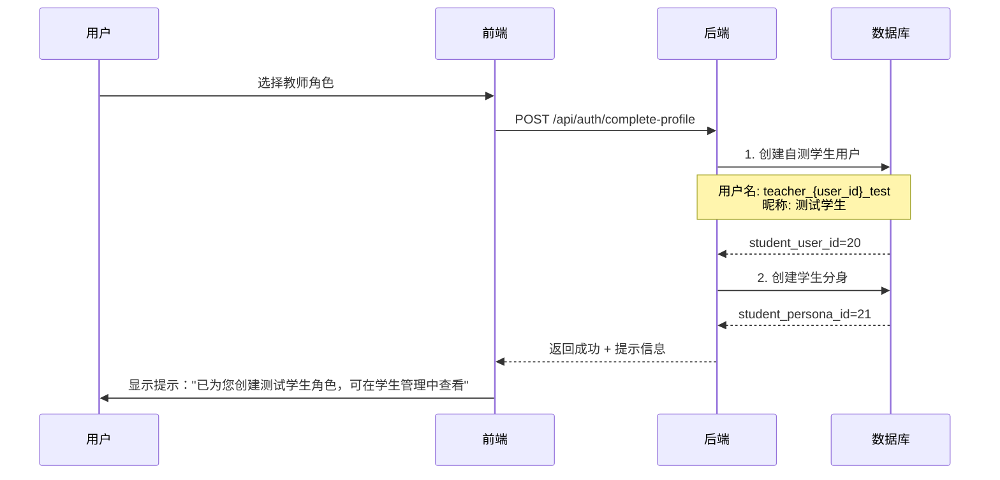

# V2.0 迭代11 需求文档

## 概述

本迭代包含两大核心改造：

1. **分身机制重构**：剔除多分身机制和主分身概念，改为"班级绑定分身"——老师创建班级时同步创建该班级专属分身；老师角色默认创建学生角色用于自测
2. **系统架构 Review**：全面审视记忆机制、知识库机制及接口的一致性，识别潜在冲突并提出优化方案；知识库向量召回策略优化

---

## 一、全局约束

### 1.1 项目状态

**重要说明**：系统当前处于开发阶段，尚未上线，因此：
- ✅ 无需数据迁移，可直接调整数据库结构（清空重建）
- ✅ 无需 API 兼容性处理，可直接重构接口
- ✅ 前端需要同步调整（小程序端和 H5 端）

### 1.2 核心变更说明

**从"多分身"到"班级绑定分身"的转变：**

- **旧模式**：一个老师可以创建多个分身，每个分身独立管理班级、学生、知识库
- **新模式**：**没有主分身概念**，老师创建班级时同步创建该班级专属分身，每个班级一个分身

```
旧模式：
用户 → 教师分身1 → 班级A、班级B
    → 教师分身2 → 班级C
    → 教师分身3 → 无班级

新模式：
用户 → 创建班级A → 自动创建班级A专属分身
    → 创建班级B → 自动创建班级B专属分身
    → 创建班级C → 自动创建班级C专属分身
（每个班级一个分身，学生与不同班级的分身对话，即便是同一老师）
```

---

## R1. 教师页面调整 - TabBar 已更新

### 1.1 当前状态

教师端 TabBar 已完成调整，当前为：

| Tab | 图标 | 页面 | 功能 |
|-----|------|------|------|
| 聊天列表 | 💬 | chat-list | 按班级分组的学生聊天列表 + 置顶 + 未读消息 |
| 学生管理 | 👥 | teacher-students | 全部学生/按班级/待审批/班级设置 |
| 知识库 | 📚 | knowledge | 知识库管理（统一输入框 + 搜索筛选） |
| 我的 | 👤 | profile | 分身概览 + 课程管理 + 设置 + 退出 |

### 1.2 验证要点

- ✅ 教师端聊天列表页已按班级分组展示学生
- ✅ 支持班级置顶和学生置顶
- ✅ 显示未读消息数量角标
- ✅ 点击学生进入聊天详情

---

## R2. 分身机制重构 - 班级绑定分身

### 2.1 功能描述

将当前的多分身机制改造为"**班级绑定分身**"模式：没有主分身概念，每个班级一个专属分身。

#### 2.1.1 核心规则

1. **没有主分身**：教师不能独立创建分身，分身随班级创建而自动创建
2. **一班一分身**：每个班级有且仅有一个专属分身
3. **分身属性**：创建班级时填写的教师信息（昵称、学校、描述）作为该班级分身的属性
4. **学生对话维度**：学生与教师的对话以"学生-班级分身"为维度，即便是同一老师的不同班级，学生也是与不同分身对话

#### 2.1.2 核心变更点

| 变更点 | 旧模式 | 新模式 | 影响 |
|--------|--------|--------|------|
| 分身数量 | 教师可创建多个分身 | 每个班级一个分身，无主分身 | 数据库约束、API 调整 |
| 分身创建 | 用户手动创建 | 创建班级时自动创建 | 班级创建流程调整 |
| 班级绑定 | 分身创建后绑定班级 | 班级与分身一一对应 | 关系表逻辑调整 |
| 学生关系 | 按 teacher_persona_id 关联 | 按班级分身关联 | 关系表逻辑调整 |
| 知识库 Scope | 按 persona_id 隔离 | 保持不变，scope=global 对所有班级生效 | 无需改动 |

### 2.2 数据库改造

#### 2.2.1 personas 表新增字段

```sql
ALTER TABLE personas ADD COLUMN bound_class_id INTEGER DEFAULT 0; -- 绑定的班级ID，每个分身必须绑定一个班级

-- 班级分身唯一约束：每个班级只能有一个分身
CREATE UNIQUE INDEX idx_persona_class ON personas(bound_class_id) WHERE bound_class_id > 0;
```

#### 2.2.2 classes 表新增字段

```sql
ALTER TABLE classes ADD COLUMN is_public INTEGER DEFAULT 1; -- 是否公开（默认公开），用于发现页展示
```

#### 2.2.3 业务约束

1. 每个班级有且仅有一个专属分身（`bound_class_id` 唯一）
2. 教师不能独立创建分身，分身随班级创建
3. 删除班级时，对应分身也应标记为停用（不物理删除，保留历史数据）

### 2.3 API 接口调整

#### 2.3.1 创建班级接口改造（核心接口）

**`POST /api/classes`** 变更：

创建班级时**同步创建班级专属分身**，请求体需包含分身信息：

```json
{
  "name": "高一(3)班",
  "description": "2026级高一3班",
  "persona_nickname": "王老师",
  "persona_school": "北京大学",
  "persona_description": "物理学教授，擅长启发式教学",
  "is_public": true
}
```

**响应**：
```json
{
  "code": 0,
  "message": "success",
  "data": {
    "id": 10,
    "name": "高一(3)班",
    "description": "2026级高一3班",
    "is_public": true,
    "persona_id": 15,
    "persona_nickname": "王老师",
    "persona_school": "北京大学",
    "created_at": "2026-04-04T17:30:00Z"
  }
}
```

**`is_public` 字段说明**：
- 默认值为 `true`（公开）
- 公开的班级会出现在发现页，方便学生搜索和加入
- 前端需要有引导语提示老师："公开班级将展示在发现页，学生可以搜索并申请加入。如果您希望仅通过分享链接邀请学生，可以关闭此选项。"

#### 2.3.2 创建分身接口改造

**`POST /api/personas`** 变更：

教师角色**不再允许**通过此接口独立创建分身。教师分身只能通过创建班级时自动创建。

**业务逻辑**：
1. 如果 `role=teacher`，返回错误"教师分身随班级创建，请通过创建班级来创建分身"
2. 如果 `role=student`，保持原有逻辑不变

#### 2.3.3 删除接口

以下接口将被移除（新模式下不再需要）：

- `PUT /api/personas/:id/switch` - 切换分身（没有主分身，不需要切换）
- `PUT /api/personas/:id/activate` - 启用分身（分身随班级管理）
- `PUT /api/personas/:id/deactivate` - 停用分身（分身随班级管理）

#### 2.3.4 获取分身列表接口增强

**`GET /api/personas`** 变更：

返回结果中增加 `bound_class_id` 和 `bound_class_name` 字段：

```json
{
  "code": 0,
  "message": "success",
  "data": {
    "personas": [
      {
        "id": 15,
        "role": "teacher",
        "nickname": "王老师",
        "school": "北京大学",
        "description": "物理学教授",
        "bound_class_id": 10,
        "bound_class_name": "高一(3)班",
        "is_public": true,
        "created_at": "2026-04-04T17:30:00Z"
      }
    ]
  }
}
```

### 2.4 前端调整

#### 2.4.1 小程序端

**分身管理页面** (`pages/profile/index.tsx`)：
- 移除"创建分身"按钮（教师角色）
- 分身列表改为按班级展示，每个班级对应一个分身
- 点击分身可编辑分身信息（昵称、描述等）

**班级创建页面** (`pages/teacher-students/index.tsx`)：
- 创建班级时必须填写分身信息（昵称、学校、描述）
- 新增 `is_public` 开关，默认开启
- 引导语："公开班级将展示在发现页，学生可以搜索并申请加入。如果您希望仅通过分享链接邀请学生，可以关闭此选项。"

#### 2.4.2 H5 教师端

**分身管理视图**：
- 简化为按班级展示分身列表
- 在班级管理中显示对应分身信息

---

## R3. 老师自测学生角色

### 3.1 功能描述

老师角色注册时，系统自动创建一个学生角色（用户可选择是否激活），用于老师自测对话功能。

### 3.2 实现方案

#### 3.2.1 注册流程调整



**注意**：注册时**不再自动创建教师分身**（因为没有主分身概念），教师分身在创建班级时自动创建。注册时只创建自测学生。

#### 3.2.2 自测学生角色特征

| 属性 | 值 | 说明 |
|------|-----|------|
| 用户名 | `teacher_{user_id}_test` | 固定格式，标记为自测账号 |
| 密码 | 自动生成（随机8位） | 老师端提供"模拟登录"快捷入口 |
| 角色 | student | 学生角色 |
| 昵称 | "测试学生" | 可由老师修改 |
| 分身昵称 | "测试学生" | 可修改 |
| 来源 | `is_test_account=1` | 新增字段，标记为自测账号 |

#### 3.2.3 数据库改造

```sql
ALTER TABLE users ADD COLUMN is_test_account BOOLEAN DEFAULT 0;
ALTER TABLE users ADD COLUMN created_by_teacher_id INTEGER DEFAULT 0; -- 创建该测试账号的老师ID
```

#### 3.2.4 特殊规则

1. **隔离规则**：自测学生账号不出现在学生搜索结果中
2. **删除规则**：老师可以删除自测学生账号
3. **对话规则**：自测学生的对话记录不参与统计分析
4. **提示规则**：首次登录后在首页提示老师使用自测学生功能
5. **加入班级**：老师创建班级后，自测学生自动加入该班级（自动审批）

### 3.3 API 新增

#### 3.3.1 获取自测学生信息

**GET** `/api/test-student`

**鉴权**：需要（Bearer Token，教师角色）

**成功响应** `200`：
```json
{
  "code": 0,
  "message": "success",
  "data": {
    "user_id": 20,
    "username": "teacher_1_test",
    "persona_id": 21,
    "nickname": "测试学生",
    "password_hint": "abc12345",
    "is_active": true,
    "created_at": "2026-04-04T17:30:00Z"
  }
}
```

#### 3.3.2 重置自测学生

**POST** `/api/test-student/reset`

**鉴权**：需要（Bearer Token，教师角色）

**说明**：清空自测学生与该教师所有班级分身的对话记录和记忆，保留师生关系

---

## R4. 记忆机制 Review

### 4.1 Review 结论

经过对记忆机制代码的全面 Review，结论如下：

| 评估维度 | 当前实现 | 与"班级分身"模式兼容性 |
|---------|---------|---------------------|
| 记忆存储 | 按 `teacher_persona_id + student_persona_id` 存储 | ✅ 完全兼容 |
| 记忆检索 | 优先分身维度，回退 user_id 维度 | ✅ 兼容（回退逻辑影响极小） |
| 记忆摘要 | 按 `(teacher_persona_id, student_persona_id)` 对扫描 | ✅ 完全兼容 |
| 用户画像 | 从记忆中提炼，存入 `users.profile_snapshot` | ✅ 兼容 |
| 老师画像 | 按 `teacher_id` 统计对话数据 | ✅ 兼容 |

**结论**：记忆机制与分身重构**完全兼容，本迭代无需改动**。

### 4.2 未来优化方向（本迭代不实施）

1. **记忆类型标准化**：在 LLM 提取 prompt 中约束 memory_type 的可选值
2. **记忆重要性多维度评估**：引入相关度、时间新鲜度、提及频率等多维度评分
3. **记忆摘要多触发条件**：增加时间触发、事件触发等

---

## R5. 知识库机制 Review

### 5.1 Review 结论

经过对知识库机制代码的全面 Review，结论如下：

| 评估维度 | 当前实现 | 与"班级分身"模式兼容性 |
|---------|---------|---------------------|
| 知识存储 | 按 `persona_id` 隔离 | ✅ 兼容 |
| Scope 机制 | global/class/student 三级 | ✅ 兼容 |
| 向量检索 | collection = `teacher_{teacher_id}` | ✅ 兼容（同一老师共享 collection） |
| Scope 过滤 | `filterByScope` 按班级过滤 | ✅ 兼容 |
| 降级处理 | Python 不可用时返回空 | ✅ 兼容 |

**结论**：知识库机制与分身重构**完全兼容，本迭代无需改动**。

**关键说明**：`scope=global` 的知识库内容对该教师所有班级分身生效，这符合新模式的设计。

### 5.2 向量召回策略优化（本迭代实施）

**当前问题**：知识库管道检索时，向量召回固定 20 条，然后按 scope 过滤，可能导致有效结果不足。

**优化方案**：
1. 向量召回数量从 20 条提升到 **100 条**
2. 增加**置信度阈值过滤**：只保留 score >= 阈值（如 0.3）的结果
3. 阈值过滤后，最多保留 **20 条**结果
4. 再按 scope 过滤，最终返回 **≤ 5 条**给对话插件

```go
// 优化后的检索逻辑（knowledge_plugin.go handlePipeline）
results := p.vectorClient.Search(collectionName, query, 100) // 召回100条

// 置信度阈值过滤
var filtered []SearchResult
for _, r := range results {
    if r.Score >= 0.3 { // 置信度阈值
        filtered = append(filtered, r)
    }
}
if len(filtered) > 20 {
    filtered = filtered[:20] // 最多保留20条
}

// scope 过滤
if studentPersonaID > 0 && teacherPersonaID > 0 {
    filtered = p.filterByScope(filtered, teacherPersonaID, studentPersonaID)
}

// 最终返回数量限制
if len(filtered) > 5 {
    filtered = filtered[:5]
}
```

### 5.3 未来优化方向（本迭代不实施）

1. **向量存储统一 collection**：所有老师共享一个 collection + metadata 过滤
2. **知识库版本管理**：新增 knowledge_versions 表
3. **知识库协作/共享**：新增 knowledge_shares 表

---

## R6. 接口一致性 Review 与调整

### 6.1 需要调整的接口清单

#### 6.1.1 分身管理接口

| 接口 | 调整类型 | 说明 |
|------|---------|------|
| `POST /api/personas` | **重构** | 教师角色禁止独立创建分身，返回引导信息 |
| `PUT /api/personas/:id/switch` | **删除** | 新模式下不需要切换分身 |
| `PUT /api/personas/:id/activate` | **删除** | 分身随班级管理 |
| `PUT /api/personas/:id/deactivate` | **删除** | 分身随班级管理 |
| `GET /api/personas` | **增强** | 返回 bound_class_id、bound_class_name、is_public |

#### 6.1.2 班级管理接口

| 接口 | 调整类型 | 说明 |
|------|---------|------|
| `POST /api/classes` | **重构** | 创建班级时同步创建分身，新增分身信息参数和 is_public |

#### 6.1.3 新增接口

| 接口 | 方法 | 说明 |
|------|------|------|
| `/api/test-student` | GET | 获取自测学生信息 |
| `/api/test-student/reset` | POST | 重置自测学生 |

#### 6.1.4 知识库/记忆接口（无需调整）

| 接口组 | 评估结论 | 说明 |
|--------|---------|------|
| 记忆管理 (`/api/memories`) | ✅ 无需调整 | 按分身维度隔离，完全兼容 |
| 知识库管理 (`/api/knowledge`) | ✅ 无需调整 | scope 机制兼容，global 对所有班级生效 |
| 知识库文档 (`/api/documents`) | ✅ 无需调整 | persona_id 隔离，兼容 |
| 对话接口 (`/api/chat`) | ✅ 无需调整 | 通过 teacher_persona_id 路由到正确分身 |

### 6.2 接口冲突矩阵

| 接口组 | 与分身重构冲突 | 与记忆机制冲突 | 与知识库冲突 | 处理方式 |
|--------|---------------|---------------|-------------|---------|
| 分身管理 | ⚠️ 高 | ✅ 无 | ✅ 无 | 重构 |
| 班级管理 | ⚠️ 高 | ✅ 无 | ✅ 无 | 重构 |
| 师生关系 | 🟡 中 | ✅ 无 | ✅ 无 | 适配 |
| 记忆管理 | ✅ 无 | ✅ 无 | ✅ 无 | 不动 |
| 知识库管理 | ✅ 无 | ✅ 无 | ✅ 无 | 不动 |
| 对话接口 | 🟢 低 | ✅ 无 | ✅ 无 | 适配 |

---

## R7. 测试验收标准

### 7.1 功能测试

| 测试项 | 验收标准 |
|--------|---------|
| 创建班级 | 同步创建班级专属分身，返回 persona_id |
| 教师注册 | 自动创建自测学生（不创建教师分身） |
| 班级公开设置 | is_public 默认 true，可切换 |
| 聊天列表 | 按班级分组显示学生 |
| 记忆隔离 | 不同班级分身的记忆独立 |
| 知识库检索 | scope=global 对所有班级生效，scope=class 按班级过滤 |
| 向量召回优化 | 召回100条 → 置信度过滤 → scope过滤 → 返回≤5条 |
| 自测学生 | 可获取信息、可重置、不出现在搜索中 |

### 7.2 性能测试

| 测试项 | 验收标准 |
|--------|---------|
| 聊天列表加载 | < 500ms（100个学生） |
| 记忆提取 | < 200ms（100条记忆） |
| 知识库检索 | < 500ms（召回100条 + 过滤） |

---

## R8. 风险评估

### 8.1 中风险项

| 风险 | 影响 | 缓解措施 |
|------|------|---------|
| 班级创建事务复杂化 | 创建班级+分身需原子性 | 使用数据库事务 |
| 向量召回100条性能 | 检索延迟增加 | 性能测试验证，必要时调整 |
| 前端适配不完整 | 功能缺失 | 前后端联调测试 |

---

## R9. 实施计划

### 9.1 后端模块划分

| 模块编号 | 模块名称 | 优先级 | 依赖 | 说明 |
|----------|----------|--------|------|------|
| V2-IT11-BE-M1 | 数据库变更 | P0-第1层 | 无 | personas 表新增 bound_class_id；classes 表新增 is_public；users 表新增 is_test_account/created_by_teacher_id |
| V2-IT11-BE-M2 | 班级创建重构（含分身同步创建） | P0-第2层 | M1 | POST /api/classes 重构，同步创建分身 |
| V2-IT11-BE-M3 | 分身管理接口调整 | P0-第2层 | M1 | POST /api/personas 限制教师；删除 switch/activate/deactivate；GET 增强 |
| V2-IT11-BE-M4 | 自测学生功能 | P0-第2层 | M1 | 注册流程调整 + GET/POST /api/test-student |
| V2-IT11-BE-M5 | 向量召回策略优化 | P1-第2层 | 无 | 召回100条 + 置信度阈值过滤 |

**开发顺序**：
```
第1层: V2-IT11-BE-M1 数据库变更
      ↓
第2层（尽量并行）:
  ├── V2-IT11-BE-M2 班级创建重构
  ├── V2-IT11-BE-M3 分身管理接口调整
  ├── V2-IT11-BE-M4 自测学生功能
  └── V2-IT11-BE-M5 向量召回策略优化
```

### 9.2 前端模块划分

| 模块编号 | 模块名称 | 优先级 | 涉及页面 | 对应后端接口 |
|----------|----------|--------|----------|-------------|
| V2-IT11-FE-M1 | 班级创建页面改版 | P0 | `teacher-students/index` | POST /api/classes |
| V2-IT11-FE-M2 | 分身管理页面简化 | P0 | `profile/index` | GET /api/personas |
| V2-IT11-FE-M3 | 自测学生入口 | P0 | `profile/index` 或 `teacher-students/index` | GET/POST /api/test-student |
| V2-IT11-FE-M4 | is_public 引导 | P0 | 班级创建/编辑页面 | POST/PUT /api/classes |

### 9.3 集成测试用例规划

| 用例编号 | 测试场景 | 涉及模块 | 数据依赖 |
|----------|----------|----------|----------|
| IT-601 | 创建班级同步创建分身 | BE-M2 | 无 |
| IT-602 | 教师禁止独立创建分身 | BE-M3 | 无 |
| IT-603 | 获取分身列表含班级信息 | BE-M3 | IT-601 |
| IT-604 | 删除 switch/activate/deactivate 接口返回404 | BE-M3 | 无 |
| IT-605 | 教师注册自动创建自测学生 | BE-M4 | 无 |
| IT-606 | 获取自测学生信息 | BE-M4 | IT-605 |
| IT-607 | 重置自测学生数据 | BE-M4 | IT-605 |
| IT-608 | 自测学生不出现在搜索结果 | BE-M4 | IT-605 |
| IT-609 | 知识库 scope=global 对所有班级生效 | 知识库 | IT-601 |
| IT-610 | 向量召回100条+置信度过滤 | BE-M5 | 知识库数据 |
| IT-611 | 班级 is_public 默认公开 | BE-M2 | IT-601 |
| IT-612 | 全链路：注册→创建班级→分身→自测学生→对话 | 全部 | 无 |

**推荐分批方案**：
- 第 1 批（班级+分身）：IT-601 ~ IT-604
- 第 2 批（自测学生）：IT-605 ~ IT-608
- 第 3 批（知识库+全链路）：IT-609 ~ IT-612

---

## 附录

### A. 相关文档

- [V2.0 全量需求规格说明书](./requirements.md)
- [迭代10需求文档](./iteration10_requirements.md)
- [迭代11接口规范](./iteration11_api_spec.md)

### B. 数据库 Schema 变更汇总

```sql
-- personas 表
ALTER TABLE personas ADD COLUMN bound_class_id INTEGER DEFAULT 0;
CREATE UNIQUE INDEX idx_persona_class ON personas(bound_class_id) WHERE bound_class_id > 0;

-- classes 表
ALTER TABLE classes ADD COLUMN is_public INTEGER DEFAULT 1;

-- users 表
ALTER TABLE users ADD COLUMN is_test_account BOOLEAN DEFAULT 0;
ALTER TABLE users ADD COLUMN created_by_teacher_id INTEGER DEFAULT 0;
```

---

**文档版本**：v2.0（基于需求确认修正）
**创建时间**：2026-04-04
**最后更新**：2026-04-04
**负责人**：开发团队