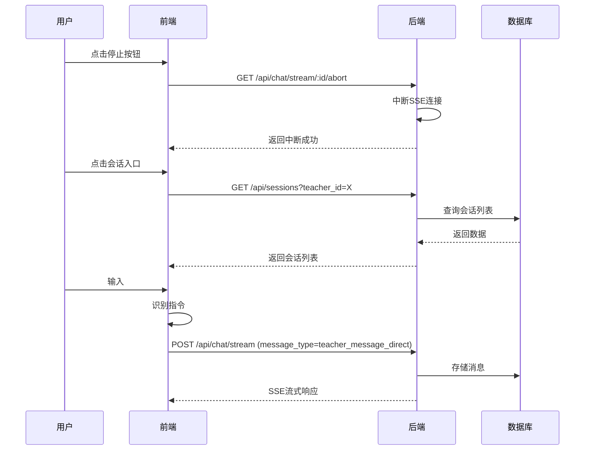

# V2.0 迭代12 API规范文档

> 本文档定义迭代12新增和修改的API接口规范

---

## 1. 概述

### 1.1 变更概览

| 接口类型 | 新增 | 修改 | 删除 | 总计 |
|---------|------|------|------|------|
| 后端接口 | 1 | 2 | 0 | 3 |
| 前端接口 | 0 | 0 | 0 | 0 |

### 1.2 接口列表

| 序号 | 接口名称 | 方法 | 路径 | 状态 | 模块 |
|------|---------|------|------|------|------|
| A1 | 流式中断接口 | GET | `/api/chat/stream/:session_id/abort` | 新增 | IT12-BE-001 |
| A2 | 流式聊天接口 | POST | `/api/chat/stream` | 扩展 | IT12-BE-002 |
| A3 | 普通聊天接口 | POST | `/api/chat` | 扩展 | IT12-BE-002 |

---

## 2. 新增接口规范

### 2.1 A1: 流式中断接口

#### 接口信息
- **接口名称**: 流式中断接口
- **接口路径**: `GET /api/chat/stream/:session_id/abort`
- **功能描述**: 中断指定会话的流式回复
- **关联模块**: IT12-BE-001

#### 请求参数

**路径参数**
| 参数名 | 类型 | 必填 | 描述 | 示例 |
|--------|------|------|------|------|
| session_id | string | ✅ | 会话ID | `"session-123"` |

**Header参数**
| 参数名 | 类型 | 必填 | 描述 | 示例 |
|--------|------|------|------|------|
| Authorization | string | ✅ | Bearer Token | `"Bearer eyJ0eXAiOiJKV1QiLCJhbGciOiJIUzI1NiJ9..."` |

#### 成功响应 (200)

```json
{
  "code": 0,
  "message": "success",
  "data": {
    "aborted": true,
    "message": "流式回复已中断"
  }
}
```

**响应字段说明**
| 字段 | 类型 | 描述 |
|------|------|------|
| code | number | 响应码，0表示成功 |
| message | string | 响应消息 |
| data.aborted | boolean | 是否成功中断 |
| data.message | string | 中断结果描述 |

#### 错误响应

**会话不存在 (404)**
```json
{
  "code": 40004,
  "message": "会话不存在",
  "data": null
}
```

**无权限操作 (403)**
```json
{
  "code": 40001,
  "message": "无权限操作该会话",
  "data": null
}
```

**服务端错误 (500)**
```json
{
  "code": 50000,
  "message": "服务器内部错误",
  "data": null
}
```

#### 错误码定义
| 错误码 | HTTP状态码 | 描述 |
|--------|-----------|------|
| 40001 | 403 | 无权限操作该会话 |
| 40004 | 404 | 会话不存在 |
| 50000 | 500 | 服务器内部错误 |

#### 接口调用示例

**前端调用示例 (TypeScript)**
```typescript
const abortStream = async (sessionId: string): Promise<void> => {
  try {
    const response = await fetch(`/api/chat/stream/${sessionId}/abort`, {
      method: 'GET',
      headers: {
        'Authorization': `Bearer ${token}`,
        'Content-Type': 'application/json'
      }
    });
    
    if (response.ok) {
      const result = await response.json();
      console.log('中断成功:', result.data.message);
    } else {
      console.error('中断失败:', response.status);
    }
  } catch (error) {
    console.error('中断请求异常:', error);
  }
};
```

**后端实现示例 (Go)**
```go
func AbortStreamHandler(c *gin.Context) {
    sessionID := c.Param("session_id")
    
    // 验证会话存在性和权限
    session, err := validateSessionAccess(c, sessionID)
    if err != nil {
        c.JSON(http.StatusNotFound, gin.H{
            "code": 40004,
            "message": "会话不存在",
            "data": nil,
        })
        return
    }
    
    // 中断流式连接
    if err := streamingManager.Abort(sessionID); err != nil {
        c.JSON(http.StatusInternalServerError, gin.H{
            "code": 50000,
            "message": "中断失败",
            "data": nil,
        })
        return
    }
    
    c.JSON(http.StatusOK, gin.H{
        "code": 0,
        "message": "success",
        "data": gin.H{
            "aborted": true,
            "message": "流式回复已中断",
        },
    })
}
```

---

## 3. 扩展接口规范

### 3.1 A2: 流式聊天接口扩展

#### 接口信息
- **接口名称**: 流式聊天接口
- **接口路径**: `POST /api/chat/stream`
- **变更类型**: 消息类型扩展
- **关联模块**: IT12-BE-002

#### 请求体扩展

**原有请求体**
```json
{
  "session_id": "string",
  "message": "string",
  "teacher_persona_id": 1
}
```

**扩展后请求体**
```json
{
  "session_id": "string",
  "message": "string",
  "teacher_persona_id": 1,
  "message_type": "user_message"
}
```

**新增字段说明**
| 字段名 | 类型 | 必填 | 默认值 | 描述 | 枚举值 |
|--------|------|------|--------|------|-------|
| message_type | string | ❌ | `"user_message"` | 消息类型 | `"user_message"`, `"teacher_message_direct"` |

**消息类型说明**
- `user_message`: 普通用户消息（默认值）
- `teacher_message_direct`: 给老师的留言消息

#### 响应体变更
无变更，保持原有SSE流式响应格式。

### 3.2 A3: 普通聊天接口扩展

#### 接口信息
- **接口名称**: 普通聊天接口
- **接口路径**: `POST /api/chat`
- **变更类型**: 消息类型扩展
- **关联模块**: IT12-BE-002

#### 请求体扩展

**原有请求体**
```json
{
  "session_id": "string",
  "message": "string",
  "teacher_persona_id": 1
}
```

**扩展后请求体**
```json
{
  "session_id": "string",
  "message": "string",
  "teacher_persona_id": 1,
  "message_type": "user_message"
}
```

**新增字段说明**
| 字段名 | 类型 | 必填 | 默认值 | 描述 | 枚举值 |
|--------|------|------|--------|------|-------|
| message_type | string | ❌ | `"user_message"` | 消息类型 | `"user_message"`, `"teacher_message_direct"` |

#### 响应体变更
无变更，保持原有响应格式。

---

## 4. 复用接口规范

### 4.1 会话列表接口 (复用)

#### 接口信息
- **接口名称**: 会话列表接口
- **接口路径**: `GET /api/sessions`
- **复用状态**: 完全复用迭代9接口
- **关联模块**: IT12-FE-002, IT12-FE-003

#### 请求参数
| 参数名 | 类型 | 必填 | 默认值 | 描述 |
|--------|------|------|--------|------|
| teacher_persona_id | number | ✅ | - | 教师分身ID |
| page | number | ❌ | 1 | 页码 |
| page_size | number | ❌ | 20 | 每页数量 |

#### 成功响应 (200)
```json
{
  "code": 0,
  "message": "success",
  "data": {
    "total": 10,
    "page": 1,
    "page_size": 20,
    "items": [
      {
        "session_id": "uuid-1",
        "title": "关于微积分的讨论",
        "last_message": "好的，那我们来详细讨论积分...",
        "message_count": 15,
        "updated_at": "2026-04-07T10:30:00Z"
      }
    ]
  }
}
```

### 4.2 创建会话接口 (复用)

#### 接口信息
- **接口名称**: 创建会话接口
- **接口路径**: `POST /api/sessions`
- **复用状态**: 完全复用迭代9接口
- **关联模块**: IT12-FE-004

#### 请求体
```json
{
  "teacher_persona_id": 1,
  "initial_message": ""
}
```

#### 成功响应 (200)
```json
{
  "code": 0,
  "message": "success",
  "data": {
    "session_id": "uuid-new"
  }
}
```

---

## 5. 接口依赖关系

### 5.1 前端组件与API映射

| 前端组件 | 调用API | 触发时机 | 数据流向 |
|---------|--------|---------|---------|
| StopButton组件 | `GET /api/chat/stream/:id/abort` | 点击停止按钮 | 前端 → 后端 |
| SessionSidebar组件 | `GET /api/sessions` | 打开侧边栏 | 后端 → 前端 |
| 指令处理器 | `POST /api/chat/stream` | 发送留言指令 | 前端 → 后端 |
| 新会话按钮 | `POST /api/sessions` | 点击新会话 | 前端 → 后端 |

### 5.2 接口调用时序图



---

## 6. 接口测试规范

### 6.1 单元测试用例

#### A1接口测试用例
```yaml
- name: "正常中断流式回复"
  request:
    method: GET
    path: /api/chat/stream/session-123/abort
    headers:
      Authorization: "Bearer valid-token"
  expected:
    status: 200
    body:
      code: 0
      data:
        aborted: true

- name: "中断不存在的会话"
  request:
    method: GET
    path: /api/chat/stream/invalid-session/abort
    headers:
      Authorization: "Bearer valid-token"
  expected:
    status: 404
    body:
      code: 40004

- name: "无权限中断会话"
  request:
    method: GET
    path: /api/chat/stream/other-user-session/abort
    headers:
      Authorization: "Bearer valid-token"
  expected:
    status: 403
    body:
      code: 40001
```

#### A2/A3接口测试用例
```yaml
- name: "发送普通用户消息"
  request:
    method: POST
    path: /api/chat/stream
    body:
      session_id: "session-123"
      message: "你好"
      teacher_persona_id: 1
      message_type: "user_message"
  expected:
    status: 200
    content_type: "text/event-stream"

- name: "发送留言消息"
  request:
    method: POST
    path: /api/chat/stream
    body:
      session_id: "session-123"
      message: "老师您好，我有一个问题"
      teacher_persona_id: 1
      message_type: "teacher_message_direct"
  expected:
    status: 200
    content_type: "text/event-stream"
```

### 6.2 集成测试要点

| 测试场景 | 验证点 | 预期结果 |
|---------|-------|---------|
| 中断后继续对话 | 中断后发送新消息 | 正常创建新会话 |
| 会话切换数据一致性 | 切换会话后消息列表 | 显示正确历史消息 |
| 指令消息类型存储 | 留言消息入库 | message_type字段正确 |
| 并发中断请求 | 同时发送多个中断 | 正确处理，无竞态条件 |

---

## 7. 兼容性说明

### 7.1 向后兼容性

| 接口 | 兼容性 | 说明 |
|------|-------|------|
| A1: 流式中断接口 | 新增接口 | 不影响现有功能 |
| A2: 流式聊天接口 | 完全兼容 | message_type为可选字段 |
| A3: 普通聊天接口 | 完全兼容 | message_type为可选字段 |

### 7.2 前端适配要求

| 功能 | 适配要求 | 影响范围 |
|------|---------|---------|
| 中断功能 | 调用新增A1接口 | IT12-FE-001 |
| 指令系统 | 设置message_type字段 | IT12-FE-005 |
| 会话列表 | 复用现有接口 | IT12-FE-002, IT12-FE-003 |

---

## 8. 性能指标

### 8.1 响应时间要求

| 接口 | P50 | P95 | P99 | 超时时间 |
|------|-----|-----|-----|---------|
| A1: 流式中断接口 | < 50ms | < 100ms | < 200ms | 5s |
| A2: 流式聊天接口 | < 100ms | < 500ms | < 1s | 30s |
| A3: 普通聊天接口 | < 200ms | < 1s | < 2s | 10s |

### 8.2 并发处理能力

| 接口 | 预期QPS | 最大并发 | 资源消耗 |
|------|--------|---------|---------|
| A1: 流式中断接口 | 1000 | 100 | 低 |
| A2: 流式聊天接口 | 100 | 50 | 中 |
| A3: 普通聊天接口 | 200 | 100 | 中 |

---

**文档版本**: v1.0  
**创建日期**: 2026-04-07  
**适用迭代**: V2.0 迭代12  
**关联文档**:
- [架构设计文档](./architecture.md)
- [需求文档](./requirements.md)
- [模块配置文档](./modules.yaml)