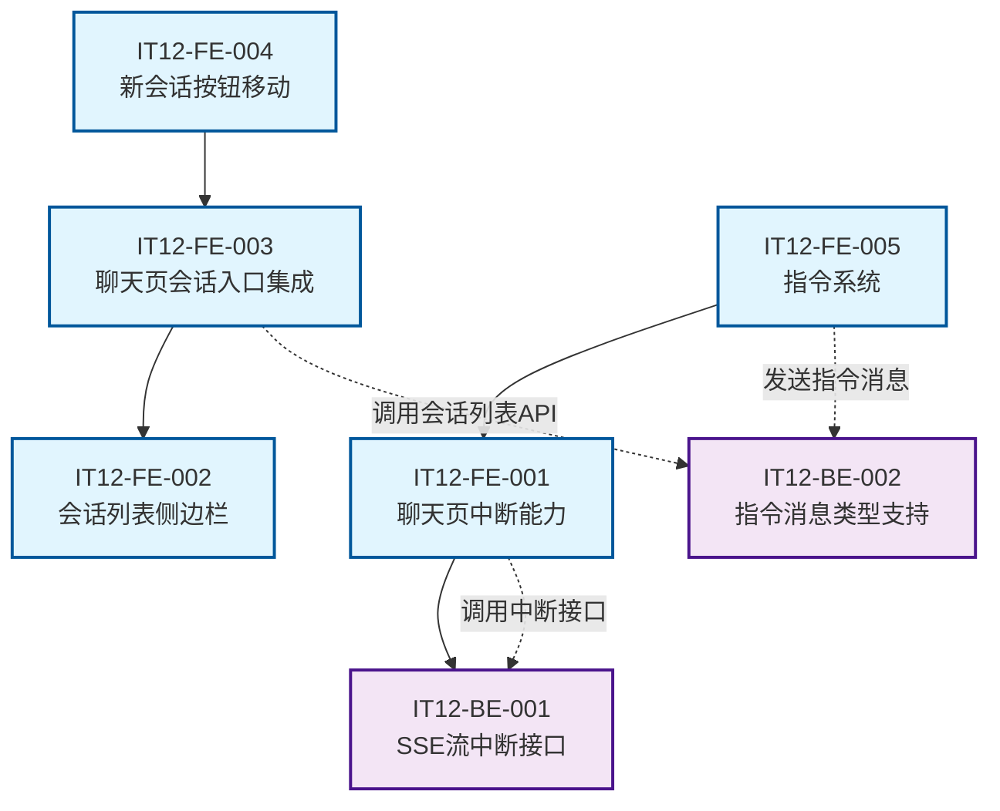
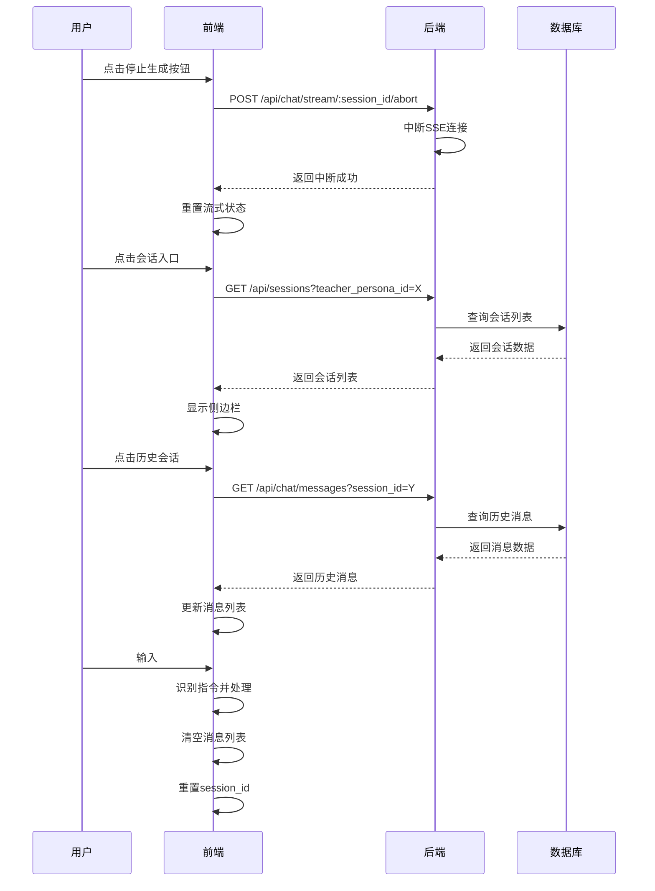
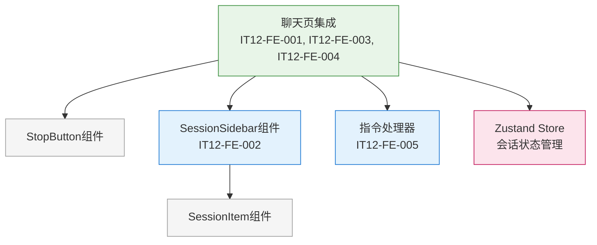
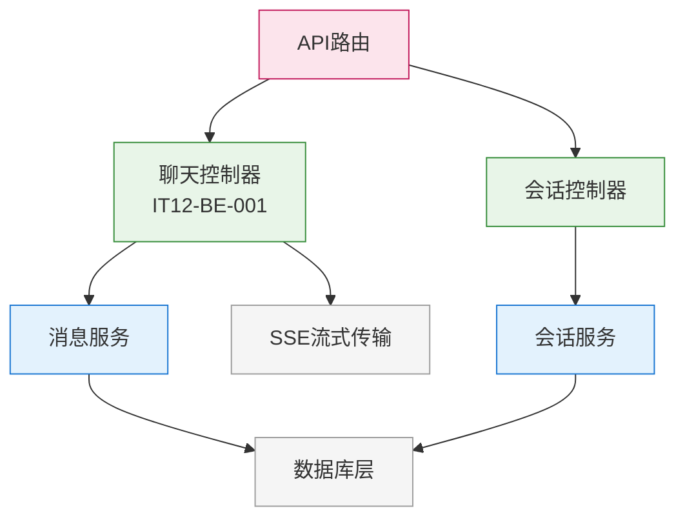
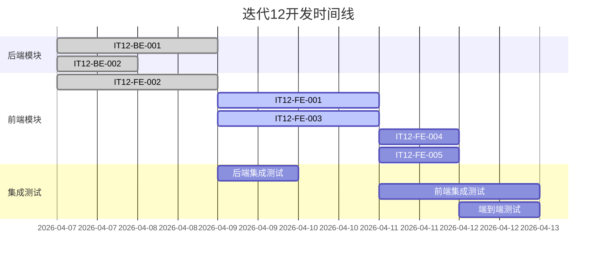
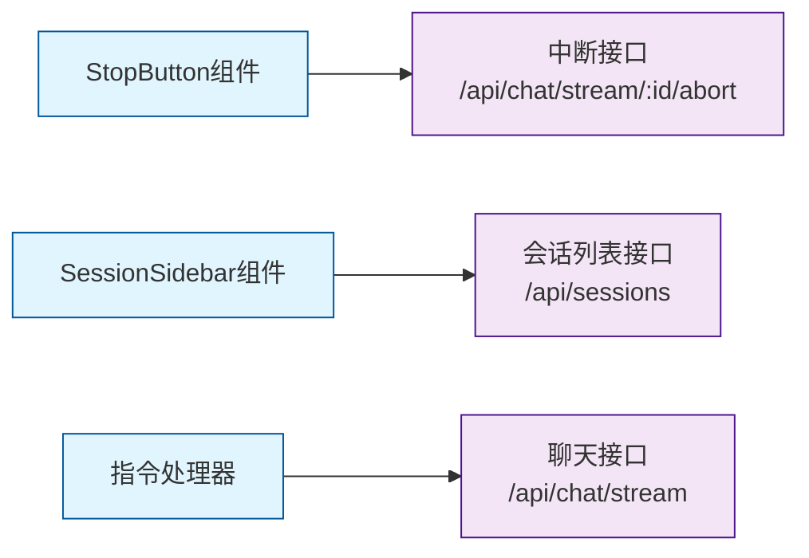
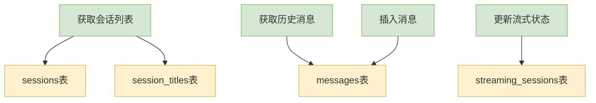

# V2.0 迭代12 架构设计文档

> 本文档描述迭代12的模块依赖关系、分层架构、开发顺序和接口设计

---

## 1. 模块依赖关系图

### 1.1 整体架构图

### 1.2 数据流向图

---

## 2. 分层架构说明

### 2.1 前端分层架构

### 2.2 后端分层架构

---

## 3. 后端/前端模块开发顺序

### 3.1 开发阶段划分

| 阶段 | 模块 | 开发顺序 | 并行性 | 依赖关系 |
|------|------|---------|--------|---------|
| **Phase 1** | IT12-BE-001: SSE流中断接口 | 1 | 可并行 | 无依赖 |
| **Phase 1** | IT12-FE-002: 会话列表侧边栏 | 2 | 可并行 | 无依赖 |
| **Phase 1** | IT12-BE-002: 指令消息类型支持 | 3 | 可并行 | 无依赖 |
| **Phase 2** | IT12-FE-001: 聊天页中断能力 | 4 | 串行 | 依赖IT12-BE-001 |
| **Phase 2** | IT12-FE-003: 聊天页会话入口集成 | 5 | 串行 | 依赖IT12-FE-002 |
| **Phase 3** | IT12-FE-004: 新会话按钮移动 | 6 | 串行 | 依赖IT12-FE-003 |
| **Phase 3** | IT12-FE-005: 指令系统 | 7 | 串行 | 依赖IT12-FE-001 |

### 3.2 并行开发策略

---

## 4. 接口依赖关系

### 4.1 新增接口列表

| 接口 | 方法 | 路径 | 模块 | 状态 |
|------|------|------|------|------|
| 流式中断接口 | GET | `/api/chat/stream/:session_id/abort` | IT12-BE-001 | 新增 |
| 消息类型扩展 | - | `/api/chat/stream` | IT12-BE-002 | 扩展 |
| 消息类型扩展 | - | `/api/chat` | IT12-BE-002 | 扩展 |

### 4.2 接口调用关系

### 4.3 接口变更影响分析

| 接口 | 变更类型 | 影响范围 | 兼容性 |
|------|---------|---------|--------|
| `/api/chat/stream/:session_id/abort` | 新增接口 | 前端中断功能 | 无影响 |
| `/api/chat/stream` | 扩展消息类型 | 指令系统 | 向后兼容 |
| `/api/chat` | 扩展消息类型 | 指令系统 | 向后兼容 |
| `/api/sessions` | 复用接口 | 会话列表 | 无变更 |

---

## 5. 数据库表依赖关系

### 5.1 涉及的数据表

| 表名 | 用途 | 变更类型 | 影响模块 |
|------|------|---------|---------|
| `sessions` | 会话表 | 查询 | IT12-FE-002, IT12-FE-003 |
| `session_titles` | 会话标题表 | 查询 | IT12-FE-002, IT12-FE-003 |
| `messages` | 消息表 | 查询/插入 | IT12-BE-002 |
| `streaming_sessions` | 流式会话表 | 更新 | IT12-BE-001 |

### 5.2 数据流图

### 5.3 数据迁移策略

| 数据操作 | 时机 | 影响 | 回滚方案 |
|---------|------|------|---------|
| 无架构变更 | 部署时 | 无影响 | 无需回滚 |
| 会话列表查询优化 | 开发时 | 性能提升 | 保持原有查询 |
| 消息类型扩展 | 部署时 | 支持新功能 | 保持原有类型 |

---

## 6. 技术风险与应对措施

### 6.1 关键技术风险

| 风险点 | 风险等级 | 影响模块 | 应对措施 |
|--------|---------|---------|---------|
| SSE流中断兼容性 | 中 | IT12-BE-001 | 使用标准AbortController，充分测试 |
| 会话切换状态同步 | 中 | IT12-FE-003 | Zustand统一状态管理，先保存后切换 |
| 指令识别准确性 | 低 | IT12-FE-005 | 严格正则匹配，前后空格处理 |
| 侧边栏动画性能 | 低 | IT12-FE-002 | CSS transform优化，避免重排 |

### 6.2 性能考虑

| 场景 | 性能指标 | 优化措施 |
|------|---------|---------|
| 会话列表加载 | < 500ms | 分页查询，缓存机制 |
| 侧边栏动画 | 60fps | CSS硬件加速，transform优化 |
| 流式中断响应 | < 100ms | 轻量级接口，快速响应 |
| 指令识别 | < 10ms | 前端预检查，正则优化 |

---

## 7. 部署与发布策略

### 7.1 部署顺序

1. **后端部署** (IT12-BE-001, IT12-BE-002)
   - 部署新增接口
   - 验证接口功能
   - 确保向后兼容

2. **前端部署** (IT12-FE-001 ~ IT12-FE-005)
   - 部署前端组件
   - 验证功能集成
   - 性能测试

3. **集成测试**
   - 端到端功能测试
   - 性能基准测试
   - 兼容性验证

### 7.2 回滚方案

| 组件 | 回滚策略 | 影响范围 |
|------|---------|---------|
| 后端接口 | 版本回退 | 前端中断功能暂时不可用 |
| 前端组件 | 版本回退 | 会话管理功能暂时不可用 |
| 数据库 | 无需回滚 | 无架构变更 |

---

**文档版本**: v1.0  
**创建日期**: 2026-04-07  
**适用迭代**: V2.0 迭代12  
**关联文档**:
- [需求文档](./requirements.md)
- [UI规范文档](./ui_spec.md)
- [模块配置文档](./modules.yaml)