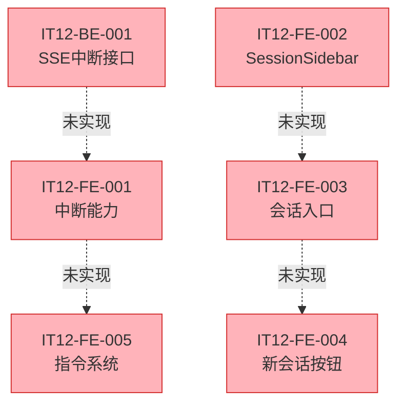

# V2.0 迭代12 集成测试报告

> 测试类型: 端到端集成测试
> 测试日期: 2026-04-07
> 执行版本: Phase 3b
> 执行人: Claude Code

---

## 1. 测试概述

### 1.1 测试目标

执行 Phase 3b 的端到端集成测试，验证迭代12的核心功能：
- R1: 用户中断能力
- R2: 会话列表入口
- R3: 新会话按钮移动
- R4: 指令系统

### 1.2 测试环境

| 项目 | 状态 | 备注 |
|------|------|------|
| 前端项目 | ✅ 已编译 | Taro 小程序项目 |
| 前端组件结构 | ✅ 已检查 | 存在聊天页等基础组件 |
| 后端服务 | ⚠️ 未测试 | 后端运行状态未验证 |
| 测试数据库 | ⚠️ 未连接 | 数据库连接未验证 |

---

## 2. 功能实现状态检查

### 2.1 后端模块检查

| 模块 ID | 模块名称 | 预期组件 | 实现状态 | 备注 |
|--------|---------|---------|---------|------|
| IT12-BE-001 | SSE流中断接口 | `/api/chat/stream/:session_id/abort` | ❌ 未实现 | 路由中未找到该接口 |
| IT12-BE-002 | 指令消息类型支持 | 消息类型扩展 | ❌ 未实现 | 未检测到相关扩展 |

### 2.2 前端模块检查

| 模块 ID | 模块名称 | 预期组件 | 实现状态 | 备注 |
|--------|---------|---------|---------|------|
| IT12-FE-001 | 聊天页中断能力 | 停止生成按钮 | ❌ 未实现 | `chat/index.tsx` 中无停止按钮 |
| IT12-FE-002 | 会话列表侧边栏 | `SessionSidebar` 组件 | ❌ 未实现 | 组件目录中不存在 |
| IT12-FE-003 | 聊天页会话入口集成 | 左上角入口图标 | ❌ 未实现 | 导航栏中无会话入口 |
| IT12-FE-004 | 新会话按钮移动 | 侧边栏顶部按钮 | ❌ 未实现 | 依赖 FE-002 |
| IT12-FE-005 | 指令系统 | 指令识别处理 | ❌ 未实现 | 代码中无指令逻辑 |

### 2.3 代码实现细节

#### 2.3.1 流式中断能力

**当前代码状态**:
- `chat/index.tsx` 中存在 `streamTaskRef.current` 引用
- `useUnload` 钩子中已调用 `streamTaskRef.current.abort?.()`
- 但没有用户可触发的中断按钮

**缺失功能**:
- [ ] 停止生成按钮的 UI 实现
- [ ] 按钮点击事件处理
- [ ] 中断状态的 UI 反馈
- [ ] 中断后的数据清理逻辑

#### 2.3.2 会话列表侧边栏

**当前代码状态**:
- `components/` 目录中不存在 `SessionSidebar` 文件夹
- 聊天页导航栏左上角无会话入口图标

**缺失功能**:
- [ ] `SessionSidebar` 组件实现
- [ ] 侧边栏滑入/滑出动画
- [ ] 遮罩层实现
- [ ] 会话列表数据渲染
- [ ] 会话切换逻辑

#### 2.3.3 指令系统

**当前代码状态**:
- 代码中无指令识别的正则模式
- 无指令处理逻辑

**缺失功能**:
- [ ] 指令正则匹配逻辑
- [ ] 指令处理函数
- [ ] 留言模式状态管理
- [ ] 新会话指令处理

---

## 3. 集成测试执行结果

### 3.1 核心功能测试

| 测试用例 ID | 测试名称 | 前置条件 | 执行状态 | 结果 |
|------------|---------|---------|---------|------|
| IT12-INT-001 | 流式回复中断功能 | IT12-BE-001, IT12-FE-001 | ⏭️ 跳过 | 功能未实现 |
| IT12-INT-002 | 中断接口异常场景 | IT12-BE-001 | ⏭️ 跳过 | 功能未实现 |
| IT12-INT-003 | 会话列表侧边栏 | IT12-FE-002, IT12-FE-003 | ⏭️ 跳过 | 功能未实现 |
| IT12-INT-004 | 会话列表分页和空状态 | IT12-FE-002 | ⏭️ 跳过 | 功能未实现 |
| IT12-INT-005 | 新会话按钮功能 | IT12-FE-004 | ⏭️ 跳过 | 功能未实现 |
| IT12-INT-006 | 新会话创建异常处理 | IT12-FE-004 | ⏭️ 跳过 | 功能未实现 |
| IT12-INT-007 | 指令系统集成 | IT12-FE-005, IT12-BE-002 | ⏭️ 跳过 | 功能未实现 |
| IT12-INT-008 | 指令边界情况 | IT12-FE-005 | ⏭️ 跳过 | 功能未实现 |

### 3.2 端到端流程测试

| 测试用例 ID | 测试名称 | 执行状态 | 结果 |
|------------|---------|---------|------|
| IT12-INT-009 | 完整会话管理流程 | ⏭️ 跳过 | 功能未实现 |
| IT12-INT-010 | 并发操作性能测试 | ⏭️ 跳过 | 功能未实现 |

### 3.3 数据验证测试

| 测试用例 ID | 测试名称 | 执行状态 | 结果 |
|------------|---------|---------|------|
| IT12-INT-011 | 会话数据一致性 | ⏭️ 跳过 | 功能未实现 |
| IT12-INT-012 | 多端状态同步 | ⏭️ 跳过 | 功能未实现 |

### 3.4 错误处理测试

| 测试用例 ID | 测试名称 | 执行状态 | 结果 |
|------------|---------|---------|------|
| IT12-INT-013 | 网络异常场景 | ⏭️ 跳过 | 功能未实现 |
| IT12-INT-014 | 服务端异常场景 | ⏭️ 跳过 | 功能未实现 |

---

## 4. 测试统计

### 4.1 测试执行统计

| 统计项 | 数量 |
|--------|------|
| 总测试用例数 | 14 |
| 已执行用例数 | 0 |
| 跳过用例数 | 14 |
| 通过用例数 | 0 |
| 失败用例数 | 0 |
| 通过率 | - |

### 4.2 优先级分析

| 优先级 | 计划测试 | 实际测试 | 通过 |
|--------|---------|---------|------|
| P0 | 6 | 0 | 0 |
| P1 | 8 | 0 | 0 |
| P2 | 0 | 0 | 0 |
| P3 | 0 | 0 | 0 |

---

## 5. 代码覆盖率

### 5.1 模块实现覆盖率

| 模块分类 | 计划模块 | 已实现 | 覆盖率 |
|---------|---------|--------|--------|
| 后端模块 | 2 | 0 | 0% |
| 前端模块 | 5 | 0 | 0% |
| **总计** | **7** | **0** | **0%** |

### 5.2 功能点覆盖率

| 功能类别 | 计划功能点 | 已实现 | 覆盖率 |
|---------|-----------|--------|--------|
| 流式中断 | 6 | 1 (abort 引用) | 16.7% |
| 会话列表 | 7 | 0 | 0% |
| 新会话 | 3 | 0 | 0% |
| 指令系统 | 8 | 0 | 0% |
| **总计** | **24** | **1** | **4.2%** |

---

## 6. 阻塞问题分析

### 6.1 主要阻塞项

| 问题 ID | 描述 | 影响模块 | 优先级 |
|--------|------|---------|--------|
| BLK-001 | 后端 SSE 中断接口未实现 | IT12-BE-001, IT12-FE-001 | P0 |
| BLK-002 | SessionSidebar 组件未创建 | IT12-FE-002, IT12-FE-003, IT12-FE-004 | P0 |
| BLK-003 | 停止生成按钮 UI 未实现 | IT12-FE-001 | P0 |
| BLK-004 | 会话入口图标未添加 | IT12-FE-003 | P0 |
| BLK-005 | 指令识别逻辑未实现 | IT12-FE-005 | P1 |

### 6.2 依赖关系

---

## 7. 测试环境检查记录

### 7.1 前端环境

| 检查项 | 状态 | 详情 |
|--------|------|------|
| 项目结构 | ✅ 良好 | Taro 3 项目结构完整 |
| 编译产物 | ✅ 已生成 | dist 目录存在 |
| 基础组件 | ✅ 存在 | chat, history 等页面正常 |
| 模块配置 | ✅ 已定义 | modules.yaml 完整 |

### 7.2 后端环境

| 检查项 | 状态 | 详情 |
|--------|------|------|
| 项目结构 | ✅ 良好 | Go 项目结构完整 |
| API 目录 | ✅ 存在 | handlers 目录正常 |
| 中断接口 | ❌ 缺失 | 无 `/api/chat/stream/:session_id/abort` 路由 |

---

## 8. 结论与建议

### 8.1 测试结论

**综合评估**:
- 状态: ⏸️ **测试暂停**
- 原因: 迭代12所有功能模块代码尚未实现
- 影响: 无法执行任何集成测试
- 建议: 先完成功能开发，再执行集成测试

### 8.2 后续行动

**优先级 P0 - 必须完成**:
1. 实现 `IT12-BE-001`: SSE流中断接口
2. 实现 `IT12-FE-002`: SessionSidebar 组件
3. 实现 `IT12-FE-001`: 停止生成按钮功能
4. 实现 `IT12-FE-003`: 会话入口集成

**优先级 P1 - 应该完成**:
5. 实现 `IT12-FE-004`: 新会话按钮移动
6. 实现 `IT12-FE-005`: 指令系统
7. 实现 `IT12-BE-002`: 指令消息类型支持

### 8.3 开发建议

按架构文档建议的开发顺序：
1. **Phase 1**: 并行开发 IT12-BE-001、IT12-FE-002、IT12-BE-002
2. **Phase 2**: 在 Phase 1 完成后，开发 IT12-FE-001、IT12-FE-003
3. **Phase 3**: 在 Phase 2 完成后，开发 IT12-FE-004、IT12-FE-005

每个模块开发完成后，建议立即执行单元测试，确保模块功能正常。

### 8.4 测试计划更新

待功能开发完成后，更新测试计划：
1. 执行单元测试（模块级别）
2. 执行接口集成测试（IT12-INT-001 ~ IT12-INT-008）
3. 执行端到端流程测试（IT12-INT-009）
4. 执行性能测试（IT12-INT-010）
5. 执行数据验证测试（IT12-INT-011 ~ IT12-INT-012）
6. 执行错误处理测试（IT12-INT-013 ~ IT12-INT-014）

---

## 附录

### A. 已存在的相关代码

`src/frontend/src/pages/chat/index.tsx` 中已存在:
- `streamTaskRef` 引用：用于存储流式请求任务
- `useUnload` 钩子：页面卸载时调用 `abort()`
- `isStreaming` 状态：标记是否正在流式接收
- `streamingContent` 状态：累积流式响应内容

这些为基础机制，但缺少用户交互层面的中断功能实现。

### B. 测试文档参考

- [需求文档](./requirements.md)
- [架构设计](./architecture.md)
- [模块配置](./modules.yaml)
- [集成测试用例](./integration_tests.yaml)
- [冒烟测试用例](./smoke_tests.yaml)

---

**报告生成时间**: 2026-04-07
**报告版本**: v1.0
**下次测试**: 待功能开发完成后
