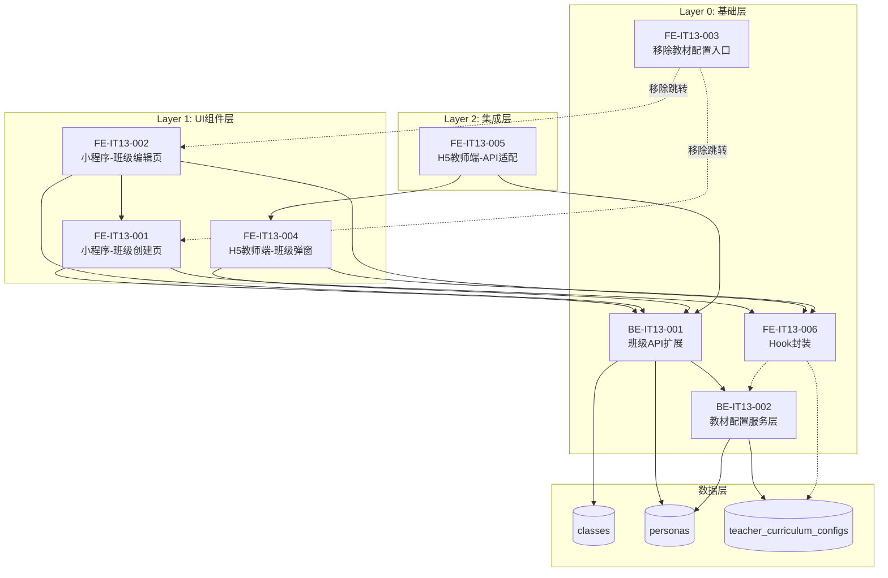
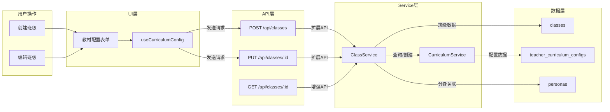
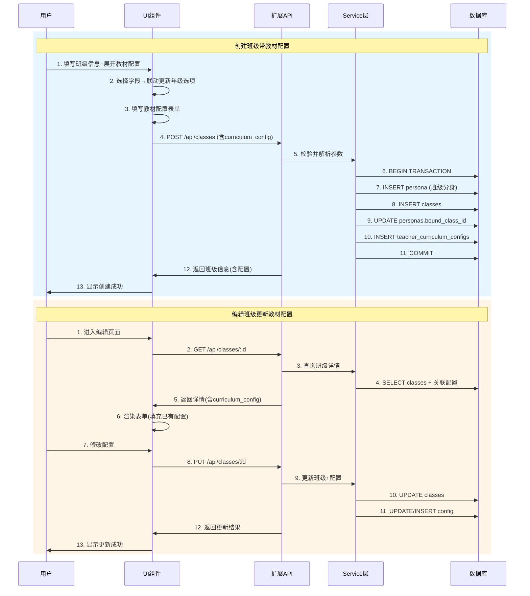
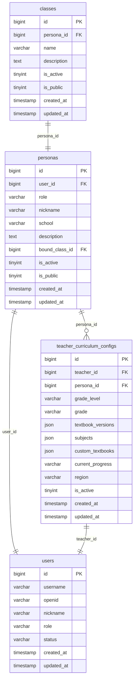

# V2.0 IT13 架构设计文档

## 迭代信息

- **版本**: V2.0
- **迭代**: IT13
- **主题**: UI优化调整和教材配置流程重构
- **生成日期**: 2026-04-09
- **关联文档**: [API规范](./api_spec.md) | [集成测试](./integration_tests.yaml) | [冒烟测试](./smoke_tests.yaml)

---

## 1. 模块依赖关系图

### 1.1 整体依赖关系



### 1.2 数据流向图



### 1.3 流程时序图



---

## 2. 分层架构说明

### 2.1 分层架构总览

| 层级 | 编号 | 职责 | 包含模块 | 开发前提 |
|------|------|------|----------|----------|
| **Layer 0** | 基础层 | API接口、数据模型、共享Hook、配置修改 | BE-IT13-001/002, FE-IT13-003/006 | 无依赖，可并行启动 |
| **Layer 1** | UI组件层 | 页面UI开发、表单交互、弹窗组件 | FE-IT13-001/002/004 | Layer 0完成 |
| **Layer 2** | 集成层 | API适配、数据绑定 | FE-IT13-005 | Layer 1完成 |
| **Layer 3** | 测试层 | 端到端测试、兼容性测试 | QA-IT13-001/002 | 全量完成 |

### 2.2 Layer 0 - 基础层

#### 2.2.1 后端模块

**BE-IT13-001: 班级API扩展-支持教材配置**
- **职责**: 扩展班级管理API，支持同时传入curriculum_config字段
- **关键接口**:
  - `POST /api/classes` - 创建班级时可选创建教材配置
  - `PUT /api/classes/:id` - 更新班级时可选更新教材配置
  - `GET /api/classes/:id` - 返回班级详情包含关联的教材配置
- **数据绑定**: 通过班级的`persona_id`关联到`teacher_curriculum_configs`

**BE-IT13-002: 教材配置服务层调整**
- **职责**: 调整Service层，支持通过persona_id查询/创建教材配置
- **关键方法**:
  ```go
  CreateByPersonaID(personaID int64, config *CurriculumConfig) (int64, error)
  GetByPersonaID(personaID int64) (*CurriculumConfig, error)
  UpdateByPersonaID(personaID int64, config *CurriculumConfig) error
  DeleteByPersonaID(personaID int64) error
  ```

#### 2.2.2 前端模块

**FE-IT13-003: 小程序-个人中心移除教材配置入口**
- **职责**: 在个人中心页面移除"教材配置"菜单项
- **影响范围**: `src/frontend/src/pages/profile/index.tsx`
- **兼容处理**: 保留`curriculum-config`页面代码但标记为废弃

**FE-IT13-006: 小程序-教材配置Hook封装**
- **职责**: 封装通用的教材配置状态管理和表单处理Hook
- **提供API**:
  ```typescript
  interface UseCurriculumConfigReturn {
    config: CurriculumConfig;
    setConfig: (config: Partial<CurriculumConfig>) => void;
    gradeOptions: string[];           // 根据学段动态计算
    subjectOptions: string[];         // 预定义学科列表
    textbookVersionOptions: string[]; // 预定义版本列表
    isValid: boolean;
    errors: ValidationError[];
    reset: () => void;
    handleGradeLevelChange: (level: string) => void;
  }
  ```

### 2.3 Layer 1 - UI组件层

**FE-IT13-001: 小程序-班级创建页教材配置区域**
- **页面**: `pages/class-create/index.tsx`
- **组件**:
  - `CurriculumConfigPanel`: 可折叠/展开的教材配置面板
  - `GradeLevelPicker`: 学段选择器（Picker）
  - `GradePicker`: 年级选择器（根据学段联动）
  - `SubjectSelector`: 学科多选标签
  - `TextbookVersionSelector`: 教材版本多选标签
  - `CustomTextbookInput`: 自定义教材输入（大学及以上学段）
  - `ProgressInput`: 教学进度输入框
- **联动规则**: 学段变更时自动清空年级选择

**FE-IT13-002: 小程序-班级编辑页教材配置区域**
- **页面**: `pages/class-edit/index.tsx`
- **功能**:
  - 加载时获取并显示已有教材配置
  - 支持修改所有配置字段
  - 支持删除教材配置（传null）
  - 无配置时支持新增配置

**FE-IT13-004: H5教师端-班级管理教材配置弹窗**
- **页面**: `h5-teacher/src/views/Classes.vue`
- **技术栈**: Vue 3 + Element Plus
- **组件映射**:
  | Taro组件 | Vue/Element Plus组件 |
  |----------|---------------------|
  | AtAccordion | ElCollapse |
  | Picker | ElCascader |
  | TagInput | ElSelect(multiple) |
  | Textarea | ElInput(type="textarea") |

### 2.4 Layer 2 - 集成层

**FE-IT13-005: H5教师端-班级管理API适配**
- **职责**: 适配H5教师端班级管理API调用，支持curriculum_config参数
- **数据转换**:
  ```typescript
  // 前端表单 → API请求
  const toApiPayload = (formData: ClassFormData) => ({
    ...formData,
    curriculum_config: formData.curriculumConfig ? {
      grade_level: formData.curriculumConfig.gradeLevel,
      grade: formData.curriculumConfig.grade,
      subjects: formData.curriculumConfig.subjects,
      textbook_versions: formData.curriculumConfig.textbookVersions,
      custom_textbooks: formData.curriculumConfig.customTextbooks,
      current_progress: formData.curriculumConfig.currentProgress
    } : undefined
  })
  ```

### 2.5 Layer 3 - 测试层

**QA-IT13-001: 教材配置整合测试**
- **测试范围**: 
  - 创建班级+教材配置端到端测试
  - 编辑班级+教材配置端到端测试
  - 删除教材配置测试
- **测试目标**: 验证完整流程的功能正确性

**QA-IT13-002: API兼容性测试**
- **测试范围**:
  - 不传curriculum_config时API正常响应
  - 传递完整/部分教材配置参数
  - 旧版本客户端向后兼容
- **测试目标**: 确保API稳定性和向后兼容

---

## 3. 后端/前端模块开发顺序

### 3.1 后端开发顺序

```
Day 1-2: BE-IT13-002 教材配置服务层调整
Day 3-4: BE-IT13-001 班级API扩展 (依赖BE-IT13-002)
```

| 顺序 | 模块 | 预计工期 | 并行性 |
|------|------|----------|--------|
| 1 | BE-IT13-002 教材配置服务层 | 2d | 可与数据库优化并行 |
| 2 | BE-IT13-001 班级API扩展 | 2d | 依赖BE-IT13-002 |

### 3.2 前端开发顺序

```
Layer 0 (Day 1-3):
  FE-IT13-006 Hook封装 ─────────────────┐
  FE-IT13-003 移除入口 ─────────────────┤ 可完全并行

Layer 1 (Day 4-7):
  FE-IT13-001 小程序创建页 ─────────────┤
  FE-IT13-004 H5弹窗 ───────────────────┤ 依赖Layer 0完成后并行
  FE-IT13-002 小程序编辑页 ─────────────┘ 依赖FE-IT13-001

Layer 2 (Day 8):
  FE-IT13-005 H5 API适配 ──────────────── 依赖FE-IT13-004
```

| 顺序 | 模块 | 预计工期 | 依赖 | 并行性 |
|------|------|----------|------|--------|
| 1 | FE-IT13-006 Hook封装 | 1.5d | - | 与后端并行 |
| 2 | FE-IT13-003 移除入口 | 0.5d | - | 与后端并行 |
| 3 | FE-IT13-001 小程序创建页 | 2d | 后端完成+FE-IT13-006 | - |
| 4 | FE-IT13-004 H5弹窗 | 2d | 后端完成+FE-IT13-006 | 可与FE-IT13-001并行 |
| 5 | FE-IT13-002 小程序编辑页 | 1.5d | FE-IT13-001 | - |
| 6 | FE-IT13-005 H5 API适配 | 1d | FE-IT13-004 | - |

### 3.3 整体开发甘特图

```
Day:        1       2       3       4       5       6       7       8
            |-------|-------|-------|-------|-------|-------|-------|
Backend:
  BE-IT13-002 [=======]
  BE-IT13-001         [=======]

Frontend:
  FE-IT13-006 [====]
  FE-IT13-003 [=]
  FE-IT13-001         [=======]
  FE-IT13-004             [=======]
  FE-IT13-002                     [=====]
  FE-IT13-005                             [===]

QA:
  QA-IT13-001                                 [===========]
  QA-IT13-002                                 [===========]
```

### 3.4 并行开发策略

**可并行模块**:
1. **BE-IT13-002** 与 **FE-IT13-006/003** - 无依赖关系
2. **FE-IT13-001** 与 **FE-IT13-004** - 两者都依赖后端和Hook

**依赖关系**:
1. BE-IT13-001 → 依赖 BE-IT13-002
2. FE-IT13-001 → 依赖 后端完成 + FE-IT13-006
3. FE-IT13-002 → 依赖 FE-IT13-001
4. FE-IT13-004 → 依赖 后端完成 + FE-IT13-006
5. FE-IT13-005 → 依赖 FE-IT13-004

---

## 4. 接口依赖关系

### 4.1 API接口对照表

| 接口 | 方法 | 提供者 | 消费者 | 变更类型 | 影响范围 |
|------|------|--------|--------|----------|----------|
| `POST /api/classes` | BE-IT13-001 | 后端 | FE-IT13-001, FE-IT13-004, FE-IT13-005 | 扩展 | 新增可选curriculum_config |
| `PUT /api/classes/:id` | BE-IT13-001 | 后端 | FE-IT13-002, FE-IT13-004, FE-IT13-005 | 扩展 | 新增可选curriculum_config |
| `GET /api/classes/:id` | BE-IT13-001 | 后端 | FE-IT13-002, FE-IT13-004 | 扩展 | 响应新增curriculum_config |
| `POST /api/curriculum-configs` | 现有API | - | - | 废弃(入口) | 新流程不再使用 |
| `GET /api/curriculum-configs` | 现有API | - | - | 废弃(入口) | 新流程不再使用 |
| `PUT /api/curriculum-configs/:id` | 现有API | 内部 | BE-IT13-002 | 保留(内部) | 供Service层调用 |
| `GET /api/curriculum-versions` | 现有API | 后端 | FE-IT13-001, FE-IT13-004 | 无变更 | 复用现有接口 |

### 4.2 接口详细规格

#### 4.2.1 POST /api/classes（扩展）

**请求体变化**:
```json
{
  "name": "班级名称",
  "description": "班级描述",
  "persona_nickname": "王老师",
  "persona_school": "XX小学",
  "persona_description": "专注小学数学教学",
  "is_public": true,
  // 新增(可选)
  "curriculum_config": {
    "grade_level": "primary",
    "grade": "三年级",
    "subjects": ["数学", "语文"],
    "textbook_versions": ["人教版"],
    "custom_textbooks": [],
    "current_progress": "第三单元 两位数乘法"
  }
}
```

**响应变化**:
```json
{
  "code": 0,
  "data": {
    "id": 1,
    "name": "班级名称",
    "description": "班级描述",
    "is_public": true,
    "persona_id": 100,
    // 新增
    "curriculum_config": {
      "id": 10,
      "grade_level": "primary",
      "grade": "三年级",
      "subjects": ["数学", "语文"],
      "textbook_versions": ["人教版"],
      "current_progress": "第三单元"
    },
    "created_at": "2026-04-09T10:00:00Z"
  }
}
```

#### 4.2.2 PUT /api/classes/:id（扩展）

**请求体**:
```json
{
  "name": "新班级名称",
  "description": "新描述",
  "is_public": false,
  // 新增(可选，传null表示删除)
  "curriculum_config": {
    "grade_level": "middle",
    "grade": "七年级",
    "subjects": ["数学"],
    "textbook_versions": ["北师大版"],
    "current_progress": "第一单元"
  }
}
```

#### 4.2.3 GET /api/classes/:id（增强）

**响应**:
```json
{
  "code": 0,
  "data": {
    "id": 1,
    "name": "班级名称",
    "description": "班级描述",
    "is_public": true,
    "persona_id": 100,
    "curriculum_config": null,  // 无配置时返回null
    // 或
    "curriculum_config": {
      "id": 10,
      "grade_level": "primary",
      "grade": "三年级",
      "subjects": ["数学"],
      "textbook_versions": ["人教版"],
      "current_progress": "第三单元"
    }
  }
}
```

### 4.3 前端Hook接口规格

**useCurriculumConfig**:
```typescript
interface CurriculumConfig {
  grade_level?: 'primary' | 'middle' | 'high' | 'university' | 'adult_life' | 'adult_professional';
  grade?: string;
  subjects?: string[];
  textbook_versions?: string[];
  custom_textbooks?: string[];
  current_progress?: string;
}

interface UseCurriculumConfigOptions {
  initialValue?: CurriculumConfig;
  onValidate?: (config: CurriculumConfig) => ValidationError[];
}

function useCurriculumConfig(options?: UseCurriculumConfigOptions): {
  value: CurriculumConfig;
  setValue: (value: Partial<CurriculumConfig>) => void;
  gradeOptions: string[];
  subjectOptions: string[];
  textbookVersionOptions: string[];
  isValid: boolean;
  errors: ValidationError[];
  reset: () => void;
}
```

---

## 5. 数据库表依赖关系

### 5.1 表结构关系



### 5.2 外键关系

| 表名 | 外键列 | 引用表 | 引用列 | 关系类型 | 说明 |
|------|--------|--------|--------|----------|------|
| classes | persona_id | personas | id | 一对一 | 一个班级对应一个分身 |
| personas | user_id | users | id | 多对一 | 一个用户有多个分身 |
| personas | bound_class_id | classes | id | 一对一 | 分身绑定的班级 |
| teacher_curriculum_configs | persona_id | personas | id | 多对一 | 一个分身可有多个配置 |
| teacher_curriculum_configs | teacher_id | users | id | 多对一 | 教师维度的配置 |

### 5.3 数据绑定关系

```
班级 ↔ 教材配置 关联路径:

查询流程:
  class.id → class.persona_id → teacher_curriculum_configs.persona_id

创建流程:
  1. 创建persona → 获取 persona.id
  2. 创建class → class.persona_id = persona.id
  3. 创建curriculum_config → config.persona_id = persona.id

更新流程:
  1. 获取class.persona_id
  2. SELECT * FROM teacher_curriculum_configs WHERE persona_id = ? AND is_active = 1
  3. 存在则UPDATE，不存在则INSERT
```

### 5.4 数据迁移说明

**本迭代无需数据库迁移**，原因如下：

1. **复用现有表结构**: 
   - 使用现有的 `teacher_curriculum_configs` 表
   - 通过现有的 `persona_id` 字段进行关联
   
2. **无新增字段**:
   - classes表无需变更
   - teacher_curriculum_configs表结构完全兼容

3. **事务一致性保证**:
   ```
   创建班级事务:
   ┌─────────────────────────────────────────────────────────────┐
   │  BEGIN TRANSACTION                                          │
   │    1. INSERT personas (创建班级分身)                        │
   │    2. INSERT classes (创建班级记录)                         │
   │    3. UPDATE personas SET bound_class_id = ?              │
   │    4. IF curriculum_config provided:                        │
   │         INSERT INTO teacher_curriculum_configs            │
   │       ON ERROR: log error, continue (配置失败不影响班级)    │
   │  COMMIT                                                     │
   └─────────────────────────────────────────────────────────────┘
   ```

### 5.5 索引优化

| 表名 | 索引字段 | 索引类型 | 用途 |
|------|----------|----------|------|
| teacher_curriculum_configs | (persona_id, is_active) | 联合索引 | 快速查询分身活跃配置 |
| teacher_curriculum_configs | (teacher_id) | 普通索引 | 教师维度查询 |
| classes | (persona_id) | 普通索引 | 班级与分身关联查询 |
| personas | (user_id, role) | 联合索引 | 用户分身列表查询 |

---

## 6. 关键技术决策

### 6.1 学段年级联动策略

| 决策 | 说明 | 原因 |
|------|------|------|
| 前端维护映射表 | 学段→年级映射存放在前端代码 | 减少后端复杂度，提升响应速度 |
| 服务端枚举验证 | API层验证grade_level的有效性 | 保证数据完整性 |
| 清空策略 | 切换学段时清空年级选择 | 避免无效组合 |

**学段年级映射**:
```typescript
const gradeLevelMap = {
  primary: ['一年级', '二年级', '三年级', '四年级', '五年级', '六年级'],
  middle: ['七年级', '八年级', '九年级'],
  high: ['高一', '高二', '高三'],
  university: [], // 大学及以上无年级选项
  adult_life: [],
  adult_professional: []
};
```

### 6.2 教材配置数据绑定策略

| 方案 | 优点 | 缺点 | 选择 |
|------|------|------|------|
| A: 绑定到persona | 数据模型不变，兼容性最好 | 班级与配置一对一 | ✅ 选中 |
| B: 绑定到class | 支持班级级别配置 | 需要新增字段，改动大 | ❌ 放弃 |

### 6.3 API兼容性策略

| 策略 | 说明 |
|------|------|
| 向后兼容 | 不传curriculum_config时API正常响应 |
| 渐进式废弃 | 保留独立教材配置API，UI入口移除 |
| 数据保留 | 已有教材配置数据不受影响 |

### 6.4 错误处理策略

| 场景 | 处理方式 | 用户感知 |
|------|----------|----------|
| 班级创建成功，配置失败 | 记录日志，继续返回成功 | 班级创建成功提示 |
| 班级创建失败 | 事务回滚 | 创建失败错误提示 |
| 更新时配置格式错误 | 返回400错误 | 参数错误提示 |
| 查询时配置不存在 | 返回 curriculum_config: null | 正常显示空表单 |

---

## 7. 风险与缓解

| 风险点 | 风险等级 | 影响 | 应对措施 |
|--------|----------|------|----------|
| 学段年级联动UI复杂 | 中 | 延期 | Hook封装统一逻辑，多端复用 |
| 事务性能问题 | 低 | 响应慢 | 监控耗时，优化索引 |
| H5与小程序UI不一致 | 中 | 体验差 | 制定组件映射规范 |
| 旧数据兼容问题 | 低 | 数据丢失 | 充分测试B3查询正确性 |
| Hook在H5端复用困难 | 低 | 代码重复 | 核心逻辑抽出，视图层分别实现 |

---

## 附录

### A. 模块依赖矩阵

| ↓依赖→ | BE-IT13-001 | BE-IT13-002 | FE-IT13-001 | FE-IT13-002 | FE-IT13-003 | FE-IT13-004 | FE-IT13-005 | FE-IT13-006 |
|--------|:-----------:|:-----------:|:-----------:|:-----------:|:-----------:|:-----------:|:-----------:|:-----------:|
| BE-IT13-001 | - | D | - | - | - | - | - | - |
| BE-IT13-002 | - | - | - | - | - | - | - | - |
| FE-IT13-001 | D | - | - | - | - | - | - | D |
| FE-IT13-002 | D | - | D | - | - | - | - | D |
| FE-IT13-003 | - | - | - | - | - | - | - | - |
| FE-IT13-004 | D | - | - | - | - | - | - | D |
| FE-IT13-005 | D | - | - | - | - | D | - | - |
| FE-IT13-006 | - | D | - | - | - | - | - | - |

*D = 依赖 (Depends on)*

### B. 学段枚举定义

| grade_level | 中文名 | 年级选项 |
|-------------|--------|----------|
| primary | 小学 | 一至六年级 |
| middle | 初中 | 七至九年级 |
| high | 高中 | 高一至高三 |
| university | 大学 | 无（自定义输入） |
| adult_life | 成人生活 | 无（自定义输入） |
| adult_professional | 成人职业 | 无（自定义输入） |

### C. 学科选项

```typescript
const subjects = [
  '语文', '数学', '英语', '物理', '化学', '生物',
  '历史', '地理', '政治', '信息技术', '音乐', '美术', '体育'
];
```

### D. 教材版本选项

```typescript
const textbookVersions = [
  '人教版', '北师大版', '苏教版', '沪教版', '部编版', '外研版'
];
```
