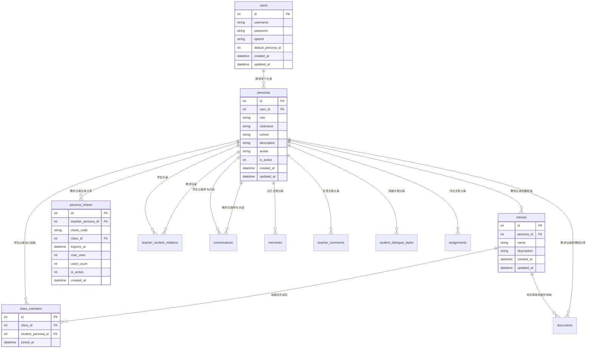
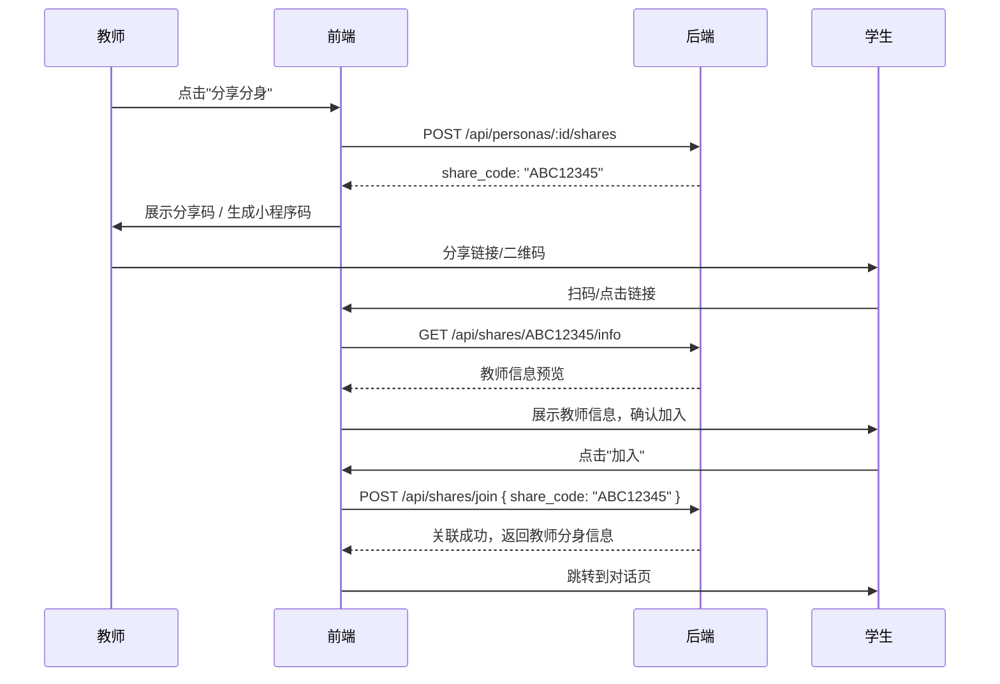
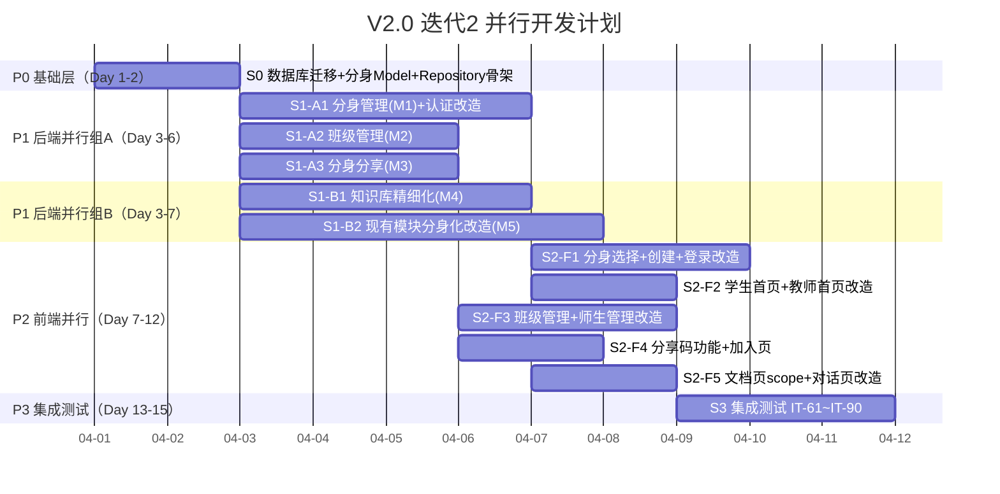
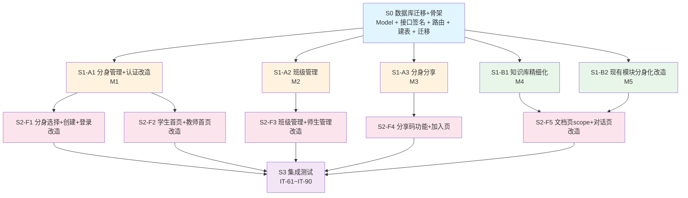

# V2.0 迭代2 需求规格说明书

## 1. 迭代概述

| 项目 | 说明 |
|------|------|
| **迭代名称** | V2.0 Sprint 2 - 多角色多分身架构 |
| **迭代目标** | 支持一个微信用户拥有多个角色和分身，教师可按班级管理学生，分身可分享给学生 |
| **迭代周期** | ~4 周 |
| **交付标准** | 所有新功能通过集成测试，前端页面可交互 |
| **前置依赖** | V2.0 迭代1 全部完成（21 个集成测试通过） |

## 2. 迭代目标

### 2.1 核心目标
> **完成多角色多分身体系 + 班级管理 + 分身分享 + 知识库精细化管理**

具体来说：
1. ✅ 多角色多分身：一个微信用户可以创建多个分身（如高中老师、培训班老师、音乐培训班学生等）
2. ✅ 分身分享：老师可以主动分享自己的分身给学生，学生点击后即可跟老师对话
3. ✅ 知识库精细化：老师上传知识库时可以选择班级或学生，实现知识库的精细化管理
4. ✅ 班级管理：老师可以创建班级，按班级管理学生
5. ✅ 老师分身管理页：登录后可以选择不同的分身进行管理
6. ✅ 学生分身选择页：登录后可以选择不同老师的分身进行交流

### 2.2 不在本迭代范围
- ❌ Docker 容器化部署（移至 V2.0 迭代3）
- ❌ HTTPS / Nginx 配置（移至 V2.0 迭代3）
- ❌ 安全加固 / API 限流（移至 V2.0 迭代3）
- ❌ 记忆衰减机制（移至 V2.0 迭代3）
- ❌ 数据分析看板（移至 V2.0 迭代3）
- ❌ 小程序审核发布（移至 V2.0 迭代3）

### 2.3 与迭代1的关系
本迭代是对迭代1的**架构升级**，核心变化是将"一个用户一个角色"升级为"一个用户多个分身"。需要：
- 新增 `personas`（分身）表和 `classes`（班级）表
- 改造现有的 `teacher_student_relations` 表，关联到分身而非用户
- 改造现有的对话、知识库、评语、作业等模块，支持分身维度
- 改造前端登录流程，支持分身选择

---

## 3. 核心概念定义

### 3.1 概念模型

```
微信用户 (User)
  ├── 分身A: 高中物理老师 (Persona, role=teacher)
  │     ├── 班级1: 高一(3)班
  │     │     ├── 学生甲
  │     │     └── 学生乙
  │     ├── 班级2: 高二(1)班
  │     │     └── 学生丙
  │     └── 知识库: 高中物理知识
  │           ├── 全局知识（所有学生可见）
  │           ├── 班级知识（高一3班专属）
  │           └── 学生知识（学生甲专属）
  │
  ├── 分身B: 培训班数学老师 (Persona, role=teacher)
  │     ├── 班级3: 数学提高班
  │     └── 知识库: 数学培训知识
  │
  └── 分身C: 音乐培训班学生 (Persona, role=student)
        └── 关联老师: 李老师的钢琴教学分身
```

### 3.2 术语表

| 术语 | 英文 | 说明 |
|------|------|------|
| 用户 | User | 微信登录的自然人，通过 openid 唯一标识 |
| 分身 | Persona | 用户创建的角色实例，一个用户可以有多个分身 |
| 教师分身 | Teacher Persona | role=teacher 的分身，可以管理知识库、班级、学生 |
| 学生分身 | Student Persona | role=student 的分身，可以与教师分身对话 |
| 班级 | Class | 教师分身创建的学生分组，用于批量管理 |
| 分身分享 | Persona Share | 教师分身生成分享链接/二维码，学生扫码后关联 |
| 知识库作用域 | Knowledge Scope | 知识库的可见范围：全局 / 班级 / 学生 |

---

## 4. 数据库设计

### 4.1 新增表

#### 4.1.1 分身表 (personas)

```sql
CREATE TABLE IF NOT EXISTS personas (
    id              INTEGER PRIMARY KEY AUTOINCREMENT,
    user_id         INTEGER NOT NULL,                    -- 所属用户
    role            TEXT NOT NULL,                        -- teacher / student
    nickname        TEXT NOT NULL,                        -- 分身昵称
    school          TEXT DEFAULT '',                      -- 学校名称（教师分身必填）
    description     TEXT DEFAULT '',                      -- 分身描述（教师分身必填）
    avatar          TEXT DEFAULT '',                      -- 头像 URL（预留）
    is_active       INTEGER DEFAULT 1,                   -- 是否激活 1=是 0=否
    created_at      DATETIME DEFAULT CURRENT_TIMESTAMP,
    updated_at      DATETIME DEFAULT CURRENT_TIMESTAMP,
    FOREIGN KEY (user_id) REFERENCES users(id)
);

-- 教师分身 nickname + school 联合唯一索引
CREATE UNIQUE INDEX IF NOT EXISTS idx_persona_teacher_school
ON personas(nickname, school) WHERE role = 'teacher';
```

#### 4.1.2 班级表 (classes)

```sql
CREATE TABLE IF NOT EXISTS classes (
    id              INTEGER PRIMARY KEY AUTOINCREMENT,
    persona_id      INTEGER NOT NULL,                    -- 所属教师分身
    name            TEXT NOT NULL,                        -- 班级名称
    description     TEXT DEFAULT '',                      -- 班级描述
    created_at      DATETIME DEFAULT CURRENT_TIMESTAMP,
    updated_at      DATETIME DEFAULT CURRENT_TIMESTAMP,
    FOREIGN KEY (persona_id) REFERENCES personas(id),
    UNIQUE(persona_id, name)                             -- 同一教师分身下班级名唯一
);
```

#### 4.1.3 班级成员表 (class_members)

```sql
CREATE TABLE IF NOT EXISTS class_members (
    id              INTEGER PRIMARY KEY AUTOINCREMENT,
    class_id        INTEGER NOT NULL,                    -- 班级 ID
    student_persona_id INTEGER NOT NULL,                 -- 学生分身 ID
    joined_at       DATETIME DEFAULT CURRENT_TIMESTAMP,
    FOREIGN KEY (class_id) REFERENCES classes(id),
    FOREIGN KEY (student_persona_id) REFERENCES personas(id),
    UNIQUE(class_id, student_persona_id)                 -- 同一班级不重复加入
);
```

#### 4.1.4 分身分享表 (persona_shares)

```sql
CREATE TABLE IF NOT EXISTS persona_shares (
    id              INTEGER PRIMARY KEY AUTOINCREMENT,
    teacher_persona_id INTEGER NOT NULL,                 -- 教师分身 ID
    share_code      TEXT NOT NULL UNIQUE,                 -- 分享码（短码，如 8 位随机字符串）
    class_id        INTEGER,                              -- 可选：指定加入的班级
    expires_at      DATETIME,                             -- 过期时间（NULL 表示永不过期）
    max_uses        INTEGER DEFAULT 0,                    -- 最大使用次数（0=不限）
    used_count      INTEGER DEFAULT 0,                    -- 已使用次数
    is_active       INTEGER DEFAULT 1,                    -- 是否有效
    created_at      DATETIME DEFAULT CURRENT_TIMESTAMP,
    FOREIGN KEY (teacher_persona_id) REFERENCES personas(id),
    FOREIGN KEY (class_id) REFERENCES classes(id)
);
```

### 4.2 改造表

#### 4.2.1 users 表变更

```sql
-- users 表不再存储 role/nickname/school/description
-- 这些字段迁移到 personas 表
-- 但保留 users 表的 role/nickname 字段用于向后兼容（标记为 deprecated）
-- 新增 default_persona_id 字段
ALTER TABLE users ADD COLUMN default_persona_id INTEGER DEFAULT 0;
```

> **迁移策略**：现有 users 表中 role 不为空的用户，自动创建对应的 persona 记录，并设置 `default_persona_id`。

#### 4.2.2 teacher_student_relations 表变更

```sql
-- 改造：teacher_id / student_id → teacher_persona_id / student_persona_id
-- 新增列
ALTER TABLE teacher_student_relations ADD COLUMN teacher_persona_id INTEGER DEFAULT 0;
ALTER TABLE teacher_student_relations ADD COLUMN student_persona_id INTEGER DEFAULT 0;
-- 迁移后，teacher_id / student_id 标记为 deprecated
```

> **迁移策略**：现有 teacher_student_relations 记录，根据 teacher_id / student_id 查找对应的 persona_id 进行回填。

#### 4.2.3 documents 表变更

```sql
-- 新增知识库作用域字段
ALTER TABLE documents ADD COLUMN scope TEXT DEFAULT 'global';       -- global / class / student
ALTER TABLE documents ADD COLUMN scope_id INTEGER DEFAULT 0;        -- class_id 或 student_persona_id
ALTER TABLE documents ADD COLUMN persona_id INTEGER DEFAULT 0;      -- 所属教师分身 ID
```

> **迁移策略**：现有 documents 记录，根据 teacher_id 查找对应的 persona_id 进行回填，scope 默认为 'global'。

#### 4.2.4 conversations 表变更

```sql
-- 新增分身维度
ALTER TABLE conversations ADD COLUMN teacher_persona_id INTEGER DEFAULT 0;
ALTER TABLE conversations ADD COLUMN student_persona_id INTEGER DEFAULT 0;
```

> **迁移策略**：现有 conversations 记录，根据 teacher_id / student_id 查找对应的 persona_id 进行回填。

#### 4.2.5 memories 表变更

```sql
-- 新增分身维度
ALTER TABLE memories ADD COLUMN teacher_persona_id INTEGER DEFAULT 0;
ALTER TABLE memories ADD COLUMN student_persona_id INTEGER DEFAULT 0;
```

#### 4.2.6 teacher_comments 表变更

```sql
ALTER TABLE teacher_comments ADD COLUMN teacher_persona_id INTEGER DEFAULT 0;
ALTER TABLE teacher_comments ADD COLUMN student_persona_id INTEGER DEFAULT 0;
```

#### 4.2.7 student_dialogue_styles 表变更

```sql
ALTER TABLE student_dialogue_styles ADD COLUMN teacher_persona_id INTEGER DEFAULT 0;
ALTER TABLE student_dialogue_styles ADD COLUMN student_persona_id INTEGER DEFAULT 0;
```

#### 4.2.8 assignments 表变更

```sql
ALTER TABLE assignments ADD COLUMN teacher_persona_id INTEGER DEFAULT 0;
ALTER TABLE assignments ADD COLUMN student_persona_id INTEGER DEFAULT 0;
```

### 4.3 数据迁移方案

> **核心原则**：向后兼容，新旧字段并存过渡期，迁移完成后旧字段标记为 deprecated。

```sql
-- Step 1: 为现有用户创建默认分身
INSERT INTO personas (user_id, role, nickname, school, description)
SELECT id, role, COALESCE(nickname, username), COALESCE(school, ''), COALESCE(description, '')
FROM users
WHERE role != '';

-- Step 2: 回填 users.default_persona_id
UPDATE users SET default_persona_id = (
    SELECT p.id FROM personas p WHERE p.user_id = users.id LIMIT 1
) WHERE role != '';

-- Step 3: 回填 teacher_student_relations
UPDATE teacher_student_relations SET
    teacher_persona_id = (SELECT p.id FROM personas p WHERE p.user_id = teacher_student_relations.teacher_id AND p.role = 'teacher' LIMIT 1),
    student_persona_id = (SELECT p.id FROM personas p WHERE p.user_id = teacher_student_relations.student_id AND p.role = 'student' LIMIT 1);

-- Step 4: 回填 documents.persona_id
UPDATE documents SET persona_id = (
    SELECT p.id FROM personas p WHERE p.user_id = documents.teacher_id AND p.role = 'teacher' LIMIT 1
);

-- Step 5: 回填 conversations
UPDATE conversations SET
    teacher_persona_id = (SELECT p.id FROM personas p WHERE p.user_id = conversations.teacher_id AND p.role = 'teacher' LIMIT 1),
    student_persona_id = (SELECT p.id FROM personas p WHERE p.user_id = conversations.student_id AND p.role = 'student' LIMIT 1);

-- Step 6: 回填 memories
UPDATE memories SET
    teacher_persona_id = (SELECT p.id FROM personas p WHERE p.user_id = memories.teacher_id AND p.role = 'teacher' LIMIT 1),
    student_persona_id = (SELECT p.id FROM personas p WHERE p.user_id = memories.student_id AND p.role = 'student' LIMIT 1);

-- Step 7: 回填 teacher_comments
UPDATE teacher_comments SET
    teacher_persona_id = (SELECT p.id FROM personas p WHERE p.user_id = teacher_comments.teacher_id AND p.role = 'teacher' LIMIT 1),
    student_persona_id = (SELECT p.id FROM personas p WHERE p.user_id = teacher_comments.student_id AND p.role = 'student' LIMIT 1);

-- Step 8: 回填 student_dialogue_styles
UPDATE student_dialogue_styles SET
    teacher_persona_id = (SELECT p.id FROM personas p WHERE p.user_id = student_dialogue_styles.teacher_id AND p.role = 'teacher' LIMIT 1),
    student_persona_id = (SELECT p.id FROM personas p WHERE p.user_id = student_dialogue_styles.student_id AND p.role = 'student' LIMIT 1);

-- Step 9: 回填 assignments
UPDATE assignments SET
    teacher_persona_id = (SELECT p.id FROM personas p WHERE p.user_id = assignments.teacher_id AND p.role = 'teacher' LIMIT 1),
    student_persona_id = (SELECT p.id FROM personas p WHERE p.user_id = assignments.student_id AND p.role = 'student' LIMIT 1);
```

### 4.4 ER 关系图



---

## 5. 模块需求

### 5.1 模块 V2-IT2-M1：分身管理

**目标**：支持用户创建、切换、管理多个分身。

#### 功能需求

| ID | 需求 | 优先级 |
|----|------|--------|
| PER-01 | 用户创建分身（教师/学生角色） | P0 |
| PER-02 | 教师分身必填 nickname + school + description | P0 |
| PER-03 | 学生分身必填 nickname | P0 |
| PER-04 | 教师分身 nickname + school 联合唯一 | P0 |
| PER-05 | 获取当前用户的所有分身列表 | P0 |
| PER-06 | 切换当前活跃分身 | P0 |
| PER-07 | 编辑分身信息 | P1 |
| PER-08 | 停用/启用分身 | P1 |
| PER-09 | 数据迁移：现有用户自动创建默认分身 | P0 |

#### 新增接口

| 方法 | 路径 | 说明 | 鉴权 |
|------|------|------|------|
| POST | `/api/personas` | 创建分身 | 登录用户 |
| GET | `/api/personas` | 获取当前用户的分身列表 | 登录用户 |
| PUT | `/api/personas/:id` | 编辑分身信息 | 登录用户（本人） |
| PUT | `/api/personas/:id/activate` | 启用分身 | 登录用户（本人） |
| PUT | `/api/personas/:id/deactivate` | 停用分身 | 登录用户（本人） |
| PUT | `/api/personas/:id/switch` | 切换当前活跃分身 | 登录用户（本人） |

#### 业务逻辑

```
创建分身:
  POST /api/personas
  {
    "role": "teacher",
    "nickname": "王老师",
    "school": "北京大学",
    "description": "物理学教授"
  }
  → 校验 role 合法性
  → 教师分身：校验 nickname + school 唯一
  → 创建 persona 记录
  → 如果是用户的第一个分身，自动设为 default_persona_id

切换分身:
  PUT /api/personas/:id/switch
  → 校验分身属于当前用户
  → 更新 users.default_persona_id = persona_id
  → 返回新的 JWT token（包含 persona_id 信息）
```

#### 认证改造

**JWT Token 结构变更**：

```json
// 迭代1 的 JWT Claims
{
  "user_id": 1,
  "role": "teacher",
  "exp": 1234567890
}

// 迭代2 的 JWT Claims（新增 persona_id）
{
  "user_id": 1,
  "persona_id": 3,
  "role": "teacher",
  "exp": 1234567890
}
```

**登录流程改造**：

```
wx-login:
  1. 通过 openid 查找用户
  2. 新用户：创建 user，返回 is_new_user=true
  3. 老用户：
     a. 查询用户的所有分身列表
     b. 如果有 default_persona_id，使用该分身生成 token
     c. 如果没有分身，返回 is_new_user=true（引导创建分身）
     d. 返回 personas 列表 + 当前分身信息

complete-profile 改造:
  → 改为创建分身（调用 POST /api/personas 的逻辑）
  → 向后兼容：仍然接受 role/nickname/school/description
  → 内部转换为创建 persona
```

#### 涉及文件

| 文件 | 改动 |
|------|------|
| `database/database.go` | 新增 personas 表 + ALTER TABLE + 数据迁移 |
| `database/models.go` | 新增 Persona 结构体 |
| `database/repository.go` | 新增 PersonaRepository |
| `plugins/auth/auth_plugin.go` | 改造 wx-login / complete-profile，支持分身 |
| `plugins/auth/jwt.go` | JWT Claims 新增 persona_id |
| `api/handlers.go` | 新增分身管理 Handler |
| `api/router.go` | 新增 /api/personas 路由 |

---

### 5.2 模块 V2-IT2-M2：班级管理

**目标**：教师分身可以创建班级，按班级管理学生。

#### 功能需求

| ID | 需求 | 优先级 |
|----|------|--------|
| CLS-01 | 教师分身创建班级 | P0 |
| CLS-02 | 获取教师分身的班级列表 | P0 |
| CLS-03 | 编辑班级信息 | P1 |
| CLS-04 | 删除班级（需无成员） | P1 |
| CLS-05 | 添加学生到班级 | P0 |
| CLS-06 | 从班级移除学生 | P0 |
| CLS-07 | 获取班级成员列表 | P0 |
| CLS-08 | 同一教师分身下班级名唯一 | P0 |

#### 新增接口

| 方法 | 路径 | 说明 | 角色 |
|------|------|------|------|
| POST | `/api/classes` | 创建班级 | teacher |
| GET | `/api/classes` | 获取班级列表 | teacher |
| PUT | `/api/classes/:id` | 编辑班级 | teacher |
| DELETE | `/api/classes/:id` | 删除班级 | teacher |
| POST | `/api/classes/:id/members` | 添加成员 | teacher |
| DELETE | `/api/classes/:id/members/:member_id` | 移除成员 | teacher |
| GET | `/api/classes/:id/members` | 获取成员列表 | teacher |

#### 业务逻辑

```
创建班级:
  POST /api/classes { "name": "高一(3)班", "description": "2026级高一3班" }
  → 从 JWT 获取 persona_id
  → 校验当前分身是教师角色
  → 校验同一分身下班级名唯一
  → 创建 class 记录

添加成员:
  POST /api/classes/:id/members { "student_persona_id": 5 }
  → 校验班级属于当前教师分身
  → 校验学生分身存在且 role=student
  → 校验未重复加入
  → 创建 class_member 记录
  → 如果师生关系不存在，自动创建 approved 关系

获取班级成员列表:
  GET /api/classes/:id/members
  → 返回成员列表，含学生分身昵称、加入时间
```

#### 涉及文件

| 文件 | 改动 |
|------|------|
| `database/database.go` | 新增 classes + class_members 表 |
| `database/models.go` | 新增 Class / ClassMember 结构体 |
| `database/repository.go` | 新增 ClassRepository |
| `api/handlers.go` | 新增班级管理 Handler |
| `api/router.go` | 新增 /api/classes 路由 |

---

### 5.3 模块 V2-IT2-M3：分身分享

**目标**：教师可以生成分享码/链接，学生扫码后自动关联到教师分身。

#### 功能需求

| ID | 需求 | 优先级 |
|----|------|--------|
| SHR-01 | 教师分身生成分享码 | P0 |
| SHR-02 | 分享码可指定加入的班级 | P0 |
| SHR-03 | 分享码可设置过期时间 | P1 |
| SHR-04 | 分享码可设置最大使用次数 | P1 |
| SHR-05 | 学生通过分享码关联教师分身 | P0 |
| SHR-06 | 关联时自动创建师生关系（approved） | P0 |
| SHR-07 | 关联时如果指定了班级，自动加入班级 | P0 |
| SHR-08 | 获取分享码列表 | P1 |
| SHR-09 | 停用分享码 | P1 |
| SHR-10 | 学生如果没有学生分身，自动引导创建 | P0 |

#### 新增接口

| 方法 | 路径 | 说明 | 角色 |
|------|------|------|------|
| POST | `/api/personas/:id/shares` | 生成分享码 | teacher |
| GET | `/api/personas/:id/shares` | 获取分享码列表 | teacher |
| PUT | `/api/shares/:id/deactivate` | 停用分享码 | teacher |
| POST | `/api/shares/join` | 学生通过分享码加入 | 登录用户 |
| GET | `/api/shares/:code/info` | 获取分享码信息（预览） | 登录用户 |

#### 业务逻辑

```
生成分享码:
  POST /api/personas/:id/shares
  {
    "class_id": 1,           // 可选：指定加入的班级
    "expires_hours": 168,    // 可选：过期时间（小时），默认 7 天
    "max_uses": 50           // 可选：最大使用次数，0=不限
  }
  → 校验分身属于当前用户且为教师角色
  → 如果指定了 class_id，校验班级属于该分身
  → 生成 8 位随机分享码
  → 创建 persona_share 记录

学生通过分享码加入:
  POST /api/shares/join
  {
    "share_code": "ABC12345",
    "student_persona_id": 5   // 可选：指定使用哪个学生分身
  }
  → 校验分享码有效（存在 + 未过期 + 未超限 + is_active）
  → 如果未指定 student_persona_id：
    a. 查找当前用户的学生分身
    b. 如果只有一个，自动使用
    c. 如果有多个，返回列表让用户选择
    d. 如果没有，返回提示需要先创建学生分身
  → 创建 teacher_student_relation（status=approved）
  → 如果分享码指定了 class_id，自动加入班级
  → 更新 persona_share.used_count += 1
  → 返回教师分身信息

获取分享码信息（预览）:
  GET /api/shares/:code/info
  → 返回教师分身昵称、学校、描述、班级名称（如果有）
  → 不需要登录也可以预览（用于分享页面展示）
```

#### 分享流程



#### 涉及文件

| 文件 | 改动 |
|------|------|
| `database/database.go` | 新增 persona_shares 表 |
| `database/models.go` | 新增 PersonaShare 结构体 |
| `database/repository.go` | 新增 ShareRepository |
| `api/handlers.go` | 新增分享相关 Handler |
| `api/router.go` | 新增 /api/shares 路由 |

---

### 5.4 模块 V2-IT2-M4：知识库精细化管理

**目标**：教师上传知识库时可以选择作用域（全局/班级/学生），对话时按作用域检索。

#### 功能需求

| ID | 需求 | 优先级 |
|----|------|--------|
| KBS-01 | 添加文档时可指定 scope（global/class/student） | P0 |
| KBS-02 | scope=class 时需指定 class_id | P0 |
| KBS-03 | scope=student 时需指定 student_persona_id | P0 |
| KBS-04 | 对话时按作用域检索知识库：全局 + 所在班级 + 学生专属 | P0 |
| KBS-05 | 文档列表支持按 scope 筛选 | P1 |
| KBS-06 | 文件上传和 URL 导入也支持 scope | P1 |
| KBS-07 | 向量检索时合并多个 scope 的结果 | P0 |

#### 改造接口

**`POST /api/documents`** 请求体变更：

```json
{
  "title": "牛顿运动定律",
  "content": "...",
  "tags": "物理,力学",
  "scope": "class",              // 🆕 global / class / student，默认 global
  "scope_id": 1                  // 🆕 class_id 或 student_persona_id
}
```

**`POST /api/documents/upload`** 表单字段变更：

```
file: (binary)
title: 牛顿运动定律
tags: 物理,力学
scope: class                     // 🆕
scope_id: 1                      // 🆕
```

**`POST /api/documents/import-url`** 请求体变更：

```json
{
  "url": "https://example.com/article",
  "title": "可选标题",
  "tags": "物理,力学",
  "scope": "student",            // 🆕
  "scope_id": 5                  // 🆕
}
```

**`GET /api/documents`** Query 参数变更：

| 参数 | 类型 | 必填 | 说明 |
|------|------|------|------|
| scope | string | ❌ | 按作用域筛选 |
| scope_id | int | ❌ | 按作用域 ID 筛选 |

#### 对话时知识库检索逻辑

```
学生分身 S 与教师分身 T 对话:
  1. 查询 S 所在的 T 的班级列表 → class_ids
  2. 检索知识库时，合并以下 scope 的文档:
     a. scope=global AND persona_id=T.id（全局知识）
     b. scope=class AND scope_id IN class_ids（班级知识）
     c. scope=student AND scope_id=S.id（学生专属知识）
  3. 向量检索时，使用 Chroma 的 where 过滤条件
```

#### Chroma 元数据变更

```json
// 迭代1 的 Chroma 元数据
{
  "teacher_id": 1,
  "document_id": 10,
  "doc_type": "text"
}

// 迭代2 的 Chroma 元数据（新增 scope 相关）
{
  "teacher_id": 1,
  "persona_id": 3,
  "document_id": 10,
  "doc_type": "text",
  "scope": "class",
  "scope_id": 1
}
```

#### 涉及文件

| 文件 | 改动 |
|------|------|
| `database/models.go` | Document 结构体新增 Scope / ScopeID / PersonaID |
| `database/repository.go` | DocumentRepository 改造查询方法，支持 scope 筛选 |
| `plugins/knowledge/knowledge_plugin.go` | add action 支持 scope 参数；search action 合并多 scope |
| `plugins/knowledge/chroma_client.go` | 向量检索增加 where 过滤 |
| `api/handlers.go` | HandleAddDocument / HandleUploadDocument / HandleImportURL 增加 scope 参数 |

---

### 5.5 模块 V2-IT2-M5：现有模块分身化改造

**目标**：将迭代1中基于 user_id 的模块改造为基于 persona_id。

#### 功能需求

| ID | 需求 | 优先级 |
|----|------|--------|
| MIG-01 | 师生关系改为分身维度 | P0 |
| MIG-02 | 对话改为分身维度 | P0 |
| MIG-03 | 记忆改为分身维度 | P0 |
| MIG-04 | 评语改为分身维度 | P1 |
| MIG-05 | 问答风格改为分身维度 | P1 |
| MIG-06 | 作业改为分身维度 | P1 |
| MIG-07 | 教师列表改为分身列表 | P0 |
| MIG-08 | 所有 Handler 从 JWT 中读取 persona_id | P0 |

#### 改造要点

**1. 师生关系**：
- `teacher_student_relations` 使用 `teacher_persona_id` + `student_persona_id`
- 邀请/申请/审批逻辑不变，只是维度从 user 变为 persona
- 一个学生分身只能与一个教师分身建立一个关系

**2. 对话**：
- `POST /api/chat` 请求体中 `teacher_id` 改为 `teacher_persona_id`
- 对话记录存储 `teacher_persona_id` + `student_persona_id`
- 对话历史查询按分身维度

**3. 教师列表**：
- `GET /api/teachers` 改为返回教师分身列表（而非用户列表）
- 返回字段包含 persona_id、nickname、school、description、document_count

**4. Handler 改造**：
- 所有需要角色判断的 Handler，从 JWT 的 `persona_id` 获取当前分身
- 所有需要 teacher_id / student_id 的地方，改为 teacher_persona_id / student_persona_id

#### 涉及文件

| 文件 | 改动 |
|------|------|
| `api/handlers.go` | 所有 Handler 改造（读取 persona_id） |
| `database/repository.go` | 所有 Repository 改造（查询条件改为 persona_id） |
| `plugins/dialogue/dialogue_plugin.go` | 对话插件改造 |
| `plugins/memory/memory_plugin.go` | 记忆插件改造 |
| `plugins/knowledge/knowledge_plugin.go` | 知识库插件改造 |
| `plugins/auth/auth_plugin.go` | 认证插件改造 |

---

### 5.6 模块 V2-IT2-M6：集成测试

**目标**：所有新功能和改造功能通过集成测试。

#### 测试用例规划

| 用例编号 | 测试场景 | 涉及模块 |
|----------|----------|----------|
| IT-61 | 用户创建教师分身 | M1 |
| IT-62 | 用户创建学生分身 | M1 |
| IT-63 | 同一用户创建多个分身（教师+学生） | M1 |
| IT-64 | 教师分身 nickname+school 唯一校验 | M1 |
| IT-65 | 切换分身 → JWT 包含新 persona_id | M1 |
| IT-66 | 获取分身列表 | M1 |
| IT-67 | 教师分身创建班级 | M2 |
| IT-68 | 同一分身下班级名唯一校验 | M2 |
| IT-69 | 添加学生到班级 | M2 |
| IT-70 | 获取班级成员列表 | M2 |
| IT-71 | 教师分身生成分享码 | M3 |
| IT-72 | 学生通过分享码加入 → 自动创建关系 | M3 |
| IT-73 | 分享码指定班级 → 学生自动加入班级 | M3 |
| IT-74 | 分享码过期/超限 → 返回错误 | M3 |
| IT-75 | 获取分享码信息（预览） | M3 |
| IT-76 | 添加文档指定 scope=global | M4 |
| IT-77 | 添加文档指定 scope=class | M4 |
| IT-78 | 添加文档指定 scope=student | M4 |
| IT-79 | 对话时检索合并多 scope 知识库 | M4 |
| IT-80 | 文档列表按 scope 筛选 | M4 |
| IT-81 | 师生关系使用分身维度 | M5 |
| IT-82 | 对话使用分身维度 | M5 |
| IT-83 | 评语使用分身维度 | M5 |
| IT-84 | 作业使用分身维度 | M5 |
| IT-85 | 数据迁移：旧用户自动创建分身 | M1 |
| IT-86 | 全链路：注册→创建分身→创建班级→分享→学生加入→对话→评语 | 全部 |
| IT-87 | 老用户登录 → 返回分身列表 → 切换分身 | M1 |
| IT-88 | 教师设置学生进度/评语（分身维度） | M5 |
| IT-89 | 知识库上传文件指定 scope | M4 |
| IT-90 | 知识库 URL 导入指定 scope | M4 |

---

## 6. 前端页面需求

### 6.1 改造页面

#### 6.1.1 登录页（FE-P1）改造

**改造内容**：登录成功后，根据分身数量决定跳转

```
wx-login 返回:
  → is_new_user=true → 跳转角色选择页（创建第一个分身）
  → 有分身列表:
    → 只有1个分身 → 直接进入对应首页
    → 有多个分身 → 跳转分身选择页
```

#### 6.1.2 角色选择页（FE-P2）改造

**改造内容**：改为"创建分身"页面，支持创建教师分身或学生分身

```
┌─────────────────────────┐
│     创建你的分身          │
│                         │
│  [教师分身]  [学生分身]   │
│                         │
│  ── 教师分身信息 ──      │
│  昵称: [________]       │
│  学校: [________]       │
│  分身描述: [______]      │
│                         │
│  [创建分身]              │
│                         │
│  已有分身？[选择已有分身]  │
└─────────────────────────┘
```

#### 6.1.3 学生首页（FE-P3）改造

**改造内容**：显示当前学生分身关联的教师分身列表

```
┌─────────────────────────┐
│  当前分身: 音乐培训班学生  │
│  [切换分身 ↓]            │
│                         │
│  我的老师                │
│  ┌───────────────────┐  │
│  │ 李老师 · 音乐学院   │  │
│  │ 钢琴教学            │  │
│  │ [进入对话]          │  │
│  └───────────────────┘  │
│                         │
│  [+ 通过分享码加入]      │
└─────────────────────────┘
```

#### 6.1.4 教师首页（FE-P6 知识库管理页）改造

**改造内容**：增加分身切换入口，知识库按 scope 展示

```
┌─────────────────────────┐
│  当前分身: 高中物理老师    │
│  [切换分身 ↓]            │
│                         │
│  知识库管理               │
│  [全局] [班级] [学生]     │  ← scope 切换 Tab
│                         │
│  全局知识库               │
│  ┌───────────────────┐  │
│  │ 牛顿运动定律        │  │
│  │ 8 个知识块          │  │
│  └───────────────────┘  │
│                         │
│  [+ 添加文档]            │
└─────────────────────────┘
```

#### 6.1.5 添加文档页（FE-P8）改造

**改造内容**：增加 scope 选择

```
┌─────────────────────────┐
│  添加文档                │
│                         │
│  作用域:                 │
│  ○ 全局（所有学生可见）   │
│  ○ 班级 [选择班级 ▼]    │
│  ○ 学生 [选择学生 ▼]    │
│                         │
│  [文本录入] [文件上传] [URL导入]  │
│  ─────────────────────  │
│  ...（原有内容）          │
└─────────────────────────┘
```

#### 6.1.6 师生管理页（FE-P10）改造

**改造内容**：增加班级管理 Tab，支持按班级查看学生

```
┌─────────────────────────┐
│  师生管理                │
│  [全部学生] [按班级] [分享] │
│                         │
│  ── 按班级 Tab ──        │
│  高一(3)班 (15人)        │
│  ┌───────────────────┐  │
│  │ 小李 · 已授权 ✅    │  │
│  │ 小王 · 已授权 ✅    │  │
│  │ [+ 添加学生]       │  │
│  └───────────────────┘  │
│                         │
│  [+ 创建班级]            │
│                         │
│  ── 分享 Tab ──          │
│  ┌───────────────────┐  │
│  │ 分享码: ABC12345    │  │
│  │ 班级: 高一(3)班     │  │
│  │ 已使用: 12/50       │  │
│  │ [停用] [复制链接]   │  │
│  └───────────────────┘  │
│  [+ 生成分享码]          │
└─────────────────────────┘
```

### 6.2 新增页面

#### 6.2.1 分身选择页（FE-P19）

```
┌─────────────────────────┐
│     选择分身              │
│                         │
│  教师分身                │
│  ┌───────────────────┐  │
│  │ 👨‍🏫 高中物理老师     │  │
│  │ 北京大学            │  │
│  │ [进入管理]          │  │
│  └───────────────────┘  │
│  ┌───────────────────┐  │
│  │ 👨‍🏫 培训班数学老师   │  │
│  │ 新东方              │  │
│  │ [进入管理]          │  │
│  └───────────────────┘  │
│                         │
│  学生分身                │
│  ┌───────────────────┐  │
│  │ 🎓 音乐培训班学生   │  │
│  │ [进入学习]          │  │
│  └───────────────────┘  │
│                         │
│  [+ 创建新分身]          │
└─────────────────────────┘
```

#### 6.2.2 分享码加入页（FE-P20）

```
┌─────────────────────────┐
│     加入教师分身          │
│                         │
│  ┌───────────────────┐  │
│  │ 👨‍🏫 王老师           │  │
│  │ 北京大学 · 物理学教授 │  │
│  │ 班级: 高一(3)班     │  │
│  └───────────────────┘  │
│                         │
│  选择你的学生分身:        │
│  ○ 音乐培训班学生        │
│  ○ [+ 创建新学生分身]    │
│                         │
│  [确认加入]              │
└─────────────────────────┘
```

#### 6.2.3 创建班级页（FE-P21）

```
┌─────────────────────────┐
│  创建班级                │
│                         │
│  班级名称: [________]    │
│  班级描述: [________]    │
│                         │
│  [创建]                  │
└─────────────────────────┘
```

### 6.3 前端模块划分

| 模块编号 | 模块名称 | 优先级 | 涉及页面 |
|----------|----------|--------|----------|
| V2-IT2-FE-M1 | 分身选择页 + 创建分身页改造 | P0 | FE-P19 + FE-P2 |
| V2-IT2-FE-M2 | 登录流程改造 | P0 | FE-P1 |
| V2-IT2-FE-M3 | 学生首页改造 + 分身切换 | P0 | FE-P3 |
| V2-IT2-FE-M4 | 教师首页改造 + 分身切换 | P0 | FE-P6 |
| V2-IT2-FE-M5 | 班级管理 + 师生管理改造 | P0 | FE-P10 + FE-P21 |
| V2-IT2-FE-M6 | 分享码功能 + 加入页 | P0 | FE-P20 + FE-P10 |
| V2-IT2-FE-M7 | 添加文档页 scope 改造 | P1 | FE-P8 |
| V2-IT2-FE-M8 | 对话页分身维度改造 | P1 | FE-P5 |

### 6.4 前端新增 API 模块

| 文件 | 说明 |
|------|------|
| `src/api/persona.ts` | 🆕 分身 API（create/list/switch/edit） |
| `src/api/class.ts` | 🆕 班级 API（create/list/members/add/remove） |
| `src/api/share.ts` | 🆕 分享 API（generate/join/info/list） |
| `src/api/document.ts` | 🔧 改造：新增 scope 参数 |
| `src/api/chat.ts` | 🔧 改造：teacher_id → teacher_persona_id |
| `src/api/relation.ts` | 🔧 改造：使用 persona_id |
| `src/api/auth.ts` | 🔧 改造：登录返回分身列表 |

### 6.5 前端新增 Store

| 文件 | 说明 |
|------|------|
| `src/store/personaStore.ts` | 🆕 分身状态管理（当前分身、分身列表） |
| `src/store/classStore.ts` | 🆕 班级状态管理 |

---

## 7. 并行开发计划

### 7.1 总体原则

> **核心思路**：先完成数据库迁移和分身基础设施，然后各子模块按接口契约并行开发。



### 7.2 P0 基础层：数据库迁移 + 骨架（Day 1-2）

> **目标**：完成所有数据库变更、数据迁移、新增 Model 定义、Repository 接口签名、Handler 空壳、路由注册。

#### S0-1：数据库变更（`database/database.go`）

一次性完成：
1. 创建 `personas` 表
2. 创建 `classes` 表
3. 创建 `class_members` 表
4. 创建 `persona_shares` 表
5. ALTER TABLE 新增列（documents.scope/scope_id/persona_id, conversations/memories/comments/styles/assignments 的 persona_id 列, users.default_persona_id）
6. 执行数据迁移脚本

#### S0-2：Model 定义（`database/models.go`）

新增结构体：
- `Persona`
- `Class`
- `ClassMember`
- `PersonaShare`
- `PersonaListItem`（分身列表展示用）
- `ClassWithMemberCount`（班级列表展示用）
- `ClassMemberItem`（班级成员展示用）
- `ShareInfo`（分享码信息展示用）

#### S0-3：Repository 接口签名（`database/repository.go`）

新增 Repository（方法体先返回空值）：
- `PersonaRepository`
- `ClassRepository`
- `ShareRepository`

#### S0-4：Handler 空壳 + 路由注册

新增路由和 Handler 空壳（返回 501）。

### 7.3 P1 后端并行开发（Day 3-7）

| 子模块 | 负责模块 | 预估工时 |
|--------|----------|----------|
| **S1-A1** | M1 分身管理 + 认证改造 | 4d |
| **S1-A2** | M2 班级管理 | 3d |
| **S1-A3** | M3 分身分享 | 3d |
| **S1-B1** | M4 知识库精细化 | 4d |
| **S1-B2** | M5 现有模块分身化改造 | 5d |

### 7.4 并行依赖关系图



### 7.5 共享文件冲突管理

| 共享文件 | 冲突策略 |
|----------|----------|
| `database/database.go` | S0 一次性完成所有变更 |
| `database/models.go` | S0 一次性定义完所有新结构体 |
| `database/repository.go` | S0 定义接口签名，各子模块填充自己的 Repository |
| `api/handlers.go` | S0 定义空壳，各子模块填充自己的 Handler |
| `api/router.go` | S0 一次性注册完所有路由 |
| `plugins/auth/auth_plugin.go` | S1-A1 独占改造 |
| `plugins/auth/jwt.go` | S1-A1 独占改造 |
| `plugins/knowledge/knowledge_plugin.go` | S1-B1 独占改造 |
| `plugins/dialogue/dialogue_plugin.go` | S1-B2 独占改造 |

---

## 8. 新增错误码

| 错误码 | 说明 | HTTP Status | 模块 |
|--------|------|-------------|------|
| 40013 | 分身不存在 | 404 | M1 |
| 40014 | 分身不属于当前用户 | 403 | M1 |
| 40015 | 该学校已有同名教师分身 | 409 | M1 |
| 40016 | 班级不存在 | 404 | M2 |
| 40017 | 班级不属于当前教师分身 | 403 | M2 |
| 40018 | 同名班级已存在 | 409 | M2 |
| 40019 | 学生已在该班级中 | 409 | M2 |
| 40020 | 分享码无效或已过期 | 400 | M3 |
| 40021 | 分享码使用次数已达上限 | 400 | M3 |
| 40022 | 需要先创建学生分身 | 400 | M3 |
| 40023 | 无效的知识库作用域 | 400 | M4 |
| 40024 | 班级有成员，无法删除 | 400 | M2 |

---

## 9. 目录结构变更（迭代2 产出）

```
digital-twin/
├── src/
│   ├── plugins/
│   │   ├── auth/
│   │   │   ├── auth_plugin.go           # 🔧 登录流程改造，支持分身
│   │   │   ├── jwt.go                   # 🔧 JWT Claims 新增 persona_id
│   │   │   └── wx_client.go             # 不变
│   │   ├── knowledge/
│   │   │   ├── knowledge_plugin.go      # 🔧 支持 scope 参数
│   │   │   └── chroma_client.go         # 🔧 向量检索增加 scope 过滤
│   │   ├── dialogue/
│   │   │   └── dialogue_plugin.go       # 🔧 分身维度改造
│   │   └── memory/
│   │       └── memory_plugin.go         # 🔧 分身维度改造
│   └── backend/
│       ├── api/
│       │   ├── router.go                # 🔧 新增 personas/classes/shares 路由
│       │   └── handlers.go              # 🔧 新增 15+ Handler + 改造现有 Handler
│       └── database/
│           ├── database.go              # 🔧 新增 4 张表 + ALTER TABLE + 数据迁移
│           ├── models.go                # 🔧 新增 8+ 结构体
│           └── repository.go            # 🔧 新增 3 个 Repository + 改造现有 Repository
├── src/frontend/src/
│   ├── api/
│   │   ├── persona.ts                   # 🆕 分身 API
│   │   ├── class.ts                     # 🆕 班级 API
│   │   ├── share.ts                     # 🆕 分享 API
│   │   ├── document.ts                  # 🔧 新增 scope 参数
│   │   ├── chat.ts                      # 🔧 使用 persona_id
│   │   ├── relation.ts                  # 🔧 使用 persona_id
│   │   └── auth.ts                      # 🔧 登录返回分身列表
│   ├── store/
│   │   ├── personaStore.ts              # 🆕 分身状态管理
│   │   ├── classStore.ts                # 🆕 班级状态管理
│   │   └── userStore.ts                 # 🔧 改造：支持分身切换
│   └── pages/
│       ├── login/index.tsx              # 🔧 登录流程改造
│       ├── role-select/index.tsx        # 🔧 改为创建分身页
│       ├── home/index.tsx               # 🔧 增加分身切换
│       ├── knowledge/index.tsx          # 🔧 增加 scope 展示
│       ├── knowledge/add.tsx            # 🔧 增加 scope 选择
│       ├── teacher-students/index.tsx   # 🔧 增加班级管理 Tab
│       ├── chat/index.tsx               # 🔧 使用 persona_id
│       ├── persona-select/index.tsx     # 🆕 分身选择页
│       ├── share-join/index.tsx         # 🆕 分享码加入页
│       └── class-create/index.tsx       # 🆕 创建班级页
└── tests/
    └── integration/
        └── v2_iteration2_test.go        # 🆕 迭代2 集成测试
```

**统计**：🆕 新建 ~10 个文件，🔧 修改 ~25 个文件

---

## 10. 验收标准

### 10.1 功能验收

| 编号 | 验收项 | 验证方式 |
|------|--------|----------|
| AC-01 | 用户可以创建多个分身（教师+学生混合） | curl + 集成测试 |
| AC-02 | 教师分身 nickname+school 唯一校验 | curl + 集成测试 |
| AC-03 | 用户可以切换分身，JWT 包含新 persona_id | curl + 集成测试 |
| AC-04 | 教师分身可以创建班级，班级名唯一 | curl + 集成测试 |
| AC-05 | 教师分身可以添加/移除班级成员 | curl + 集成测试 |
| AC-06 | 教师分身可以生成分享码 | curl + 集成测试 |
| AC-07 | 学生通过分享码加入，自动创建关系 + 加入班级 | curl + 集成测试 |
| AC-08 | 分享码过期/超限正确拒绝 | curl + 集成测试 |
| AC-09 | 添加文档支持 scope（global/class/student） | curl + 集成测试 |
| AC-10 | 对话时按 scope 合并检索知识库 | curl + 集成测试 |
| AC-11 | 师生关系、对话、评语、作业均使用分身维度 | curl + 集成测试 |
| AC-12 | 数据迁移：旧用户自动创建分身，旧数据正确回填 | 集成测试 |
| AC-13 | 全链路：注册→创建分身→创建班级→分享→学生加入→对话→评语 | 集成测试 |

### 10.2 质量验收

| 编号 | 验收项 | 标准 |
|------|--------|------|
| QA-01 | 代码编译通过 | `go build` 无错误 |
| QA-02 | 单元测试通过 | `go test ./...` 全部 PASS |
| QA-03 | 集成测试通过 | IT-61 ~ IT-90 全部 PASS |
| QA-04 | 迭代1 集成测试回归 | IT-40 ~ IT-60 全部 PASS（向后兼容） |
| QA-05 | 前端编译通过 | `npm run build:weapp` 无错误 |

---

## 11. 风险与应对

| 风险 | 影响 | 应对方案 |
|------|------|----------|
| 数据迁移失败 | 旧数据丢失或不一致 | 迁移前自动备份 SQLite 文件；迁移脚本幂等设计 |
| 分身维度改造范围大 | 改造遗漏导致功能异常 | 迭代1 集成测试全量回归 |
| JWT 结构变更 | 旧 token 不兼容 | JWT 解析兼容：persona_id 为 0 时回退到 user_id 查找默认分身 |
| Chroma scope 过滤性能 | 多 scope 合并检索慢 | 使用 Chroma 的 $or 过滤条件，单次查询合并 |
| 分享码安全性 | 分享码被暴力猜测 | 8 位随机字符串（62^8 ≈ 218 万亿种组合）+ 限制使用次数 |
| 前端页面改动大 | 开发周期超预期 | 分身选择页优先，其他页面渐进改造 |

---

**文档版本**: v1.0.0
**创建日期**: 2026-03-29
**最后更新**: 2026-03-29
