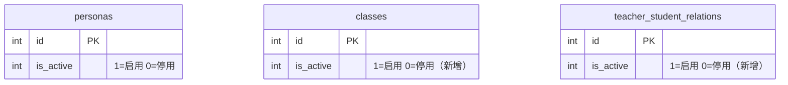
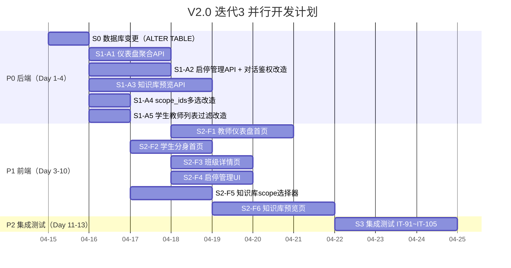
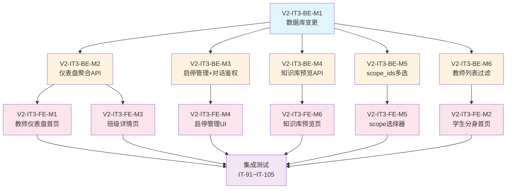

# V2.0 迭代3 需求规格说明书

## 1. 迭代概述

| 项目 | 说明 |
|------|------|
| **迭代名称** | V2.0 Sprint 3 - UI 重构与体验优化 |
| **迭代目标** | 重新设计教师/学生首页为仪表盘式布局，完善班级管理、知识库上传体验、启停管理等核心交互 |
| **迭代周期** | ~3 周 |
| **交付标准** | 所有新功能通过集成测试 + 端到端冒烟验证 |
| **前置依赖** | V2.0 迭代2 全部完成（90 个集成测试通过） |

## 2. 迭代目标

### 2.1 核心目标
> **重构前端 UI 为仪表盘式设计 + 完善教师管理能力 + 优化知识库上传体验**

具体来说：
1. ✅ 教师分身首页重设计：仪表盘式布局，包含待审批提醒、班级概览、分享码入口、知识库入口
2. ✅ 学生分身首页重设计：展示"我的老师"列表（仅已授权的教师分身）、分享码加入入口
3. ✅ 班级详情页：教师可查看班级下每个学生的管理操作（对话记录、评语、风格设置）
4. ✅ 知识库 scope 选择器重设计：默认全部班级生效，支持多班级选择，支持指定学生
5. ✅ 知识库上传预览页：上传后展示切片结果预览，默认选择 Web URL 导入
6. ✅ 启停管理：教师可关闭/开启某个分身、班级或学生，关闭时二次确认
7. ✅ 分享码入口优化：教师首页直接展示分享码，方便复制和分享

### 2.2 不在本迭代范围
- ❌ Docker 容器化部署（删除，后续再补）
- ❌ HTTPS / Nginx 配置（删除，后续再补）
- ❌ 安全加固 / API 限流（删除，后续再补）
- ❌ 记忆衰减机制（删除，后续再补）
- ❌ 数据分析看板（删除，后续再补）
- ❌ 小程序审核发布（删除，后续再补）
- ❌ 多账号关联学生身份（移至 V3.0 BL-007）
- ❌ 分身市场（移至 V3.0 BL-008）

### 2.3 与迭代2的关系
本迭代是对迭代2的**UI/UX 重构**，核心变化是将扁平的页面结构升级为仪表盘式设计，并完善教师的管理能力。后端改动较小，主要是新增几个聚合查询 API 和启停管理 API。

---

## 3. 问题分析与解决方案

### 3.1 用户反馈的核心问题

| # | 问题 | 当前状态 | 根因 |
|---|------|---------|------|
| 1 | 登录后看不到自己的分身（包括教师分身和申请到的其他老师分身） | 学生首页只展示教师列表，没有"我的分身"概念 | 首页设计以"教师列表"为中心，而非以"我的分身"为中心 |
| 2 | 学生提交申请后，教师分身没有"同意"的入口 | 师生管理页有审批功能，但入口不明显 | 教师首页缺少"待审批"提醒和快捷入口 |
| 3 | 教师的每个分身，需要对每个班级的每个学生都有管理页面 | 当前师生管理页是扁平的学生列表，没有按"分身→班级→学生"层级组织 | 缺少班级详情页 |
| 4 | 上传知识库时需要选择生效范围（分身、班级、人） | 后端已支持 scope，但前端选择器不够直观 | 前端 scope 选择 UI 需要重新设计 |
| 5 | 老师没有发起邀请/分享的明显入口 | 分享码功能在师生管理页的子 Tab 中，不够醒目 | 教师首页缺少分享码快捷入口 |
| 6 | 学生只能看到已授权的老师分身 | 当前学生首页展示所有教师列表 | 需要过滤为仅展示已授权的教师分身 |
| 7 | 缺少知识库上传预览和切片结果展示 | 上传后直接入库，无预览 | 需要新增预览页面 |

---

## 4. 数据库设计

### 4.1 表变更

#### 4.1.1 classes 表新增 is_active 字段

```sql
ALTER TABLE classes ADD COLUMN is_active INTEGER DEFAULT 1;  -- 1=启用 0=停用
```

#### 4.1.2 teacher_student_relations 表新增 is_active 字段

```sql
ALTER TABLE teacher_student_relations ADD COLUMN is_active INTEGER DEFAULT 1;  -- 1=启用 0=停用
```

> **说明**：
> - `personas` 表已有 `is_active` 字段，无需新增
> - `classes.is_active` 用于教师关闭/开启某个班级
> - `teacher_student_relations.is_active` 用于教师关闭/开启某个学生的访问权限
> - 关闭后，学生无法与该教师分身对话，但历史数据保留

### 4.2 ER 关系图（启停管理相关）



---

## 5. 模块需求

### 5.1 模块 V2-IT3-M1：教师分身首页（仪表盘）

**目标**：将教师登录后的首页从知识库管理页改为仪表盘式设计。

#### 功能需求

| ID | 需求 | 优先级 |
|----|------|--------|
| TDH-01 | 教师首页展示当前分身信息（昵称、学校、描述） | P0 |
| TDH-02 | 展示待审批申请数量，点击跳转审批页 | P0 |
| TDH-03 | 展示"我的班级"列表（含学生人数），点击进入班级详情 | P0 |
| TDH-04 | 展示分享码，支持复制和刷新 | P0 |
| TDH-05 | 快捷入口：知识库管理、作业管理 | P0 |
| TDH-06 | 顶部支持切换分身 | P0 |
| TDH-07 | 支持创建新班级（快捷入口） | P1 |

#### 页面原型

```
┌─────────────────────────────────┐
│ 👨‍🏫 王老师 · 北京大学       [切换分身] │
│ 物理学教授                         │
├─────────────────────────────────┤
│ 📋 待审批申请 (3)              →  │
├─────────────────────────────────┤
│ 快捷操作                          │
│ ┌──────┐ ┌──────┐ ┌──────┐     │
│ │📚知识库│ │📝作业 │ │👥师生 │     │
│ └──────┘ └──────┘ └──────┘     │
├─────────────────────────────────┤
│ 我的班级                          │
│ ┌─────────────┐ ┌─────────────┐│
│ │ 高一(3)班    │ │ 高二(1)班    ││
│ │ 32人         │ │ 28人         ││
│ │ [进入管理]   │ │ [进入管理]   ││
│ └─────────────┘ └─────────────┘│
│ [+ 创建班级]                      │
├─────────────────────────────────┤
│ 分享码                            │
│ ABC12345  [复制] [生成新码]        │
│ 高一(3)班 · 已使用 12/50          │
└─────────────────────────────────┘
```

#### 新增后端接口

| 方法 | 路径 | 说明 |
|------|------|------|
| GET | `/api/personas/:id/dashboard` | 教师分身仪表盘聚合数据 |

**响应数据**：
```json
{
  "persona": { "id": 3, "nickname": "王老师", "school": "北京大学", "description": "物理学教授" },
  "pending_count": 3,
  "classes": [
    { "id": 1, "name": "高一(3)班", "member_count": 32, "is_active": true },
    { "id": 2, "name": "高二(1)班", "member_count": 28, "is_active": true }
  ],
  "latest_share": {
    "share_code": "ABC12345",
    "class_name": "高一(3)班",
    "used_count": 12,
    "max_uses": 50,
    "is_active": true
  },
  "stats": {
    "total_students": 60,
    "total_documents": 15,
    "total_classes": 2
  }
}
```

#### 涉及文件

| 文件 | 改动 |
|------|------|
| `api/handlers_persona.go` | 新增 HandleGetPersonaDashboard |
| `api/router.go` | 新增 GET /api/personas/:id/dashboard |
| `database/repository_persona.go` | 新增 GetPersonaDashboard 聚合查询 |
| `frontend/src/pages/home/index.tsx` | 重构为教师仪表盘 |

---

### 5.2 模块 V2-IT3-M2：学生分身首页

**目标**：学生登录后的首页展示"我的老师"列表（仅已授权的教师分身）。

#### 功能需求

| ID | 需求 | 优先级 |
|----|------|--------|
| SDH-01 | 学生首页展示当前分身信息 | P0 |
| SDH-02 | 展示"我的老师"列表（仅已授权 + is_active 的教师分身） | P0 |
| SDH-03 | 每个老师卡片显示：昵称、学校、描述、[开始对话] 按钮 | P0 |
| SDH-04 | 分享码加入入口：输入分享码加入新老师 | P0 |
| SDH-05 | 顶部支持切换分身 | P0 |
| SDH-06 | 快捷入口：我的作业、我的评语 | P1 |

#### 页面原型

```
┌─────────────────────────────────┐
│ 👨‍🎓 小明                   [切换分身] │
├─────────────────────────────────┤
│ 我的老师                           │
│ ┌───────────────────────────┐   │
│ │ 👨‍🏫 王老师 · 北京大学        │   │
│ │ 物理学教授                   │   │
│ │ [开始对话]                   │   │
│ └───────────────────────────┘   │
│ ┌───────────────────────────┐   │
│ │ 👨‍🏫 李老师 · 清华大学        │   │
│ │ 高中数学                     │   │
│ │ [开始对话]                   │   │
│ └───────────────────────────┘   │
├─────────────────────────────────┤
│ 🔗 输入分享码加入新老师        →  │
├─────────────────────────────────┤
│ 快捷操作                          │
│ ┌──────┐ ┌──────┐              │
│ │📝我的作业│ │💬我的评语│              │
│ └──────┘ └──────┘              │
└─────────────────────────────────┘
```

#### 改造后端接口

**`GET /api/teachers` 改造**：

学生视角下，仅返回与当前学生分身有 **approved + is_active** 关系的教师分身列表。

当前行为：返回所有教师分身列表。
改造后行为：
- 教师角色调用：返回所有教师分身列表（不变）
- 学生角色调用：仅返回与当前学生分身有 approved + is_active 关系的教师分身

#### 涉及文件

| 文件 | 改动 |
|------|------|
| `api/handlers.go` | 改造 HandleGetTeachers，学生视角过滤 |
| `database/repository.go` | 改造 ListTeachers，支持按学生分身过滤 |
| `frontend/src/pages/home/index.tsx` | 重构为学生首页 |

---

### 5.3 模块 V2-IT3-M3：班级详情页

**目标**：教师点击班级后，进入班级详情页，查看班级下每个学生的管理操作。

#### 功能需求

| ID | 需求 | 优先级 |
|----|------|--------|
| CLD-01 | 展示班级基本信息（名称、描述、人数） | P0 |
| CLD-02 | 展示班级学生列表 | P0 |
| CLD-03 | 每个学生卡片显示：昵称、加入时间、快捷操作 | P0 |
| CLD-04 | 学生快捷操作：查看对话记录、写评语、设置风格 | P0 |
| CLD-05 | 支持从班级移除学生 | P1 |
| CLD-06 | 支持关闭/开启学生（二次确认） | P0 |
| CLD-07 | 班级设置入口（编辑班级信息、关闭班级） | P1 |

#### 页面原型

```
┌─────────────────────────────────┐
│ ← 高一(3)班                [设置] │
│ 2026级高一3班 · 32人              │
├─────────────────────────────────┤
│ 学生列表                          │
│ ┌───────────────────────────┐   │
│ │ 👨‍🎓 张三                      │   │
│ │ 加入时间: 2026-04-01          │   │
│ │ [对话记录] [写评语] [设置风格]  │   │
│ │ [关闭学生 ⚠️]                 │   │
│ └───────────────────────────┘   │
│ ┌───────────────────────────┐   │
│ │ 👨‍🎓 李四                      │   │
│ │ 加入时间: 2026-04-02          │   │
│ │ [对话记录] [写评语] [设置风格]  │   │
│ │ [关闭学生 ⚠️]                 │   │
│ └───────────────────────────┘   │
│ ...                              │
└─────────────────────────────────┘
```

#### 新增前端页面

| 页面 | 路径 | 说明 |
|------|------|------|
| 班级详情页 | `pages/class-detail/index.tsx` | 🆕 新增 |

#### 涉及文件

| 文件 | 改动 |
|------|------|
| `frontend/src/pages/class-detail/index.tsx` | 🆕 新增班级详情页 |
| `frontend/src/app.config.ts` | 新增页面路由 |

---

### 5.4 模块 V2-IT3-M4：启停管理

**目标**：教师可以关闭/开启某个分身、班级或学生，关闭时需要二次确认。

#### 功能需求

| ID | 需求 | 优先级 |
|----|------|--------|
| TOG-01 | 教师可关闭/开启自己的分身（二次确认） | P0 |
| TOG-02 | 教师可关闭/开启某个班级（二次确认） | P0 |
| TOG-03 | 教师可关闭/开启某个学生的访问权限（二次确认） | P0 |
| TOG-04 | 关闭分身后，该分身下所有学生无法发起新对话 | P0 |
| TOG-05 | 关闭班级后，该班级下所有学生无法发起新对话 | P0 |
| TOG-06 | 关闭学生后，该学生无法与该教师分身发起新对话 | P0 |
| TOG-07 | 关闭操作不删除历史数据（对话记录、评语等保留） | P0 |
| TOG-08 | 二次确认弹窗需明确告知影响范围 | P0 |

#### 二次确认弹窗文案

**关闭分身**：
```
确认关闭分身"王老师"？
关闭后，该分身下所有学生将无法发起新对话。
已有的对话记录和数据不会被删除。
[取消] [确认关闭]
```

**关闭班级**：
```
确认关闭班级"高一(3)班"？
关闭后，该班级下 32 名学生将无法发起新对话。
已有的对话记录和数据不会被删除。
[取消] [确认关闭]
```

**关闭学生**：
```
确认关闭学生"张三"的访问权限？
关闭后，该学生将无法与你发起新对话。
已有的对话记录和数据不会被删除。
[取消] [确认关闭]
```

#### 新增后端接口

| 方法 | 路径 | 说明 |
|------|------|------|
| PUT | `/api/classes/:id/toggle` | 启用/停用班级 |
| PUT | `/api/relations/:id/toggle` | 启用/停用学生访问权限 |

> **说明**：分身的启用/停用已有接口（`PUT /api/personas/:id/activate` 和 `PUT /api/personas/:id/deactivate`），无需新增。

**`PUT /api/classes/:id/toggle` 请求体**：
```json
{
  "is_active": false
}
```

**`PUT /api/relations/:id/toggle` 请求体**：
```json
{
  "is_active": false
}
```

#### 对话鉴权改造

当前对话鉴权逻辑：
```
学生发起对话 → 检查 teacher_student_relations.status == 'approved'
```

改造后：
```
学生发起对话 → 检查以下全部条件：
  1. teacher_student_relations.status == 'approved'
  2. teacher_student_relations.is_active == 1（学生未被关闭）
  3. 教师分身 personas.is_active == 1（分身未被关闭）
  4. 学生所在班级 classes.is_active == 1（班级未被关闭）
     （如果学生不在任何班级，则跳过此检查）
  → 任一条件不满足 → 返回 403 + 具体原因
```

#### 新增错误码

| 错误码 | 说明 | HTTP Status |
|--------|------|-------------|
| 40025 | 教师分身已停用 | 403 |
| 40026 | 班级已停用 | 403 |
| 40027 | 学生访问权限已关闭 | 403 |

#### 涉及文件

| 文件 | 改动 |
|------|------|
| `database/database.go` | ALTER TABLE classes/teacher_student_relations 新增 is_active |
| `api/handlers_class.go` | 新增 HandleToggleClass |
| `api/handlers.go` | 新增 HandleToggleRelation + 改造对话鉴权 |
| `api/router.go` | 新增路由 |
| `database/repository_class.go` | 新增 ToggleClass |
| `database/repository.go` | 新增 ToggleRelation + 改造 IsApproved 查询 |

---

### 5.5 模块 V2-IT3-M5：知识库 scope 选择器重设计

**目标**：重新设计知识库上传时的 scope 选择器，默认全部班级生效，支持多班级选择。

#### 功能需求

| ID | 需求 | 优先级 |
|----|------|--------|
| KSC-01 | scope 选择器默认选中"全部学生"（global） | P0 |
| KSC-02 | 支持选择"指定班级"，可多选班级 | P0 |
| KSC-03 | 支持选择"指定学生"，可搜索和多选学生 | P1 |
| KSC-04 | 班级列表从当前教师分身的班级中获取 | P0 |
| KSC-05 | 学生列表从当前教师分身的学生中获取 | P1 |

#### 页面原型

```
┌─────────────────────────────────┐
│ 生效范围                          │
│                                  │
│ ● 全部学生（当前分身下所有人可见）   │
│ ○ 指定班级                        │
│   ☑ 高一(3)班                    │
│   ☐ 高二(1)班                    │
│ ○ 指定学生                        │
│   [搜索学生...]                   │
│   ☑ 张三                         │
│   ☑ 李四                         │
└─────────────────────────────────┘
```

#### 后端改造

**`POST /api/documents` 改造**：

当前 scope 只支持单个 class_id 或单个 student_persona_id。改造为支持多选：

```json
{
  "title": "牛顿运动定律",
  "content": "...",
  "scope": "class",
  "scope_ids": [1, 2]
}
```

| 字段 | 类型 | 必填 | 默认值 | 说明 |
|------|------|------|--------|------|
| scope | string | ❌ | global | 作用域：global / class / student |
| scope_ids | int[] | scope≠global 时 ✅ | [] | 班级 ID 列表或学生分身 ID 列表 |
| scope_id | int | ❌ | 0 | **向后兼容**：单个 scope_id，优先使用 scope_ids |

**实现方式**：当 scope_ids 包含多个 ID 时，为每个 ID 创建一条 document 记录（相同内容，不同 scope_id）。这样对话时的检索逻辑不需要改动。

> **向后兼容**：如果请求中只有 `scope_id`（旧格式），自动转换为 `scope_ids: [scope_id]`。

同样改造 `POST /api/documents/upload` 和 `POST /api/documents/import-url`。

#### 涉及文件

| 文件 | 改动 |
|------|------|
| `api/handlers_knowledge.go` | 改造 HandleAddDocument/HandleUploadDocument/HandleImportURL 支持 scope_ids |
| `frontend/src/pages/knowledge/add.tsx` | 重构 scope 选择器 UI |

---

### 5.6 模块 V2-IT3-M6：知识库上传预览页

**目标**：知识库上传后展示切片结果预览，让教师确认后再入库。默认选择 Web URL 导入。

#### 功能需求

| ID | 需求 | 优先级 |
|----|------|--------|
| KPV-01 | 添加文档页默认选中"URL 导入"Tab | P0 |
| KPV-02 | 上传/导入后跳转预览页，展示切片结果 | P0 |
| KPV-03 | 预览页展示：文档标题、总字数、切片数量、每个切片的内容摘要 | P0 |
| KPV-04 | 预览页支持"确认入库"和"取消" | P0 |
| KPV-05 | 确认入库后才真正存储到知识库 | P0 |
| KPV-06 | 预览页支持编辑文档标题和标签 | P1 |

#### 页面原型

**添加文档页（改造）**：
```
┌─────────────────────────────────┐
│ 添加文档                          │
│                                  │
│ [URL导入] [文本录入] [文件上传]     │  ← 默认选中 URL 导入
│                                  │
│ 生效范围:                         │
│ ● 全部学生  ○ 指定班级  ○ 指定学生  │
│                                  │
│ ── URL 导入 ──                    │
│ URL: [https://example.com/...]   │
│                                  │
│ [预览]                            │  ← 点击后跳转预览页
└─────────────────────────────────┘
```

**预览页（新增）**：
```
┌─────────────────────────────────┐
│ ← 文档预览                       │
├─────────────────────────────────┤
│ 标题: [牛顿运动定律]  [编辑]      │
│ 标签: [物理] [力学]   [编辑]      │
│ 总字数: 3,500                    │
│ 切片数: 4                        │
│ 生效范围: 全部学生                 │
├─────────────────────────────────┤
│ 切片预览                          │
│ ┌───────────────────────────┐   │
│ │ 切片 1 (850字)              │   │
│ │ 牛顿第一定律，也称为惯性定律...│   │
│ └───────────────────────────┘   │
│ ┌───────────────────────────┐   │
│ │ 切片 2 (920字)              │   │
│ │ 牛顿第二定律描述了力与加速度...│   │
│ └───────────────────────────┘   │
│ ┌───────────────────────────┐   │
│ │ 切片 3 (880字)              │   │
│ │ 牛顿第三定律指出，对于每一个...│   │
│ └───────────────────────────┘   │
│ ┌───────────────────────────┐   │
│ │ 切片 4 (850字)              │   │
│ │ 牛顿运动定律的应用范围非常...  │   │
│ └───────────────────────────┘   │
├─────────────────────────────────┤
│ [取消]              [确认入库]    │
└─────────────────────────────────┘
```

#### 新增后端接口

| 方法 | 路径 | 说明 |
|------|------|------|
| POST | `/api/documents/preview` | 预览文档切片结果（不入库） |
| POST | `/api/documents/preview-upload` | 预览上传文件切片结果（不入库） |
| POST | `/api/documents/preview-url` | 预览 URL 导入切片结果（不入库） |
| POST | `/api/documents/confirm` | 确认入库（基于预览结果） |

**`POST /api/documents/preview` 请求体**：
```json
{
  "title": "牛顿运动定律",
  "content": "牛顿第一定律...",
  "tags": "物理,力学"
}
```

**`POST /api/documents/preview` 响应**：
```json
{
  "code": 0,
  "message": "success",
  "data": {
    "preview_id": "tmp_abc123",
    "title": "牛顿运动定律",
    "tags": "物理,力学",
    "total_chars": 3500,
    "chunks": [
      {
        "index": 0,
        "content": "牛顿第一定律，也称为惯性定律...",
        "char_count": 850
      },
      {
        "index": 1,
        "content": "牛顿第二定律描述了力与加速度...",
        "char_count": 920
      }
    ],
    "chunk_count": 4
  }
}
```

**`POST /api/documents/confirm` 请求体**：
```json
{
  "preview_id": "tmp_abc123",
  "title": "牛顿运动定律",
  "tags": "物理,力学",
  "scope": "global",
  "scope_ids": []
}
```

> **实现方式**：
> 1. preview 接口将原始内容和切片结果缓存到内存（或临时文件），返回 preview_id
> 2. confirm 接口根据 preview_id 取出缓存的内容，执行真正的入库操作
> 3. preview_id 有效期 30 分钟，过期自动清理

#### 新增前端页面

| 页面 | 路径 | 说明 |
|------|------|------|
| 文档预览页 | `pages/knowledge/preview.tsx` | 🆕 新增 |

#### 涉及文件

| 文件 | 改动 |
|------|------|
| `api/handlers_knowledge.go` | 新增 HandlePreviewDocument/HandlePreviewUpload/HandlePreviewURL/HandleConfirmDocument |
| `api/router.go` | 新增预览和确认路由 |
| `plugins/knowledge/knowledge_plugin.go` | 新增 preview action（只切片不入库） |
| `frontend/src/pages/knowledge/add.tsx` | 改造：默认 URL Tab + 预览按钮 |
| `frontend/src/pages/knowledge/preview.tsx` | 🆕 新增预览页 |
| `frontend/src/app.config.ts` | 新增页面路由 |

---

### 5.7 模块 V2-IT3-M7：集成测试

**目标**：所有新功能和改造功能通过集成测试。

#### 测试用例规划

| 用例编号 | 测试场景 | 涉及模块 |
|----------|----------|----------|
| IT-91 | 教师分身仪表盘聚合数据 | M1 |
| IT-92 | 学生首页仅展示已授权教师分身 | M2 |
| IT-93 | 班级详情页获取成员列表 | M3 |
| IT-94 | 关闭分身 → 学生无法对话 | M4 |
| IT-95 | 关闭班级 → 班级下学生无法对话 | M4 |
| IT-96 | 关闭学生 → 该学生无法对话 | M4 |
| IT-97 | 重新开启分身/班级/学生 → 恢复对话 | M4 |
| IT-98 | 添加文档 scope_ids 多班级 | M5 |
| IT-99 | 文档预览（文本） | M6 |
| IT-100 | 文档预览（URL 导入） | M6 |
| IT-101 | 文档预览（文件上传） | M6 |
| IT-102 | 文档确认入库 | M6 |
| IT-103 | 预览 ID 过期 → 确认失败 | M6 |
| IT-104 | 全链路：教师创建分身→创建班级→生成分享码→学生加入→教师上传知识库（预览+确认）→学生对话→教师关闭学生→学生无法对话→教师重新开启→学生恢复对话 | 全部 |
| IT-105 | 向后兼容：scope_id 单值仍可用 | M5 |

---

## 6. 前端页面需求

### 6.1 改造页面

#### 6.1.1 首页（FE-P3）重构

**改造内容**：根据当前分身角色展示不同的仪表盘

- **教师分身**：展示教师仪表盘（见 5.1 模块）
- **学生分身**：展示学生首页（见 5.2 模块）

#### 6.1.2 添加文档页（FE-P8）改造

**改造内容**：
1. 默认选中"URL 导入"Tab
2. scope 选择器重设计（支持多班级选择）
3. 提交按钮改为"预览"，跳转预览页

#### 6.1.3 师生管理页（FE-P10）改造

**改造内容**：
1. 学生列表中增加"关闭/开启"操作按钮
2. 关闭操作增加二次确认弹窗

### 6.2 新增页面

| 页面 | 路径 | 说明 |
|------|------|------|
| 班级详情页 | `pages/class-detail/index.tsx` | 🆕 班级下学生管理 |
| 文档预览页 | `pages/knowledge/preview.tsx` | 🆕 切片结果预览 |

### 6.3 前端模块划分

| 模块编号 | 模块名称 | 优先级 | 涉及页面 |
|----------|----------|--------|----------|
| V2-IT3-FE-M1 | 教师仪表盘首页 | P0 | home/index.tsx |
| V2-IT3-FE-M2 | 学生分身首页 | P0 | home/index.tsx |
| V2-IT3-FE-M3 | 班级详情页 | P0 | class-detail/index.tsx（新增） |
| V2-IT3-FE-M4 | 启停管理 UI（二次确认弹窗） | P0 | teacher-students/index.tsx + class-detail/index.tsx |
| V2-IT3-FE-M5 | 知识库 scope 选择器重设计 | P0 | knowledge/add.tsx |
| V2-IT3-FE-M6 | 知识库上传预览页 | P0 | knowledge/preview.tsx（新增）+ knowledge/add.tsx |

### 6.4 前端新增/改造 API 模块

| 文件 | 说明 |
|------|------|
| `src/api/persona.ts` | 🔧 新增 getPersonaDashboard |
| `src/api/document.ts` | 🔧 新增 previewDocument/previewUpload/previewURL/confirmDocument + scope_ids 支持 |
| `src/api/class.ts` | 🔧 新增 toggleClass |
| `src/api/relation.ts` | 🔧 新增 toggleRelation |

---

## 7. 并行开发计划

### 7.1 总体原则

> **核心思路**：后端改动较小（主要是聚合查询 API + 启停管理 + 预览接口），前端改动较大（首页重构 + 新增页面）。后端先行，前端跟进。



### 7.2 后端模块划分

| 模块编号 | 模块名称 | 优先级 | 预估工时 |
|----------|----------|--------|----------|
| **V2-IT3-BE-M1** | 数据库变更（ALTER TABLE） | P0 | 0.5d |
| **V2-IT3-BE-M2** | 教师仪表盘聚合 API | P0 | 2d |
| **V2-IT3-BE-M3** | 启停管理 API + 对话鉴权改造 | P0 | 2d |
| **V2-IT3-BE-M4** | 知识库预览 API | P0 | 3d |
| **V2-IT3-BE-M5** | scope_ids 多选改造 | P0 | 1d |
| **V2-IT3-BE-M6** | 学生教师列表过滤改造 | P0 | 1d |

**开发顺序**：
```
第1层: V2-IT3-BE-M1 数据库变更
      ↓
第2层（并行）: V2-IT3-BE-M2 仪表盘 + V2-IT3-BE-M3 启停管理 + V2-IT3-BE-M4 预览 + V2-IT3-BE-M5 scope + V2-IT3-BE-M6 过滤
```

### 7.3 并行依赖关系图



---

## 8. 新增错误码

| 错误码 | 说明 | HTTP Status | 模块 |
|--------|------|-------------|------|
| 40025 | 教师分身已停用，无法发起对话 | 403 | M4 |
| 40026 | 班级已停用，无法发起对话 | 403 | M4 |
| 40027 | 学生访问权限已关闭，无法发起对话 | 403 | M4 |
| 40028 | 预览 ID 无效或已过期 | 400 | M6 |

---

## 9. 目录结构变更（迭代3 产出）

```
digital-twin/
├── src/
│   └── backend/
│       ├── api/
│       │   ├── router.go                # 🔧 新增路由
│       │   ├── handlers.go              # 🔧 改造对话鉴权 + 新增 HandleToggleRelation
│       │   ├── handlers_persona.go      # 🔧 新增 HandleGetPersonaDashboard
│       │   ├── handlers_class.go        # 🔧 新增 HandleToggleClass
│       │   └── handlers_knowledge.go    # 🔧 新增预览/确认 Handler + scope_ids 改造
│       └── database/
│           ├── database.go              # 🔧 ALTER TABLE 新增 is_active
│           ├── repository.go            # 🔧 改造 IsApproved + 新增 ToggleRelation
│           ├── repository_persona.go    # 🔧 新增 GetPersonaDashboard
│           └── repository_class.go      # 🔧 新增 ToggleClass
├── src/frontend/src/
│   ├── api/
│   │   ├── persona.ts                   # 🔧 新增 getPersonaDashboard
│   │   ├── document.ts                  # 🔧 新增预览/确认 API + scope_ids
│   │   ├── class.ts                     # 🔧 新增 toggleClass
│   │   └── relation.ts                  # 🔧 新增 toggleRelation
│   └── pages/
│       ├── home/index.tsx               # 🔧 重构为仪表盘（教师/学生双模式）
│       ├── knowledge/add.tsx            # 🔧 默认URL + scope多选 + 预览按钮
│       ├── knowledge/preview.tsx        # 🆕 文档预览页
│       ├── class-detail/index.tsx       # 🆕 班级详情页
│       └── teacher-students/index.tsx   # 🔧 增加启停操作
└── tests/
    └── integration/
        └── v2_iteration3_test.go        # 🆕 迭代3 集成测试
```

**统计**：🆕 新建 ~4 个文件，🔧 修改 ~15 个文件

---

## 10. 冒烟测试用例（迭代3）

| 编号 | 场景 | 操作步骤 | 预期结果 |
|------|------|----------|----------|
| SM-13 | 教师登录看到仪表盘 | 1. 教师登录<br>2. 进入首页 | 看到仪表盘：待审批数、班级列表、分享码、快捷入口 |
| SM-14 | 学生登录看到我的老师 | 1. 学生登录<br>2. 进入首页 | 只看到已授权的教师分身，可点击开始对话 |
| SM-15 | 教师进入班级详情 | 1. 教师点击班级<br>2. 查看学生列表 | 看到班级下所有学生，每个学生有管理操作 |
| SM-16 | 教师关闭学生 | 1. 教师在班级详情中关闭学生<br>2. 弹出二次确认<br>3. 确认关闭 | 学生无法发起新对话 |
| SM-17 | 教师上传知识库（预览） | 1. 教师输入 URL<br>2. 点击预览<br>3. 查看切片结果<br>4. 确认入库 | 预览页展示切片结果，确认后文档入库 |
| SM-18 | 知识库多班级生效 | 1. 教师添加文档<br>2. 选择指定班级（多选）<br>3. 确认入库 | 文档对选中的多个班级生效 |
| SM-19 | 教师通过分享码邀请学生 | 1. 教师在首页复制分享码<br>2. 学生输入分享码加入 | 学生自动加入，教师首页学生数更新 |

---

## 11. 验收标准

### 11.1 功能验收

| 编号 | 验收项 | 验证方式 |
|------|--------|----------|
| AC-14 | 教师登录后看到仪表盘（待审批数、班级列表、分享码） | 冒烟测试 |
| AC-15 | 学生登录后只看到已授权的教师分身 | 集成测试 + 冒烟测试 |
| AC-16 | 教师可进入班级详情，管理每个学生 | 冒烟测试 |
| AC-17 | 教师可关闭/开启分身、班级、学生（二次确认） | 集成测试 + 冒烟测试 |
| AC-18 | 关闭后学生无法对话，开启后恢复 | 集成测试 |
| AC-19 | 知识库上传支持多班级 scope 选择 | 集成测试 |
| AC-20 | 知识库上传有预览页，展示切片结果 | 冒烟测试 |
| AC-21 | 添加文档页默认选中 URL 导入 | 冒烟测试 |
| AC-22 | 分享码在教师首页直接可见可复制 | 冒烟测试 |

### 11.2 质量验收

| 编号 | 验收项 | 标准 |
|------|--------|------|
| QA-06 | 代码编译通过 | `go build` 无错误 |
| QA-07 | 单元测试通过 | `go test ./...` 全部 PASS |
| QA-08 | 集成测试通过 | IT-91 ~ IT-105 全部 PASS |
| QA-09 | 迭代1+2 集成测试回归 | IT-01 ~ IT-90 全部 PASS |
| QA-10 | 前端编译通过 | `npm run build:weapp` 无错误 |
| QA-11 | 冒烟测试通过 | SM-13 ~ SM-19 全部 PASS |

---

## 12. 风险与应对

| 风险 | 影响 | 应对方案 |
|------|------|----------|
| 首页重构范围大 | 前端开发周期超预期 | 教师仪表盘和学生首页可并行开发 |
| 预览缓存内存占用 | 大文件预览占用过多内存 | 预览缓存设置 30 分钟过期 + 最大 100 条限制 |
| scope_ids 多选改造影响现有文档 | 旧文档 scope_id 不兼容 | 向后兼容：scope_id 单值仍可用 |
| 启停管理影响对话鉴权性能 | 每次对话需多次查询 | 使用 JOIN 查询一次获取所有状态 |
| 二次确认弹窗体验 | 小程序 Modal 样式受限 | 使用自定义弹窗组件 |

---

**文档版本**: v1.0.0
**创建日期**: 2026-03-30
**最后更新**: 2026-03-30
