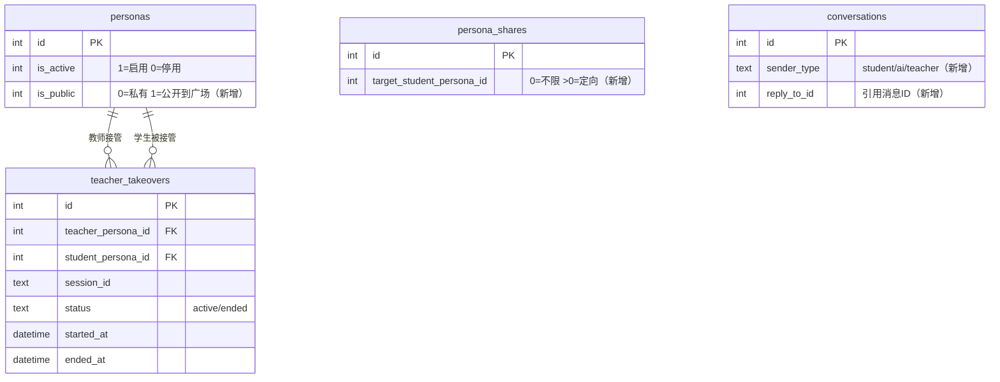
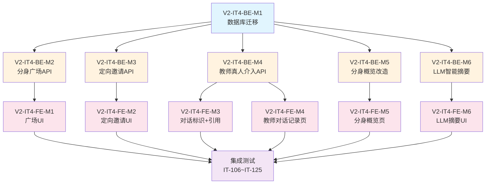

# V2.0 迭代4 需求规格说明书

## 1. 迭代概述

| 项目 | 说明 |
|------|------|
| **迭代名称** | V2.0 Sprint 4 - 分身广场 + 教师真人介入 + 智能摘要 |
| **迭代目标** | 开放分身广场让学生主动发现教师、教师可真人介入对话、知识库上传自动生成摘要 |
| **迭代周期** | ~3 周 |
| **交付标准** | 所有新功能通过集成测试 + 端到端冒烟验证 |
| **前置依赖** | V2.0 迭代3 全部完成（112 个集成测试通过） |

## 2. 迭代目标

### 2.1 核心目标

> **分身广场 + 定向邀请 + 教师真人介入对话 + 分身概览 + 知识库智能摘要**

具体来说：
1. **老师分身广场**：学生首页下方新增"老师分身广场"，展示所有公开的教师分身，学生可申请；教师可设置分身是否公开到广场
2. **定向邀请链接**：教师生成的分享码绑定特定学生分身 ID，仅该学生可使用；同时支持教师搜索已注册学生定向邀请
3. **教师真人介入对话**：教师可查看每个学生的聊天记录，以引用回复模式真人回复；真人接管后分身 AI 自动停止，真人退出后分身恢复服务；聊天页面明显标识真人回复与 AI 回复
4. **分身概览页**：教师登录后首先看到所有分身的概览列表，可创建新分身，点击某个分身进入该分身的仪表盘
5. **知识库 LLM 智能摘要**：上传知识库后立即通过 LLM 自动提取 title 和摘要，展示 loading 状态，允许教师修改

### 2.2 不在本迭代范围
- ❌ Docker 容器化部署
- ❌ HTTPS / Nginx 配置
- ❌ 安全加固 / API 限流
- ❌ 记忆衰减机制
- ❌ 数据分析看板
- ❌ 多账号关联学生身份（V3.0 BL-007）

### 2.3 与迭代3的关系
本迭代在迭代3的基础上，新增了**分身广场**（BL-008 简化版落地）、**教师真人介入对话**（全新能力）、**定向邀请**（分享码增强）和**知识库智能摘要**（LLM 辅助）。后端改动较大（新增对话接管机制、LLM 摘要服务），前端改动中等（广场 UI、对话页标识、概览页）。

---

## 3. 问题分析与解决方案

### 3.1 用户反馈的核心问题

| # | 问题 | 当前状态 | 根因 |
|---|------|---------|------|
| 1 | 学生只能看到已授权的教师分身，无法发现新教师 | 学生首页仅展示已授权教师 | 缺少分身广场/市场功能 |
| 2 | 教师分享码对所有学生通用，无法定向邀请 | 分享码无学生绑定 | 分享码缺少目标学生字段 |
| 3 | 教师无法直接回复学生对话 | 教师只能查看对话记录，不能参与 | 缺少教师真人介入机制 |
| 4 | 学生无法区分 AI 回复和教师真人回复 | 对话记录无 sender_type 区分 | 数据模型缺少发送者类型字段 |
| 5 | 教师登录后直接进入单个分身仪表盘，看不到全部分身 | 登录后选择分身进入 | 缺少分身概览页 |
| 6 | 知识库上传后 title 和摘要需要手动填写 | 预览页需手动输入 | 缺少 LLM 自动摘要能力 |

---

## 4. 数据库设计

### 4.1 表变更

#### 4.1.1 personas 表新增 is_public 字段

```sql
ALTER TABLE personas ADD COLUMN is_public INTEGER DEFAULT 0;  -- 0=私有 1=公开到广场
```

> **说明**：教师可设置分身是否公开到广场，默认不公开。

#### 4.1.2 persona_shares 表新增 target_student_persona_id 字段

```sql
ALTER TABLE persona_shares ADD COLUMN target_student_persona_id INTEGER DEFAULT 0;
-- 0 表示不限定学生（向后兼容），>0 表示仅该学生分身可使用
```

> **说明**：定向邀请时绑定特定学生分身 ID，非目标学生使用该分享码时被拒绝。

#### 4.1.3 conversations 表新增 sender_type 字段

```sql
ALTER TABLE conversations ADD COLUMN sender_type TEXT DEFAULT '';
-- 可选值: 'student'（学生发送）/ 'ai'（AI 分身回复）/ 'teacher'（教师真人回复）
-- 空字符串表示旧数据（向后兼容）
```

> **说明**：用于区分对话消息的发送者类型，前端据此展示不同的标识样式。

#### 4.1.4 新增 teacher_takeover 表

```sql
CREATE TABLE IF NOT EXISTS teacher_takeovers (
    id                  INTEGER PRIMARY KEY AUTOINCREMENT,
    teacher_persona_id  INTEGER NOT NULL,
    student_persona_id  INTEGER NOT NULL,
    session_id          TEXT NOT NULL,           -- 接管的会话 ID
    status              TEXT NOT NULL DEFAULT 'active',  -- active / ended
    started_at          DATETIME DEFAULT CURRENT_TIMESTAMP,
    ended_at            DATETIME,
    FOREIGN KEY (teacher_persona_id) REFERENCES personas(id),
    FOREIGN KEY (student_persona_id) REFERENCES personas(id)
);
CREATE INDEX IF NOT EXISTS idx_takeover_session ON teacher_takeovers(session_id, status);
```

> **说明**：记录教师真人接管对话的状态。当 status='active' 时，该会话的 AI 分身自动停止回复。

#### 4.1.5 conversations 表新增 reply_to_id 字段

```sql
ALTER TABLE conversations ADD COLUMN reply_to_id INTEGER DEFAULT 0;
-- 0 表示非引用回复，>0 表示引用的消息 ID
```

> **说明**：教师真人回复时可引用某条消息，前端展示引用关系。

### 4.2 ER 关系图（迭代4 新增/变更）



---

## 5. 模块需求

### 5.1 模块 V2-IT4-M1：老师分身广场

**目标**：学生首页下方新增"老师分身广场"，展示所有公开的教师分身，学生可发起申请。

#### 功能需求

| ID | 需求 | 优先级 |
|----|------|--------|
| MKT-01 | 教师可在分身设置中开启/关闭"公开到广场" | P0 |
| MKT-02 | 学生首页下方展示"老师分身广场"区域 | P0 |
| MKT-03 | 广场展示所有 is_public=1 且 is_active=1 的教师分身 | P0 |
| MKT-04 | 广场中已授权的教师分身不重复展示（已在"我的老师"中） | P0 |
| MKT-05 | 学生可点击广场中的教师分身发起申请 | P0 |
| MKT-06 | 申请后教师端收到待审批消息（复用现有审批机制） | P0 |
| MKT-07 | 广场支持按学校/昵称搜索 | P1 |
| MKT-08 | 广场分页加载 | P1 |

#### 页面原型（学生首页改造）

```
┌─────────────────────────────────┐
│ 👨‍🎓 小明                   [切换分身] │
├─────────────────────────────────┤
│ 我的老师                           │
│ ┌───────────────────────────┐   │
│ │ 👨‍🏫 王老师 · 北京大学        │   │
│ │ 物理学教授                   │   │
│ │ [开始对话]                   │   │
│ └───────────────────────────┘   │
├─────────────────────────────────┤
│ 🔗 输入分享码加入新老师        →  │
├─────────────────────────────────┤
│ 🌐 老师分身广场                    │
│ [搜索老师...]                     │
│ ┌───────────────────────────┐   │
│ │ 👨‍🏫 李老师 · 清华大学        │   │
│ │ 高中数学                     │   │
│ │ [申请使用]                   │   │
│ └───────────────────────────┘   │
│ ┌───────────────────────────┐   │
│ │ 👩‍🏫 张老师 · 复旦大学        │   │
│ │ 英语教学                     │   │
│ │ [申请中...]                  │   │
│ └───────────────────────────┘   │
│ [加载更多...]                     │
└─────────────────────────────────┘
```

#### 新增后端接口

| 方法 | 路径 | 说明 |
|------|------|------|
| GET | `/api/personas/marketplace` | 获取分身广场列表（公开的教师分身） |
| PUT | `/api/personas/:id/visibility` | 设置分身公开/私有 |

#### 涉及文件

| 文件 | 改动 |
|------|------|
| `database/database.go` | ALTER TABLE personas 新增 is_public |
| `database/repository_persona.go` | 新增 ListPublicPersonas、UpdatePersonaVisibility |
| `api/handlers_persona.go` | 新增 HandleGetMarketplace、HandleSetVisibility |
| `api/router.go` | 新增路由 |
| `frontend/src/pages/home/index.tsx` | 学生首页新增广场区域 |
| `frontend/src/api/persona.ts` | 新增 getMarketplace、setVisibility |

---

### 5.2 模块 V2-IT4-M2：定向邀请链接

**目标**：教师生成的分享码可绑定特定学生，仅该学生可使用；同时支持教师搜索已注册学生定向邀请。

#### 功能需求

| ID | 需求 | 优先级 |
|----|------|--------|
| INV-01 | 教师生成分享码时可选择绑定特定学生分身 | P0 |
| INV-02 | 绑定后的分享码仅目标学生可使用，其他学生使用时被拒绝 | P0 |
| INV-03 | 不绑定学生的分享码保持原有行为（所有学生可用） | P0 |
| INV-04 | 教师可搜索系统中已注册的学生，选择后生成定向分享码 | P0 |
| INV-05 | 分享码信息页展示目标学生信息（如有绑定） | P1 |
| INV-06 | 向后兼容：旧分享码（target_student_persona_id=0）不受影响 | P0 |

#### 业务逻辑

**生成定向分享码**：
```
教师生成分享码:
  POST /api/shares {class_id, target_student_persona_id, ...}
  → target_student_persona_id > 0 时，分享码仅对该学生可用
  → target_student_persona_id = 0 时，分享码对所有学生可用（默认）
```

**使用分享码鉴权**：
```
学生使用分享码:
  POST /api/shares/:code/join
  → 检查 target_student_persona_id
  → 如果 > 0 且 != 当前学生分身 ID → 拒绝（40029 "该分享码仅对特定学生可用"）
  → 如果 = 0 或 = 当前学生分身 ID → 允许加入
```

**搜索学生**：
```
教师搜索学生:
  GET /api/students/search?keyword=xxx
  → 返回匹配的学生分身列表（按昵称模糊搜索）
  → 仅返回学生角色的分身
```

#### 新增/改造后端接口

| 方法 | 路径 | 说明 | 类型 |
|------|------|------|------|
| GET | `/api/students/search` | 搜索已注册学生 | 🆕 新增 |
| POST | `/api/shares` | 创建分享码（改造：新增 target_student_persona_id） | 🔧 改造 |
| POST | `/api/shares/:code/join` | 使用分享码（改造：增加目标学生校验） | 🔧 改造 |
| GET | `/api/shares/:code/info` | 分享码信息（改造：返回目标学生信息） | 🔧 改造 |

#### 涉及文件

| 文件 | 改动 |
|------|------|
| `database/database.go` | ALTER TABLE persona_shares 新增 target_student_persona_id |
| `database/repository_share.go` | 改造 CreateShare、ValidateAndJoin |
| `database/repository_persona.go` | 新增 SearchStudentPersonas |
| `api/handlers_share.go` | 改造 HandleCreateShare、HandleJoinByShare、HandleGetShareInfo |
| `api/handlers_persona.go` | 新增 HandleSearchStudents |
| `api/router.go` | 新增搜索路由 |
| `frontend/src/pages/share-join/index.tsx` | 展示定向信息 |
| `frontend/src/api/share.ts` | 改造 createShare |
| `frontend/src/api/persona.ts` | 新增 searchStudents |

---

### 5.3 模块 V2-IT4-M3：教师真人介入对话

**目标**：教师可查看学生聊天记录，以引用回复模式真人回复；真人接管后 AI 分身自动停止，真人退出后分身恢复服务。

#### 功能需求

| ID | 需求 | 优先级 |
|----|------|--------|
| TKO-01 | 教师可在班级详情页查看某个学生的对话记录 | P0 |
| TKO-02 | 教师可选择某条消息进行引用回复（真人回复） | P0 |
| TKO-03 | 教师发送真人回复后，自动进入"接管"状态 | P0 |
| TKO-04 | 接管状态下，学生发送消息不再触发 AI 回复 | P0 |
| TKO-05 | 接管状态下，教师可继续回复学生（无需每次引用） | P0 |
| TKO-06 | 教师可主动"退出接管"，AI 分身恢复服务 | P0 |
| TKO-07 | 学生端对话页面明显标识"老师真人回复"和"AI 分身回复" | P0 |
| TKO-08 | 学生端对话页面展示引用关系（引用了哪条消息） | P1 |
| TKO-09 | 教师端查看对话记录时，也能看到 sender_type 标识 | P0 |
| TKO-10 | 接管状态下，学生端显示"老师正在亲自回复" 提示 | P1 |

#### 业务逻辑

**教师真人回复流程**：
```
1. 教师进入学生对话记录页
2. 选择某条消息 → 点击"引用回复"
3. 输入回复内容 → 发送
4. 后端:
   a. 创建 teacher_takeovers 记录（status='active'）
   b. 保存对话记录（sender_type='teacher', reply_to_id=引用消息ID）
   c. 返回成功
5. 学生端实时收到教师真人回复（带"老师真人"标识）
```

**接管状态下学生发消息**：
```
1. 学生发送消息
2. 后端检查 teacher_takeovers 表:
   → 存在 status='active' 的接管记录
   → 保存学生消息（sender_type='student'）
   → 不调用 AI 生成回复
   → 返回提示："老师正在亲自回复中，请等待老师回复"
```

**教师退出接管**：
```
1. 教师点击"退出接管"按钮
2. 后端:
   a. 更新 teacher_takeovers.status = 'ended', ended_at = NOW()
   b. 返回成功
3. 之后学生发消息恢复 AI 回复
```

#### 对话页面标识设计

**学生端对话页面**：
```
┌─────────────────────────────────┐
│ ← 与王老师对话                    │
│ ⚡ 老师正在亲自回复中              │  ← 接管状态提示（仅接管时显示）
├─────────────────────────────────┤
│                                  │
│ 我: 牛顿第一定律是什么？          │
│                                  │
│ 🤖 AI分身:                       │  ← AI 回复标识
│ 这是一个很好的问题！让我们一起     │
│ 来思考...                        │
│                                  │
│ 我: 我还是不太理解惯性的概念       │
│                                  │
│ 👨‍🏫 王老师(真人):                 │  ← 教师真人回复标识
│ ┌─ 引用: "我还是不太理解惯性..."  │  ← 引用消息
│ │                                │
│ 同学你好！惯性其实就是物体保持     │
│ 原来运动状态的性质...             │
│                                  │
│ 我: 谢谢老师！我明白了            │
│                                  │
│ 👨‍🏫 王老师(真人):                 │  ← 接管期间继续回复
│ 很好！那你能举一个生活中的例子吗？ │
│                                  │
├─────────────────────────────────┤
│ [输入消息...]              [发送] │
└─────────────────────────────────┘
```

**教师端对话记录页**：
```
┌─────────────────────────────────┐
│ ← 小明的对话记录                  │
│ 会话: 2026-03-31 14:30           │
│ 状态: 🟢 接管中  [退出接管]       │  ← 接管状态 + 退出按钮
├─────────────────────────────────┤
│                                  │
│ 👨‍🎓 小明:                        │
│ 牛顿第一定律是什么？              │
│                          [引用回复]│  ← 每条消息可引用回复
│                                  │
│ 🤖 AI分身:                       │
│ 这是一个很好的问题！让我们一起     │
│ 来思考...                        │
│                                  │
│ 👨‍🎓 小明:                        │
│ 我还是不太理解惯性的概念           │
│                          [引用回复]│
│                                  │
│ 👨‍🏫 我(真人):                     │
│ ┌─ 引用: "我还是不太理解惯性..."  │
│ │                                │
│ 同学你好！惯性其实就是物体保持     │
│ 原来运动状态的性质...             │
│                                  │
├─────────────────────────────────┤
│ [输入回复...]              [发送] │
└─────────────────────────────────┘
```

#### 新增后端接口

| 方法 | 路径 | 说明 |
|------|------|------|
| POST | `/api/chat/teacher-reply` | 教师真人回复（自动触发接管） |
| GET | `/api/chat/takeover-status` | 查询接管状态 |
| POST | `/api/chat/end-takeover` | 教师退出接管 |
| GET | `/api/conversations/student/:student_persona_id` | 教师查看某学生的对话记录 |

#### 改造后端接口

| 接口 | 改造内容 |
|------|----------|
| `POST /api/chat` | 检查接管状态，接管中不调用 AI |
| `POST /api/chat/stream` | 检查接管状态，接管中不调用 AI |
| `GET /api/conversations` | 返回 sender_type 和 reply_to_id 字段 |

#### 涉及文件

| 文件 | 改动 |
|------|------|
| `database/database.go` | 新建 teacher_takeovers 表 + ALTER conversations |
| `database/models.go` | 新增 TeacherTakeover 模型 + Conversation 新增字段 |
| `database/repository.go` | 新增 TakeoverRepository 方法 + 改造 ConversationRepository |
| `api/handlers_chat.go` | 🆕 新增（从 handlers.go 拆分）HandleTeacherReply、HandleGetTakeoverStatus、HandleEndTakeover |
| `api/handlers.go` | 改造 HandleChat/HandleChatStream 增加接管检查 |
| `api/router.go` | 新增路由 |
| `plugins/dialogue/dialogue_plugin.go` | 改造：接管状态下跳过 AI 调用 |
| `frontend/src/pages/chat/index.tsx` | 改造：展示 sender_type 标识 + 引用关系 + 接管提示 |
| `frontend/src/pages/student-chat-history/index.tsx` | 🆕 教师查看学生对话记录页 |
| `frontend/src/api/chat.ts` | 新增 teacherReply、getTakeoverStatus、endTakeover |

---

### 5.4 模块 V2-IT4-M4：分身概览页

**目标**：教师登录后首先看到所有分身的概览列表，可创建新分身，点击某个分身进入该分身的仪表盘。

#### 功能需求

| ID | 需求 | 优先级 |
|----|------|--------|
| OVW-01 | 教师登录后进入分身概览页，展示所有分身列表 | P0 |
| OVW-02 | 每个分身卡片展示：昵称、学校、描述、学生数、班级数、启停状态、公开状态 | P0 |
| OVW-03 | 点击分身卡片进入该分身的仪表盘（已有功能） | P0 |
| OVW-04 | 概览页支持创建新分身（快捷入口） | P0 |
| OVW-05 | 概览页展示汇总统计（总分身数、总学生数、总班级数） | P1 |

#### 页面原型

```
┌─────────────────────────────────┐
│ 👨‍🏫 我的分身                      │
│ 共 3 个分身 · 88 名学生 · 5 个班级 │
├─────────────────────────────────┤
│ ┌───────────────────────────┐   │
│ │ 👨‍🏫 王老师 · 北京大学        │   │
│ │ 物理学教授                   │   │
│ │ 🟢 启用中 · 🌐 已公开        │   │
│ │ 学生: 60  班级: 2  文档: 15  │   │
│ │ [进入管理]                   │   │
│ └───────────────────────────┘   │
│ ┌───────────────────────────┐   │
│ │ 👨‍🏫 王教授 · 北京大学        │   │
│ │ 研究生物理                   │   │
│ │ 🟢 启用中 · 🔒 未公开        │   │
│ │ 学生: 20  班级: 2  文档: 8   │   │
│ │ [进入管理]                   │   │
│ └───────────────────────────┘   │
│ ┌───────────────────────────┐   │
│ │ 👨‍🏫 物理实验助手 · 北京大学   │   │
│ │ 实验指导                     │   │
│ │ 🔴 已停用 · 🔒 未公开        │   │
│ │ 学生: 8   班级: 1  文档: 3   │   │
│ │ [进入管理]                   │   │
│ └───────────────────────────┘   │
│                                  │
│ [+ 创建新分身]                    │
└─────────────────────────────────┘
```

#### 改造后端接口

| 接口 | 改造内容 |
|------|----------|
| `GET /api/personas` | 返回结果新增 is_public 字段 |

#### 涉及文件

| 文件 | 改动 |
|------|------|
| `database/repository_persona.go` | 改造 ListPersonas 返回 is_public |
| `api/handlers_persona.go` | 改造 HandleGetPersonas |
| `frontend/src/pages/persona-overview/index.tsx` | 🆕 新增分身概览页 |
| `frontend/src/pages/home/index.tsx` | 改造：教师登录后跳转概览页 |
| `frontend/src/app.config.ts` | 新增页面路由 |

---

### 5.5 模块 V2-IT4-M5：知识库 LLM 智能摘要

**目标**：知识库上传后立即通过 LLM 自动提取 title 和摘要，展示 loading 状态，允许教师修改。

#### 功能需求

| ID | 需求 | 优先级 |
|----|------|--------|
| SUM-01 | 文本/文件/URL 上传后，立即调用 LLM 生成 title 和摘要 | P0 |
| SUM-02 | 生成过程中展示 loading 状态 | P0 |
| SUM-03 | 生成完成后自动填充 title 和摘要字段 | P0 |
| SUM-04 | 教师可修改自动生成的 title 和摘要 | P0 |
| SUM-05 | 预览页展示文本分段结果（已有功能，保持不变） | P0 |
| SUM-06 | LLM 生成失败时，降级为空字段，提示教师手动填写 | P0 |

#### 业务逻辑

**LLM 摘要生成流程**：
```
1. 教师上传内容（文本/文件/URL）
2. 后端:
   a. 解析内容、执行分段（已有逻辑）
   b. 取前 3000 字符作为 LLM 输入
   c. 调用 LLM 生成 title + summary
   d. 返回预览结果（含 LLM 生成的 title 和 summary）
3. 前端:
   a. 上传后展示 loading（"正在智能分析文档..."）
   b. 收到响应后填充 title 和 summary
   c. 教师可修改后确认入库
```

**LLM Prompt 设计**：
```
你是一个文档分析助手。请根据以下文档内容，生成：
1. 一个简洁准确的标题（不超过50字）
2. 一段内容摘要（不超过200字，概括文档的核心内容和要点）

请以 JSON 格式返回：
{"title": "...", "summary": "..."}

文档内容：
{content_first_3000_chars}
```

#### 改造后端接口

| 接口 | 改造内容 |
|------|----------|
| `POST /api/documents/preview` | 返回新增 llm_title 和 llm_summary 字段 |
| `POST /api/documents/preview-upload` | 返回新增 llm_title 和 llm_summary 字段 |
| `POST /api/documents/preview-url` | 返回新增 llm_title 和 llm_summary 字段 |

**预览接口响应新增字段**：
```json
{
  "code": 0,
  "message": "success",
  "data": {
    "preview_id": "tmp_abc123",
    "title": "牛顿运动定律",
    "llm_title": "牛顿三大运动定律详解",
    "llm_summary": "本文详细介绍了牛顿三大运动定律的内容、推导过程和实际应用...",
    "tags": "物理,力学",
    "total_chars": 3500,
    "chunks": [...],
    "chunk_count": 4
  }
}
```

| 字段 | 说明 |
|------|------|
| llm_title | LLM 自动生成的标题（如果生成失败则为空字符串） |
| llm_summary | LLM 自动生成的摘要（如果生成失败则为空字符串） |

> **说明**：
> - 如果教师在请求中已提供 title，则 llm_title 仅作为参考，不覆盖用户输入
> - 如果教师未提供 title，前端自动使用 llm_title 填充
> - summary 字段为新增，用于文档摘要展示

#### 涉及文件

| 文件 | 改动 |
|------|------|
| `plugins/knowledge/knowledge_plugin.go` | 改造 preview action，新增 LLM 摘要调用 |
| `plugins/knowledge/llm_summarizer.go` | 🆕 新增 LLM 摘要服务 |
| `api/handlers_knowledge_preview.go` | 改造预览 Handler，返回 llm_title/llm_summary |
| `frontend/src/pages/knowledge/preview.tsx` | 改造：展示 loading + 自动填充 + 可编辑 |
| `frontend/src/pages/knowledge/add.tsx` | 改造：上传后展示 loading 状态 |

---

### 5.6 模块 V2-IT4-M6：数据库迁移

**目标**：执行所有数据库表变更，确保幂等。

#### 迁移步骤

| 步骤 | SQL | 说明 |
|------|-----|------|
| 1 | `ALTER TABLE personas ADD COLUMN is_public INTEGER DEFAULT 0` | 分身公开状态 |
| 2 | `ALTER TABLE persona_shares ADD COLUMN target_student_persona_id INTEGER DEFAULT 0` | 定向邀请 |
| 3 | `ALTER TABLE conversations ADD COLUMN sender_type TEXT DEFAULT ''` | 消息发送者类型 |
| 4 | `ALTER TABLE conversations ADD COLUMN reply_to_id INTEGER DEFAULT 0` | 引用回复 |
| 5 | `CREATE TABLE IF NOT EXISTS teacher_takeovers (...)` | 教师接管表 |
| 6 | `CREATE INDEX IF NOT EXISTS idx_takeover_session ON teacher_takeovers(session_id, status)` | 接管索引 |
| 7 | 回填旧对话数据 sender_type：`UPDATE conversations SET sender_type='student' WHERE role='user' AND sender_type=''` | 回填学生消息 |
| 8 | 回填旧对话数据 sender_type：`UPDATE conversations SET sender_type='ai' WHERE role='assistant' AND sender_type=''` | 回填 AI 消息 |

> **幂等性**：所有 ALTER TABLE 使用 `ADD COLUMN IF NOT EXISTS` 语义（SQLite 不直接支持，需先检查列是否存在）。CREATE TABLE 使用 `IF NOT EXISTS`。UPDATE 使用 `WHERE sender_type=''` 条件确保不重复回填。

#### 涉及文件

| 文件 | 改动 |
|------|------|
| `database/database.go` | 新增迭代4迁移函数 |
| `database/models.go` | 新增 TeacherTakeover 模型 + 更新 Conversation/Persona/PersonaShare 模型 |

---

### 5.7 模块 V2-IT4-M7：集成测试

**目标**：所有新功能和改造功能通过集成测试。

#### 测试用例规划

| 用例编号 | 测试场景 | 涉及模块 |
|----------|----------|----------|
| IT-106 | 教师设置分身公开 → 广场可见 | M1 |
| IT-107 | 教师设置分身私有 → 广场不可见 | M1 |
| IT-108 | 学生从广场申请教师分身 → 教师收到待审批 | M1 |
| IT-109 | 广场不展示已授权的教师分身 | M1 |
| IT-110 | 广场搜索教师分身（按昵称/学校） | M1 |
| IT-111 | 教师生成定向分享码 → 目标学生可用 | M2 |
| IT-112 | 非目标学生使用定向分享码 → 被拒绝（40029） | M2 |
| IT-113 | 不绑定学生的分享码 → 所有学生可用（向后兼容） | M2 |
| IT-114 | 教师搜索已注册学生 | M2 |
| IT-115 | 教师真人回复学生（引用回复） | M3 |
| IT-116 | 真人回复后自动进入接管状态 | M3 |
| IT-117 | 接管状态下学生发消息 → 不触发 AI 回复 | M3 |
| IT-118 | 教师退出接管 → AI 恢复服务 | M3 |
| IT-119 | 对话记录包含 sender_type 和 reply_to_id | M3 |
| IT-120 | 查询接管状态 | M3 |
| IT-121 | 分身概览页获取所有分身（含 is_public） | M4 |
| IT-122 | 知识库预览返回 LLM 生成的 title 和 summary | M5 |
| IT-123 | LLM 生成失败时降级为空字段 | M5 |
| IT-124 | 全链路：教师创建分身→设置公开→学生从广场申请→教师审批→学生对话→教师真人介入→退出接管→AI恢复 | 全部 |
| IT-125 | 回归：旧对话数据 sender_type 回填正确 | M6 |

---

## 6. 前端页面需求

### 6.1 改造页面

#### 6.1.1 学生首页（home/index.tsx）改造
- 下方新增"老师分身广场"区域
- 广场展示公开的教师分身（排除已授权的）
- 支持搜索和分页
- 每个分身卡片有"申请使用"按钮

#### 6.1.2 对话页（chat/index.tsx）改造
- 消息气泡根据 sender_type 展示不同标识：
  - `student`：普通学生消息样式
  - `ai`：带 🤖 标识的 AI 回复样式
  - `teacher`：带 👨‍🏫 标识 + 高亮背景的教师真人回复样式
- 引用回复展示引用的原消息摘要
- 接管状态下顶部显示提示条

#### 6.1.3 知识库预览页（knowledge/preview.tsx）改造
- 上传后展示 loading 状态（"正在智能分析文档..."）
- LLM 生成完成后自动填充 title 和 summary
- title 和 summary 字段可编辑

#### 6.1.4 教师首页（home/index.tsx）改造
- 教师登录后跳转到分身概览页（而非直接进入某个分身仪表盘）

#### 6.1.5 分身设置相关页面改造
- 分身编辑页新增"公开到广场"开关

### 6.2 新增页面

| 页面 | 路径 | 说明 |
|------|------|------|
| 分身概览页 | `pages/persona-overview/index.tsx` | 🆕 教师所有分身概览 |
| 学生对话记录页（教师端） | `pages/student-chat-history/index.tsx` | 🆕 教师查看学生对话 + 真人回复 |

### 6.3 前端模块划分

| 模块编号 | 模块名称 | 优先级 | 涉及页面 |
|----------|----------|--------|----------|
| V2-IT4-FE-M1 | 老师分身广场 UI | P0 | home/index.tsx |
| V2-IT4-FE-M2 | 定向邀请 UI | P0 | share 相关页面 |
| V2-IT4-FE-M3 | 对话页 sender_type 标识 + 引用回复 | P0 | chat/index.tsx |
| V2-IT4-FE-M4 | 教师对话记录页 + 真人回复 | P0 | student-chat-history/index.tsx（新增） |
| V2-IT4-FE-M5 | 分身概览页 | P0 | persona-overview/index.tsx（新增） |
| V2-IT4-FE-M6 | 知识库 LLM 摘要 UI | P0 | knowledge/preview.tsx + knowledge/add.tsx |

### 6.4 前端新增/改造 API 模块

| 文件 | 说明 |
|------|------|
| `src/api/persona.ts` | 🔧 新增 getMarketplace、setVisibility、searchStudents |
| `src/api/chat.ts` | 🔧 新增 teacherReply、getTakeoverStatus、endTakeover、getStudentConversations |
| `src/api/share.ts` | 🔧 改造 createShare（新增 target_student_persona_id） |

---

## 7. 并行开发计划

### 7.1 总体原则

> **核心思路**：后端改动较大（接管机制 + LLM 摘要 + 广场 + 定向邀请），前端改动中等（广场 UI + 对话标识 + 概览页）。后端先行，前端跟进。

### 7.2 后端模块划分

| 模块编号 | 模块名称 | 优先级 | 预估工时 |
|----------|----------|--------|----------|
| **V2-IT4-BE-M1** | 数据库迁移 | P0 | 0.5d |
| **V2-IT4-BE-M2** | 老师分身广场 API | P0 | 1.5d |
| **V2-IT4-BE-M3** | 定向邀请 API | P0 | 1.5d |
| **V2-IT4-BE-M4** | 教师真人介入对话 API | P0 | 3d |
| **V2-IT4-BE-M5** | 分身概览改造 | P0 | 0.5d |
| **V2-IT4-BE-M6** | 知识库 LLM 智能摘要 | P0 | 2d |

**开发顺序**：
```
第1层: V2-IT4-BE-M1 数据库迁移
      ↓
第2层（并行）: V2-IT4-BE-M2 广场 + V2-IT4-BE-M3 定向邀请 + V2-IT4-BE-M4 真人介入 + V2-IT4-BE-M5 概览 + V2-IT4-BE-M6 LLM摘要
```

### 7.3 并行依赖关系图



---

## 8. 新增错误码

| 错误码 | 说明 | HTTP Status | 模块 |
|--------|------|-------------|------|
| 40029 | 该分享码仅对特定学生可用 | 403 | M2 |
| 40030 | 当前会话已被教师接管，请等待教师回复 | 200 | M3 |
| 40031 | 接管记录不存在或已结束 | 400 | M3 |
| 40032 | 无权操作该会话（非该分身的教师） | 403 | M3 |
| 40033 | LLM 摘要生成失败 | 200（降级） | M5 |

---

## 9. 新增环境变量

| 变量名 | 必填 | 默认值 | 说明 |
|--------|------|--------|------|
| `LLM_SUMMARY_ENABLED` | ❌ | `true` | 是否启用 LLM 智能摘要 |
| `LLM_SUMMARY_MAX_CHARS` | ❌ | `3000` | LLM 摘要输入的最大字符数 |

---

## 10. 目录结构变更（迭代4 产出）

```
digital-twin/
├── src/
│   └── backend/
│       ├── api/
│       │   ├── router.go                    # 🔧 新增路由
│       │   ├── handlers.go                  # 🔧 改造 HandleChat/HandleChatStream 增加接管检查
│       │   ├── handlers_persona.go          # 🔧 新增 HandleGetMarketplace、HandleSetVisibility、HandleSearchStudents
│       │   ├── handlers_share.go            # 🔧 改造 HandleCreateShare、HandleJoinByShare
│       │   ├── handlers_chat.go             # 🆕 新增 HandleTeacherReply、HandleGetTakeoverStatus、HandleEndTakeover、HandleGetStudentConversations
│       │   └── handlers_knowledge_preview.go # 🔧 改造预览 Handler 返回 LLM 摘要
│       ├── database/
│       │   ├── database.go                  # 🔧 迭代4迁移（ALTER TABLE + CREATE TABLE）
│       │   ├── models.go                    # 🔧 新增 TeacherTakeover + 更新 Conversation/Persona/PersonaShare
│       │   ├── repository.go               # 🔧 新增 Takeover 方法 + 改造 Conversation 查询
│       │   ├── repository_persona.go        # 🔧 新增 ListPublicPersonas、UpdateVisibility、SearchStudents
│       │   └── repository_share.go          # 🔧 改造 CreateShare、ValidateAndJoin
│       └── plugins/
│           └── knowledge/
│               ├── knowledge_plugin.go      # 🔧 改造 preview action 增加 LLM 摘要
│               └── llm_summarizer.go        # 🆕 LLM 摘要服务
├── src/frontend/src/
│   ├── api/
│   │   ├── persona.ts                       # 🔧 新增 getMarketplace、setVisibility、searchStudents
│   │   ├── chat.ts                          # 🔧 新增 teacherReply、getTakeoverStatus、endTakeover
│   │   └── share.ts                         # 🔧 改造 createShare
│   └── pages/
│       ├── home/index.tsx                   # 🔧 学生首页新增广场 + 教师跳转概览
│       ├── chat/index.tsx                   # 🔧 sender_type 标识 + 引用回复 + 接管提示
│       ├── knowledge/preview.tsx            # 🔧 LLM 摘要 loading + 自动填充
│       ├── knowledge/add.tsx                # 🔧 上传 loading 状态
│       ├── persona-overview/index.tsx       # 🆕 分身概览页
│       └── student-chat-history/index.tsx   # 🆕 教师查看学生对话记录页
└── tests/
    └── integration/
        └── v2_iteration4_test.go            # 🆕 迭代4 集成测试
```

**统计**：🆕 新建 ~5 个文件，🔧 修改 ~18 个文件

---

## 11. 冒烟测试用例（迭代4）

| 编号 | 场景 | 操作步骤 | 预期结果 |
|------|------|----------|----------|
| SM-20 | 教师设置分身公开 + 学生从广场申请 | 1. 教师登录→分身设置→开启"公开到广场"<br>2. 学生登录→首页下方看到广场<br>3. 学生点击"申请使用"<br>4. 教师收到待审批→同意 | 1. 分身公开成功<br>2. 广场展示该教师分身<br>3. 申请发送成功<br>4. 审批通过，学生可对话 |
| SM-21 | 定向邀请链接 | 1. 教师搜索学生→选择目标学生<br>2. 生成定向分享码<br>3. 目标学生使用分享码→成功<br>4. 其他学生使用同一分享码→被拒绝 | 1. 搜索返回学生列表<br>2. 分享码生成成功<br>3. 目标学生加入成功<br>4. 非目标学生被拒绝 |
| SM-22 | 教师真人介入对话 | 1. 学生与 AI 对话<br>2. 教师查看对话记录→引用回复<br>3. 学生收到真人回复（有标识）<br>4. 学生继续发消息→不触发 AI<br>5. 教师退出接管→学生发消息→AI 恢复 | 1. 对话正常<br>2. 真人回复成功<br>3. 标识明显<br>4. AI 不回复<br>5. AI 恢复服务 |
| SM-23 | 分身概览页 | 1. 教师登录<br>2. 看到所有分身概览<br>3. 点击某个分身→进入仪表盘<br>4. 点击创建新分身→创建成功 | 1. 登录成功<br>2. 概览展示所有分身<br>3. 进入仪表盘<br>4. 新分身出现在概览中 |
| SM-24 | 知识库 LLM 智能摘要 | 1. 教师上传文档/URL<br>2. 看到 loading 状态<br>3. 自动填充 title 和摘要<br>4. 修改 title→确认入库 | 1. 上传成功<br>2. loading 展示<br>3. 自动填充正确<br>4. 修改后入库成功 |

---

## 12. 验收标准

### 12.1 功能验收

| 编号 | 验收项 | 验证方式 |
|------|--------|----------|
| AC-23 | 教师可设置分身公开/私有，公开分身在广场可见 | 集成测试 + 冒烟测试 |
| AC-24 | 学生可从广场申请教师分身，教师可审批 | 集成测试 + 冒烟测试 |
| AC-25 | 广场不展示已授权的教师分身 | 集成测试 |
| AC-26 | 定向分享码仅目标学生可用 | 集成测试 + 冒烟测试 |
| AC-27 | 教师可搜索已注册学生 | 集成测试 |
| AC-28 | 教师可真人回复学生（引用回复模式） | 集成测试 + 冒烟测试 |
| AC-29 | 真人接管后 AI 自动停止，退出后恢复 | 集成测试 + 冒烟测试 |
| AC-30 | 对话页面明显标识真人回复和 AI 回复 | 冒烟测试 |
| AC-31 | 教师登录后看到分身概览页 | 冒烟测试 |
| AC-32 | 知识库上传后 LLM 自动生成 title 和摘要 | 集成测试 + 冒烟测试 |
| AC-33 | LLM 摘要展示 loading 状态 | 冒烟测试 |
| AC-34 | 教师可修改 LLM 生成的 title 和摘要 | 冒烟测试 |

### 12.2 质量验收

| 编号 | 验收项 | 标准 |
|------|--------|------|
| QA-12 | 代码编译通过 | `go build` 无错误 |
| QA-13 | 单元测试通过 | `go test ./...` 全部 PASS |
| QA-14 | 集成测试通过 | IT-106 ~ IT-125 全部 PASS |
| QA-15 | 迭代1+2+3 集成测试回归 | IT-01 ~ IT-105 全部 PASS |
| QA-16 | 前端编译通过 | `npm run build:weapp` 无错误 |
| QA-17 | 冒烟测试通过 | SM-20 ~ SM-24 全部 PASS |

---

## 13. 风险与应对

| 风险 | 影响 | 应对方案 |
|------|------|----------|
| 教师接管机制复杂度高 | 对话流程改动大，可能引入 bug | 充分的集成测试覆盖 + 接管状态机设计清晰 |
| LLM 摘要调用延迟 | 预览页 loading 时间过长 | 设置超时（10s），超时后降级为空字段 |
| LLM 摘要质量不稳定 | 生成的 title/summary 不准确 | 允许教师修改 + 降级为手动填写 |
| 广场数据量大 | 分页加载性能 | 数据库索引 + 分页查询 |
| 接管状态并发问题 | 多个教师同时接管同一会话 | 数据库唯一约束（session_id + status='active'） |
| 旧数据 sender_type 回填 | 大量旧数据需要更新 | 使用批量 UPDATE + 条件限制 |

---

**文档版本**: v1.0.0
**创建日期**: 2026-03-31
**最后更新**: 2026-03-31
