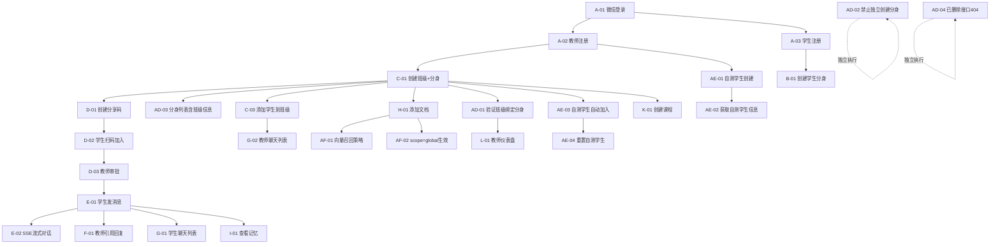

# 数字孪生（Digital Twin）冒烟测试用例全集

> **文档版本**: V2.1（迭代11已合并）
> **创建时间**: 2026-04-03
> **最后更新**: 2026-04-05
> **适用范围**: V2.0 迭代1~迭代11 全部功能
> **用例总数**: 126 条（含迭代11新增11条；废弃3条已标注）
> **预计执行时间**: 30~40 分钟（自动化）

---

## 一、测试环境要求

### 1.1 环境准备

| 项目 | 要求 |
|------|------|
| 后端服务 | `http://localhost:8080`，`go build` 编译通过 |
| Python 知识服务 | `http://localhost:8100`（LlamaIndex 语义检索，端口8100非8000） |
| 前端编译 | Webpack 编译通过，`dist/` 目录存在 |
| 微信开发者工具 | 已启动并登录，项目已加载 |
| 自动化工具 | `miniprogram-automator` SDK 已安装 |
| 数据库 | SQLite，测试前需重置或使用独立测试库 |

### 1.2 环境重置流程

```
Phase 0: 环境重置
┌─────────────────────────────────────────────────────────────┐
│  1. 备份当前数据库                                           │
│  2. 清理测试数据（或使用独立测试数据库）                      │
│  3. 清理小程序 Storage（clearStorageSync）                   │
│  4. 重启后端服务                                             │
│  5. 验证健康检查接口 GET /api/system/health                  │
│  6. 准备测试账号（教师 + 学生 + 管理员）                     │
└─────────────────────────────────────────────────────────────┘
```

### 1.3 测试账号

| 角色 | 登录方式 | Mock Code | 说明 |
|------|----------|-----------|------|
| 教师A | 微信登录 | `smoke_teacher_001` | 主测试教师 |
| 教师B | 微信登录 | `smoke_teacher_002` | 辅助教师（权限隔离验证） |
| 学生A | 微信登录 | `smoke_student_001` | 主测试学生 |
| 学生B | 微信登录 | `smoke_student_002` | 辅助学生（班级加入验证） |
| 管理员 | 数据库脚本设置 | — | admin 角色，不通过前端注册 |

> **迭代11说明**：教师注册后系统自动创建自测学生（`teacher_{user_id}_test`），无需单独准备自测学生账号。

---

## 二、用例优先级定义

| 优先级 | 定义 | 失败影响 | 处理方式 |
|--------|------|----------|----------|
| **P0** | 阻塞级 | 核心业务不可用 | 立即打回修复，不继续测试 |
| **P1** | 重要级 | 主要功能受损 | 记录问题，继续测试 |
| **P2** | 一般级 | 次要功能/体验问题 | 记录待修复 |

---

## 三、冒烟测试用例清单

### 模块A：认证与登录（6条）

| ID | 用例名称 | 角色 | 优先级 | 前置条件 | 操作步骤 | 预期结果 | 验证方式 |
|----|---------|------|--------|---------|---------|---------|----------|
| A-01 | 微信登录-新用户 | 游客 | P0 | 无账号 | 1. 打开小程序<br>2. POST /api/auth/wx-login | 返回 token + 空 personas 列表 | API |
| A-02 | 教师注册完善资料 | 游客 | P0 | A-01 已登录 | 1. POST /api/auth/complete-profile<br>2. role=teacher, nickname, school, description | 返回成功 + `test_student`（user_id/username/persona_id/password_hint）；**不返回教师 persona_id**（迭代11变更） | API |
| A-03 | 学生注册完善资料 | 游客 | P0 | A-01 已登录 | 1. POST /api/auth/complete-profile<br>2. role=student, nickname | 返回 persona_id + 新 token | API |
| A-04 | 已有账号登录 | 教师 | P0 | 已注册 | 1. POST /api/auth/wx-login<br>2. 使用已有 code | 返回 token + personas 列表非空（班级分身列表） | API |
| A-05 | Token 刷新 | 教师 | P1 | 已登录 | 1. POST /api/auth/refresh<br>2. 携带旧 token | 返回新 token | API |
| A-06 | 登录页UI渲染 | 游客 | P1 | 无 | 1. 打开小程序<br>2. 检查登录页元素 | 登录按钮、Slogan 正常显示 | E2E |

### 模块B：分身管理（5条）

> **迭代11变更说明**：
> - ~~B-01 创建教师分身~~：已废弃，教师分身随班级创建，`POST /api/personas` 对教师返回 40040
> - ~~B-04 切换分身~~：已废弃，`PUT /api/personas/:id/switch` 接口已删除（返回404）
> - ~~B-06 停用/启用分身~~：已废弃，`PUT /api/personas/:id/activate/deactivate` 接口已删除（返回404）
> - 以上废弃用例已移至模块AD进行正向/负向验证

| ID | 用例名称 | 角色 | 优先级 | 前置条件 | 操作步骤 | 预期结果 | 验证方式 |
|----|---------|------|--------|---------|---------|---------|----------|
| B-01 | 创建学生分身 | 学生 | P0 | 已登录 | 1. POST /api/personas<br>2. role=student, nickname | 返回新 persona_id | API |
| B-02 | 查看分身列表-含班级信息 | 教师 | P0 | 有班级（即有分身） | 1. GET /api/personas | 返回分身列表，每个分身含 id/nickname/role/**bound_class_id**/**bound_class_name**/**is_public** | API |
| B-03 | 编辑分身信息 | 教师 | P1 | 有分身 | 1. PUT /api/personas/:id<br>2. 修改 nickname/description | 更新成功，GET 验证信息已变更 | API |
| B-04 | 分身概览页渲染 | 教师 | P1 | 有班级（即有分身） | 1. 进入 persona-overview 页面 | 按班级展示分身卡片，无独立"创建分身"按钮 | E2E |
| B-05 | 教师禁止独立创建分身 | 教师 | P0 | 已登录 | 1. POST /api/personas<br>2. role=teacher | 返回 400，code=40040，"教师分身随班级创建" | API |

### 模块C：班级管理（8条）

> **迭代11变更说明**：C-01 创建班级接口已重构，需携带分身信息参数。

| ID | 用例名称 | 角色 | 优先级 | 前置条件 | 操作步骤 | 预期结果 | 验证方式 |
|----|---------|------|--------|---------|---------|---------|----------|
| C-01 | 创建班级（同步创建分身） | 教师 | P0 | 已登录 | 1. POST /api/classes<br>2. name + persona_nickname + persona_school + persona_description + is_public=true | 返回班级 id + **persona_id** + share_code + share_url | API |
| C-02 | 查看班级列表 | 教师 | P0 | 有班级 | 1. GET /api/classes | 返回班级列表 | API |
| C-03 | 添加学生到班级 | 教师 | P0 | 有班级+有学生 | 1. POST /api/classes/:id/members<br>2. student_persona_id | 添加成功 | API |
| C-04 | 查看班级成员 | 教师 | P1 | 班级有成员 | 1. GET /api/classes/:id/members | 返回成员列表 | API |
| C-05 | 移除班级成员 | 教师 | P1 | 班级有成员 | 1. DELETE /api/classes/:id/members/:member_id | 移除成功 | API |
| C-06 | 班级启停 | 教师 | P1 | 有班级 | 1. PUT /api/classes/:id/toggle | 班级 is_active 状态切换 | API |
| C-07 | 班级创建页UI | 教师 | P1 | 已登录 | 1. 进入 class-create 页面<br>2. 填写表单（含分身信息+is_public 开关） | 表单含分身信息字段和 is_public 开关，引导语正确；提交成功 | E2E |
| C-08 | 班级详情页渲染 | 教师 | P2 | 有班级 | 1. 进入 class-detail 页面 | 班级信息+对应分身信息+成员列表正确显示 | E2E |

### 模块D：分享码与师生关系（8条）

| ID | 用例名称 | 角色 | 优先级 | 前置条件 | 操作步骤 | 预期结果 | 验证方式 |
|----|---------|------|--------|---------|---------|---------|----------|
| D-01 | 创建分享码 | 教师 | P0 | 有班级（即有班级分身） | 1. POST /api/shares<br>2. persona_id（班级分身） | 返回 share_code | API |
| D-02 | 学生扫码加入 | 学生 | P0 | 有分享码 | 1. POST /api/shares/:code/join | 加入成功或返回待审批 | API |
| D-03 | 教师审批通过 | 教师 | P0 | 有待审批申请 | 1. GET /api/relations?status=pending<br>2. PUT /api/relations/:id/approve | 审批通过 | API |
| D-04 | 查看分享码信息（公开） | 游客 | P1 | 有分享码 | 1. GET /api/shares/:code/info | 返回教师信息+join_status | API |
| D-05 | 已加入学生重复扫码 | 学生 | P1 | 已加入 | 1. GET /api/shares/:code/info | join_status=already_joined | API |
| D-06 | 教师拒绝申请 | 教师 | P1 | 有待审批 | 1. PUT /api/relations/:id/reject | 拒绝成功 | API |
| D-07 | 分享码二维码生成 | 教师 | P2 | 有分享码 | 1. 进入 share-manage 页面 | Canvas 二维码正确生成 | E2E |
| D-08 | 扫码落地页渲染 | 学生 | P2 | 有分享码 | 1. 进入 share-join 页面 | 教师信息+操作按钮正确显示 | E2E |

### 模块E：对话核心功能（10条）

| ID | 用例名称 | 角色 | 优先级 | 前置条件 | 操作步骤 | 预期结果 | 验证方式 |
|----|---------|------|--------|---------|---------|---------|----------|
| E-01 | 学生发送消息 | 学生 | P0 | 有师生关系 | 1. POST /api/chat<br>2. teacher_persona_id（班级分身ID）+ message | 返回 AI 回复 | API |
| E-02 | SSE 流式对话 | 学生 | P0 | 有师生关系 | 1. POST /api/chat/stream<br>2. 监听 SSE 事件 | 收到流式回复 | API |
| E-03 | 思考过程展示 | 学生 | P0 | 有师生关系 | 1. 发送消息<br>2. 检查 ThinkingPanel | thinking_step 事件正确推送 | E2E |
| E-04 | 新会话创建 | 学生 | P0 | 已登录 | 1. POST /api/chat/new-session | 返回 session_id | API |
| E-05 | 会话列表查看 | 学生 | P0 | 有对话记录 | 1. GET /api/conversations/sessions | 返回会话列表 | API |
| E-06 | 会话标题生成 | 学生 | P1 | 有会话 | 1. POST /api/conversations/sessions/:id/title | 返回生成的标题 | API |
| E-07 | 语音输入UI | 学生 | P1 | 在聊天页 | 1. 点击语音按钮<br>2. 检查录音界面 | 语音按钮+录音界面正常 | E2E |
| E-08 | +号多功能面板 | 学生 | P1 | 在聊天页 | 1. 点击+号按钮<br>2. 检查面板选项 | 文件/相册/拍摄选项完整 | E2E |
| E-09 | 快捷指令 | 学生 | P1 | 新会话 | 1. GET /api/chat/quick-actions | 返回快捷指令列表 | API |
| E-10 | 对话附件发送 | 学生 | P2 | 有师生关系 | 1. POST /api/chat<br>2. 携带 attachment | 附件正确处理 | API |

### 模块F：教师真人介入（5条）

| ID | 用例名称 | 角色 | 优先级 | 前置条件 | 操作步骤 | 预期结果 | 验证方式 |
|----|---------|------|--------|---------|---------|---------|----------|
| F-01 | 教师引用回复 | 教师 | P0 | 有学生对话 | 1. POST /api/chat/teacher-reply<br>2. student_persona_id + message | 回复成功，sender_type=teacher | API |
| F-02 | 查看接管状态 | 教师 | P1 | 已回复 | 1. GET /api/chat/takeover-status | 返回 is_taken_over=true | API |
| F-03 | 结束接管 | 教师 | P1 | 已接管 | 1. POST /api/chat/end-takeover | 接管结束，AI 恢复 | API |
| F-04 | 查看学生对话记录 | 教师 | P1 | 有学生对话 | 1. GET /api/conversations/student/:id | 返回对话记录列表 | API |
| F-05 | 接管后学生发消息 | 学生 | P1 | 教师已接管 | 1. POST /api/chat | AI 不回复（或提示教师已接管） | API |

### 模块G：聊天列表（6条）

| ID | 用例名称 | 角色 | 优先级 | 前置条件 | 操作步骤 | 预期结果 | 验证方式 |
|----|---------|------|--------|---------|---------|---------|----------|
| G-01 | 学生聊天列表 | 学生 | P0 | 有师生关系 | 1. GET /api/chat-list/student | 返回教师列表（按班级分身组织） | API |
| G-02 | 教师聊天列表 | 教师 | P0 | 有班级+学生 | 1. GET /api/chat-list/teacher | 返回按班级组织的学生列表 | API |
| G-03 | 学生端列表UI | 学生 | P1 | 有教师 | 1. 进入 chat-list 页面 | 教师卡片正确显示 | E2E |
| G-04 | 教师端列表UI | 教师 | P1 | 有班级 | 1. 进入 chat-list 页面 | 班级分组+学生列表正确 | E2E |
| G-05 | 会话二级展开 | 学生 | P1 | 有多条会话 | 1. 点击展开按钮 | 历史会话列表展开/折叠 | E2E |
| G-06 | 置顶功能 | 教师 | P2 | 有聊天记录 | 1. POST /api/chat-pins<br>2. GET /api/chat-pins | 置顶成功，列表顺序正确 | API |

### 模块H：知识库管理（8条）

| ID | 用例名称 | 角色 | 优先级 | 前置条件 | 操作步骤 | 预期结果 | 验证方式 |
|----|---------|------|--------|---------|---------|---------|----------|
| H-01 | 添加文本文档 | 教师 | P0 | 已登录（有班级分身） | 1. POST /api/documents<br>2. title + content | 文档创建成功 | API |
| H-02 | 查看文档列表 | 教师 | P0 | 有文档 | 1. GET /api/documents | 返回文档列表 | API |
| H-03 | 删除文档 | 教师 | P1 | 有文档 | 1. DELETE /api/documents/:id | 删除成功 | API |
| H-04 | 智能上传（V8） | 教师 | P1 | 已登录 | 1. POST /api/knowledge/upload | 上传成功，返回文档信息 | API |
| H-05 | 知识库搜索 | 教师 | P1 | 有文档 | 1. GET /api/knowledge?q=关键词 | 返回匹配结果 | API |
| H-06 | 文档预览 | 教师 | P2 | 有文档 | 1. POST /api/documents/preview | 返回预览内容 | API |
| H-07 | 聊天记录导入 | 教师 | P2 | 已登录 | 1. POST /api/documents/import-chat | 导入成功，doc_type=chat | API |
| H-08 | 知识库页面渲染 | 教师 | P2 | 有文档 | 1. 进入 knowledge 页面 | 文档列表+搜索框正确显示 | E2E |

### 模块I：记忆系统（6条）

| ID | 用例名称 | 角色 | 优先级 | 前置条件 | 操作步骤 | 预期结果 | 验证方式 |
|----|---------|------|--------|---------|---------|---------|----------|
| I-01 | 查看记忆列表 | 教师 | P0 | 有对话记录 | 1. GET /api/memories | 返回记忆列表（含 memory_layer） | API |
| I-02 | 编辑记忆 | 教师 | P1 | 有记忆 | 1. PUT /api/memories/:id<br>2. 修改 content | 更新成功 | API |
| I-03 | 删除记忆 | 教师 | P1 | 有记忆 | 1. DELETE /api/memories/:id | 删除成功 | API |
| I-04 | 记忆摘要合并 | 教师 | P1 | 有多条 episodic 记忆 | 1. POST /api/memories/summarize | 合并成功 | API |
| I-05 | 记忆自动提取 | 学生 | P1 | LLM 非 mock 模式 | 1. 发送对话<br>2. 检查记忆 | 自动提取 episodic 记忆 | API |
| I-06 | 记忆管理页渲染 | 教师 | P2 | 有记忆 | 1. 进入 memory-manage 页面 | 分层 Tab + 记忆列表正确 | E2E |

### 模块J：对话风格（3条）

| ID | 用例名称 | 角色 | 优先级 | 前置条件 | 操作步骤 | 预期结果 | 验证方式 |
|----|---------|------|--------|---------|---------|---------|----------|
| J-01 | 设置对话风格 | 教师 | P1 | 已登录 | 1. PUT /api/styles<br>2. style_template | 设置成功 | API |
| J-02 | 查看对话风格 | 教师 | P1 | 已设置 | 1. GET /api/styles | 返回当前风格配置 | API |
| J-03 | 风格选择器UI | 教师 | P2 | 已登录 | 1. 进入风格设置页面 | 6种风格卡片正确显示 | E2E |

### 模块K：课程管理（5条）

| ID | 用例名称 | 角色 | 优先级 | 前置条件 | 操作步骤 | 预期结果 | 验证方式 |
|----|---------|------|--------|---------|---------|---------|----------|
| K-01 | 创建课程 | 教师 | P1 | 已登录（有班级分身） | 1. POST /api/courses<br>2. title + description | 课程创建成功 | API |
| K-02 | 查看课程列表 | 教师 | P1 | 有课程 | 1. GET /api/courses | 返回课程列表 | API |
| K-03 | 推送课程通知 | 教师 | P1 | 有课程+有班级 | 1. POST /api/courses/:id/push | 推送成功 | API |
| K-04 | 课程发布页UI | 教师 | P2 | 已登录 | 1. 进入 course-publish 页面<br>2. 填写表单提交 | 表单完整，提交后跳转 | E2E |
| K-05 | 删除课程 | 教师 | P2 | 有课程 | 1. DELETE /api/courses/:id | 删除成功 | API |

### 模块L：教师仪表盘与首页（4条）

| ID | 用例名称 | 角色 | 优先级 | 前置条件 | 操作步骤 | 预期结果 | 验证方式 |
|----|---------|------|--------|---------|---------|---------|----------|
| L-01 | 教师仪表盘API | 教师 | P0 | 有班级分身 | 1. GET /api/personas/:id/dashboard | 返回统计数据 | API |
| L-02 | 教师首页渲染 | 教师 | P0 | 已登录 | 1. 进入 home 页面 | Dashboard 卡片正确显示 | E2E |
| L-03 | 学生首页渲染 | 学生 | P0 | 已登录 | 1. 进入 home 页面 | 教师列表/对话入口正确 | E2E |
| L-04 | 用户资料查看 | 教师 | P1 | 已登录 | 1. GET /api/user/profile | 返回用户信息 | API |

### 模块M：发现页与广场（4条）

| ID | 用例名称 | 角色 | 优先级 | 前置条件 | 操作步骤 | 预期结果 | 验证方式 |
|----|---------|------|--------|---------|---------|---------|----------|
| M-01 | 发现页数据加载 | 学生 | P1 | 已登录 | 1. GET /api/discover | 返回推荐+学科分类（仅 is_public=true 的班级） | API |
| M-02 | 发现页搜索 | 学生 | P1 | 已登录 | 1. GET /api/discover/search?q=关键词 | 返回搜索结果（仅公开班级） | API |
| M-03 | 分身广场（公开班级） | 学生 | P1 | 有 is_public=true 的班级 | 1. GET /api/personas/marketplace | 返回公开班级的分身列表；私密班级不出现 | API |
| M-04 | 发现页UI渲染 | 学生 | P2 | 已登录 | 1. 进入 discover 页面 | 搜索框+推荐+学科浏览正确 | E2E |

### 模块N：头像点击与学生详情（4条）

| ID | 用例名称 | 角色 | 优先级 | 前置条件 | 操作步骤 | 预期结果 | 验证方式 |
|----|---------|------|--------|---------|---------|---------|----------|
| N-01 | 学生查看班级信息 | 学生 | P1 | 有班级 | 1. GET /api/classes/:id | 返回班级详情 | API |
| N-02 | 教师查看学生详情 | 教师 | P1 | 有师生关系 | 1. GET /api/students/:id/profile | 返回学生详情 | API |
| N-03 | 教师更新学生评语 | 教师 | P1 | 有师生关系 | 1. PUT /api/students/:id/evaluation | 更新成功 | API |
| N-04 | 头像弹窗UI | 学生 | P2 | 在聊天页 | 1. 点击老师头像 | AvatarPopup 弹窗正确显示 | E2E |

### 模块O：教材配置（3条）

| ID | 用例名称 | 角色 | 优先级 | 前置条件 | 操作步骤 | 预期结果 | 验证方式 |
|----|---------|------|--------|---------|---------|---------|----------|
| O-01 | 创建教材配置 | 教师 | P1 | 已登录 | 1. POST /api/curriculum-configs | 创建成功 | API |
| O-02 | 查看教材配置 | 教师 | P1 | 有配置 | 1. GET /api/curriculum-configs | 返回配置列表 | API |
| O-03 | 教材配置页UI | 教师 | P2 | 已登录 | 1. 进入 curriculum-config 页面 | 学段选择+教材版本正确 | E2E |

### 模块P：消息推送与反馈（4条）

| ID | 用例名称 | 角色 | 优先级 | 前置条件 | 操作步骤 | 预期结果 | 验证方式 |
|----|---------|------|--------|---------|---------|---------|----------|
| P-01 | 教师推送消息 | 教师 | P1 | 有班级 | 1. POST /api/teacher-messages | 推送成功 | API |
| P-02 | 查看推送历史 | 教师 | P2 | 有推送记录 | 1. GET /api/teacher-messages/history | 返回历史列表 | API |
| P-03 | 提交反馈 | 学生 | P2 | 已登录 | 1. POST /api/feedbacks | 提交成功 | API |
| P-04 | 查看反馈列表 | 教师 | P2 | 有反馈 | 1. GET /api/feedbacks | 返回反馈列表 | API |

### 模块Q：权限与安全（5条）

| ID | 用例名称 | 角色 | 优先级 | 前置条件 | 操作步骤 | 预期结果 | 验证方式 |
|----|---------|------|--------|---------|---------|---------|----------|
| Q-01 | 未登录访问受保护API | 游客 | P0 | 无 token | 1. GET /api/personas（无 Authorization） | 返回 401 | API |
| Q-02 | 学生访问教师API | 学生 | P0 | 学生 token | 1. POST /api/classes（学生 token） | 返回 403 | API |
| Q-03 | 教师编辑他人分身 | 教师B | P0 | 教师B token | 1. PUT /api/personas/:教师A的id | 返回 403 或无权限 | API |
| Q-04 | 画像隐私保护 | 学生 | P1 | 有教师画像 | 1. GET /api/teachers<br>2. 检查返回字段 | 不包含 profile_snapshot | API |
| Q-05 | API 限流验证 | 学生 | P2 | 限流已启用 | 1. 快速连续发送请求 | 超限后返回 429 | API |

### 模块R：TabBar 与导航（2条）

| ID | 用例名称 | 角色 | 优先级 | 前置条件 | 操作步骤 | 预期结果 | 验证方式 |
|----|---------|------|--------|---------|---------|---------|----------|
| R-01 | 教师端 TabBar | 教师 | P1 | 已登录 | 1. 检查底部 TabBar | 4 Tab: **聊天列表**/学生管理/知识库/我的（注意：不是"工作台"） | E2E |
| R-02 | 学生端 TabBar | 学生 | P1 | 已登录 | 1. 检查底部 TabBar | 3 Tab: 对话/发现/我的 | E2E |

### 模块S：管理员后台与操作日志（14条）【迭代10新增】

| ID | 用例名称 | 角色 | 优先级 | 前置条件 | 操作步骤 | 预期结果 | 验证方式 |
|----|---------|------|--------|---------|---------|---------|----------|
| S-01 | 获取微信H5授权URL | 游客 | P0 | 无 | 1. GET /api/auth/wx-h5-login-url?redirect_uri=xxx | 返回 auth_url + state | API |
| S-02 | 微信H5授权回调-新用户 | 游客 | P0 | 有授权code | 1. POST /api/auth/wx-h5-callback<br>2. code + state | 返回 token + is_new_user=true | API |
| S-03 | 微信H5授权回调-已有用户 | 用户 | P0 | 已注册 | 1. POST /api/auth/wx-h5-callback | 返回 token + is_new_user=false | API |
| S-04 | 管理员系统总览 | 管理员 | P0 | 已登录管理员 | 1. GET /api/admin/dashboard/overview | 返回统计数据 + 趋势数据 | API |
| S-05 | 管理员用户统计 | 管理员 | P0 | 已登录管理员 | 1. GET /api/admin/dashboard/user-stats | 返回角色分布 + 活跃度分布 | API |
| S-06 | 管理员对话统计 | 管理员 | P0 | 已登录管理员 | 1. GET /api/admin/dashboard/chat-stats | 返回对话量 + 时段分布 | API |
| S-07 | 用户管理列表 | 管理员 | P0 | 已登录管理员 | 1. GET /api/admin/users | 返回用户列表（分页） | API |
| S-08 | 修改用户角色 | 管理员 | P0 | 已登录管理员 | 1. PUT /api/admin/users/:id/role | 角色修改成功 | API |
| S-09 | 禁用用户 | 管理员 | P0 | 已登录管理员 | 1. PUT /api/admin/users/:id/status<br>2. status=disabled | 用户禁用成功 | API |
| S-10 | 被禁用用户登录 | 已禁用用户 | P0 | 用户已禁用 | 1. POST /api/auth/wx-h5-callback | 返回 40003 + "账号已被禁用" | API |
| S-11 | 被禁用用户访问API | 已禁用用户 | P0 | 用户已禁用 | 1. GET /api/personas（被禁用用户token） | 返回 403 + "账号已被禁用" | API |
| S-12 | 查询操作日志 | 管理员 | P0 | 已登录管理员 | 1. GET /api/admin/logs | 返回日志列表（分页） | API |
| S-13 | 日志统计 | 管理员 | P1 | 已登录管理员 | 1. GET /api/admin/logs/stats | 返回统计数据 + 热力图 | API |
| S-14 | 导出日志CSV | 管理员 | P1 | 已登录管理员 | 1. GET /api/admin/logs/export | 返回 CSV 文件 | API |

### 模块T：H5平台适配（3条）【迭代10新增】

| ID | 用例名称 | 角色 | 优先级 | 前置条件 | 操作步骤 | 预期结果 | 验证方式 |
|----|---------|------|--------|---------|---------|---------|----------|
| T-01 | 获取H5平台配置 | 游客 | P0 | 无 | 1. GET /api/platform/config?platform=h5 | 返回 features + upload 配置 | API |
| T-02 | H5文件上传 | 用户 | P0 | 已登录 | 1. POST /api/upload/h5<br>2. multipart/form-data | 返回文件 URL | API |
| T-03 | H5文件上传-超大文件 | 用户 | P2 | 已登录 | 1. POST /api/upload/h5<br>2. 文件>20MB | 返回 40021 错误 | API |

### 模块AD：班级绑定分身【迭代11新增】（5条）

| ID | 用例名称 | 角色 | 优先级 | 前置条件 | 操作步骤 | 预期结果 | 验证方式 |
|----|---------|------|--------|---------|---------|---------|----------|
| AD-01 | 创建班级同步创建分身 | 教师 | P0 | 已登录，无班级 | 1. POST /api/classes<br>2. name=测试班级, persona_nickname=张老师, persona_school=测试大学, persona_description=测试描述, is_public=true | 1. 返回 persona_id<br>2. personas.bound_class_id = 班级ID<br>3. is_public=true | API |
| AD-02 | 教师禁止独立创建分身 | 教师 | P0 | 已登录 | 1. POST /api/personas<br>2. role=teacher | 返回 400，code=40040，message="教师分身随班级创建，请通过创建班级来创建分身" | API |
| AD-03 | 分身列表展示班级信息 | 教师 | P0 | 已创建班级 | 1. GET /api/personas | 每个分身含 bound_class_id + bound_class_name + is_public | API |
| AD-04 | 已删除接口返回404 | 教师 | P0 | 已登录，已有分身 | 1. PUT /api/personas/:id/switch<br>2. PUT /api/personas/:id/activate<br>3. PUT /api/personas/:id/deactivate | 三个接口均返回 404 | API |
| AD-05 | 班级 is_public 切换 | 教师 | P1 | 已创建班级（is_public=true） | 1. PUT /api/classes/:id<br>2. is_public=false | 更新成功，发现页不再展示该班级 | API |

### 模块AE：自测学生【迭代11新增】（4条）

| ID | 用例名称 | 角色 | 优先级 | 前置条件 | 操作步骤 | 预期结果 | 验证方式 |
|----|---------|------|--------|---------|---------|---------|----------|
| AE-01 | 教师注册自动创建自测学生 | 游客 | P0 | 新用户 | 1. POST /api/auth/complete-profile<br>2. role=teacher | 返回 test_student.username=teacher_{id}_test；不创建教师分身 | API |
| AE-02 | 获取自测学生信息 | 教师 | P0 | 已注册教师 | 1. GET /api/test-student | 返回 user_id/username/persona_id/password_hint/joined_classes | API |
| AE-03 | 自测学生自动加入班级 | 教师 | P1 | 教师已有自测学生 | 1. POST /api/classes（创建新班级）<br>2. GET /api/classes/:id/members | 自测学生出现在成员列表，approval_status=approved | API |
| AE-04 | 重置自测学生数据 | 教师 | P1 | 自测学生有对话数据 | 1. POST /api/test-student/reset | 返回 cleared_conversations + cleared_memories；师生关系和班级成员关系保留 | API |

### 模块AF：向量召回优化【迭代11新增】（2条）

| ID | 用例名称 | 角色 | 优先级 | 前置条件 | 操作步骤 | 预期结果 | 验证方式 |
|----|---------|------|--------|---------|---------|---------|----------|
| AF-01 | 向量召回策略生效 | 学生 | P1 | 教师已上传≥10条知识库文档，学生与教师班级分身有师生关系 | 1. POST /api/chat/stream<br>2. message 与知识库相关<br>3. 查看后端日志 | 日志显示：召回≤100条 → score过滤 → scope过滤 → 最终≤5条参与对话 | API |
| AF-02 | scope=global 对多班级生效 | 学生 | P1 | 教师已创建≥2个班级，上传 scope=global 文档 | 1. 学生A（班级A）发送与 global 知识相关的问题<br>2. 学生B（班级B）发送相同问题 | 两个班级的分身均能引用 global 知识回复 | API |

---

## 四、用例统计

### 4.1 按模块统计

| 模块 | P0 | P1 | P2 | 合计 |
|------|----|----|----|----|
| A-认证与登录 | 4 | 2 | 0 | 6 |
| B-分身管理（迭代11重构） | 3 | 2 | 0 | 5 |
| C-班级管理（迭代11重构） | 3 | 3 | 2 | 8 |
| D-分享码与师生关系 | 3 | 3 | 2 | 8 |
| E-对话核心功能 | 5 | 4 | 1 | 10 |
| F-教师真人介入 | 1 | 4 | 0 | 5 |
| G-聊天列表 | 2 | 3 | 1 | 6 |
| H-知识库管理 | 2 | 3 | 3 | 8 |
| I-记忆系统 | 1 | 4 | 1 | 6 |
| J-对话风格 | 0 | 2 | 1 | 3 |
| K-课程管理 | 0 | 3 | 2 | 5 |
| L-教师仪表盘与首页 | 3 | 1 | 0 | 4 |
| M-发现页与广场（迭代11适配） | 0 | 3 | 1 | 4 |
| N-头像点击与学生详情 | 0 | 3 | 1 | 4 |
| O-教材配置 | 0 | 2 | 1 | 3 |
| P-消息推送与反馈 | 0 | 1 | 3 | 4 |
| Q-权限与安全 | 3 | 1 | 1 | 5 |
| R-TabBar与导航（迭代11修正） | 0 | 2 | 0 | 2 |
| S-管理员后台与操作日志【迭代10】 | 11 | 2 | 0 | 14 |
| T-H5平台适配【迭代10】 | 2 | 0 | 1 | 3 |
| AD-班级绑定分身【迭代11】 | 4 | 1 | 0 | 5 |
| AE-自测学生【迭代11】 | 2 | 2 | 0 | 4 |
| AF-向量召回优化【迭代11】 | 0 | 2 | 0 | 2 |
| **合计** | **50** | **53** | **21** | **124** |

> **注**：原 B-01（创建教师分身）、B-04（切换分身）、B-06（停用/启用分身）共 3 条废弃用例已从模块B删除，对应行为由 B-05（禁止独立创建）和 AD-04（已删除接口返回404）覆盖。

### 4.2 按验证方式统计

| 验证方式 | 数量 | 占比 |
|----------|------|------|
| API 验证 | 95 | 76.6% |
| E2E 验证 | 29 | 23.4% |
| **合计** | **124** | **100%** |

### 4.3 按角色统计

| 角色 | 数量 | 占比 |
|------|------|------|
| 教师 | 55 | 44.4% |
| 学生 | 33 | 26.6% |
| 游客 | 10 | 8.1% |
| 管理员 | 14 | 11.3% |
| 教师B（权限隔离） | 1 | 0.8% |
| 已禁用用户 | 2 | 1.6% |
| 多角色 | 9 | 7.2% |

---

## 五、执行分组与依赖关系

### 5.1 执行顺序

```
Phase 1: 环境验证（2条）
├── 健康检查 GET /api/system/health
└── Python 知识服务检查 GET http://localhost:8100/api/v1/health

Phase 2: 认证链路（A-01 ~ A-06）
├── 新用户登录 → 教师注册（自动创建自测学生）→ 学生注册
└── 已有账号登录 → Token 刷新

Phase 3: 基础数据准备（B + C + D + AD + AE 部分）
├── 学生创建分身（B-01）
├── 创建班级（自动创建分身）→ C-01/AD-01
├── 验证教师禁止独立创建分身 → AD-02/B-05（独立执行）
├── 创建分享码 → D-01
├── 学生扫码加入 → 教师审批 → D-02/D-03
├── 添加学生到班级 → C-03
├── 验证自测学生自动加入班级 → AE-03
└── 验证已删除接口 → AD-04（独立执行）

Phase 4: 核心业务验证（E + F + G）
├── 对话功能（发消息 → 流式对话 → 思考过程）
├── 教师介入（引用回复 → 接管 → 结束接管）
└── 聊天列表（学生端 + 教师端）

Phase 5: 功能模块验证（H ~ P + AF）
├── 知识库管理（含 scope=global 验证）
├── 记忆系统
├── 对话风格
├── 课程管理
├── 教材配置
├── 消息推送
├── 发现页（is_public 过滤验证）
├── 头像点击
├── 反馈系统
└── 向量召回优化验证（AF-01/AF-02）

Phase 6: 安全与权限（Q + AD-04）
├── 未登录访问
├── 角色越权
├── 数据隔离
└── 已废弃接口返回404

Phase 7: 管理员 & H5 适配（S + T）
├── H5 登录流程
├── 管理员仪表盘
├── 用户管理（启禁用）
└── 日志查询与导出

Phase 8: UI 验证（E2E 用例）
├── 首页渲染（教师 + 学生）
├── TabBar 验证（注意教师端为"聊天列表"）
├── 班级创建页（含分身信息+is_public 开关）
├── 各功能页面渲染
└── 交互验证
```

### 5.2 依赖关系图



---

## 六、覆盖完整性检查

### 6.1 功能覆盖矩阵

| 功能模块 | 游客 | 学生 | 教师 | 管理员 |
|---------|------|------|------|--------|
| **认证** | ✅ A-01 | ✅ A-03 | ✅ A-02 | - |
| **分身管理（迭代11）** | - | ✅ B-01 | ✅ B-02/03/05/AD-01~05 | - |
| **班级管理** | - | - | ✅ C-01~08 | - |
| **分享码** | ✅ D-04 | ✅ D-02/05/08 | ✅ D-01/03/06/07 | - |
| **对话** | - | ✅ E-01~10 | ✅ F-01~05 | - |
| **聊天列表** | - | ✅ G-01/03/05 | ✅ G-02/04/06 | - |
| **知识库** | - | - | ✅ H-01~08 | - |
| **记忆** | - | ✅ I-05 | ✅ I-01~04/06 | - |
| **风格** | - | - | ✅ J-01~03 | - |
| **课程** | - | - | ✅ K-01~05 | - |
| **首页** | - | ✅ L-03 | ✅ L-01/02/04 | - |
| **发现页** | - | ✅ M-01~04 | - | - |
| **头像详情** | - | ✅ N-01/04 | ✅ N-02/03 | - |
| **教材** | - | - | ✅ O-01~03 | - |
| **消息推送** | - | ✅ P-03 | ✅ P-01/02/04 | - |
| **权限安全** | ✅ Q-01 | ✅ Q-02/04/05 | ✅ Q-03 | - |
| **TabBar** | - | ✅ R-02 | ✅ R-01 | - |
| **管理员后台** | - | - | - | ✅ S-04~14 |
| **H5登录** | ✅ S-01/02/T-01 | - | - | - |
| **自测学生** | - | - | ✅ AE-01~04 | - |
| **向量召回** | - | ✅ AF-01/02 | - | - |

### 6.2 CRUD 覆盖检查

| 模块 | Create | Read | Update | Delete |
|------|--------|------|--------|--------|
| 分身（迭代11重构）| ✅ C-01（随班级创建）| ✅ B-02 | ✅ B-03 | ✅ C-01班级删除时分身停用 |
| 班级 | ✅ C-01 | ✅ C-02/04 | ✅ C-06/AD-05 | ✅ C-05（移除成员） |
| 分享码 | ✅ D-01 | ✅ D-04 | - | - |
| 对话 | ✅ E-01/04 | ✅ E-05 | - | - |
| 知识库 | ✅ H-01/04 | ✅ H-02/05 | - | ✅ H-03 |
| 记忆 | ✅ I-05（自动） | ✅ I-01 | ✅ I-02 | ✅ I-03 |
| 课程 | ✅ K-01 | ✅ K-02 | - | ✅ K-05 |
| 教材 | ✅ O-01 | ✅ O-02 | - | - |
| 反馈 | ✅ P-03 | ✅ P-04 | - | - |
| 自测学生 | ✅ AE-01（自动） | ✅ AE-02 | ✅ AE-04（重置） | - |

### 6.3 异常路径覆盖

| 异常类型 | 用例 | 覆盖 |
|----------|------|------|
| 未登录访问 | Q-01 | ✅ |
| 角色越权 | Q-02 | ✅ |
| 数据越权 | Q-03 | ✅ |
| 隐私泄露 | Q-04 | ✅ |
| 限流保护 | Q-05 | ✅ |
| 重复操作 | D-05 | ✅ |
| 教师禁止独立创建分身 | AD-02/B-05 | ✅ |
| 废弃接口调用 | AD-04 | ✅ |
| 用户被禁用 | S-10/S-11 | ✅ |
| 大文件上传 | T-03 | ✅ |

### 6.4 迭代11专项覆盖检查

| 迭代11需求 | 覆盖用例 | 状态 |
|-----------|---------|------|
| 班级创建同步创建分身（含事务） | C-01、AD-01 | ✅ |
| 教师禁止独立创建分身 | AD-02、B-05 | ✅ |
| 分身列表含 bound_class_id/is_public | AD-03、B-02 | ✅ |
| switch/activate/deactivate 删除 | AD-04 | ✅ |
| is_public 切换 + 发现页过滤 | AD-05、M-03 | ✅ |
| 教师注册自动创建自测学生（不创建分身）| AE-01、A-02 | ✅ |
| GET /api/test-student | AE-02 | ✅ |
| 自测学生自动加入班级 | AE-03 | ✅ |
| POST /api/test-student/reset | AE-04 | ✅ |
| 向量召回100条+置信度过滤 | AF-01 | ✅ |
| scope=global 对多班级生效 | AF-02 | ✅ |

---

## 七、结果报告模板

```markdown
# 冒烟测试报告

## 基本信息
- 测试版本: V2.1（迭代11）
- 测试时间: YYYY-MM-DD HH:MM
- 测试环境: localhost / staging
- 执行方式: 自动化 / 手动
- 执行耗时: XXs

## 执行结果

| 状态 | 数量 | 占比 |
|------|------|------|
| ✅ 通过 | XX | XX% |
| ❌ 失败 | XX | XX% |
| ⏭️ 跳过 | XX | XX% |

## P0 阻塞问题
| ID | 用例 | 错误信息 | 影响范围 |
|----|------|----------|----------|

## P1 重要问题
| ID | 用例 | 错误信息 | 影响范围 |
|----|------|----------|----------|

## 迭代11 专项结果

| 模块 | P0通过率 | 问题 |
|------|---------|------|
| AD-班级绑定分身 | X/4 | |
| AE-自测学生 | X/2 | |
| AF-向量召回 | - | |

## 结论
- [ ] ✅ 通过 - 可进入详细测试
- [ ] ❌ 不通过 - 存在P0阻塞问题，需修复后重测
```

---

## 八、维护指南

### 8.1 新增功能时

1. 确定功能所属模块（A~T、AD/AE/AF 等）
2. 按优先级（P0/P1/P2）添加用例
3. 确定验证方式（API/E2E）
4. 更新依赖关系图
5. 更新统计数据（§四）
6. 将新发现的陷阱追加到 `skills/smoke-test-traps.md`

### 8.2 用例废弃规则

- 功能已下线/接口已删除 → 删除对应用例，在**同模块**补充负向验证（如 AD-04）
- 功能行为变更 → 更新预期结果（如 A-02、C-01）
- 优先级变更 → 调整优先级标记

### 8.3 定期 Review

- 每个迭代结束后 Review 用例覆盖率（对照 `api_spec_full.md` 接口列表）
- 每月检查用例有效性
- 根据线上问题补充遗漏场景
